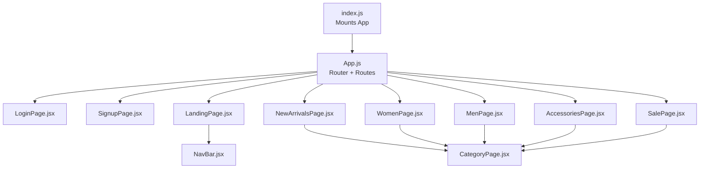
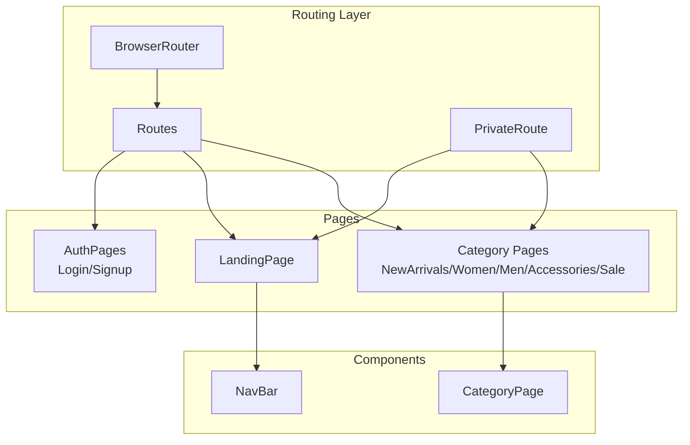
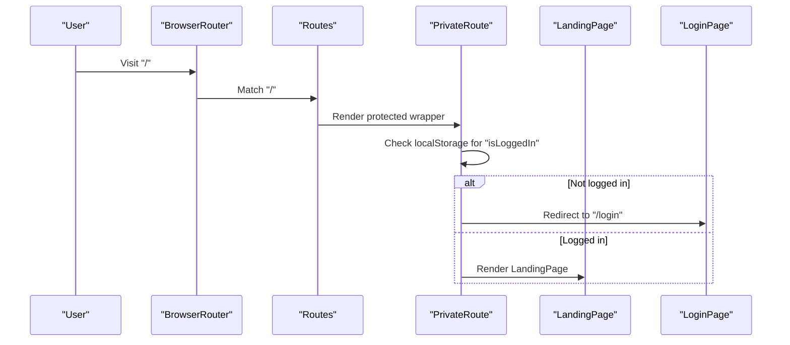
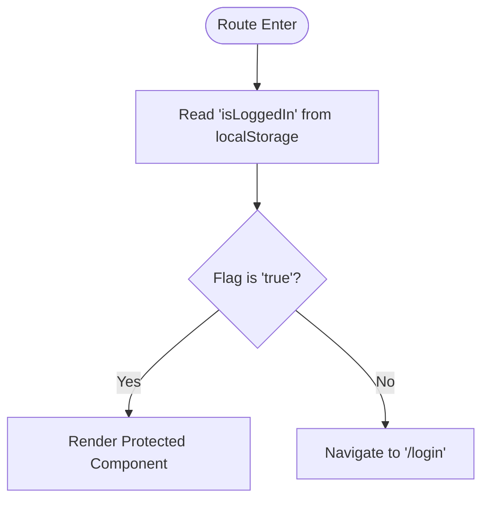
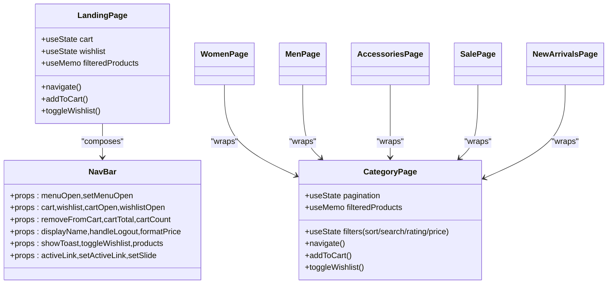
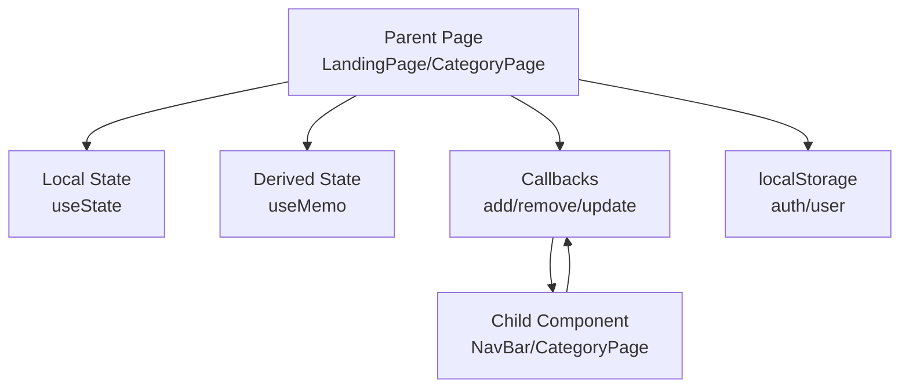
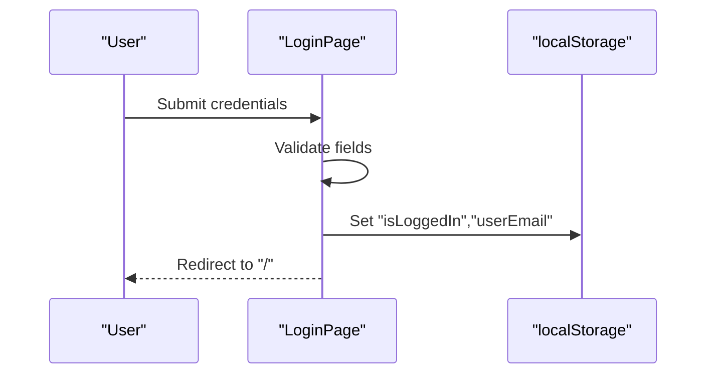
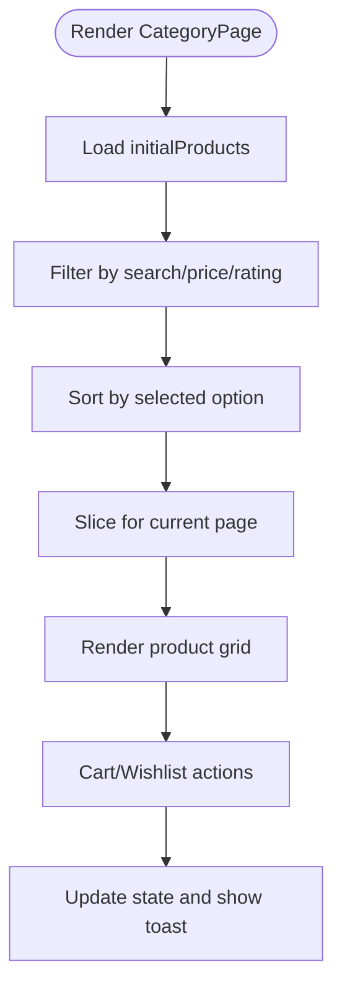
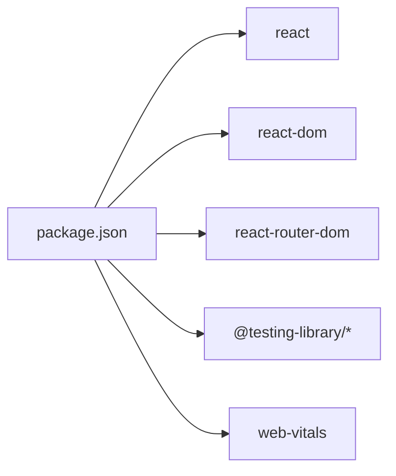

# Architecture Overview

<cite>
**Referenced Files in This Document**
- [App.js](file://src/App.js)
- [index.js](file://src/index.js)
- [NavBar.jsx](file://src/components/NavBar.jsx)
- [LandingPage.jsx](file://src/pages/LandingPage.jsx)
- [CategoryPage.jsx](file://src/components/CategoryPage.jsx)
- [LoginPage.jsx](file://src/pages/LoginPage.jsx)
- [SignupPage.jsx](file://src/pages/SignupPage.jsx)
- [WomenPage.jsx](file://src/pages/WomenPage.jsx)
- [MenPage.jsx](file://src/pages/MenPage.jsx)
- [AccessoriesPage.jsx](file://src/pages/AccessoriesPage.jsx)
- [SalePage.jsx](file://src/pages/SalePage.jsx)
- [NewArrivalsPage.jsx](file://src/pages/NewArrivalsPage.jsx)
- [AuthPages.css](file://src/pages/AuthPages.css)
- [index.css](file://src/index.css)
- [package.json](file://package.json)
</cite>

## Table of Contents
1. [Introduction](#introduction)
2. [Project Structure](#project-structure)
3. [Core Components](#core-components)
4. [Architecture Overview](#architecture-overview)
5. [Detailed Component Analysis](#detailed-component-analysis)
6. [Dependency Analysis](#dependency-analysis)
7. [Performance Considerations](#performance-considerations)
8. [Troubleshooting Guide](#troubleshooting-guide)
9. [Conclusion](#conclusion)

## Introduction
This document describes the Lumière e-commerce client application architecture. It is a React-based Single Page Application (SPA) using functional components and hooks, with React Router DOM for navigation. The application separates reusable UI components (NavBar, CategoryPage) from page-level components (LandingPage, AuthPages, Category pages). Authentication is handled via a simple localStorage-based guard, and state is managed locally with React hooks and persisted in localStorage for session tokens and user identity.

## Project Structure
The client is organized by feature and responsibility:
- Root entry renders the application shell and mounts the router.
- Routing defines public and protected routes with a simple authentication guard.
- Reusable components live under components/.
- Page-level components live under pages/.
- Styling is split between shared page-level styles and component-specific styles.

**Diagram sources**
- [index.js:1-18](file://src/index.js#L1-L18)
- [App.js:18-85](file://src/App.js#L18-L85)
- [LoginPage.jsx:1-151](file://src/pages/LoginPage.jsx#L1-L151)
- [SignupPage.jsx:1-158](file://src/pages/SignupPage.jsx#L1-L158)
- [LandingPage.jsx:1-405](file://src/pages/LandingPage.jsx#L1-L405)
- [NavBar.jsx:1-177](file://src/components/NavBar.jsx#L1-L177)
- [CategoryPage.jsx:1-328](file://src/components/CategoryPage.jsx#L1-L328)
- [NewArrivalsPage.jsx:1-29](file://src/pages/NewArrivalsPage.jsx#L1-L29)
- [WomenPage.jsx:1-29](file://src/pages/WomenPage.jsx#L1-L29)
- [MenPage.jsx:1-29](file://src/pages/MenPage.jsx#L1-L29)
- [AccessoriesPage.jsx:1-29](file://src/pages/AccessoriesPage.jsx#L1-L29)
- [SalePage.jsx:1-29](file://src/pages/SalePage.jsx#L1-L29)

**Section sources**
- [index.js:1-18](file://src/index.js#L1-L18)
- [App.js:18-85](file://src/App.js#L18-L85)

## Core Components
- App: Defines SPA routes, a private route guard, and maps routes to page components.
- NavBar: A reusable header component receiving state and callbacks via props.
- LandingPage: Orchestrates global state (cart, wishlist, UI toggles) and composes NavBar and marketing sections.
- CategoryPage: A reusable page template for category views with filtering, sorting, pagination, and cart/wishlist actions.
- AuthPages: LoginPage and SignupPage manage form state, validation, and redirect after authentication.

Key state management patterns:
- Local state via useState for UI flags, cart, wishlist, filters, and pagination.
- Derived state via useMemo for filtered/sorted product lists.
- Persistence via localStorage for authentication and user identity.

**Section sources**
- [App.js:12-16](file://src/App.js#L12-L16)
- [App.js:18-85](file://src/App.js#L18-L85)
- [NavBar.jsx:7-30](file://src/components/NavBar.jsx#L7-L30)
- [LandingPage.jsx:57-129](file://src/pages/LandingPage.jsx#L57-L129)
- [CategoryPage.jsx:10-63](file://src/components/CategoryPage.jsx#L10-L63)
- [LoginPage.jsx:5-42](file://src/pages/LoginPage.jsx#L5-L42)
- [SignupPage.jsx:5-44](file://src/pages/SignupPage.jsx#L5-L44)

## Architecture Overview
The application follows a component-based SPA architecture:
- Router-driven navigation with protected routes.
- Component composition: LandingPage composes NavBar; Category pages compose CategoryPage.
- State hoisted to page components and passed down to reusable components.
- LocalStorage integration for authentication and user identity.

**Diagram sources**
- [App.js:18-85](file://src/App.js#L18-L85)
- [LandingPage.jsx:152-175](file://src/pages/LandingPage.jsx#L152-L175)
- [CategoryPage.jsx:104-127](file://src/components/CategoryPage.jsx#L104-L127)

## Detailed Component Analysis

### Routing and Navigation Flow
- Public routes: /login, /signup.
- Protected routes: /, /new-arrivals, /women, /men, /accessories, /sale.
- PrivateRoute checks localStorage for an authentication flag and redirects unauthenticated users to /login.
- Navigation uses react-router-dom Link and useNavigate.

**Diagram sources**
- [App.js:12-16](file://src/App.js#L12-L16)
- [App.js:28-36](file://src/App.js#L28-L36)
- [LandingPage.jsx:59-60](file://src/pages/LandingPage.jsx#L59-L60)

**Section sources**
- [App.js:18-85](file://src/App.js#L18-L85)

### Authentication Guard Implementation
- PrivateRoute reads a boolean flag from localStorage to decide whether to render children or redirect.
- LoginPage and SignupPage write the authentication flag upon successful form submission.

**Diagram sources**
- [App.js:12-16](file://src/App.js#L12-L16)
- [LoginPage.jsx:33-42](file://src/pages/LoginPage.jsx#L33-L42)
- [SignupPage.jsx:36-44](file://src/pages/SignupPage.jsx#L36-L44)

**Section sources**
- [App.js:12-16](file://src/App.js#L12-L16)
- [LoginPage.jsx:33-42](file://src/pages/LoginPage.jsx#L33-L42)
- [SignupPage.jsx:36-44](file://src/pages/SignupPage.jsx#L36-L44)

### Component Hierarchy and Composition
- LandingPage is the root protected page, composing NavBar and marketing sections.
- Category pages (WomenPage, MenPage, etc.) are thin wrappers passing category metadata to CategoryPage.
- CategoryPage encapsulates product listing, filtering, sorting, pagination, and cart/wishlist actions.

**Diagram sources**
- [LandingPage.jsx:57-175](file://src/pages/LandingPage.jsx#L57-L175)
- [NavBar.jsx:7-30](file://src/components/NavBar.jsx#L7-L30)
- [CategoryPage.jsx:10-98](file://src/components/CategoryPage.jsx#L10-L98)
- [WomenPage.jsx:26-28](file://src/pages/WomenPage.jsx#L26-L28)
- [MenPage.jsx:26-28](file://src/pages/MenPage.jsx#L26-L28)
- [AccessoriesPage.jsx:26-28](file://src/pages/AccessoriesPage.jsx#L26-L28)
- [SalePage.jsx:26-28](file://src/pages/SalePage.jsx#L26-L28)
- [NewArrivalsPage.jsx:26-28](file://src/pages/NewArrivalsPage.jsx#L26-L28)

**Section sources**
- [LandingPage.jsx:152-175](file://src/pages/LandingPage.jsx#L152-L175)
- [CategoryPage.jsx:104-127](file://src/components/CategoryPage.jsx#L104-L127)

### State Management and Data Flow
- Global state in LandingPage and CategoryPage includes cart, wishlist, UI flags, filters, and pagination.
- Derived state computed with useMemo to avoid unnecessary re-renders.
- Callbacks passed down to NavBar and CategoryPage to mutate state in parents.
- LocalStorage persists authentication and user identity.

**Diagram sources**
- [LandingPage.jsx:62-124](file://src/pages/LandingPage.jsx#L62-L124)
- [CategoryPage.jsx:15-63](file://src/components/CategoryPage.jsx#L15-L63)
- [NavBar.jsx:152-175](file://src/components/NavBar.jsx#L152-L175)

**Section sources**
- [LandingPage.jsx:62-124](file://src/pages/LandingPage.jsx#L62-L124)
- [CategoryPage.jsx:66-98](file://src/components/CategoryPage.jsx#L66-L98)
- [NavBar.jsx:152-175](file://src/components/NavBar.jsx#L152-L175)

### Authentication Pages
- LoginPage validates email/password, simulates an API call, and sets localStorage flags to log in.
- SignupPage validates registration fields, simulates an API call, and sets localStorage flags to log in.
- Both pages use form state, field-level errors, and a global error message.

**Diagram sources**
- [LoginPage.jsx:12-42](file://src/pages/LoginPage.jsx#L12-L42)
- [App.js:23-26](file://src/App.js#L23-L26)

**Section sources**
- [LoginPage.jsx:5-42](file://src/pages/LoginPage.jsx#L5-L42)
- [SignupPage.jsx:5-44](file://src/pages/SignupPage.jsx#L5-L44)

### Category Page Template
- CategoryPage provides a reusable template for category views with:
  - Filtering by search term, price range, and minimum rating.
  - Sorting by newest, price low/high, and rating.
  - Pagination with configurable items per page.
  - Cart and wishlist actions integrated with NavBar.

**Diagram sources**
- [CategoryPage.jsx:66-98](file://src/components/CategoryPage.jsx#L66-L98)
- [CategoryPage.jsx:94-98](file://src/components/CategoryPage.jsx#L94-L98)
- [CategoryPage.jsx:104-127](file://src/components/CategoryPage.jsx#L104-L127)

**Section sources**
- [CategoryPage.jsx:10-98](file://src/components/CategoryPage.jsx#L10-L98)
- [CategoryPage.jsx:104-127](file://src/components/CategoryPage.jsx#L104-L127)

## Dependency Analysis
External dependencies relevant to architecture:
- react, react-dom: Core framework.
- react-router-dom: Routing and navigation.
- Testing libraries and web-vitals are present but not part of runtime architecture.

**Diagram sources**
- [package.json:5-14](file://package.json#L5-L14)

**Section sources**
- [package.json:1-41](file://package.json#L1-L41)

## Performance Considerations
- useMemo is used to compute filtered/sorted product lists, reducing re-computation on unrelated state changes.
- Local state is scoped to page components to minimize prop drilling and unnecessary re-renders.
- Images are lazy-loaded and fallback URLs are used to improve resilience.
- Pagination limits rendered item count per page.

[No sources needed since this section provides general guidance]

## Troubleshooting Guide
Common issues and remedies:
- Login failures: Verify form validation and that localStorage flags are set on success.
- Navigation to protected routes: Ensure the authentication flag exists in localStorage.
- Cart/Wishlist not updating: Confirm callbacks are passed correctly to NavBar and that state updates are reflected in derived totals.

**Section sources**
- [LoginPage.jsx:12-42](file://src/pages/LoginPage.jsx#L12-L42)
- [SignupPage.jsx:36-44](file://src/pages/SignupPage.jsx#L36-L44)
- [App.js:12-16](file://src/App.js#L12-L16)
- [NavBar.jsx:152-175](file://src/components/NavBar.jsx#L152-L175)

## Conclusion
Lumière’s client uses a clean, component-based SPA architecture. Routing is centralized with a simple authentication guard, while reusable components encapsulate shared UI and logic. State is managed locally with hooks and persisted in localStorage for lightweight session handling. The design supports scalability by keeping page-level components thin and leveraging a reusable category template.