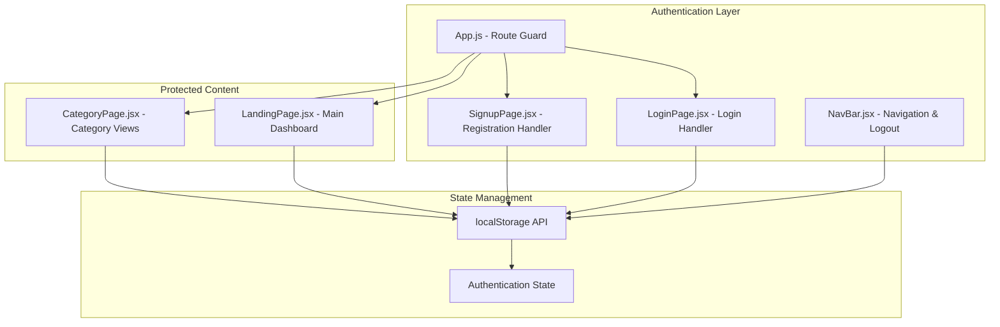
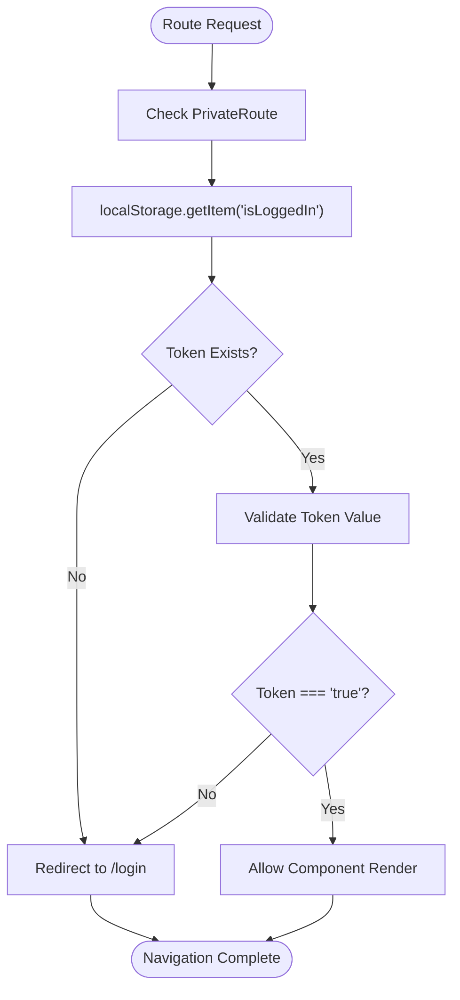
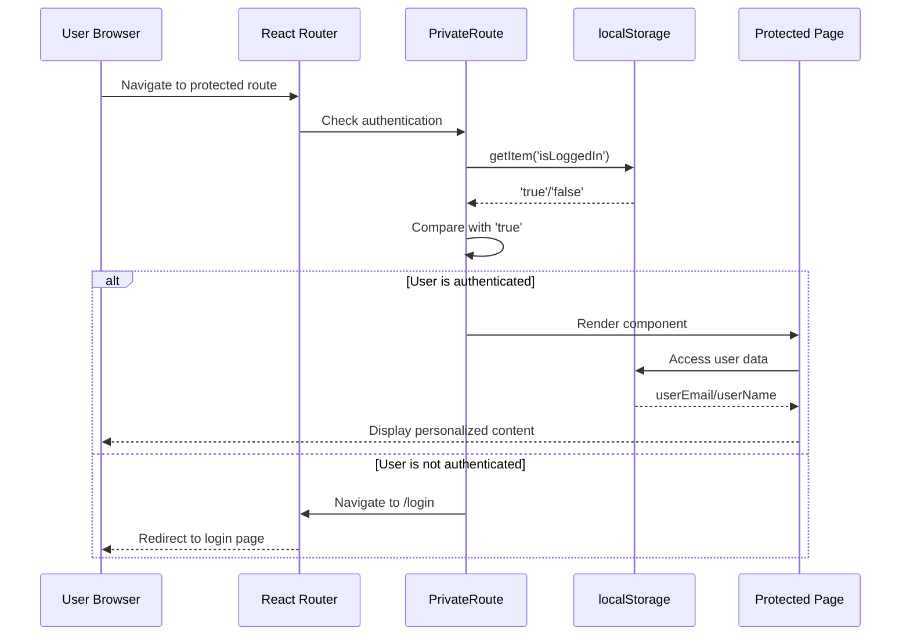
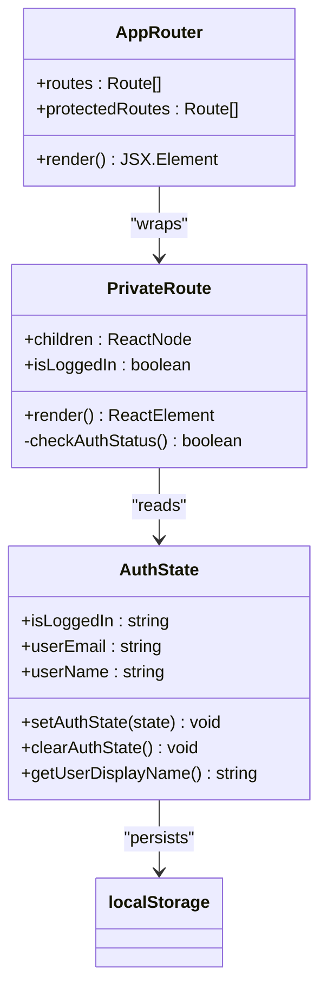
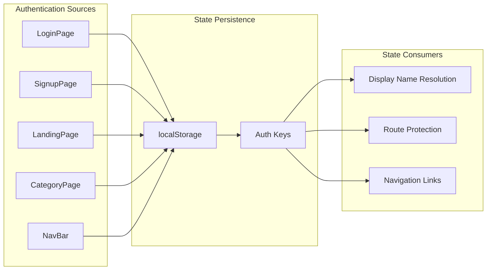
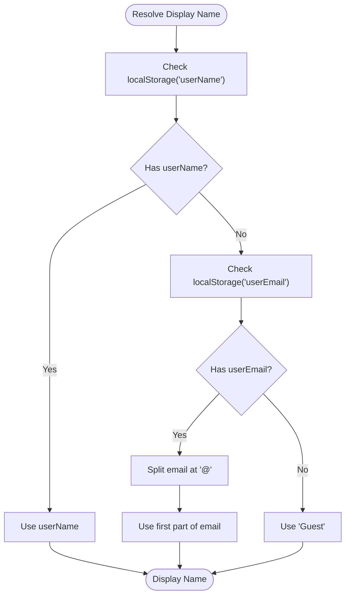
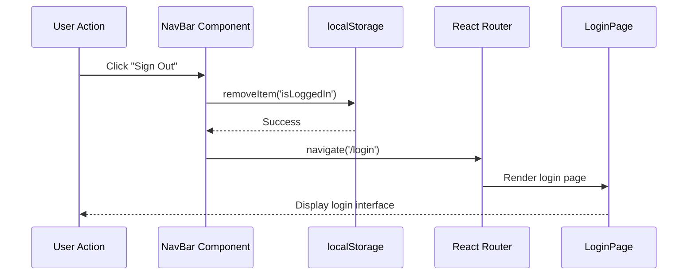
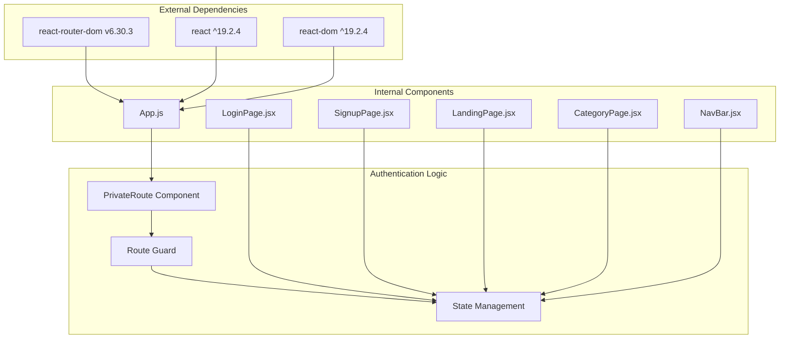

# Authentication State Management

<cite>
**Referenced Files in This Document**
- [App.js](file://src/App.js)
- [LoginPage.jsx](file://src/pages/LoginPage.jsx)
- [SignupPage.jsx](file://src/pages/SignupPage.jsx)
- [LandingPage.jsx](file://src/pages/LandingPage.jsx)
- [NavBar.jsx](file://src/components/NavBar.jsx)
- [CategoryPage.jsx](file://src/components/CategoryPage.jsx)
- [AuthPages.css](file://src/pages/AuthPages.css)
- [package.json](file://package.json)
</cite>

## Table of Contents
1. [Introduction](#introduction)
2. [Project Structure](#project-structure)
3. [Core Components](#core-components)
4. [Architecture Overview](#architecture-overview)
5. [Detailed Component Analysis](#detailed-component-analysis)
6. [Dependency Analysis](#dependency-analysis)
7. [Performance Considerations](#performance-considerations)
8. [Troubleshooting Guide](#troubleshooting-guide)
9. [Conclusion](#conclusion)

## Introduction

The Lumière e-commerce client implements a localStorage-based authentication system that provides seamless user session management across browser sessions. This system enables secure route protection, persistent user state tracking, and automatic logout functionality while maintaining simplicity and reliability for the shopping experience.

The authentication system is built around three primary localStorage keys: `isLoggedIn`, `userEmail`, and `userName`. These keys collectively manage user authentication state, session persistence, and user identity presentation throughout the application.

## Project Structure

The authentication system is distributed across several key components within the React application architecture:

**Diagram sources**
- [App.js:12-16](file://src/App.js#L12-L16)
- [LoginPage.jsx:33-36](file://src/pages/LoginPage.jsx#L33-L36)
- [SignupPage.jsx:38-41](file://src/pages/SignupPage.jsx#L38-L41)

**Section sources**
- [App.js:1-85](file://src/App.js#L1-L85)
- [package.json:1-41](file://package.json#L1-L41)

## Core Components

### Authentication State Keys

The system utilizes three primary localStorage keys for state management:

| Key | Purpose | Data Type | Scope |
|-----|---------|-----------|-------|
| `isLoggedIn` | Authentication status flag | String (`"true"`/`"false"`) | Global application |
| `userEmail` | User email address | String | Session scope |
| `userName` | User display name | String | Session scope |

### Route Protection Implementation

The authentication guard is implemented as a simple yet effective middleware pattern:

**Diagram sources**
- [App.js:13-16](file://src/App.js#L13-L16)

**Section sources**
- [App.js:12-16](file://src/App.js#L12-L16)

## Architecture Overview

The authentication architecture follows a centralized state management pattern with distributed access points:

**Diagram sources**
- [App.js:13-16](file://src/App.js#L13-L16)
- [LandingPage.jsx:58-60](file://src/pages/LandingPage.jsx#L58-L60)

**Section sources**
- [App.js:18-85](file://src/App.js#L18-L85)

## Detailed Component Analysis

### Authentication Guard Implementation

The PrivateRoute component serves as the central authentication gatekeeper:

**Diagram sources**
- [App.js:13-16](file://src/App.js#L13-L16)
- [LandingPage.jsx:126-129](file://src/pages/LandingPage.jsx#L126-L129)

#### Authentication Flow Patterns

The system implements two primary authentication flows:

**Login Flow:**
1. User submits valid credentials
2. System validates password length (mock validation)
3. On success, sets `isLoggedIn` to `"true"`
4. Stores user email in `userEmail` key
5. Navigates to home page

**Registration Flow:**
1. User submits registration form
2. System validates form fields
3. On success, sets `isLoggedIn` to `"true"`
4. Stores user name in `userName` key
5. Navigates to home page

**Section sources**
- [LoginPage.jsx:25-42](file://src/pages/LoginPage.jsx#L25-L42)
- [SignupPage.jsx:32-44](file://src/pages/SignupPage.jsx#L32-L44)

### State Synchronization Across Components

The authentication state is synchronized through multiple access points:

**Diagram sources**
- [LandingPage.jsx:58-60](file://src/pages/LandingPage.jsx#L58-L60)
- [CategoryPage.jsx:10-13](file://src/components/CategoryPage.jsx#L10-L13)

#### Display Name Resolution

The system implements intelligent user display name resolution:

**Diagram sources**
- [LandingPage.jsx:58-60](file://src/pages/LandingPage.jsx#L58-L60)
- [CategoryPage.jsx:10-13](file://src/components/CategoryPage.jsx#L10-L13)

**Section sources**
- [LandingPage.jsx:58-60](file://src/pages/LandingPage.jsx#L58-L60)
- [CategoryPage.jsx:10-13](file://src/components/CategoryPage.jsx#L10-L13)

### Automatic Logout Implementation

The logout functionality is implemented consistently across all authenticated components:

**Diagram sources**
- [LandingPage.jsx:126-129](file://src/pages/LandingPage.jsx#L126-L129)
- [CategoryPage.jsx:60-63](file://src/components/CategoryPage.jsx#L60-L63)

**Section sources**
- [LandingPage.jsx:126-129](file://src/pages/LandingPage.jsx#L126-L129)
- [CategoryPage.jsx:60-63](file://src/components/CategoryPage.jsx#L60-L63)

## Dependency Analysis

The authentication system has minimal external dependencies, relying primarily on React Router DOM for navigation:

**Diagram sources**
- [package.json:10-12](file://package.json#L10-L12)
- [App.js:1-10](file://src/App.js#L1-L10)

**Section sources**
- [package.json:1-41](file://package.json#L1-L41)

## Performance Considerations

### State Access Optimization

The authentication system implements efficient state access patterns:

- **Single localStorage reads**: Authentication state is checked with minimal localStorage operations
- **Declarative routing**: Route protection is handled declaratively through React Router
- **Component-level caching**: User display names are computed once per component mount

### Memory Management

The system avoids memory leaks through proper cleanup:

- **Timer cleanup**: Hero carousel timers are cleared on component unmount
- **Event listeners**: No persistent event listeners are maintained
- **State cleanup**: Logout removes only necessary keys from localStorage

## Troubleshooting Guide

### Common Authentication Issues

**Issue: Users remain logged in after browser restart**
- **Cause**: `isLoggedIn` key persists in localStorage
- **Solution**: Clear localStorage or implement session expiration
- **Prevention**: Add timestamp-based expiration to authentication tokens

**Issue: Display name shows "Guest" instead of user name**
- **Cause**: Missing `userName` or `userEmail` in localStorage
- **Solution**: Verify authentication flow completed successfully
- **Debugging**: Check localStorage keys after successful login

**Issue: Route protection fails silently**
- **Cause**: PrivateRoute component not properly wrapping protected routes
- **Solution**: Ensure all protected routes use the PrivateRoute wrapper
- **Verification**: Check App.js route configuration

### Edge Cases and Solutions

**Concurrent Sessions**: The current implementation doesn't support multiple concurrent sessions. If a user logs in on another device, the first session remains active until manually logged out.

**State Corruption**: If localStorage becomes corrupted, the system gracefully falls back to guest mode with "Guest" display name.

**Session Timeout**: The current implementation has no automatic session timeout. Consider adding timestamp-based expiration for production use.

**Cross-tab Synchronization**: The system doesn't automatically synchronize authentication state across browser tabs. Consider implementing localStorage event listeners for cross-tab communication.

**Section sources**
- [LandingPage.jsx:58-60](file://src/pages/LandingPage.jsx#L58-L60)
- [App.js:13-16](file://src/App.js#L13-L16)

## Conclusion

The Lumière e-commerce client implements a robust, localStorage-based authentication system that provides reliable user session management with minimal complexity. The system successfully balances security, usability, and maintainability through its centralized state management approach.

Key strengths of the implementation include:

- **Simplicity**: Clean, straightforward authentication logic using standard localStorage APIs
- **Reliability**: Consistent authentication state across all application components
- **Scalability**: Modular design that can accommodate future authentication enhancements
- **User Experience**: Seamless authentication flow with intuitive display name resolution

The system provides a solid foundation for e-commerce authentication that can be extended with advanced features like session timeout, concurrent session management, and cross-tab synchronization as the application evolves.