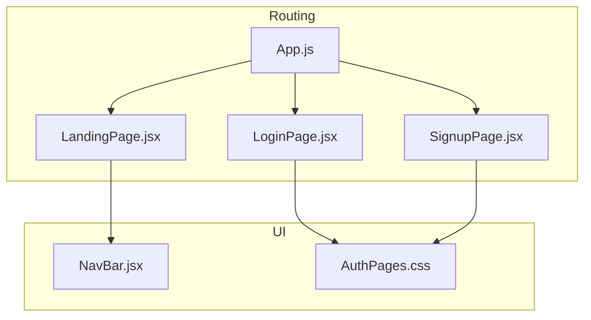
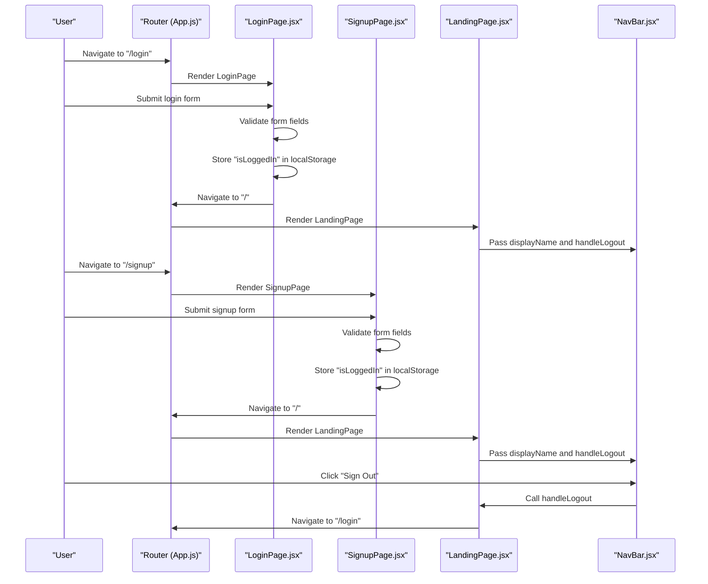
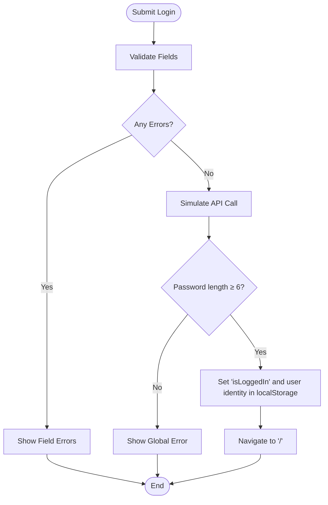
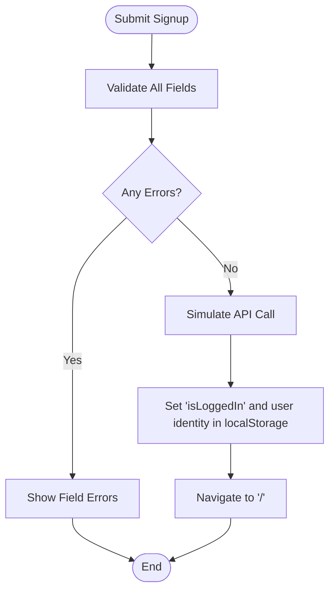
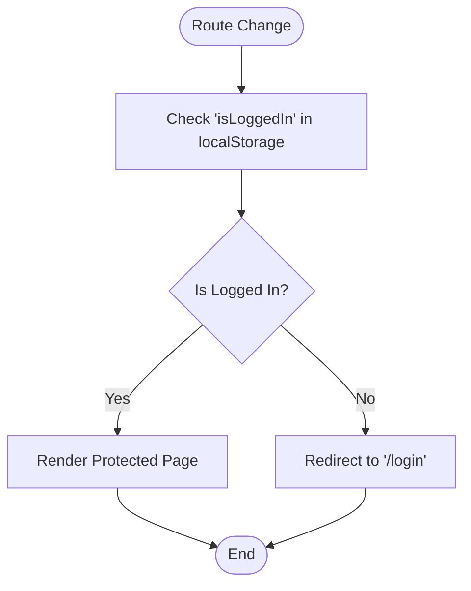
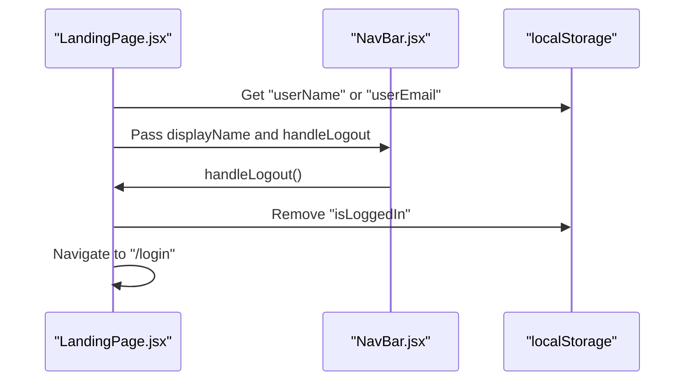
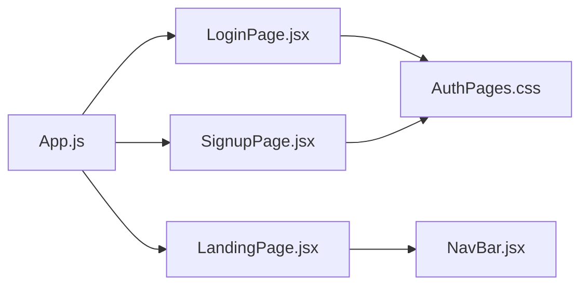

# Authentication System

<cite>
**Referenced Files in This Document**
- [LoginPage.jsx](file://src/pages/LoginPage.jsx)
- [SignupPage.jsx](file://src/pages/SignupPage.jsx)
- [App.js](file://src/App.js)
- [LandingPage.jsx](file://src/pages/LandingPage.jsx)
- [NavBar.jsx](file://src/components/NavBar.jsx)
- [AuthPages.css](file://src/pages/AuthPages.css)
</cite>

## Table of Contents
1. [Introduction](#introduction)
2. [Project Structure](#project-structure)
3. [Core Components](#core-components)
4. [Architecture Overview](#architecture-overview)
5. [Detailed Component Analysis](#detailed-component-analysis)
6. [Dependency Analysis](#dependency-analysis)
7. [Performance Considerations](#performance-considerations)
8. [Troubleshooting Guide](#troubleshooting-guide)
9. [Conclusion](#conclusion)

## Introduction
This document explains the authentication system for the Lumière e-commerce client. It covers user registration and login flows, form validation, error handling, success feedback, authentication state management using localStorage, session handling, and private route protection with authentication guards. It also documents the relationship between authentication components and the main App routing system, along with security considerations, troubleshooting guidance, and best practices for user session management.

## Project Structure
The authentication system spans several key files:
- Login and signup forms are implemented in dedicated pages
- Routing and authentication guards are defined in the main App component
- Shared styling for authentication pages is centralized
- The landing page integrates authentication state and logout functionality
- The navigation bar displays user greeting and provides logout action

**Diagram sources**
- [App.js:18-85](file://src/App.js#L18-L85)
- [LoginPage.jsx:5-151](file://src/pages/LoginPage.jsx#L5-L151)
- [SignupPage.jsx:5-158](file://src/pages/SignupPage.jsx#L5-L158)
- [LandingPage.jsx:57-177](file://src/pages/LandingPage.jsx#L57-L177)
- [NavBar.jsx:7-30](file://src/components/NavBar.jsx#L7-L30)
- [AuthPages.css:19-277](file://src/pages/AuthPages.css#L19-L277)

**Section sources**
- [App.js:18-85](file://src/App.js#L18-L85)
- [LoginPage.jsx:5-151](file://src/pages/LoginPage.jsx#L5-L151)
- [SignupPage.jsx:5-158](file://src/pages/SignupPage.jsx#L5-L158)
- [LandingPage.jsx:57-177](file://src/pages/LandingPage.jsx#L57-L177)
- [NavBar.jsx:7-30](file://src/components/NavBar.jsx#L7-L30)
- [AuthPages.css:19-277](file://src/pages/AuthPages.css#L19-L277)

## Core Components
- LoginPage.jsx: Implements login form with client-side validation, loading states, and feedback messages. On successful validation, it stores authentication state in localStorage and navigates to the protected landing page.
- SignupPage.jsx: Implements registration form with comprehensive validation for name, email, password, confirm password, and phone. On success, it stores authentication state and navigates to the landing page.
- App.js: Defines the routing system and a simple authentication guard that checks localStorage for an authentication flag to protect routes.
- LandingPage.jsx: Displays user greeting based on stored user identity and provides logout functionality by removing the authentication flag from localStorage.
- NavBar.jsx: Renders the user greeting and logout button, receiving the display name and logout handler from LandingPage.
- AuthPages.css: Provides shared styling for authentication forms and visual sections.

**Section sources**
- [LoginPage.jsx:5-151](file://src/pages/LoginPage.jsx#L5-L151)
- [SignupPage.jsx:5-158](file://src/pages/SignupPage.jsx#L5-L158)
- [App.js:12-16](file://src/App.js#L12-L16)
- [LandingPage.jsx:126-129](file://src/pages/LandingPage.jsx#L126-L129)
- [NavBar.jsx:73-76](file://src/components/NavBar.jsx#L73-L76)
- [AuthPages.css:19-277](file://src/pages/AuthPages.css#L19-L277)

## Architecture Overview
The authentication system uses a simple localStorage-based approach:
- Authentication state is stored under a key indicating logged-in status
- A reusable authentication guard checks this key to protect routes
- Forms manage local state for validation and user feedback
- Navigation updates based on authentication state

**Diagram sources**
- [App.js:18-85](file://src/App.js#L18-L85)
- [LoginPage.jsx:25-42](file://src/pages/LoginPage.jsx#L25-L42)
- [SignupPage.jsx:32-44](file://src/pages/SignupPage.jsx#L32-L44)
- [LandingPage.jsx:126-129](file://src/pages/LandingPage.jsx#L126-L129)
- [NavBar.jsx:73-76](file://src/components/NavBar.jsx#L73-L76)

## Detailed Component Analysis

### LoginPage.jsx
- Form state: Tracks email and password
- Validation: Ensures email format and presence of password
- Feedback: Displays field-level errors and global error for invalid credentials
- Loading state: Disables submit button during simulated API call
- Success flow: On valid submission, stores authentication state and navigates to home

**Diagram sources**
- [LoginPage.jsx:12-17](file://src/pages/LoginPage.jsx#L12-L17)
- [LoginPage.jsx:25-42](file://src/pages/LoginPage.jsx#L25-L42)
- [LoginPage.jsx:34-35](file://src/pages/LoginPage.jsx#L34-L35)

**Section sources**
- [LoginPage.jsx:5-151](file://src/pages/LoginPage.jsx#L5-L151)

### SignupPage.jsx
- Form state: Tracks name, email, password, confirm password, and phone
- Validation: Enforces name presence, email format, password length, password match, and phone format
- Feedback: Displays field-level errors inline
- Loading state: Disables submit button during simulated API call
- Success flow: On valid submission, stores authentication state and navigates to home

**Diagram sources**
- [SignupPage.jsx:17-25](file://src/pages/SignupPage.jsx#L17-L25)
- [SignupPage.jsx:32-44](file://src/pages/SignupPage.jsx#L32-L44)
- [SignupPage.jsx:39-40](file://src/pages/SignupPage.jsx#L39-L40)

**Section sources**
- [SignupPage.jsx:5-158](file://src/pages/SignupPage.jsx#L5-L158)

### App.js Authentication Guard and Routing
- Authentication guard: Checks localStorage for an authentication flag to decide whether to render protected content or redirect to login
- Routes: Defines login, signup, and protected category pages behind the authentication guard
- Redirect behavior: Unauthenticated users are redirected to login; otherwise they see the requested page

**Diagram sources**
- [App.js:12-16](file://src/App.js#L12-L16)
- [App.js:28-78](file://src/App.js#L28-L78)

**Section sources**
- [App.js:12-16](file://src/App.js#L12-L16)
- [App.js:18-85](file://src/App.js#L18-L85)

### LandingPage.jsx and NavBar.jsx Integration
- LandingPage.jsx: Reads user identity from localStorage to greet the user and provides logout by removing the authentication flag
- NavBar.jsx: Receives displayName and handleLogout props from LandingPage to render greeting and logout button

**Diagram sources**
- [LandingPage.jsx:59-60](file://src/pages/LandingPage.jsx#L59-L60)
- [LandingPage.jsx:126-129](file://src/pages/LandingPage.jsx#L126-L129)
- [NavBar.jsx:73-76](file://src/components/NavBar.jsx#L73-L76)

**Section sources**
- [LandingPage.jsx:57-177](file://src/pages/LandingPage.jsx#L57-L177)
- [NavBar.jsx:7-30](file://src/components/NavBar.jsx#L7-L30)

### Styling and User Experience
- Shared styles: Centralized CSS for authentication forms, visual sections, and responsive layout
- Error presentation: Field-level errors and global error messages styled consistently
- Visual feedback: Disabled buttons during loading, spinner indicators, and interactive states

**Section sources**
- [AuthPages.css:19-277](file://src/pages/AuthPages.css#L19-L277)

## Dependency Analysis
- LoginPage.jsx depends on React hooks and react-router-dom for navigation
- SignupPage.jsx similarly depends on React hooks and react-router-dom
- App.js orchestrates routing and defines the authentication guard
- LandingPage.jsx depends on localStorage and react-router-dom for navigation
- NavBar.jsx receives props from LandingPage for user greeting and logout

**Diagram sources**
- [App.js:18-85](file://src/App.js#L18-L85)
- [LoginPage.jsx:5-151](file://src/pages/LoginPage.jsx#L5-L151)
- [SignupPage.jsx:5-158](file://src/pages/SignupPage.jsx#L5-L158)
- [LandingPage.jsx:57-177](file://src/pages/LandingPage.jsx#L57-L177)
- [NavBar.jsx:7-30](file://src/components/NavBar.jsx#L7-L30)
- [AuthPages.css:19-277](file://src/pages/AuthPages.css#L19-L277)

**Section sources**
- [App.js:18-85](file://src/App.js#L18-L85)
- [LoginPage.jsx:5-151](file://src/pages/LoginPage.jsx#L5-L151)
- [SignupPage.jsx:5-158](file://src/pages/SignupPage.jsx#L5-L158)
- [LandingPage.jsx:57-177](file://src/pages/LandingPage.jsx#L57-L177)
- [NavBar.jsx:7-30](file://src/components/NavBar.jsx#L7-L30)
- [AuthPages.css:19-277](file://src/pages/AuthPages.css#L19-L277)

## Performance Considerations
- Client-side validation reduces server load during initial checks
- Simulated API calls introduce minimal delay; consider adding real network requests with proper error handling
- LocalStorage reads/writes are synchronous; keep payloads small to minimize overhead
- Avoid unnecessary re-renders by managing form state efficiently and using controlled components

## Troubleshooting Guide
Common issues and resolutions:
- Login fails with global error: Verify password meets minimum length requirement
  - Check validation logic and ensure the password meets the required length
  - Confirm that authentication state is being written to localStorage
  - Reference: [LoginPage.jsx:12-17](file://src/pages/LoginPage.jsx#L12-L17), [LoginPage.jsx:33-39](file://src/pages/LoginPage.jsx#L33-L39)
- Signup validation errors: Ensure all fields meet validation criteria (name, email, password length, password match, phone)
  - Review field-level error messages and adjust input accordingly
  - Reference: [SignupPage.jsx:17-25](file://src/pages/SignupPage.jsx#L17-L25)
- Protected routes redirect to login unexpectedly: Check that authentication flag is present in localStorage
  - Clear browser cache/localStorage if stale state persists
  - Reference: [App.js:12-16](file://src/App.js#L12-L16)
- Logout does not work: Confirm that the authentication flag is removed and navigation occurs
  - Reference: [LandingPage.jsx:126-129](file://src/pages/LandingPage.jsx#L126-L129)
- Styling inconsistencies: Verify that shared CSS classes are applied correctly
  - Reference: [AuthPages.css:19-277](file://src/pages/AuthPages.css#L19-L277)

**Section sources**
- [LoginPage.jsx:12-17](file://src/pages/LoginPage.jsx#L12-L17)
- [LoginPage.jsx:33-39](file://src/pages/LoginPage.jsx#L33-L39)
- [SignupPage.jsx:17-25](file://src/pages/SignupPage.jsx#L17-L25)
- [App.js:12-16](file://src/App.js#L12-L16)
- [LandingPage.jsx:126-129](file://src/pages/LandingPage.jsx#L126-L129)
- [AuthPages.css:19-277](file://src/pages/AuthPages.css#L19-L277)

## Conclusion
The Lumière authentication system uses a straightforward client-side approach with localStorage-backed state, simple form validation, and a reusable authentication guard. It provides clear user feedback, protects routes effectively, and integrates seamlessly with the main application routing. For production readiness, consider replacing simulated API calls with real backend integration, enhancing security around client-side storage, and centralizing state management for scalability.