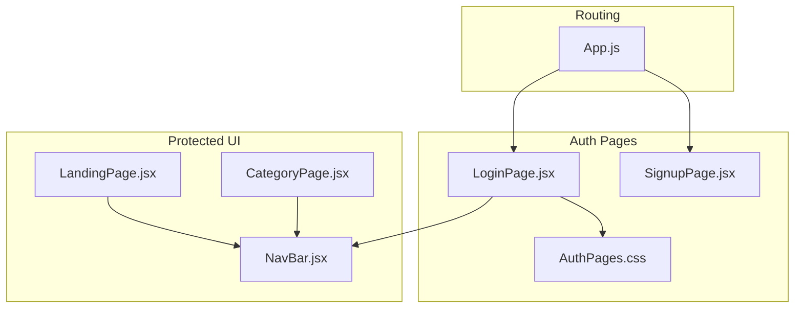
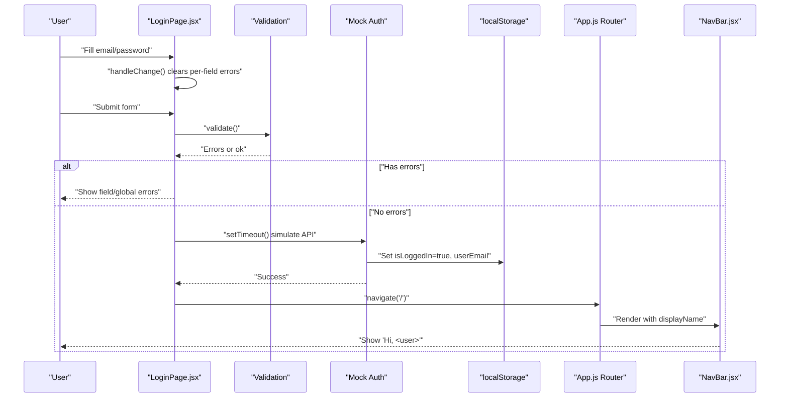
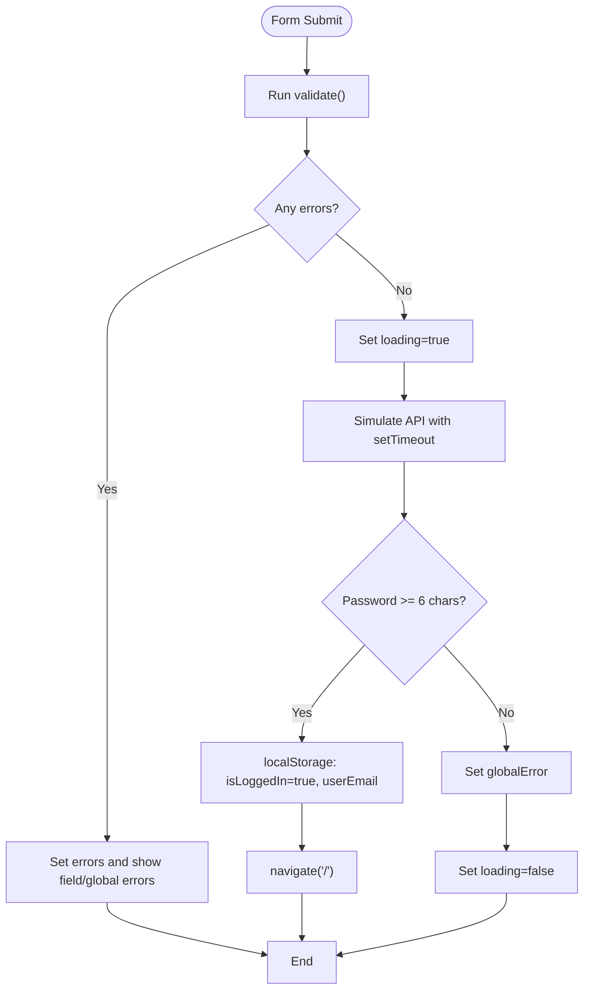
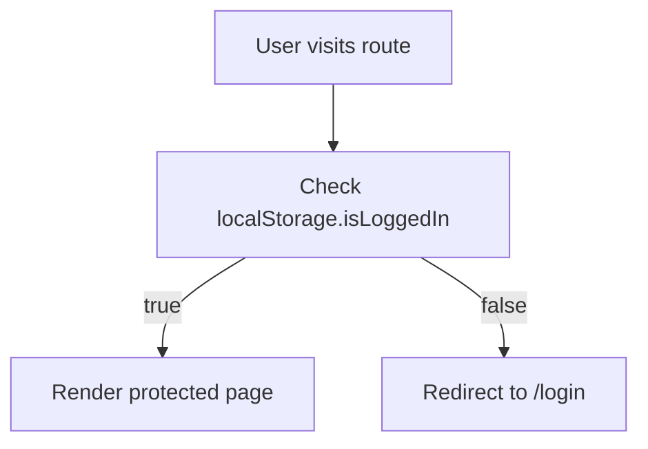
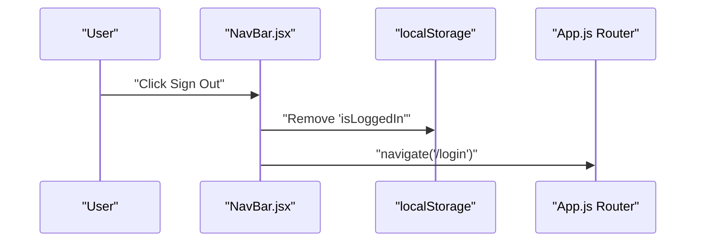
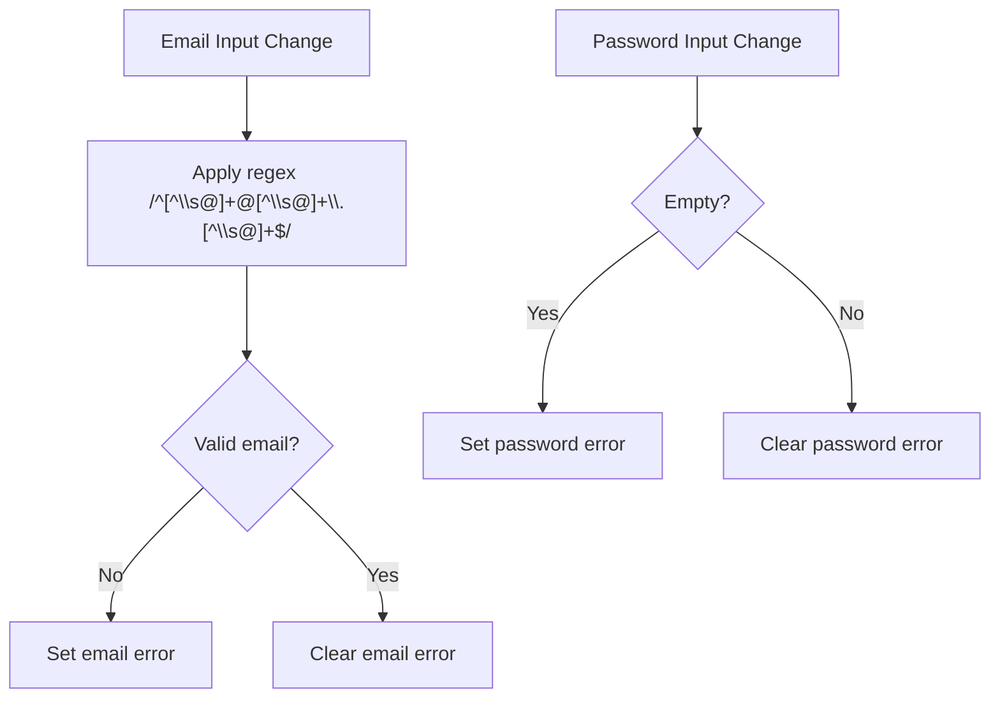
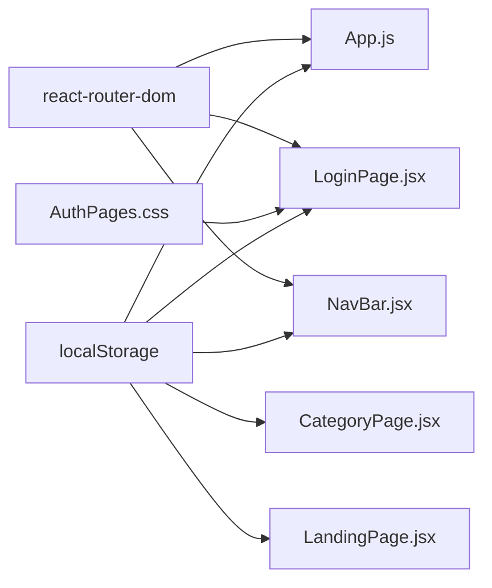

# Login Functionality

<cite>
**Referenced Files in This Document**
- [LoginPage.jsx](file://src/pages/LoginPage.jsx)
- [AuthPages.css](file://src/pages/AuthPages.css)
- [App.js](file://src/App.js)
- [NavBar.jsx](file://src/components/NavBar.jsx)
- [CategoryPage.jsx](file://src/components/CategoryPage.jsx)
- [LandingPage.jsx](file://src/pages/LandingPage.jsx)
- [SignupPage.jsx](file://src/pages/SignupPage.jsx)
- [package.json](file://package.json)
</cite>

## Table of Contents
1. [Introduction](#introduction)
2. [Project Structure](#project-structure)
3. [Core Components](#core-components)
4. [Architecture Overview](#architecture-overview)
5. [Detailed Component Analysis](#detailed-component-analysis)
6. [Dependency Analysis](#dependency-analysis)
7. [Performance Considerations](#performance-considerations)
8. [Troubleshooting Guide](#troubleshooting-guide)
9. [Conclusion](#conclusion)

## Introduction
This document explains the login functionality in the Lumière e-commerce client. It focuses on the LoginPage component’s form handling, validation logic, user feedback mechanisms, and the mock authentication flow using localStorage. It also documents the integration points for social login buttons and provides troubleshooting guidance for common login issues such as invalid credentials, validation errors, and loading states.

## Project Structure
The login feature spans several files:
- LoginPage.jsx: Implements the login form, validation, and mock authentication.
- AuthPages.css: Provides styling for the login form and error states.
- App.js: Defines routing and a simple authentication guard using localStorage.
- NavBar.jsx: Displays the logged-in user greeting and logout action.
- CategoryPage.jsx and LandingPage.jsx: Demonstrate how the app reads authentication state from localStorage to greet users and enable protected routes.
- SignupPage.jsx: Shows a similar pattern for sign-up, which complements the login flow.
- package.json: Lists React and react-router-dom dependencies.

**Diagram sources**
- [App.js:18-85](file://src/App.js#L18-L85)
- [LoginPage.jsx:1-151](file://src/pages/LoginPage.jsx#L1-L151)
- [AuthPages.css:1-277](file://src/pages/AuthPages.css#L1-L277)
- [NavBar.jsx:1-177](file://src/components/NavBar.jsx#L1-L177)
- [LandingPage.jsx:57-130](file://src/pages/LandingPage.jsx#L57-L130)
- [CategoryPage.jsx:10-63](file://src/components/CategoryPage.jsx#L10-L63)
- [SignupPage.jsx:1-158](file://src/pages/SignupPage.jsx#L1-L158)

**Section sources**
- [App.js:18-85](file://src/App.js#L18-L85)
- [LoginPage.jsx:1-151](file://src/pages/LoginPage.jsx#L1-L151)
- [AuthPages.css:1-277](file://src/pages/AuthPages.css#L1-L277)
- [NavBar.jsx:1-177](file://src/components/NavBar.jsx#L1-L177)
- [LandingPage.jsx:57-130](file://src/pages/LandingPage.jsx#L57-L130)
- [CategoryPage.jsx:10-63](file://src/components/CategoryPage.jsx#L10-L63)
- [SignupPage.jsx:1-158](file://src/pages/SignupPage.jsx#L1-L158)
- [package.json:1-41](file://package.json#L1-L41)

## Core Components
- LoginPage: Manages form state, validates inputs, simulates authentication, and redirects on success.
- AuthPages.css: Applies field error highlighting, global error banners, and button states.
- App.js: Protects routes using a localStorage-based guard.
- NavBar: Displays the user greeting and handles logout.
- CategoryPage and LandingPage: Read authentication state from localStorage to personalize the UI.
- SignupPage: Demonstrates a similar form and localStorage-based login flow.

Key implementation highlights:
- Form state management with useState for email/password and error messages.
- Real-time validation triggered on input change.
- Loading state during the mock authentication attempt.
- Social login buttons present for Google and GitHub (placeholder actions).

**Section sources**
- [LoginPage.jsx:5-42](file://src/pages/LoginPage.jsx#L5-L42)
- [AuthPages.css:79-111](file://src/pages/AuthPages.css#L79-L111)
- [App.js:12-16](file://src/App.js#L12-L16)
- [NavBar.jsx:73-76](file://src/components/NavBar.jsx#L73-L76)
- [CategoryPage.jsx:10-63](file://src/components/CategoryPage.jsx#L10-L63)
- [LandingPage.jsx:57-130](file://src/pages/LandingPage.jsx#L57-L130)
- [SignupPage.jsx:1-44](file://src/pages/SignupPage.jsx#L1-L44)

## Architecture Overview
The login flow integrates form handling, validation, and a mock authentication step before redirecting to the home page. Authentication state is persisted in localStorage and used by the router and UI components.

**Diagram sources**
- [LoginPage.jsx:19-42](file://src/pages/LoginPage.jsx#L19-L42)
- [App.js:12-16](file://src/App.js#L12-L16)
- [NavBar.jsx:73-76](file://src/components/NavBar.jsx#L73-L76)

## Detailed Component Analysis

### LoginPage Component
- State management:
  - form: Tracks email and password.
  - errors: Tracks per-field validation errors.
  - loading: Controls submit button state and spinner.
  - globalError: Displays a banner-level error message.
- Validation:
  - Email regex pattern: /^[^\s@]+@[^\s@]+\.[^\s@]+$/
  - Password requirement: Non-empty string (mocked to require at least 6 characters).
- Event handling:
  - handleChange: Updates form values, clears per-field error, clears global error.
  - handleSubmit: Prevents default, runs validation, sets loading, simulates async operation, updates localStorage, navigates on success, shows global error on failure.
- UI feedback:
  - Field groups apply an "error" class when a field has an error.
  - Field error messages appear below invalid fields.
  - Global error banner appears above the form when authentication fails.
  - Submit button is disabled while loading and shows a spinner.

**Diagram sources**
- [LoginPage.jsx:12-42](file://src/pages/LoginPage.jsx#L12-L42)

**Section sources**
- [LoginPage.jsx:5-42](file://src/pages/LoginPage.jsx#L5-L42)
- [AuthPages.css:79-111](file://src/pages/AuthPages.css#L79-L111)

### Authentication Guard and Protected Routes
- PrivateRoute checks localStorage for "isLoggedIn" to decide whether to render protected content or redirect to /login.
- App routes define:
  - /login: LoginPage
  - /signup: SignupPage
  - Root and category routes: Protected by PrivateRoute

**Diagram sources**
- [App.js:12-16](file://src/App.js#L12-L16)
- [App.js:23-78](file://src/App.js#L23-L78)

**Section sources**
- [App.js:12-16](file://src/App.js#L12-L16)
- [App.js:23-78](file://src/App.js#L23-L78)

### Navigation Bar and Logout
- NavBar displays a greeting using the stored user identity (username or email).
- Logout removes the authentication flag from localStorage and navigates to /login.

**Diagram sources**
- [NavBar.jsx:73-76](file://src/components/NavBar.jsx#L73-L76)
- [LandingPage.jsx:126-129](file://src/pages/LandingPage.jsx#L126-L129)
- [CategoryPage.jsx:60-63](file://src/components/CategoryPage.jsx#L60-L63)

**Section sources**
- [NavBar.jsx:73-76](file://src/components/NavBar.jsx#L73-L76)
- [LandingPage.jsx:126-129](file://src/pages/LandingPage.jsx#L126-L129)
- [CategoryPage.jsx:60-63](file://src/components/CategoryPage.jsx#L60-L63)

### Social Login Integration Points
- LoginPage includes two social login buttons:
  - Google (SVG icon included)
  - GitHub (SVG icon included)
- These buttons currently have type="button" and no click handlers. They serve as placeholders for future integration.

Implementation guidance:
- Add click handlers to trigger external OAuth flows.
- On success, persist authentication state in localStorage and navigate to the home page.
- On failure, surface a global error similar to the existing mechanism.

**Section sources**
- [LoginPage.jsx:100-116](file://src/pages/LoginPage.jsx#L100-L116)

### Password Requirements and Validation
- Email validation uses a regex that ensures a basic email-like format.
- Password validation requires a non-empty string; the mock authentication logic enforces a minimum length of 6 characters.

**Diagram sources**
- [LoginPage.jsx:12-23](file://src/pages/LoginPage.jsx#L12-L23)

**Section sources**
- [LoginPage.jsx:12-23](file://src/pages/LoginPage.jsx#L12-L23)

## Dependency Analysis
- LoginPage depends on:
  - react-router-dom for navigation and programmatic routing.
  - AuthPages.css for styling and error visuals.
- App.js depends on:
  - react-router-dom for routing and the PrivateRoute guard.
- NavBar depends on:
  - react-router-dom for navigation and Link components.
- CategoryPage and LandingPage depend on:
  - localStorage for user identity and authentication state.

**Diagram sources**
- [package.json:10-12](file://package.json#L10-L12)
- [App.js:18-85](file://src/App.js#L18-L85)
- [LoginPage.jsx:1-3](file://src/pages/LoginPage.jsx#L1-L3)
- [AuthPages.css:1-277](file://src/pages/AuthPages.css#L1-L277)
- [NavBar.jsx:1-30](file://src/components/NavBar.jsx#L1-L30)
- [CategoryPage.jsx:10-63](file://src/components/CategoryPage.jsx#L10-L63)
- [LandingPage.jsx:57-130](file://src/pages/LandingPage.jsx#L57-L130)

**Section sources**
- [package.json:10-12](file://package.json#L10-L12)
- [App.js:18-85](file://src/App.js#L18-L85)
- [LoginPage.jsx:1-3](file://src/pages/LoginPage.jsx#L1-L3)
- [AuthPages.css:1-277](file://src/pages/AuthPages.css#L1-L277)
- [NavBar.jsx:1-30](file://src/components/NavBar.jsx#L1-L30)
- [CategoryPage.jsx:10-63](file://src/components/CategoryPage.jsx#L10-L63)
- [LandingPage.jsx:57-130](file://src/pages/LandingPage.jsx#L57-L130)

## Performance Considerations
- The mock authentication uses setTimeout to simulate network latency. In production, replace with a real API call and handle network timeouts gracefully.
- Keep validation lightweight; the current regex is efficient.
- Debounce or throttle input handlers if extending with server-side validation to reduce unnecessary requests.
- Avoid blocking the UI thread during long-running operations; use asynchronous patterns and loading indicators.

## Troubleshooting Guide
Common issues and resolutions:
- Invalid email format:
  - Symptom: Red error under the email field.
  - Cause: Email does not match the regex pattern.
  - Resolution: Enter a valid email address.
- Empty password:
  - Symptom: Red error under the password field.
  - Cause: Password is empty.
  - Resolution: Enter a non-empty password.
- Weak password (mocked):
  - Symptom: Global error banner appears after submission.
  - Cause: Password shorter than 6 characters.
  - Resolution: Use a password with at least 6 characters.
- Network timeout (conceptual):
  - Symptom: Button remains disabled indefinitely.
  - Cause: Simulated async operation did not resolve.
  - Resolution: Add explicit timeout handling and error messaging in production.
- Social login not working:
  - Symptom: Clicking social buttons has no effect.
  - Cause: Buttons are placeholders without handlers.
  - Resolution: Implement OAuth callbacks and update localStorage on success.

Operational tips:
- Clear localStorage keys ("isLoggedIn", "userEmail", "userName") to reset authentication state for testing.
- Verify that the authentication guard redirects unauthenticated users to /login.

**Section sources**
- [LoginPage.jsx:12-42](file://src/pages/LoginPage.jsx#L12-L42)
- [App.js:12-16](file://src/App.js#L12-L16)
- [CategoryPage.jsx:60-63](file://src/components/CategoryPage.jsx#L60-L63)
- [LandingPage.jsx:126-129](file://src/pages/LandingPage.jsx#L126-L129)

## Conclusion
The LoginPage component provides a clean, form-driven authentication experience with real-time validation and user feedback. The mock authentication flow demonstrates a practical pattern for integrating with a backend service, while the localStorage-based guard and UI personalization ensure a cohesive user journey. Extending social login and adding robust error handling will further improve reliability and user satisfaction.