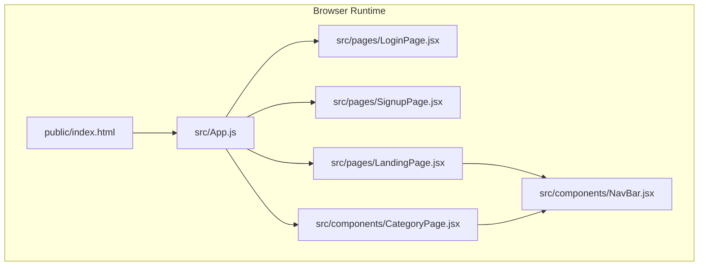
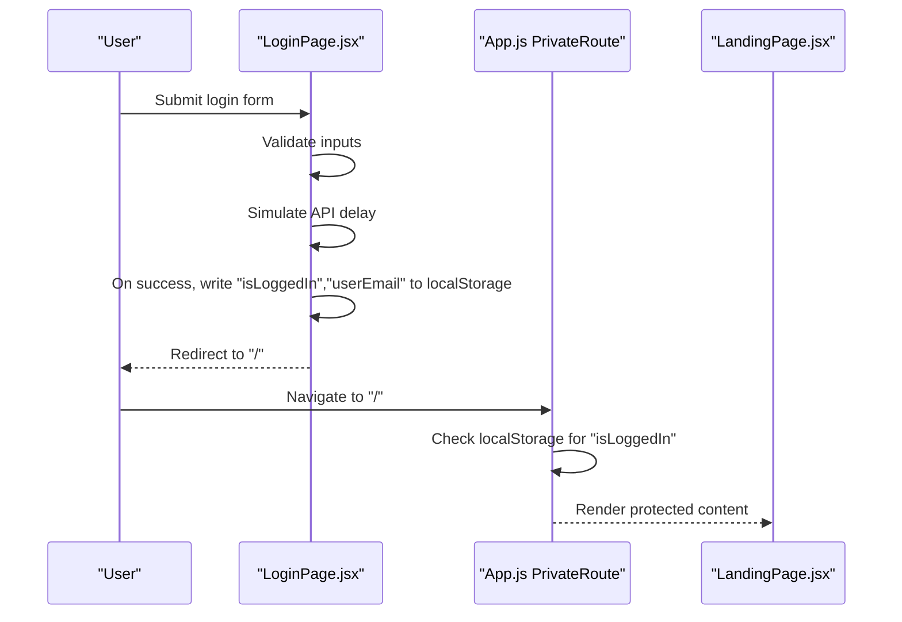
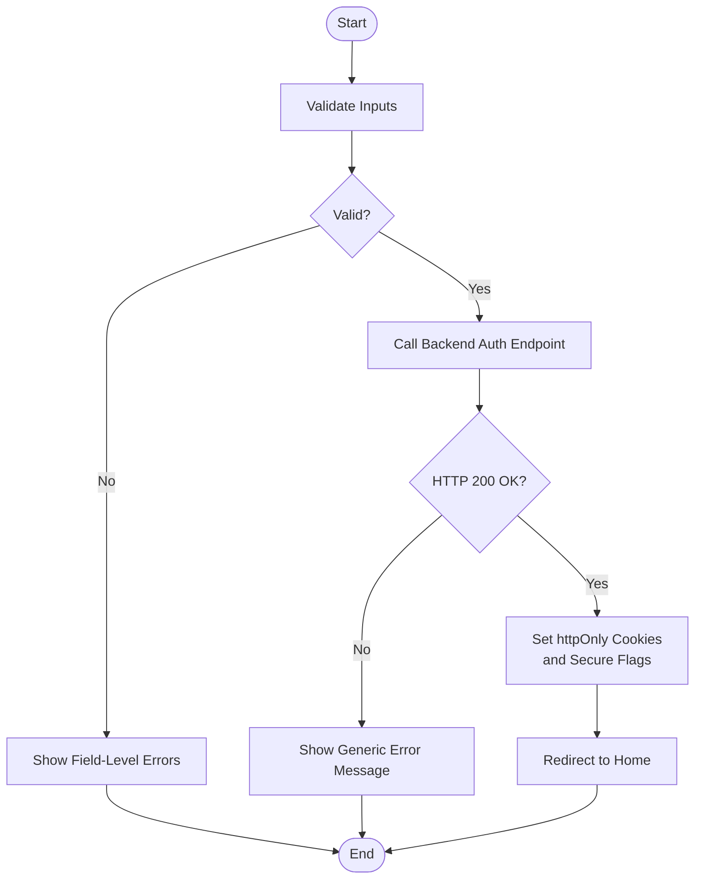
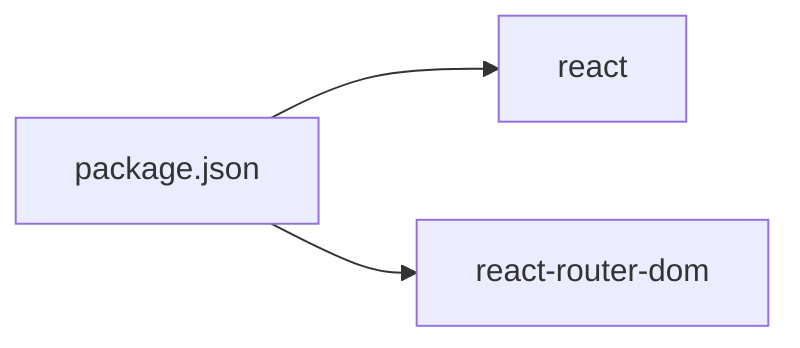

# Security Considerations

<cite>
**Referenced Files in This Document**
- [index.html](file://public/index.html)
- [package.json](file://package.json)
- [App.js](file://src/App.js)
- [LoginPage.jsx](file://src/pages/LoginPage.jsx)
- [SignupPage.jsx](file://src/pages/SignupPage.jsx)
- [LandingPage.jsx](file://src/pages/LandingPage.jsx)
- [CategoryPage.jsx](file://src/components/CategoryPage.jsx)
- [NavBar.jsx](file://src/components/NavBar.jsx)
</cite>

## Table of Contents
1. [Introduction](#introduction)
2. [Project Structure](#project-structure)
3. [Core Components](#core-components)
4. [Architecture Overview](#architecture-overview)
5. [Detailed Component Analysis](#detailed-component-analysis)
6. [Dependency Analysis](#dependency-analysis)
7. [Performance Considerations](#performance-considerations)
8. [Troubleshooting Guide](#troubleshooting-guide)
9. [Conclusion](#conclusion)

## Introduction
This document analyzes the Lumière client-side authentication system and documents its current security posture, risks, and recommended production-grade enhancements. The current implementation uses localStorage to persist minimal authentication state, which introduces significant client-side security risks including cross-site scripting (XSS) exposure, session hijacking via predictable local storage keys, and insecure credential handling. The document explains these risks, proposes secure alternatives, and outlines a migration path from mock authentication to a secure backend-driven model with robust token management and secure communication.

## Project Structure
The client-side authentication logic is primarily implemented in a small set of React components and a routing guard. Authentication state is stored in localStorage and used to enforce route protection and display user identity.

**Diagram sources**
- [index.html:1-44](file://public/index.html#L1-L44)
- [App.js:12-16](file://src/App.js#L12-L16)
- [LoginPage.jsx:33-42](file://src/pages/LoginPage.jsx#L33-L42)
- [SignupPage.jsx:38-44](file://src/pages/SignupPage.jsx#L38-L44)
- [LandingPage.jsx:58-60](file://src/pages/LandingPage.jsx#L58-L60)
- [CategoryPage.jsx:11-13](file://src/components/CategoryPage.jsx#L11-L13)
- [NavBar.jsx:73-76](file://src/components/NavBar.jsx#L73-L76)

**Section sources**
- [index.html:1-44](file://public/index.html#L1-L44)
- [App.js:12-16](file://src/App.js#L12-L16)

## Core Components
- Route-level authentication guard: Uses localStorage to determine whether a user is authenticated and redirects unauthenticated users to the login page.
- Login page: Validates email format and password presence, simulates an API call, and writes minimal state to localStorage upon successful “authentication.”
- Signup page: Validates form fields and writes minimal state to localStorage upon successful “registration.”
- Landing and Category pages: Read localStorage to display user identity and provide logout by removing localStorage entries.
- Navigation bar: Displays user greeting and exposes a logout action.

Key security observations:
- localStorage is used for authentication state, which is inherently vulnerable to XSS.
- No CSRF protection is implemented in forms.
- Passwords are handled in memory without hashing or secure transmission in the current mock flow.
- No secure cookie or token-based session management is present.

**Section sources**
- [App.js:12-16](file://src/App.js#L12-L16)
- [LoginPage.jsx:12-42](file://src/pages/LoginPage.jsx#L12-L42)
- [SignupPage.jsx:17-44](file://src/pages/SignupPage.jsx#L17-L44)
- [LandingPage.jsx:58-60](file://src/pages/LandingPage.jsx#L58-L60)
- [CategoryPage.jsx:11-13](file://src/components/CategoryPage.jsx#L11-L13)
- [NavBar.jsx:73-76](file://src/components/NavBar.jsx#L73-L76)

## Architecture Overview
The current architecture is a frontend-only mock authentication system. Authentication state is stored locally and used for route protection and UI personalization.

**Diagram sources**
- [LoginPage.jsx:25-42](file://src/pages/LoginPage.jsx#L25-L42)
- [App.js:12-16](file://src/App.js#L12-L16)
- [LandingPage.jsx:58-60](file://src/pages/LandingPage.jsx#L58-L60)

## Detailed Component Analysis

### Client-Side Storage of Authentication State
- Risk: localStorage is accessible to any script running on the same origin, making it vulnerable to XSS. An attacker who injects malicious script can steal tokens or session identifiers stored in localStorage.
- Current behavior: Successful login/signup writes a simple flag and user identifier to localStorage. Logout removes the flag.
- Impact: Predictable keys (“isLoggedIn”, “userEmail”, “userName”) allow session hijacking if an attacker can access localStorage.

Recommendations:
- Replace localStorage with httpOnly cookies for session tokens.
- Use SameSite strict cookies to mitigate CSRF.
- Implement short-lived access tokens and refresh tokens with rotation.
- Store only non-sensitive user display data in localStorage if necessary.

**Section sources**
- [LoginPage.jsx:33-36](file://src/pages/LoginPage.jsx#L33-L36)
- [SignupPage.jsx:38-41](file://src/pages/SignupPage.jsx#L38-L41)
- [LandingPage.jsx:126-129](file://src/pages/LandingPage.jsx#L126-L129)
- [CategoryPage.jsx:60-63](file://src/components/CategoryPage.jsx#L60-L63)

### XSS Vulnerabilities
- Risk: Any client-side code executed in the page (including third-party widgets or injected scripts) can access localStorage and exfiltrate authentication state.
- Evidence: localStorage keys are written and read directly without sanitization or obfuscation.
- Mitigation:
  - Apply Content Security Policy (CSP) directives to restrict inline scripts and external script sources.
  - Sanitize and validate all user inputs and dynamic content rendered to the DOM.
  - Avoid storing sensitive data in localStorage; prefer httpOnly cookies.

**Section sources**
- [LoginPage.jsx:33-36](file://src/pages/LoginPage.jsx#L33-L36)
- [SignupPage.jsx:38-41](file://src/pages/SignupPage.jsx#L38-L41)
- [LandingPage.jsx:58-60](file://src/pages/LandingPage.jsx#L58-L60)

### Session Hijacking Risks
- Risk: Predictable localStorage keys and lack of token rotation increase the risk of session theft.
- Current behavior: Single boolean flag determines authentication; no token lifecycle management.
- Mitigation:
  - Use encrypted, random session identifiers in httpOnly cookies.
  - Enforce HTTPS-only cookies and secure flags.
  - Implement automatic logout after inactivity and server-side session invalidation.

**Section sources**
- [App.js:12-16](file://src/App.js#L12-L16)
- [LandingPage.jsx:126-129](file://src/pages/LandingPage.jsx#L126-L129)

### CSRF Protection
- Risk: Forms submit without anti-CSRF tokens, making them susceptible to CSRF attacks.
- Mitigation:
  - Generate and validate CSRF tokens per-session on the backend.
  - Enforce SameSite cookies and Origin/Header checks.
  - Avoid GET-based destructive actions.

**Section sources**
- [LoginPage.jsx:25-42](file://src/pages/LoginPage.jsx#L25-L42)
- [SignupPage.jsx:32-44](file://src/pages/SignupPage.jsx#L32-L44)

### Secure Coding Practices for Input Validation
- Current validation:
  - Email regex validation on login.
  - Password length and confirmation matching on signup.
- Recommendations:
  - Normalize and trim inputs before validation.
  - Use allowlists for acceptable characters and lengths.
  - Avoid displaying raw validation errors that reveal backend structure.
  - Sanitize inputs before rendering and prevent injection into HTML attributes.

**Section sources**
- [LoginPage.jsx:12-17](file://src/pages/LoginPage.jsx#L12-L17)
- [SignupPage.jsx:17-25](file://src/pages/SignupPage.jsx#L17-L25)

### Transition from Mock Authentication to Secure Backend
- Move from localStorage to httpOnly cookies for session tokens.
- Implement token-based authentication with short-lived access tokens and refresh tokens.
- Enforce HTTPS across all endpoints and static assets.
- Add CSRF protection and secure cookie flags.
- Centralize authentication state in a dedicated service or context and avoid direct localStorage usage in components.

**Diagram sources**
- [LoginPage.jsx:12-42](file://src/pages/LoginPage.jsx#L12-L42)
- [SignupPage.jsx:17-44](file://src/pages/SignupPage.jsx#L17-L44)

### Token Management and Secure Communication
- Access tokens: Short-lived, bound to user sessions, rotated regularly.
- Refresh tokens: Stored securely (httpOnly), rotated on reuse, bound to devices or clients.
- Transport security: Enforce HTTPS, HSTS, and secure cookie flags.
- Storage: Avoid localStorage for tokens; use httpOnly cookies with SameSite and Secure flags.

[No sources needed since this section provides general guidance]

### Error Handling to Avoid Information Leakage
- Do not expose internal error details to users.
- Log detailed errors server-side only.
- Use generic messages for authentication failures.

**Section sources**
- [LoginPage.jsx:37-41](file://src/pages/LoginPage.jsx#L37-L41)

### Secure Session Management Patterns
- Enforce session binding (IP, UA, device fingerprint).
- Implement idle timeout and forced logout.
- Invalidate sessions on logout and on sensitive actions.

**Section sources**
- [LandingPage.jsx:126-129](file://src/pages/LandingPage.jsx#L126-L129)
- [CategoryPage.jsx:60-63](file://src/components/CategoryPage.jsx#L60-L63)

## Dependency Analysis
- The client depends on React and react-router-dom for routing and navigation.
- There are no explicit security middleware or libraries in the client dependencies.

**Diagram sources**
- [package.json:5-15](file://package.json#L5-L15)

**Section sources**
- [package.json:5-15](file://package.json#L5-L15)

## Performance Considerations
- Using localStorage for authentication avoids network overhead but introduces security trade-offs.
- Moving to backend authentication adds latency; optimize by caching non-sensitive UI state and minimizing cookie sizes.

[No sources needed since this section provides general guidance]

## Troubleshooting Guide
Common issues and mitigations:
- Login appears to succeed but navigation fails:
  - Verify localStorage keys are being written and read correctly.
  - Confirm route protection logic checks the correct key.
- Persistent login after logout:
  - Ensure logout removes the appropriate localStorage keys and redirects to login.
- Unexpected redirects:
  - Check the private route logic and ensure it reads the correct key.

**Section sources**
- [App.js:12-16](file://src/App.js#L12-L16)
- [LoginPage.jsx:33-42](file://src/pages/LoginPage.jsx#L33-L42)
- [LandingPage.jsx:126-129](file://src/pages/LandingPage.jsx#L126-L129)
- [CategoryPage.jsx:60-63](file://src/components/CategoryPage.jsx#L60-L63)

## Conclusion
The current Lumière client-side authentication is a mock implementation that stores minimal state in localStorage, exposing it to XSS and session hijacking risks. Immediate production readiness requires replacing localStorage with httpOnly cookies, adding CSRF protection, enforcing secure transport, and adopting token-based authentication with rotation. These changes will significantly improve confidentiality, integrity, and availability of the authentication system while enabling a scalable migration to a real backend.