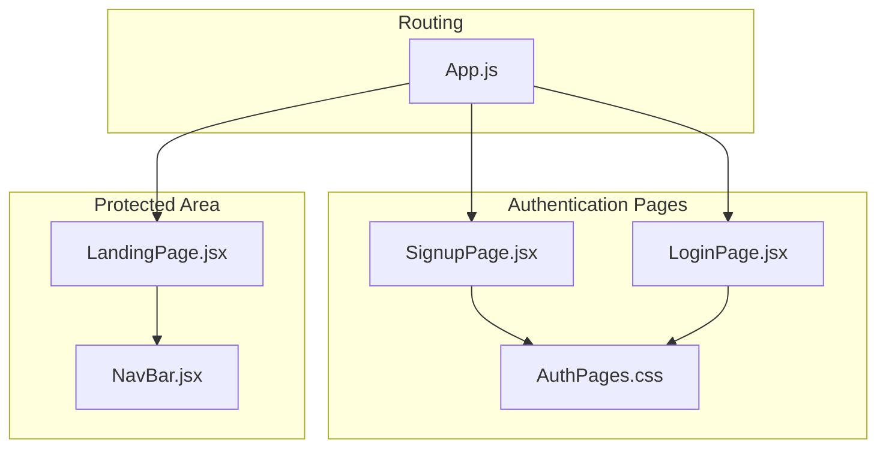
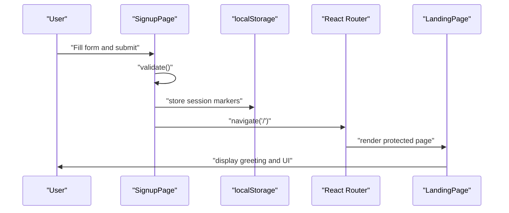
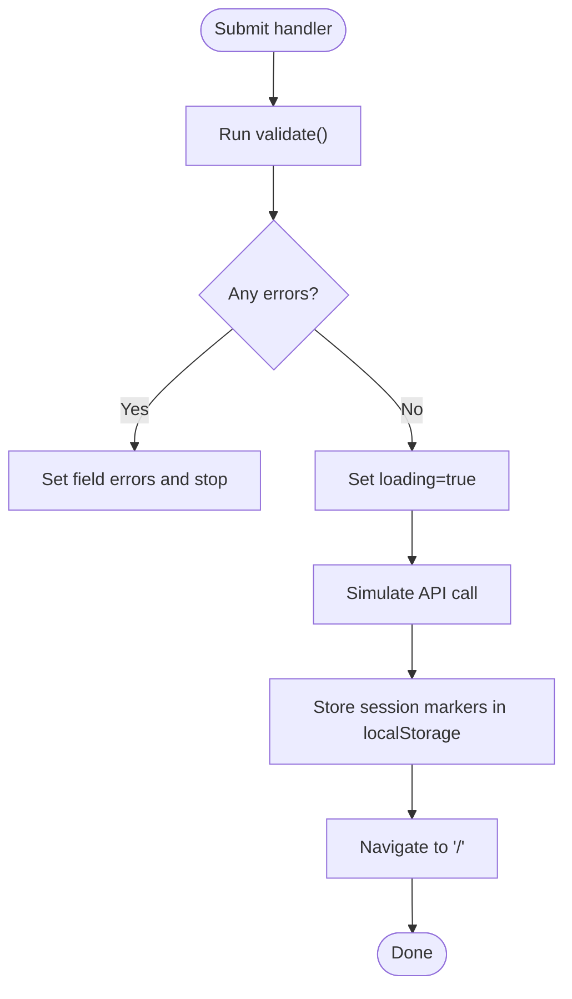
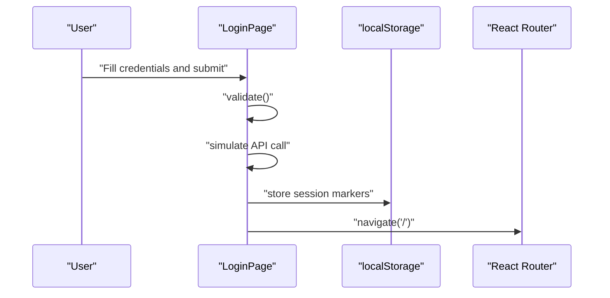
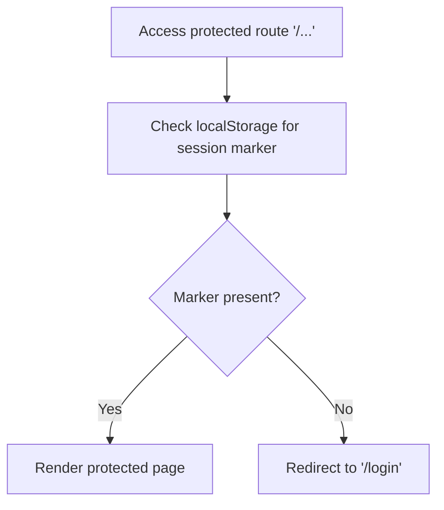
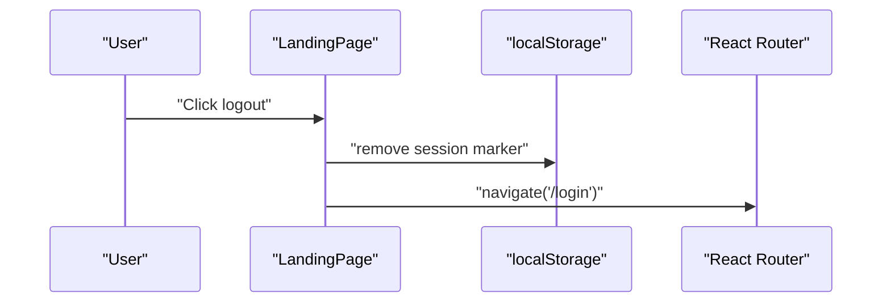
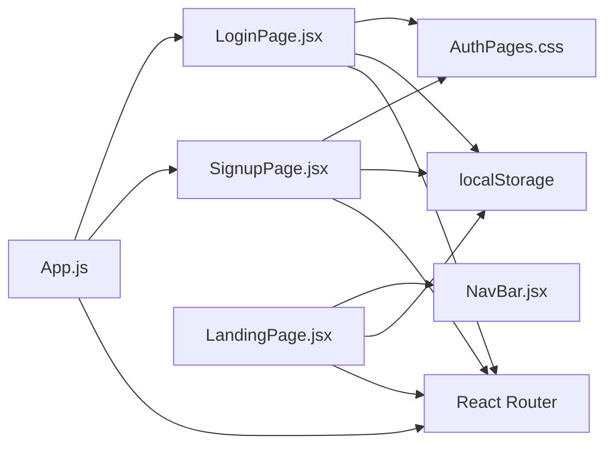

# Signup Functionality

<cite>
**Referenced Files in This Document**
- [SignupPage.jsx](file://src/pages/SignupPage.jsx)
- [LoginPage.jsx](file://src/pages/LoginPage.jsx)
- [App.js](file://src/App.js)
- [LandingPage.jsx](file://src/pages/LandingPage.jsx)
- [NavBar.jsx](file://src/components/NavBar.jsx)
- [AuthPages.css](file://src/pages/AuthPages.css)
</cite>

## Table of Contents
1. [Introduction](#introduction)
2. [Project Structure](#project-structure)
3. [Core Components](#core-components)
4. [Architecture Overview](#architecture-overview)
5. [Detailed Component Analysis](#detailed-component-analysis)
6. [Dependency Analysis](#dependency-analysis)
7. [Performance Considerations](#performance-considerations)
8. [Troubleshooting Guide](#troubleshooting-guide)
9. [Conclusion](#conclusion)

## Introduction
This document explains the signup functionality in the Lumière e-commerce client. It focuses on the user registration form handling, including field validation, password strength requirements, and duplicate user prevention strategies. It documents form state management patterns, error handling mechanisms, and success feedback systems. It also clarifies the relationship between signup and login flows, session creation upon successful registration, and navigation patterns. Finally, it addresses common signup issues such as validation failures and duplicate accounts, along with security considerations for client-side user data handling.

## Project Structure
The signup feature is implemented as a standalone page with shared styling and integrated into the routing and authentication guard system. The relevant files are organized as follows:
- Authentication pages: SignupPage.jsx, LoginPage.jsx, AuthPages.css
- Routing and authentication guard: App.js
- Protected landing page and navigation: LandingPage.jsx, NavBar.jsx

**Diagram sources**
- [App.js:18-85](file://src/App.js#L18-L85)
- [SignupPage.jsx:1-158](file://src/pages/SignupPage.jsx#L1-L158)
- [LoginPage.jsx:1-151](file://src/pages/LoginPage.jsx#L1-L151)
- [AuthPages.css:1-277](file://src/pages/AuthPages.css#L1-L277)
- [LandingPage.jsx:57-175](file://src/pages/LandingPage.jsx#L57-L175)
- [NavBar.jsx:1-177](file://src/components/NavBar.jsx#L1-L177)

**Section sources**
- [App.js:18-85](file://src/App.js#L18-L85)
- [SignupPage.jsx:1-158](file://src/pages/SignupPage.jsx#L1-L158)
- [LoginPage.jsx:1-151](file://src/pages/LoginPage.jsx#L1-L151)
- [AuthPages.css:1-277](file://src/pages/AuthPages.css#L1-L277)
- [LandingPage.jsx:57-175](file://src/pages/LandingPage.jsx#L57-L175)
- [NavBar.jsx:1-177](file://src/components/NavBar.jsx#L1-L177)

## Core Components
- SignupPage: Implements the registration form, validation, state updates, and submission flow. On success, it simulates an API call, stores session data in local storage, and navigates to the protected landing page.
- LoginPage: Provides the login form and integrates with the same authentication guard. It demonstrates complementary validation and session handling.
- App routing and authentication guard: Defines routes for signup and login, and protects downstream pages using a simple localStorage-based check.
- LandingPage and NavBar: Display the authenticated user greeting and provide logout functionality that clears the session.

Key behaviors:
- Form state is managed locally using React hooks.
- Validation runs on submit and on individual field changes.
- Session persistence uses localStorage for lightweight client-side authentication.
- Navigation uses React Router’s programmatic navigation.

**Section sources**
- [SignupPage.jsx:5-44](file://src/pages/SignupPage.jsx#L5-L44)
- [LoginPage.jsx:5-42](file://src/pages/LoginPage.jsx#L5-L42)
- [App.js:12-16](file://src/App.js#L12-L16)
- [LandingPage.jsx:57-129](file://src/pages/LandingPage.jsx#L57-L129)
- [NavBar.jsx:73-76](file://src/components/NavBar.jsx#L73-L76)

## Architecture Overview
The signup flow is part of a broader authentication architecture:
- Routes define two entry points: /signup for new users and /login for existing users.
- A private route wrapper checks for a session marker in localStorage to protect downstream pages.
- Upon successful signup, the client sets session markers and navigates to the home page.
- The landing page displays user greeting and provides logout.

**Diagram sources**
- [SignupPage.jsx:32-44](file://src/pages/SignupPage.jsx#L32-L44)
- [App.js:12-16](file://src/App.js#L12-L16)
- [LandingPage.jsx:57-60](file://src/pages/LandingPage.jsx#L57-L60)

## Detailed Component Analysis

### SignupPage Component
The signup page encapsulates the registration form, validation, and submission logic.

- Form state:
  - Tracks name, email, password, confirm password, and phone.
  - Clears per-field errors when the user edits the field.
- Validation rules:
  - Name is required.
  - Email must match a basic format.
  - Password must be at least 8 characters.
  - Confirm password must match password.
  - Phone must match a numeric pattern allowing spaces and dashes.
- Submission flow:
  - Prevents default form submission.
  - Runs validation; if errors exist, sets field-level errors and stops.
  - Sets loading state while “simulating” an API call.
  - On completion, stores session markers and navigates to the home page.

**Diagram sources**
- [SignupPage.jsx:17-44](file://src/pages/SignupPage.jsx#L17-L44)

Field validation logic highlights:
- Name required: [SignupPage.jsx:19](file://src/pages/SignupPage.jsx#L19)
- Email format: [SignupPage.jsx:20](file://src/pages/SignupPage.jsx#L20)
- Password length: [SignupPage.jsx:21](file://src/pages/SignupPage.jsx#L21)
- Password confirmation: [SignupPage.jsx:22](file://src/pages/SignupPage.jsx#L22)
- Phone format: [SignupPage.jsx:23](file://src/pages/SignupPage.jsx#L23)

Form rendering and styling:
- Styled fields with error highlighting and inline error messages.
- Uses CSS classes for layout and error states.

Navigation and links:
- Links to the login page for returning users.

**Section sources**
- [SignupPage.jsx:5-44](file://src/pages/SignupPage.jsx#L5-L44)
- [AuthPages.css:79-111](file://src/pages/AuthPages.css#L79-L111)
- [AuthPages.css:149-153](file://src/pages/AuthPages.css#L149-L153)

### LoginPage Component
The login page complements the signup flow by authenticating existing users.

- Form state: email and password.
- Validation: email format and password presence.
- Submission: validates, simulates an API call, and on success stores session markers and navigates to the home page.

**Diagram sources**
- [LoginPage.jsx:12-42](file://src/pages/LoginPage.jsx#L12-L42)

**Section sources**
- [LoginPage.jsx:5-42](file://src/pages/LoginPage.jsx#L5-L42)

### Authentication Guard and Navigation
The application uses a simple authentication guard that checks for a session marker in localStorage to protect routes.

- PrivateRoute checks for the session marker and redirects unauthenticated users to the login page.
- Routes define:
  - /login for existing users
  - /signup for new users
  - / (home) as a protected route

**Diagram sources**
- [App.js:12-16](file://src/App.js#L12-L16)
- [App.js:22-36](file://src/App.js#L22-L36)

**Section sources**
- [App.js:12-16](file://src/App.js#L12-L16)
- [App.js:22-36](file://src/App.js#L22-L36)

### Protected Page and Logout
After successful authentication, users land on the landing page, which:
- Reads the session marker to display a user greeting.
- Provides a logout action that removes the session marker and navigates back to the login page.

**Diagram sources**
- [LandingPage.jsx:126-129](file://src/pages/LandingPage.jsx#L126-L129)

**Section sources**
- [LandingPage.jsx:57-60](file://src/pages/LandingPage.jsx#L57-L60)
- [LandingPage.jsx:126-129](file://src/pages/LandingPage.jsx#L126-L129)

## Dependency Analysis
- SignupPage depends on:
  - React Router for navigation.
  - LocalStorage for session persistence.
  - Shared CSS for styling.
- LoginPage shares similar dependencies and validation patterns.
- App.js orchestrates routing and authentication guard logic.
- LandingPage and NavBar consume session data and expose logout.

**Diagram sources**
- [SignupPage.jsx:1-3](file://src/pages/SignupPage.jsx#L1-L3)
- [LoginPage.jsx:1-3](file://src/pages/LoginPage.jsx#L1-L3)
- [App.js:1-10](file://src/App.js#L1-L10)
- [LandingPage.jsx:1-4](file://src/pages/LandingPage.jsx#L1-L4)
- [NavBar.jsx:1-2](file://src/components/NavBar.jsx#L1-L2)

**Section sources**
- [SignupPage.jsx:1-3](file://src/pages/SignupPage.jsx#L1-L3)
- [LoginPage.jsx:1-3](file://src/pages/LoginPage.jsx#L1-L3)
- [App.js:1-10](file://src/App.js#L1-L10)
- [LandingPage.jsx:1-4](file://src/pages/LandingPage.jsx#L1-L4)
- [NavBar.jsx:1-2](file://src/components/NavBar.jsx#L1-L2)

## Performance Considerations
- Client-side simulation: The signup and login handlers simulate API calls with timeouts. In production, replace these with real network requests to avoid blocking UI updates.
- Validation cost: Regex validations are lightweight but should remain simple to prevent UI lag during rapid typing.
- LocalStorage usage: Frequent reads/writes are fast but can block the UI thread if done excessively. Batch updates where possible.
- CSS rendering: The shared stylesheet is minimal and unlikely to cause layout thrashing.

## Troubleshooting Guide
Common signup issues and resolutions:
- Validation failures:
  - Name missing: Ensure the name field is not empty.
  - Invalid email: Verify the email matches the expected format.
  - Weak password: Ensure the password is at least 8 characters long.
  - Password mismatch: Confirm that the confirm password matches the password.
  - Invalid phone: Ensure the phone number matches the allowed numeric pattern.
- Duplicate accounts:
  - Current implementation does not enforce uniqueness on the client. If two users register with the same email, the last registration will overwrite the stored session marker. To prevent duplicates, integrate server-side validation and return explicit error messages for duplicate emails.
- No navigation after success:
  - Confirm that the session markers are written to localStorage and that the authentication guard allows access to the home route.
- Stuck loading:
  - Ensure the loading state is reset after the simulated API completes.

Security considerations:
- Client-side only: The current implementation relies solely on localStorage for session persistence. This is insecure for production. Use secure, HttpOnly cookies and backend sessions for real authentication.
- Input sanitization: While basic regex validations are helpful, always validate and sanitize inputs server-side.
- Password storage: Never store plaintext passwords. Use strong hashing and salted hashes on the server.
- CSRF/XSS protection: Implement anti-CSRF tokens and sanitize user inputs to mitigate XSS risks.

**Section sources**
- [SignupPage.jsx:17-25](file://src/pages/SignupPage.jsx#L17-L25)
- [SignupPage.jsx:32-44](file://src/pages/SignupPage.jsx#L32-L44)
- [LoginPage.jsx:12-17](file://src/pages/LoginPage.jsx#L12-L17)
- [LoginPage.jsx:25-42](file://src/pages/LoginPage.jsx#L25-L42)
- [App.js:12-16](file://src/App.js#L12-L16)

## Conclusion
The Lumière client implements a straightforward signup flow with clear form validation, immediate feedback, and a simple session model using localStorage. The design separates concerns across components and integrates with a lightweight authentication guard. For production readiness, replace client-side simulations with real API calls, implement server-side duplicate detection and password hashing, and adopt secure session management practices.