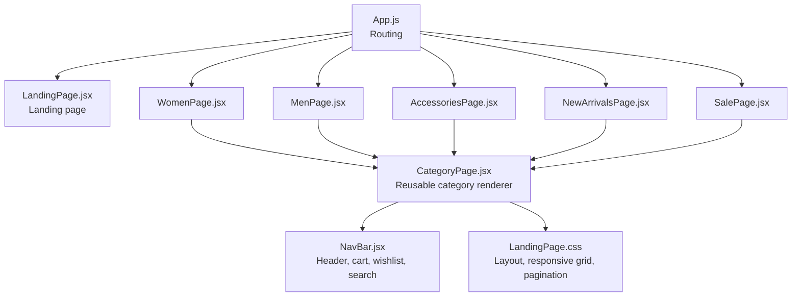
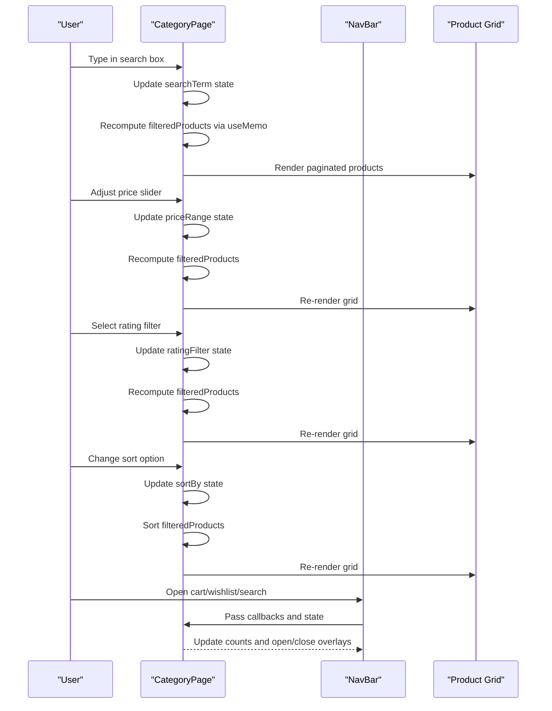
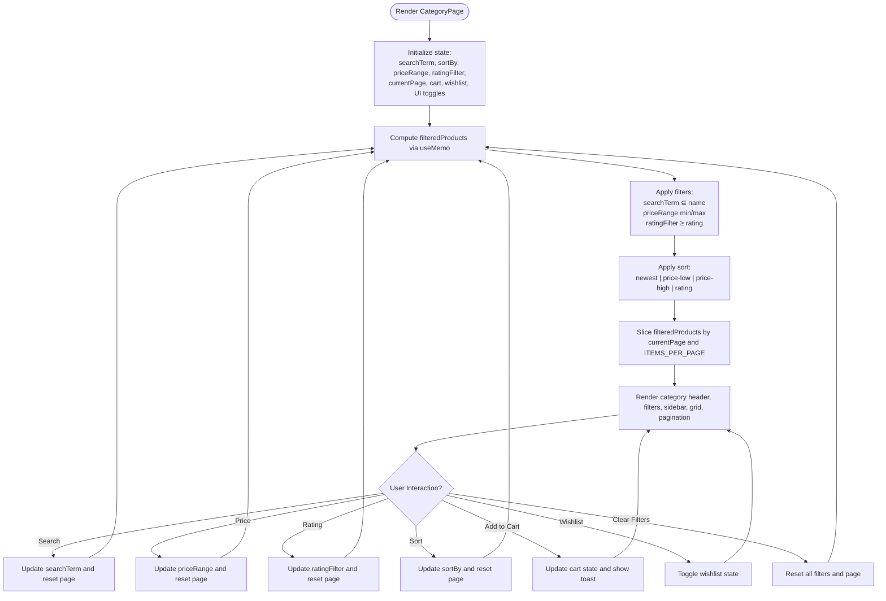
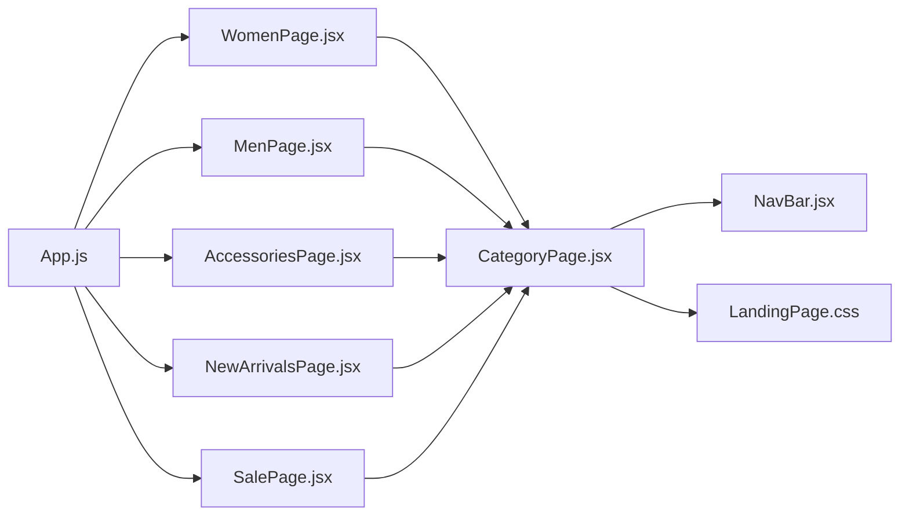

# Category System

<cite>
**Referenced Files in This Document**
- [CategoryPage.jsx](file://src/components/CategoryPage.jsx)
- [NavBar.jsx](file://src/components/NavBar.jsx)
- [App.js](file://src/App.js)
- [LandingPage.jsx](file://src/pages/LandingPage.jsx)
- [WomenPage.jsx](file://src/pages/WomenPage.jsx)
- [MenPage.jsx](file://src/pages/MenPage.jsx)
- [AccessoriesPage.jsx](file://src/pages/AccessoriesPage.jsx)
- [NewArrivalsPage.jsx](file://src/pages/NewArrivalsPage.jsx)
- [SalePage.jsx](file://src/pages/SalePage.jsx)
- [LandingPage.css](file://src/pages/LandingPage.css)
</cite>

## Table of Contents
1. [Introduction](#introduction)
2. [Project Structure](#project-structure)
3. [Core Components](#core-components)
4. [Architecture Overview](#architecture-overview)
5. [Detailed Component Analysis](#detailed-component-analysis)
6. [Dependency Analysis](#dependency-analysis)
7. [Performance Considerations](#performance-considerations)
8. [Troubleshooting Guide](#troubleshooting-guide)
9. [Conclusion](#conclusion)
10. [Appendices](#appendices)

## Introduction
This document describes the category system implementation in the Lumière e-commerce client. It focuses on the reusable CategoryPage component and its advanced filtering and sorting capabilities, the product filtering pipeline (real-time search, price range, rating), pagination, responsive grid layout, and product display patterns. It also documents the individual category pages (Women, Men, Accessories, New Arrivals, Sale) and provides guidelines for extending the system with new filters, customizing product displays, and optimizing performance for large catalogs.

## Project Structure
The category system is built around a single reusable component that renders product grids with filters and pagination. Individual category pages pass product data and metadata to CategoryPage, which manages state for search, sorting, price/rating filters, pagination, and cart/wishlist actions.

**Diagram sources**
- [App.js:18-85](file://src/App.js#L18-L85)
- [LandingPage.jsx:57-405](file://src/pages/LandingPage.jsx#L57-L405)
- [WomenPage.jsx:26-28](file://src/pages/WomenPage.jsx#L26-L28)
- [MenPage.jsx:26-28](file://src/pages/MenPage.jsx#L26-L28)
- [AccessoriesPage.jsx:26-28](file://src/pages/AccessoriesPage.jsx#L26-L28)
- [NewArrivalsPage.jsx:26-28](file://src/pages/NewArrivalsPage.jsx#L26-L28)
- [SalePage.jsx:26-28](file://src/pages/SalePage.jsx#L26-L28)
- [CategoryPage.jsx:10-328](file://src/components/CategoryPage.jsx#L10-L328)
- [NavBar.jsx:7-177](file://src/components/NavBar.jsx#L7-L177)
- [LandingPage.css:1123-1472](file://src/pages/LandingPage.css#L1123-L1472)

**Section sources**
- [App.js:18-85](file://src/App.js#L18-L85)
- [LandingPage.jsx:57-405](file://src/pages/LandingPage.jsx#L57-L405)
- [CategoryPage.jsx:10-328](file://src/components/CategoryPage.jsx#L10-L328)

## Core Components
- CategoryPage: Reusable component that accepts category name, icon, and product list. Manages filter state (search term, sort by, price range, rating), pagination, and product rendering.
- NavBar: Shared header with cart, wishlist, search modal, and navigation links. Integrates with CategoryPage via props.
- Individual category pages: Provide static product lists and render CategoryPage with category metadata.

Key responsibilities:
- Filtering: Real-time search, price range slider, rating threshold.
- Sorting: Newest, price low-to-high, price high-to-low, highest rated.
- Pagination: Fixed item count per page with first/previous/next/last controls.
- Product display: Grid layout with lazy loading, fallback images, badges, pricing, ratings, quick add to cart, and wishlist toggle.

**Section sources**
- [CategoryPage.jsx:10-328](file://src/components/CategoryPage.jsx#L10-L328)
- [NavBar.jsx:7-177](file://src/components/NavBar.jsx#L7-L177)
- [WomenPage.jsx:26-28](file://src/pages/WomenPage.jsx#L26-L28)
- [MenPage.jsx:26-28](file://src/pages/MenPage.jsx#L26-L28)
- [AccessoriesPage.jsx:26-28](file://src/pages/AccessoriesPage.jsx#L26-L28)
- [NewArrivalsPage.jsx:26-28](file://src/pages/NewArrivalsPage.jsx#L26-L28)
- [SalePage.jsx:26-28](file://src/pages/SalePage.jsx#L26-L28)

## Architecture Overview
The category system follows a unidirectional data flow:
- Parent pages (Women, Men, Accessories, New Arrivals, Sale) supply product arrays.
- CategoryPage computes filtered/sorted results and slices them for pagination.
- UI updates reactively to state changes in CategoryPage.
- NavBar receives shared state and actions from CategoryPage and renders cart/wishlist/search overlays.

**Diagram sources**
- [CategoryPage.jsx:66-91](file://src/components/CategoryPage.jsx#L66-L91)
- [CategoryPage.jsx:140-221](file://src/components/CategoryPage.jsx#L140-L221)
- [CategoryPage.jsx:224-321](file://src/components/CategoryPage.jsx#L224-L321)
- [NavBar.jsx:7-177](file://src/components/NavBar.jsx#L7-L177)

## Detailed Component Analysis

### CategoryPage Component
CategoryPage is a self-contained, reusable component that:
- Accepts category metadata (name, icon) and product list.
- Maintains local state for filters, sorting, pagination, cart, wishlist, and UI toggles.
- Computes filtered and sorted products using memoization.
- Renders a responsive grid with pagination and product cards.

Filtering and sorting logic:
- Search term is matched against product names (case-insensitive).
- Price range filter constrains products to a maximum price.
- Rating filter requires a minimum star threshold.
- Sorting options include newest (default), price low-to-high, price high-to-low, and highest rated.

Pagination:
- Items per page constant defines batch size.
- Total pages computed from filtered results.
- Navigation buttons support first, previous, next, last.

Product rendering:
- Lazy loading and error fallback for images.
- Badges, pricing (current and original), savings percentage, ratings, and quick actions.

User interactions:
- Add/remove from cart, toggle wishlist, clear filters, reset filters when no results.

**Diagram sources**
- [CategoryPage.jsx:10-328](file://src/components/CategoryPage.jsx#L10-L328)

**Section sources**
- [CategoryPage.jsx:10-328](file://src/components/CategoryPage.jsx#L10-L328)

### Individual Category Pages
Each category page is a thin wrapper that imports CategoryPage and passes:
- categoryName: Human-readable category name.
- categoryIcon: Emoji icon for the category.
- products: Static product list for that category.

Examples:
- Women’s Collection: Supplies women-centric products.
- Men’s Collection: Supplies men-centric products.
- Accessories: Supplies accessories products.
- New Arrivals: Supplies newly arrived products.
- Sale: Supplies discounted products.

These pages demonstrate reusability and separation of concerns: product data is encapsulated per page while rendering and UX are handled by CategoryPage.

**Section sources**
- [WomenPage.jsx:26-28](file://src/pages/WomenPage.jsx#L26-L28)
- [MenPage.jsx:26-28](file://src/pages/MenPage.jsx#L26-L28)
- [AccessoriesPage.jsx:26-28](file://src/pages/AccessoriesPage.jsx#L26-L28)
- [NewArrivalsPage.jsx:26-28](file://src/pages/NewArrivalsPage.jsx#L26-L28)
- [SalePage.jsx:26-28](file://src/pages/SalePage.jsx#L26-L28)

### Navigation and Routing
- App sets up protected routes for category pages.
- LandingPage integrates NavBar and serves as the home screen; it also demonstrates category-based product selection for the landing carousel.
- NavBar provides navigation links and maintains active link state, which CategoryPage also tracks for consistency.

**Section sources**
- [App.js:18-85](file://src/App.js#L18-L85)
- [LandingPage.jsx:57-405](file://src/pages/LandingPage.jsx#L57-L405)
- [NavBar.jsx:7-177](file://src/components/NavBar.jsx#L7-L177)

## Dependency Analysis
- CategoryPage depends on:
  - NavBar for shared UI actions (cart, wishlist, search).
  - Local storage for user session and display name.
  - CSS classes from LandingPage.css for layout and responsiveness.
- Individual category pages depend on CategoryPage and export their product datasets.
- App orchestrates routing and protects category pages.

**Diagram sources**
- [App.js:18-85](file://src/App.js#L18-L85)
- [WomenPage.jsx:26-28](file://src/pages/WomenPage.jsx#L26-L28)
- [MenPage.jsx:26-28](file://src/pages/MenPage.jsx#L26-L28)
- [AccessoriesPage.jsx:26-28](file://src/pages/AccessoriesPage.jsx#L26-L28)
- [NewArrivalsPage.jsx:26-28](file://src/pages/NewArrivalsPage.jsx#L26-L28)
- [SalePage.jsx:26-28](file://src/pages/SalePage.jsx#L26-L28)
- [CategoryPage.jsx:10-328](file://src/components/CategoryPage.jsx#L10-L328)
- [NavBar.jsx:7-177](file://src/components/NavBar.jsx#L7-L177)
- [LandingPage.css:1123-1472](file://src/pages/LandingPage.css#L1123-L1472)

**Section sources**
- [App.js:18-85](file://src/App.js#L18-L85)
- [CategoryPage.jsx:10-328](file://src/components/CategoryPage.jsx#L10-L328)

## Performance Considerations
- Memoized filtering: CategoryPage uses a memoized computation for filteredProducts to avoid unnecessary recomputation when unrelated state changes occur.
- Efficient sorting: Sorting is applied only after filtering and is O(n log n) for the four supported modes.
- Pagination: Slice-based pagination prevents rendering large DOM trees at once.
- Image fallbacks: Lazy loading and error fallback reduce network overhead and improve resilience.
- Recommendations:
  - Virtualize product grid for very large catalogs.
  - Debounce search input to limit frequent recomputations.
  - Consider server-side filtering/sorting for remote product APIs.
  - Persist filter state in URL query params for deep linking and refresh safety.

[No sources needed since this section provides general guidance]

## Troubleshooting Guide
Common issues and resolutions:
- No products shown after applying filters:
  - Use the “Reset Filters” action to clear search, price range, and rating filters.
  - Verify product data includes expected fields (name, price, rating).
- Pagination not updating after filter change:
  - Ensure page resets to 1 when filters change.
- Cart/wishlist not reflecting updates:
  - Confirm callbacks are passed down to NavBar and that state updates are triggered by user actions.
- Responsive layout issues:
  - Review CSS media queries for category grid and sidebar layout adjustments.

**Section sources**
- [CategoryPage.jsx:308-320](file://src/components/CategoryPage.jsx#L308-L320)
- [CategoryPage.jsx:150-151](file://src/components/CategoryPage.jsx#L150-L151)
- [CategoryPage.jsx:185-186](file://src/components/CategoryPage.jsx#L185-L186)
- [CategoryPage.jsx:201-202](file://src/components/CategoryPage.jsx#L201-L202)
- [LandingPage.css:1429-1472](file://src/pages/LandingPage.css#L1429-L1472)

## Conclusion
The Lumière category system centers on a robust, reusable CategoryPage component that encapsulates filtering, sorting, pagination, and product display. Individual category pages cleanly supply product data, enabling scalable maintenance and extension. The system’s responsive design and memoized computations provide a smooth user experience. With clear extension points, it can accommodate additional filters, custom product layouts, and performance optimizations as the catalog grows.

[No sources needed since this section summarizes without analyzing specific files]

## Appendices

### API and State Definitions
- Props accepted by CategoryPage:
  - categoryName: string
  - categoryIcon: string (emoji)
  - products: array of product objects with keys: id, name, price, old (optional), rating, reviews, badge (optional), image (optional)
- Internal state managed by CategoryPage:
  - searchTerm: string
  - sortBy: string ("newest" | "price-low" | "price-high" | "rating")
  - priceRange: number[2] (min, max)
  - ratingFilter: number (0–5)
  - currentPage: number
  - cart: array of cart items
  - wishlist: array of product ids
  - UI toggles: cartOpen, wishlistOpen, searchOpen, menuOpen, toast, activeLink, slide

**Section sources**
- [CategoryPage.jsx:10-328](file://src/components/CategoryPage.jsx#L10-L328)

### Example Paths for Implementation References
- Filter state management and recomputation:
  - [CategoryPage.jsx:15-27](file://src/components/CategoryPage.jsx#L15-L27)
  - [CategoryPage.jsx:66-91](file://src/components/CategoryPage.jsx#L66-L91)
- Product rendering and user interactions:
  - [CategoryPage.jsx:224-259](file://src/components/CategoryPage.jsx#L224-L259)
  - [CategoryPage.jsx:241-244](file://src/components/CategoryPage.jsx#L241-L244)
  - [CategoryPage.jsx:47-54](file://src/components/CategoryPage.jsx#L47-L54)
  - [CategoryPage.jsx:43-45](file://src/components/CategoryPage.jsx#L43-L45)
- Pagination:
  - [CategoryPage.jsx:94-98](file://src/components/CategoryPage.jsx#L94-L98)
  - [CategoryPage.jsx:262-306](file://src/components/CategoryPage.jsx#L262-L306)
- Responsive grid and layout:
  - [LandingPage.css:1123-1472](file://src/pages/LandingPage.css#L1123-L1472)