# CategoryPage Component

<cite>
**Referenced Files in This Document**
- [CategoryPage.jsx](file://src/components/CategoryPage.jsx)
- [NavBar.jsx](file://src/components/NavBar.jsx)
- [MenPage.jsx](file://src/pages/MenPage.jsx)
- [WomenPage.jsx](file://src/pages/WomenPage.jsx)
- [AccessoriesPage.jsx](file://src/pages/AccessoriesPage.jsx)
- [NewArrivalsPage.jsx](file://src/pages/NewArrivalsPage.jsx)
- [SalePage.jsx](file://src/pages/SalePage.jsx)
- [App.js](file://src/App.js)
- [LandingPage.css](file://src/pages/LandingPage.css)
</cite>

## Table of Contents
1. [Introduction](#introduction)
2. [Project Structure](#project-structure)
3. [Core Components](#core-components)
4. [Architecture Overview](#architecture-overview)
5. [Detailed Component Analysis](#detailed-component-analysis)
6. [Dependency Analysis](#dependency-analysis)
7. [Performance Considerations](#performance-considerations)
8. [Troubleshooting Guide](#troubleshooting-guide)
9. [Conclusion](#conclusion)

## Introduction

The CategoryPage component serves as the core reusable component of the e-commerce category system. It provides a comprehensive shopping experience with advanced filtering capabilities, real-time search functionality, price range sliders, rating-based filtering, sorting mechanisms, and pagination. Built with React hooks and designed for optimal user experience, this component integrates seamlessly with the NavBar component to provide cart and wishlist functionality, toast notifications, and navigation handling.

The component follows a functional programming approach with React hooks, implementing sophisticated state management patterns for filters, pagination, and user interactions while maintaining excellent performance through memoization and efficient rendering strategies.

## Project Structure

The CategoryPage component is part of a larger e-commerce application structure that demonstrates clean separation of concerns and reusability patterns:

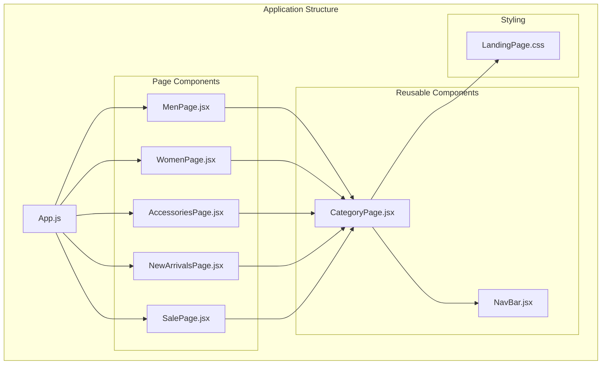

**Diagram sources**
- [App.js:18-85](file://src/App.js#L18-L85)
- [MenPage.jsx:1-29](file://src/pages/MenPage.jsx#L1-L29)
- [WomenPage.jsx:1-29](file://src/pages/WomenPage.jsx#L1-L29)
- [AccessoriesPage.jsx:1-29](file://src/pages/AccessoriesPage.jsx#L1-L29)
- [NewArrivalsPage.jsx:1-29](file://src/pages/NewArrivalsPage.jsx#L1-L29)
- [SalePage.jsx:1-29](file://src/pages/SalePage.jsx#L1-L29)

**Section sources**
- [App.js:18-85](file://src/App.js#L18-L85)
- [CategoryPage.jsx:10-328](file://src/components/CategoryPage.jsx#L10-L328)

## Core Components

### Props Interface

The CategoryPage component accepts three primary props that define its core functionality:

| Prop | Type | Description | Example |
|------|------|-------------|---------|
| `categoryName` | string | Display name of the category (e.g., "Men's Collection", "Women's Collection") | `"Men's Collection"` |
| `products` | Array | Array of product objects containing id, name, price, rating, reviews, and optional badge | `{ id: 1, name: "Blazer", price: 6500, rating: 5, reviews: 89 }` |
| `categoryIcon` | string | Unicode character representing the category icon (e.g., "👔", "👗", "💎") | `"👔"` |

### State Management Architecture

The component manages extensive state through React hooks, implementing a comprehensive filtering and pagination system:

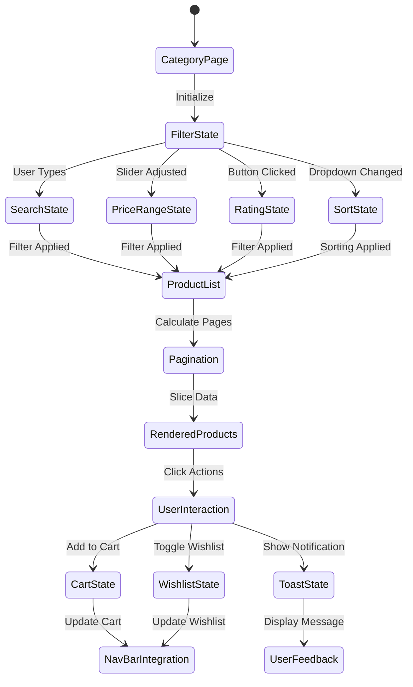

**Diagram sources**
- [CategoryPage.jsx:15-28](file://src/components/CategoryPage.jsx#L15-L28)
- [CategoryPage.jsx:66-91](file://src/components/CategoryPage.jsx#L66-L91)

**Section sources**
- [CategoryPage.jsx:10-328](file://src/components/CategoryPage.jsx#L10-L328)

## Architecture Overview

The CategoryPage component implements a sophisticated architecture that separates concerns between filtering, rendering, and user interaction:

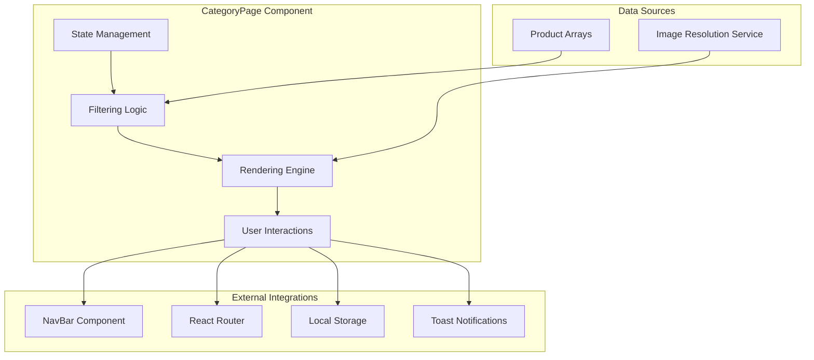

**Diagram sources**
- [CategoryPage.jsx:10-328](file://src/components/CategoryPage.jsx#L10-L328)
- [NavBar.jsx:7-30](file://src/components/NavBar.jsx#L7-L30)

The architecture emphasizes:
- **Separation of Concerns**: Filtering, rendering, and state management are distinct responsibilities
- **Performance Optimization**: Memoized computations prevent unnecessary re-renders
- **Reusability**: Component accepts props for different categories and products
- **Integration Patterns**: Seamless integration with external systems (NavBar, Router, Local Storage)

## Detailed Component Analysis

### Props Interface and Validation

The component's props interface is designed for maximum flexibility and reusability:

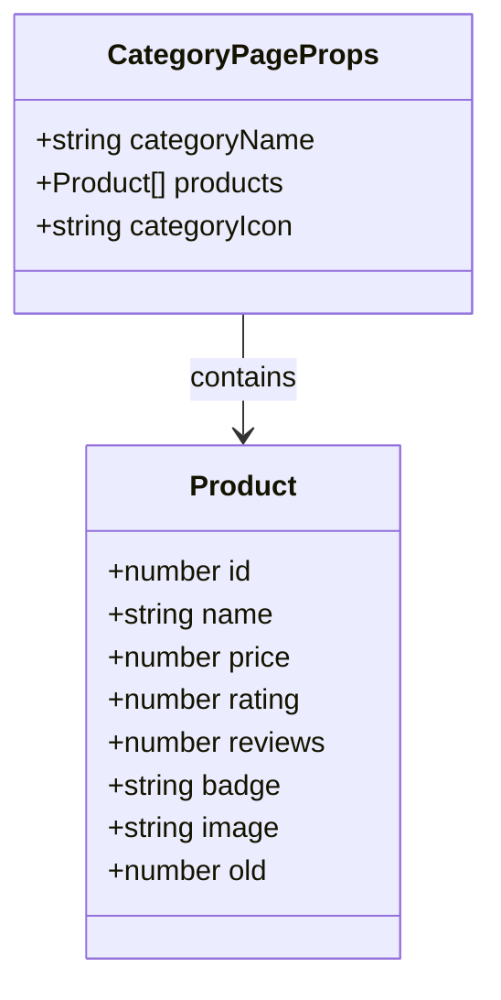

**Diagram sources**
- [CategoryPage.jsx:10](file://src/components/CategoryPage.jsx#L10)
- [MenPage.jsx:3-24](file://src/pages/MenPage.jsx#L3-L24)

### State Management Implementation

The component manages eight primary state variables through React hooks:

| State Variable | Hook | Purpose | Default Value |
|----------------|------|---------|---------------|
| `searchTerm` | useState | Real-time search input | `""` |
| `sortBy` | useState | Sorting preference | `"newest"` |
| `priceRange` | useState | Price range filter | `[0, 100000]` |
| `ratingFilter` | useState | Minimum rating threshold | `0` |
| `currentPage` | useState | Current pagination page | `1` |
| `wishlist` | useState | Wishlist item IDs | `[]` |
| `cart` | useState | Cart items with quantities | `[]` |
| `toast` | useState | Toast notification message | `""` |

### Comprehensive Filtering Logic

The filtering system operates through a sophisticated multi-criteria approach:

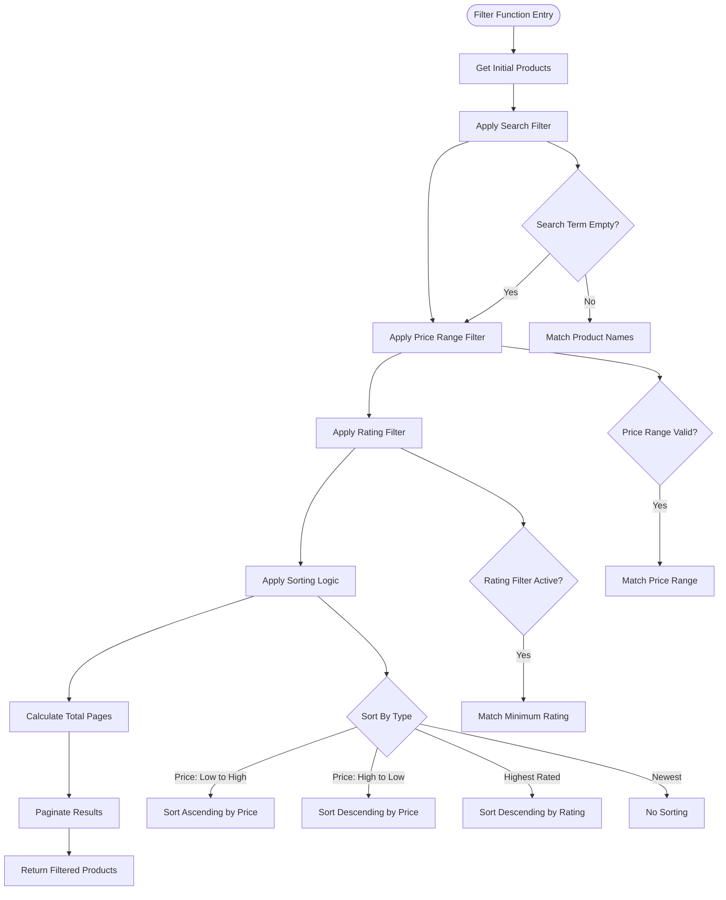

**Diagram sources**
- [CategoryPage.jsx:66-91](file://src/components/CategoryPage.jsx#L66-L91)

**Section sources**
- [CategoryPage.jsx:66-91](file://src/components/CategoryPage.jsx#L66-L91)

### Real-Time Search Functionality

The search functionality provides instant filtering as users type:

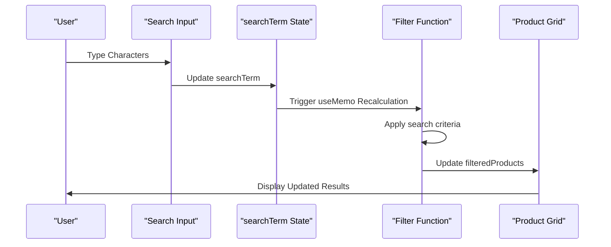

**Diagram sources**
- [CategoryPage.jsx:144-153](file://src/components/CategoryPage.jsx#L144-L153)
- [CategoryPage.jsx:66-72](file://src/components/CategoryPage.jsx#L66-L72)

### Price Range Filtering with Slider Controls

The price range slider implements bidirectional filtering with real-time updates:

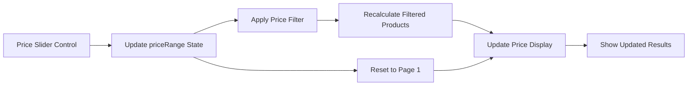

**Diagram sources**
- [CategoryPage.jsx:177-189](file://src/components/CategoryPage.jsx#L177-L189)
- [CategoryPage.jsx:189](file://src/components/CategoryPage.jsx#L189)

### Rating-Based Filtering System

The rating filter provides intuitive star-based selection:

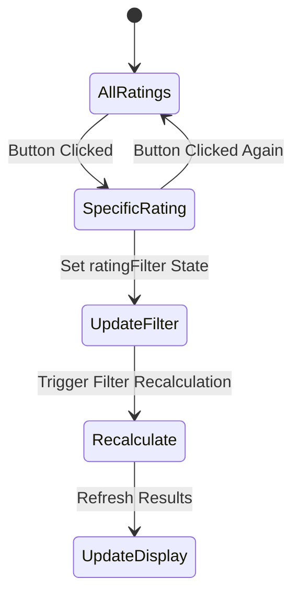

**Diagram sources**
- [CategoryPage.jsx:194-208](file://src/components/CategoryPage.jsx#L194-L208)

### Sorting Mechanisms

The component supports four distinct sorting options with intelligent default behavior:

| Sort Option | Description | Implementation |
|-------------|-------------|----------------|
| `newest` | Default chronological order | No sorting applied |
| `price-low` | Ascending price order | `a.price - b.price` |
| `price-high` | Descending price order | `b.price - a.price` |
| `rating` | Highest rated first | `b.rating - a.rating` |

**Section sources**
- [CategoryPage.jsx:75-88](file://src/components/CategoryPage.jsx#L75-L88)

### Pagination Implementation

The pagination system uses a constant page size with dynamic calculation:

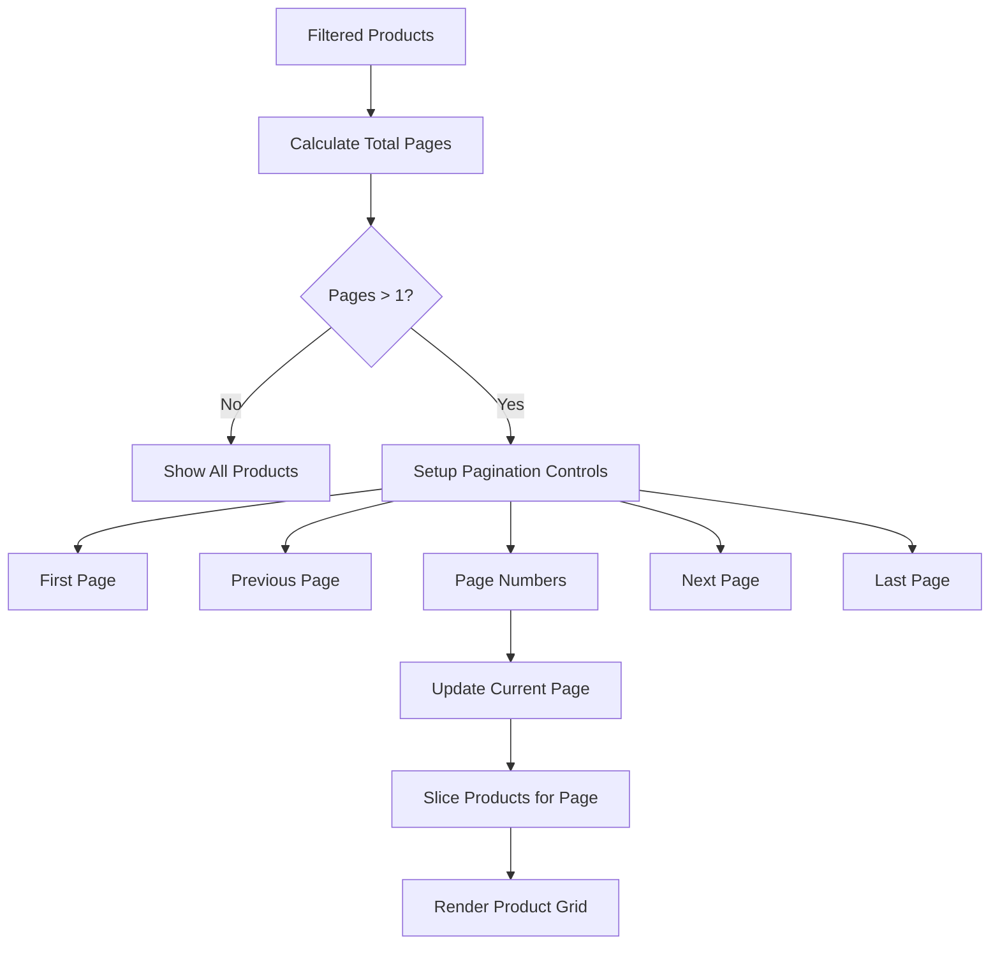

**Diagram sources**
- [CategoryPage.jsx:94-98](file://src/components/CategoryPage.jsx#L94-L98)
- [CategoryPage.jsx:262-306](file://src/components/CategoryPage.jsx#L262-L306)

**Section sources**
- [CategoryPage.jsx:8-98](file://src/components/CategoryPage.jsx#L8-L98)

### Product Rendering with Lazy Loading

The component implements efficient product rendering with lazy loading:

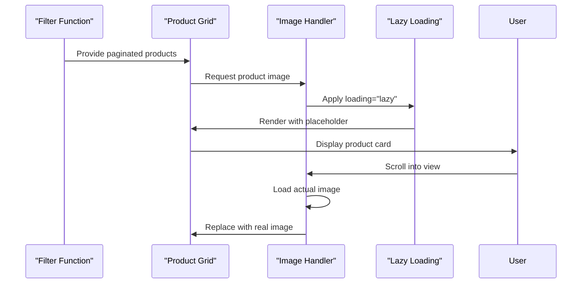

**Diagram sources**
- [CategoryPage.jsx:228-258](file://src/components/CategoryPage.jsx#L228-L258)
- [CategoryPage.jsx:235-240](file://src/components/CategoryPage.jsx#L235-L240)

### Error Handling for Images

The component includes robust error handling for image loading failures:

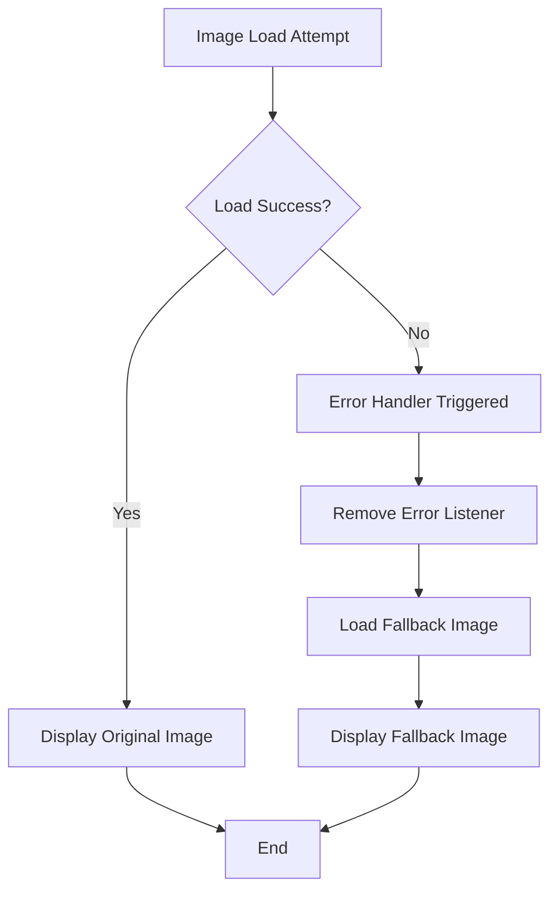

**Diagram sources**
- [CategoryPage.jsx:236-240](file://src/components/CategoryPage.jsx#L236-L240)

**Section sources**
- [CategoryPage.jsx:35-41](file://src/components/CategoryPage.jsx#L35-L41)
- [CategoryPage.jsx:236-240](file://src/components/CategoryPage.jsx#L236-L240)

### Integration with NavBar Component

The CategoryPage component integrates deeply with the NavBar for cart and wishlist functionality:

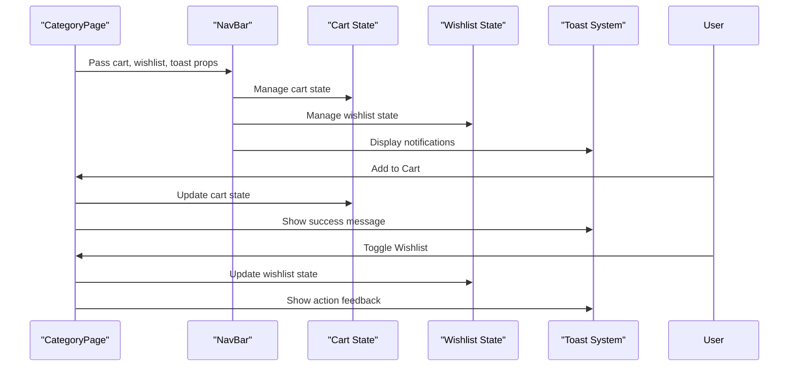

**Diagram sources**
- [CategoryPage.jsx:104-127](file://src/components/CategoryPage.jsx#L104-L127)
- [NavBar.jsx:7-30](file://src/components/NavBar.jsx#L7-L30)

**Section sources**
- [CategoryPage.jsx:104-127](file://src/components/CategoryPage.jsx#L104-L127)
- [NavBar.jsx:7-30](file://src/components/NavBar.jsx#L7-L30)

## Dependency Analysis

The CategoryPage component has strategic dependencies that enable its comprehensive functionality:

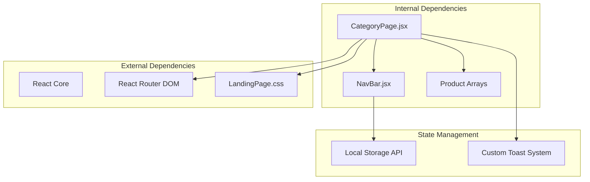

**Diagram sources**
- [CategoryPage.jsx:1-4](file://src/components/CategoryPage.jsx#L1-L4)
- [NavBar.jsx:1-3](file://src/components/NavBar.jsx#L1-L3)

### Component Coupling Analysis

The component maintains low to moderate coupling through:

- **Props-based Communication**: All external state passed via props
- **Callback Functions**: Controlled state updates through callback functions
- **Event-Driven Updates**: State changes trigger re-renders automatically
- **Separation of Concerns**: Filtering, rendering, and state management are distinct

**Section sources**
- [CategoryPage.jsx:1-4](file://src/components/CategoryPage.jsx#L1-L4)
- [NavBar.jsx:1-3](file://src/components/NavBar.jsx#L1-L3)

## Performance Considerations

### Optimization Strategies

The component implements several performance optimization techniques:

1. **Memoized Filtering**: Uses `useMemo` to prevent unnecessary filter recalculations
2. **Efficient State Updates**: Atomic state updates prevent intermediate render states
3. **Lazy Loading**: Images use native lazy loading for improved performance
4. **Pagination**: Limits rendered items to improve DOM manipulation speed
5. **Conditional Rendering**: Empty states and loading states minimize DOM complexity

### Memory Management

- **State Cleanup**: Automatic cleanup of toast messages after timeout
- **Event Listeners**: Proper cleanup of error handlers for images
- **Pagination Boundaries**: Efficient slicing prevents memory overhead

## Troubleshooting Guide

### Common Issues and Solutions

| Issue | Symptoms | Solution |
|-------|----------|----------|
| **Filter Not Working** | Search, price, or rating filters don't apply | Verify prop data structure matches expected format |
| **Pagination Errors** | Page navigation buttons disabled unexpectedly | Check filteredProducts length calculation |
| **Image Loading Failures** | Broken image icons appear | Verify fallback image URLs and network connectivity |
| **Cart/Wishlist Sync Issues** | Cart count doesn't update | Ensure callback functions are properly passed to NavBar |
| **Toast Notifications Not Showing** | No feedback for user actions | Check toast state management and timeout configuration |

### Debugging Tips

1. **Console Logging**: Add `console.log` statements in filter functions to trace data flow
2. **State Inspection**: Use browser developer tools to inspect component state
3. **Network Monitoring**: Check image loading requests in network tab
4. **Performance Profiling**: Use React DevTools Profiler to identify bottlenecks

**Section sources**
- [CategoryPage.jsx:30-33](file://src/components/CategoryPage.jsx#L30-L33)
- [CategoryPage.jsx:236-240](file://src/components/CategoryPage.jsx#L236-L240)

## Conclusion

The CategoryPage component represents a sophisticated implementation of a modern e-commerce category system. Its architecture demonstrates excellent separation of concerns, comprehensive state management, and seamless integration with external systems. The component successfully balances functionality with performance through strategic optimizations and clean design patterns.

Key strengths include:
- **Comprehensive Filtering**: Multi-criteria filtering with real-time updates
- **Intuitive User Experience**: Responsive design with smooth interactions
- **Performance Optimization**: Memoization, lazy loading, and efficient rendering
- **Extensible Design**: Reusable component pattern supporting multiple categories
- **Robust Error Handling**: Graceful degradation for failed image loads

The component serves as an excellent example of modern React development practices, showcasing how to build scalable, maintainable, and user-friendly e-commerce interfaces.