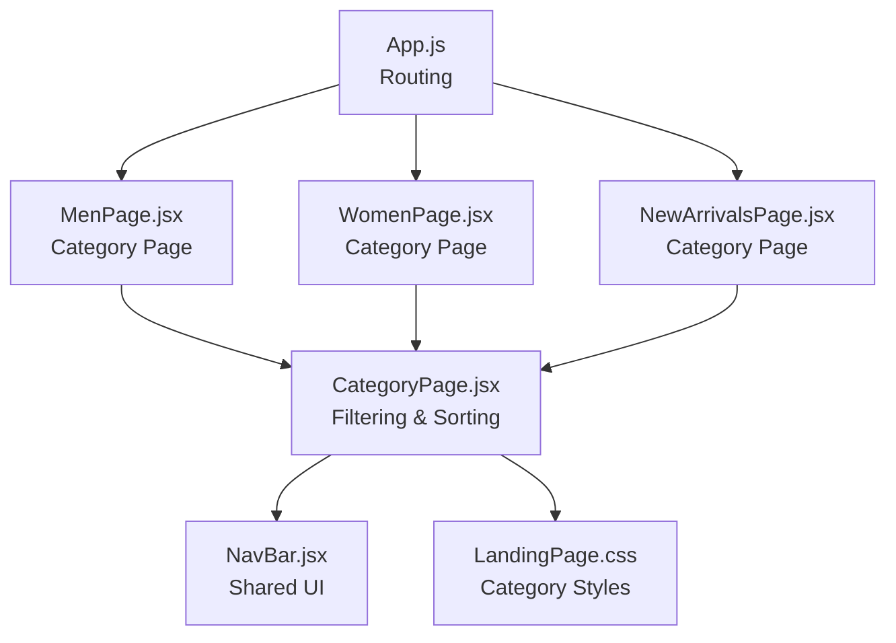
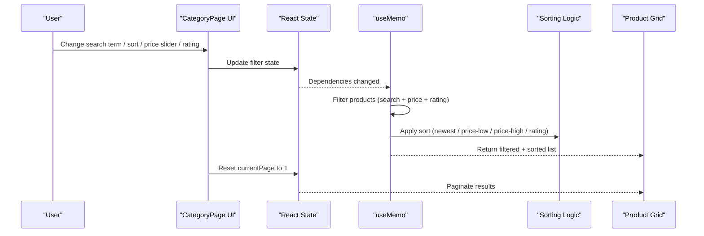
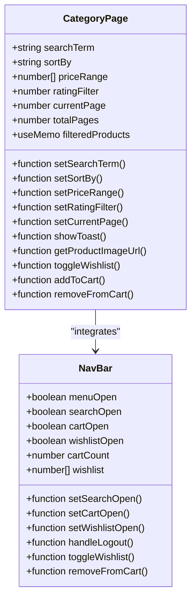
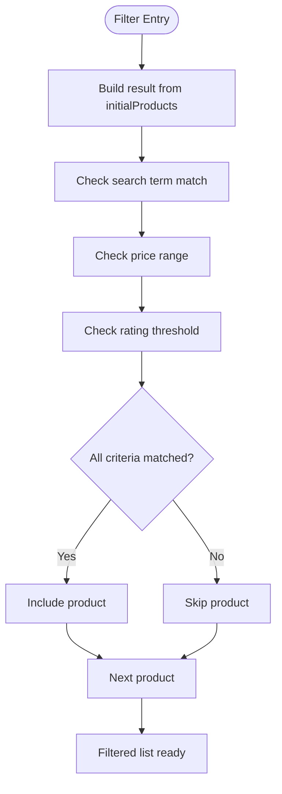
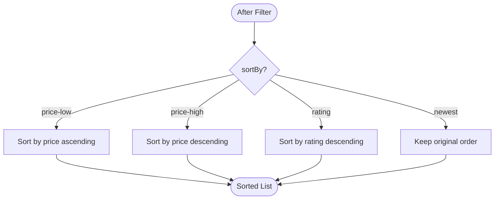
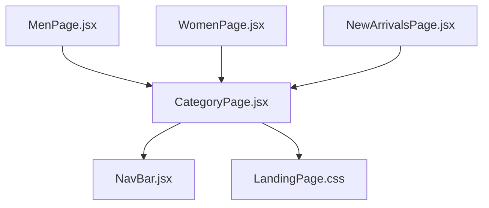

# Filtering and Sorting System

<cite>
**Referenced Files in This Document**
- [CategoryPage.jsx](file://src/components/CategoryPage.jsx)
- [NavBar.jsx](file://src/components/NavBar.jsx)
- [LandingPage.css](file://src/pages/LandingPage.css)
- [MenPage.jsx](file://src/pages/MenPage.jsx)
- [WomenPage.jsx](file://src/pages/WomenPage.jsx)
- [NewArrivalsPage.jsx](file://src/pages/NewArrivalsPage.jsx)
- [App.js](file://src/App.js)
</cite>

## Table of Contents
1. [Introduction](#introduction)
2. [Project Structure](#project-structure)
3. [Core Components](#core-components)
4. [Architecture Overview](#architecture-overview)
5. [Detailed Component Analysis](#detailed-component-analysis)
6. [Dependency Analysis](#dependency-analysis)
7. [Performance Considerations](#performance-considerations)
8. [Troubleshooting Guide](#troubleshooting-guide)
9. [Conclusion](#conclusion)

## Introduction
This document explains the advanced filtering and sorting system implemented in the CategoryPage component. It covers real-time search with case-insensitive matching, price range filtering with a dynamic slider, minimum rating filters with a star-based UI, and multiple sorting algorithms. It also documents the useMemo optimization for filter calculations, state management for filter criteria, and automatic pagination reset when filters change. UI elements such as the search input, price slider, rating buttons, sort dropdown, and clear filters functionality are described with concrete references to the code.

## Project Structure
The filtering and sorting system resides in the CategoryPage component and is used by several category pages (e.g., Men, Women, New Arrivals). The NavBar component provides shared UI elements and navigation, while LandingPage.css defines the styling for all category-related controls.

**Diagram sources**
- [App.js:38-78](file://src/App.js#L38-L78)
- [MenPage.jsx:26-28](file://src/pages/MenPage.jsx#L26-L28)
- [WomenPage.jsx:26-28](file://src/pages/WomenPage.jsx#L26-L28)
- [NewArrivalsPage.jsx:26-28](file://src/pages/NewArrivalsPage.jsx#L26-L28)
- [CategoryPage.jsx:10-328](file://src/components/CategoryPage.jsx#L10-L328)
- [NavBar.jsx:7-177](file://src/components/NavBar.jsx#L7-L177)
- [LandingPage.css:1123-1486](file://src/pages/LandingPage.css#L1123-L1486)

**Section sources**
- [App.js:38-78](file://src/App.js#L38-L78)
- [MenPage.jsx:26-28](file://src/pages/MenPage.jsx#L26-L28)
- [WomenPage.jsx:26-28](file://src/pages/WomenPage.jsx#L26-L28)
- [NewArrivalsPage.jsx:26-28](file://src/pages/NewArrivalsPage.jsx#L26-L28)
- [CategoryPage.jsx:10-328](file://src/components/CategoryPage.jsx#L10-L328)
- [NavBar.jsx:7-177](file://src/components/NavBar.jsx#L7-L177)
- [LandingPage.css:1123-1486](file://src/pages/LandingPage.css#L1123-L1486)

## Core Components
- CategoryPage: Implements the filtering and sorting logic, manages filter state, pagination, and renders the UI for search, price slider, rating filter, sort dropdown, and clear filters.
- NavBar: Provides shared navigation and actions; CategoryPage integrates with NavBar for cart/wishlist/search toggles.
- LandingPage.css: Defines the styling for category controls, sidebar filters, price slider, rating buttons, and pagination.

Key responsibilities:
- Real-time search: Case-insensitive substring matching on product names.
- Price range filter: Dynamic slider updating the upper bound and recalculating filtered results.
- Minimum rating filter: Star-based UI selecting the minimum acceptable rating.
- Sorting: Newest (default), price low-to-high, price high-to-low, and highest rated.
- Memoization: useMemo optimizes filter/sort computation.
- Pagination: Automatic reset to page 1 when filters change; displays paginated results.

**Section sources**
- [CategoryPage.jsx:15-27](file://src/components/CategoryPage.jsx#L15-L27)
- [CategoryPage.jsx:66-91](file://src/components/CategoryPage.jsx#L66-L91)
- [CategoryPage.jsx:94-98](file://src/components/CategoryPage.jsx#L94-L98)
- [LandingPage.css:1144-1426](file://src/pages/LandingPage.css#L1144-L1426)

## Architecture Overview
The filtering and sorting pipeline is encapsulated within CategoryPage. It uses React state for filter criteria and useMemo to compute filtered and sorted results efficiently. The UI binds to these states and triggers updates that automatically reset pagination.

**Diagram sources**
- [CategoryPage.jsx:66-91](file://src/components/CategoryPage.jsx#L66-L91)
- [CategoryPage.jsx:144-169](file://src/components/CategoryPage.jsx#L144-L169)
- [CategoryPage.jsx:177-188](file://src/components/CategoryPage.jsx#L177-L188)
- [CategoryPage.jsx:194-207](file://src/components/CategoryPage.jsx#L194-L207)
- [CategoryPage.jsx:94-98](file://src/components/CategoryPage.jsx#L94-L98)

## Detailed Component Analysis

### Filter State Management
CategoryPage initializes four filter states:
- searchTerm: Controlled by the search input; triggers filtering and pagination reset.
- sortBy: Controlled by the sort dropdown; triggers sorting and pagination reset.
- priceRange: Controlled by the price slider; triggers filtering and pagination reset.
- ratingFilter: Controlled by the rating buttons; triggers filtering and pagination reset.

Each filter update handler resets currentPage to 1 to ensure the user sees results from the beginning after changing filters.

**Section sources**
- [CategoryPage.jsx:15-27](file://src/components/CategoryPage.jsx#L15-L27)
- [CategoryPage.jsx:144-169](file://src/components/CategoryPage.jsx#L144-L169)
- [CategoryPage.jsx:177-188](file://src/components/CategoryPage.jsx#L177-L188)
- [CategoryPage.jsx:194-207](file://src/components/CategoryPage.jsx#L194-L207)

### Real-Time Search Functionality
The search input is a controlled component bound to searchTerm. On change, it updates the state and resets pagination. The filtering logic performs case-insensitive matching by converting both the product name and the search term to lowercase and checking for substring inclusion.

Implementation highlights:
- Controlled input binding and handler.
- Case-insensitive matching logic.
- Automatic pagination reset.

**Section sources**
- [CategoryPage.jsx:144-153](file://src/components/CategoryPage.jsx#L144-L153)
- [CategoryPage.jsx:68](file://src/components/CategoryPage.jsx#L68)
- [CategoryPage.jsx:150](file://src/components/CategoryPage.jsx#L150)

### Price Range Filtering with Dynamic Slider
The price slider updates the upper bound of the priceRange state. The filter logic checks whether each product’s price falls within the configured range. The slider UI displays the current maximum price and supports step increments.

Implementation highlights:
- Slider updates priceRange[1].
- Filter condition compares product price against the configured range.
- Price display shows formatted maximum value.

**Section sources**
- [CategoryPage.jsx:177-189](file://src/components/CategoryPage.jsx#L177-L189)
- [CategoryPage.jsx:69](file://src/components/CategoryPage.jsx#L69)
- [CategoryPage.jsx:189](file://src/components/CategoryPage.jsx#L189)

### Minimum Rating Filter with Star-Based UI
The rating filter presents buttons for minimum ratings from 0 to 5. Clicking a button sets ratingFilter and resets pagination. The filter logic ensures only products with a rating greater than or equal to the selected threshold are included.

Implementation highlights:
- Rating buttons render 0+ to 5+ options.
- Filter condition enforces rating threshold.
- Active button styling indicates current selection.

**Section sources**
- [CategoryPage.jsx:194-207](file://src/components/CategoryPage.jsx#L194-L207)
- [CategoryPage.jsx:70](file://src/components/CategoryPage.jsx#L70)
- [LandingPage.css:1270-1301](file://src/pages/LandingPage.css#L1270-L1301)

### Sorting Mechanisms
The sortBy state controls the sorting algorithm applied to the filtered list:
- Newest (default): No explicit reordering; preserves original order.
- Price low-to-high: Ascending price sort.
- Price high-to-low: Descending price sort.
- Highest rated: Descending rating sort.

The sorting switch occurs after filtering and before pagination.

**Section sources**
- [CategoryPage.jsx:157-169](file://src/components/CategoryPage.jsx#L157-L169)
- [CategoryPage.jsx:75-88](file://src/components/CategoryPage.jsx#L75-L88)

### useMemo Optimization for Filter Calculations
The filteredProducts calculation is wrapped in useMemo with dependencies on initialProducts, searchTerm, priceRange, ratingFilter, and sortBy. This prevents unnecessary recomputation when unrelated state changes occur, optimizing performance during rapid user interactions.

Benefits:
- Efficient filtering and sorting only when filter criteria or product list change.
- Stable references for filteredProducts across renders.

**Section sources**
- [CategoryPage.jsx:66-91](file://src/components/CategoryPage.jsx#L66-L91)

### Pagination and Automatic Reset
Pagination is computed from filteredProducts and uses a constant ITEMS_PER_PAGE. Each filter change handler resets currentPage to 1, ensuring the user stays on the first page after applying new filters. The pagination controls allow navigation across pages.

Highlights:
- Total pages derived from filteredProducts length.
- Paginated slice for current page.
- Reset to page 1 on filter changes.

**Section sources**
- [CategoryPage.jsx:94-98](file://src/components/CategoryPage.jsx#L94-L98)
- [CategoryPage.jsx:150](file://src/components/CategoryPage.jsx#L150)
- [CategoryPage.jsx:161](file://src/components/CategoryPage.jsx#L161)
- [CategoryPage.jsx:185](file://src/components/CategoryPage.jsx#L185)
- [CategoryPage.jsx:201](file://src/components/CategoryPage.jsx#L201)

### User Interface Elements for Filters
- Search input: Controlled input with placeholder and live filtering.
- Sort dropdown: Select element with options for sorting modes.
- Price slider: Range input controlling the maximum price; displays formatted price.
- Rating buttons: Star-based UI with active state indication.
- Clear filters: Button resetting all filters and pagination.

Styling is defined in LandingPage.css under category-related sections.

**Section sources**
- [CategoryPage.jsx:144-169](file://src/components/CategoryPage.jsx#L144-L169)
- [CategoryPage.jsx:177-189](file://src/components/CategoryPage.jsx#L177-L189)
- [CategoryPage.jsx:194-207](file://src/components/CategoryPage.jsx#L194-L207)
- [CategoryPage.jsx:210-221](file://src/components/CategoryPage.jsx#L210-L221)
- [LandingPage.css:1144-1426](file://src/pages/LandingPage.css#L1144-L1426)

### Clear Filters Functionality
The clear filters button resets searchTerm, priceRange, ratingFilter, and currentPage to 1. This provides a quick way to remove all active filters and return to the unfiltered view.

**Section sources**
- [CategoryPage.jsx:210-221](file://src/components/CategoryPage.jsx#L210-L221)

## Architecture Overview

**Diagram sources**
- [CategoryPage.jsx:15-27](file://src/components/CategoryPage.jsx#L15-L27)
- [CategoryPage.jsx:66-91](file://src/components/CategoryPage.jsx#L66-L91)
- [CategoryPage.jsx:104-127](file://src/components/CategoryPage.jsx#L104-L127)
- [NavBar.jsx:7-30](file://src/components/NavBar.jsx#L7-L30)

## Detailed Component Analysis

### Filtering Logic Flow
The filtering process combines three criteria:
- Search term: Case-insensitive substring match on product name.
- Price range: Product price within [min, max] bounds.
- Rating threshold: Product rating greater than or equal to the selected minimum.

**Diagram sources**
- [CategoryPage.jsx:67-72](file://src/components/CategoryPage.jsx#L67-L72)
- [CategoryPage.jsx:68](file://src/components/CategoryPage.jsx#L68)
- [CategoryPage.jsx:69](file://src/components/CategoryPage.jsx#L69)
- [CategoryPage.jsx:70](file://src/components/CategoryPage.jsx#L70)

**Section sources**
- [CategoryPage.jsx:67-72](file://src/components/CategoryPage.jsx#L67-L72)

### Sorting Algorithms Implementation
Sorting is applied after filtering and before pagination. The switch statement selects the algorithm based on sortBy:
- price-low: ascending price sort.
- price-high: descending price sort.
- rating: descending rating sort.
- newest: default order preserved.

**Diagram sources**
- [CategoryPage.jsx:75-88](file://src/components/CategoryPage.jsx#L75-L88)

**Section sources**
- [CategoryPage.jsx:75-88](file://src/components/CategoryPage.jsx#L75-L88)

### Pagination Reset Behavior
When any filter changes, the corresponding handler resets currentPage to 1. This ensures the user always starts from the first page after applying new filters.

**Section sources**
- [CategoryPage.jsx:150](file://src/components/CategoryPage.jsx#L150)
- [CategoryPage.jsx:161](file://src/components/CategoryPage.jsx#L161)
- [CategoryPage.jsx:185](file://src/components/CategoryPage.jsx#L185)
- [CategoryPage.jsx:201](file://src/components/CategoryPage.jsx#L201)

### UI Styling for Filters and Controls
CategoryPage relies on LandingPage.css for styling:
- Category controls: search box and sort select.
- Sidebar filters: price slider and rating buttons.
- Pagination: styled buttons and numbers.

**Section sources**
- [LandingPage.css:1144-1426](file://src/pages/LandingPage.css#L1144-L1426)

## Dependency Analysis
- CategoryPage depends on:
  - React hooks: useState, useMemo, useNavigate.
  - NavBar for shared UI and actions.
  - LandingPage.css for styling.
- Category pages (MenPage, WomenPage, NewArrivalsPage) pass product data and category metadata to CategoryPage.

**Diagram sources**
- [CategoryPage.jsx:10-328](file://src/components/CategoryPage.jsx#L10-L328)
- [NavBar.jsx:7-177](file://src/components/NavBar.jsx#L7-L177)
- [LandingPage.css:1123-1486](file://src/pages/LandingPage.css#L1123-L1486)
- [MenPage.jsx:26-28](file://src/pages/MenPage.jsx#L26-L28)
- [WomenPage.jsx:26-28](file://src/pages/WomenPage.jsx#L26-L28)
- [NewArrivalsPage.jsx:26-28](file://src/pages/NewArrivalsPage.jsx#L26-L28)

**Section sources**
- [CategoryPage.jsx:10-328](file://src/components/CategoryPage.jsx#L10-L328)
- [NavBar.jsx:7-177](file://src/components/NavBar.jsx#L7-L177)
- [LandingPage.css:1123-1486](file://src/pages/LandingPage.css#L1123-L1486)
- [MenPage.jsx:26-28](file://src/pages/MenPage.jsx#L26-L28)
- [WomenPage.jsx:26-28](file://src/pages/WomenPage.jsx#L26-L28)
- [NewArrivalsPage.jsx:26-28](file://src/pages/NewArrivalsPage.jsx#L26-L28)

## Performance Considerations
- useMemo: The filteredProducts calculation is memoized with dependencies on filter criteria and product list, preventing unnecessary recomputation.
- Sorting cost: Sorting is O(n log n) for price and rating sorts; keep lists reasonably sized for optimal UX.
- Pagination: Slice operations are O(k) where k is items per page; total rendering cost scales with visible items.
- Recommendations:
  - Debounce search input for very large datasets.
  - Consider virtualizing the product grid for thousands of items.
  - Use stable keys for product cards to minimize re-renders.

[No sources needed since this section provides general guidance]

## Troubleshooting Guide
Common issues and resolutions:
- Filters not resetting pagination: Ensure handlers for search, sort, price slider, and rating buttons call setCurrentPage(1).
- Sorting not applied: Verify sortBy state transitions and that the switch statement covers all cases.
- Price slider not updating: Confirm priceRange setter updates the upper bound and that the filter condition uses the configured range.
- Rating filter not working: Check that ratingFilter is set and the comparison uses greater-than-or-equal logic.
- No products shown: The UI displays a message and a Reset Filters button; clicking it clears all filters and resets pagination.

**Section sources**
- [CategoryPage.jsx:150](file://src/components/CategoryPage.jsx#L150)
- [CategoryPage.jsx:161](file://src/components/CategoryPage.jsx#L161)
- [CategoryPage.jsx:185](file://src/components/CategoryPage.jsx#L185)
- [CategoryPage.jsx:201](file://src/components/CategoryPage.jsx#L201)
- [CategoryPage.jsx:308-320](file://src/components/CategoryPage.jsx#L308-L320)

## Conclusion
The CategoryPage component delivers a robust, user-friendly filtering and sorting experience. Its useMemo-based optimization ensures efficient updates, while the clear UI for search, price slider, rating buttons, and sort dropdown provides intuitive control. Automatic pagination reset maintains a consistent user experience when filters change. The modular design allows reuse across category pages with minimal duplication.