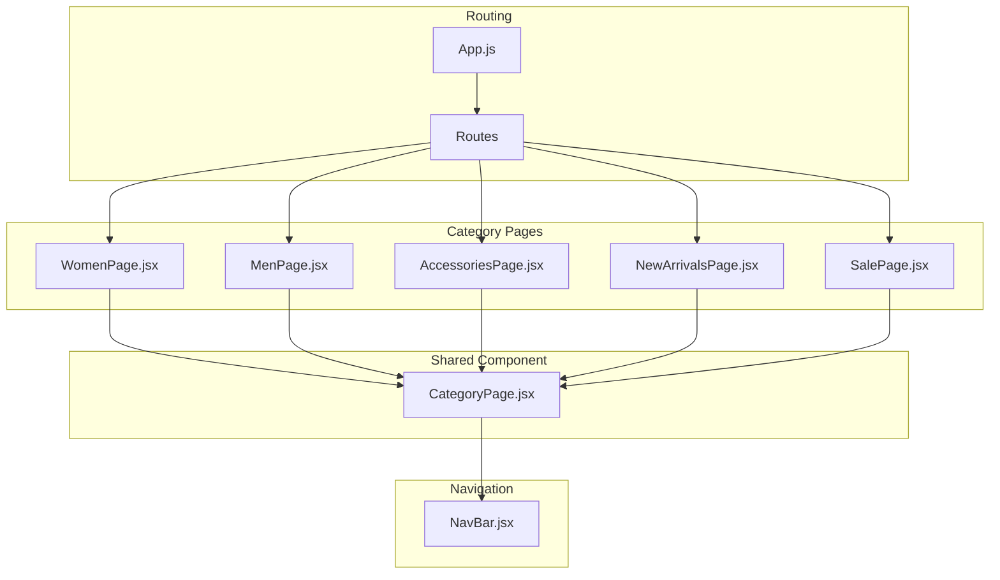
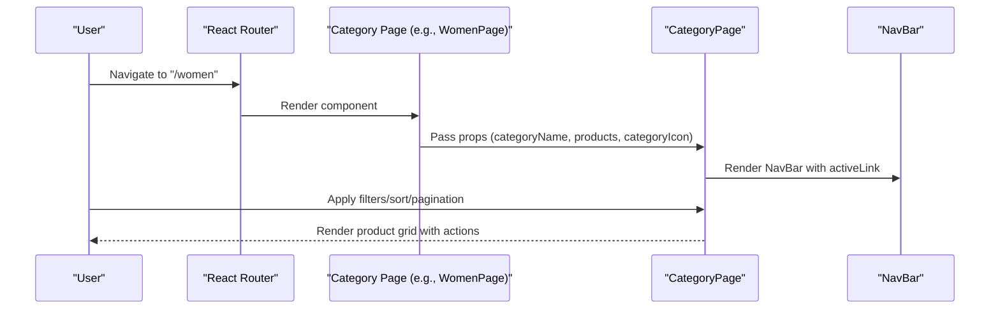
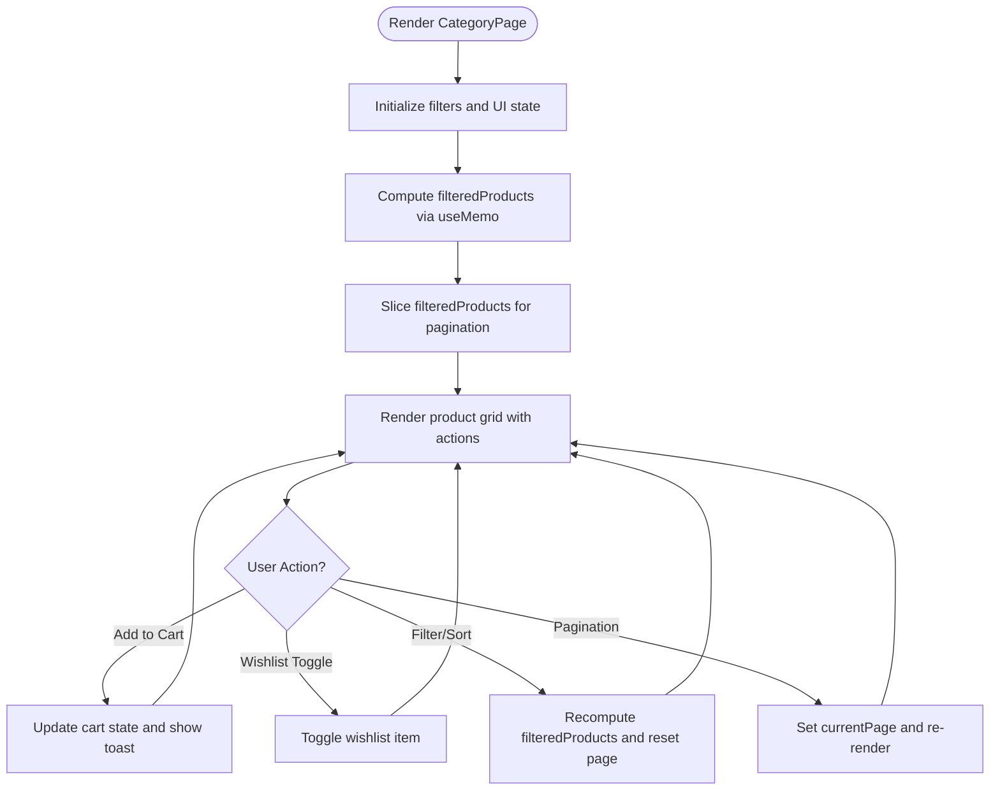
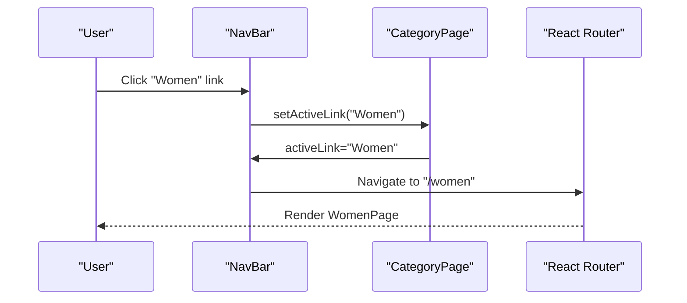
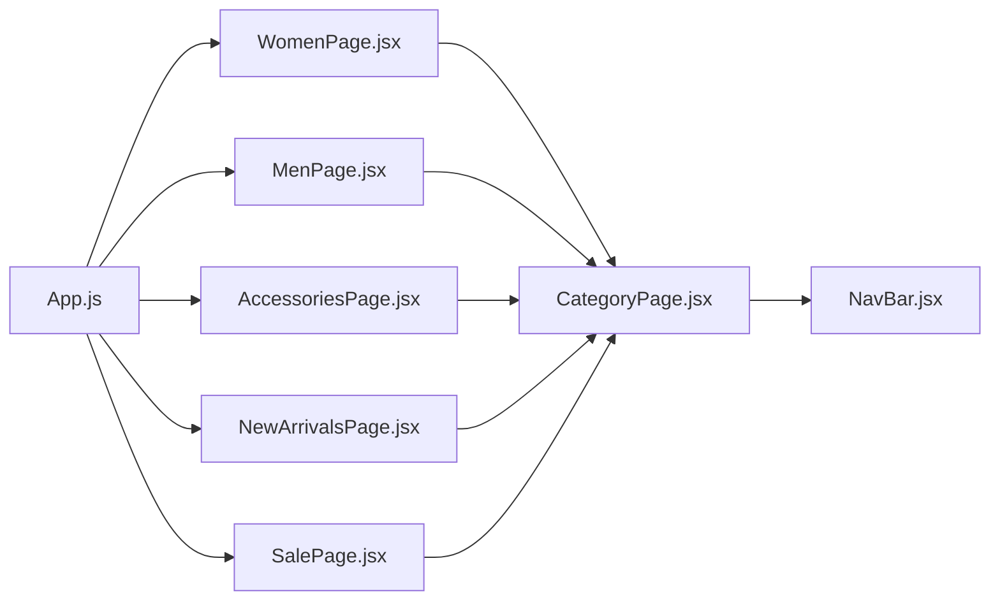

# Individual Category Pages

<cite>
**Referenced Files in This Document**
- [CategoryPage.jsx](file://src/components/CategoryPage.jsx)
- [WomenPage.jsx](file://src/pages/WomenPage.jsx)
- [MenPage.jsx](file://src/pages/MenPage.jsx)
- [AccessoriesPage.jsx](file://src/pages/AccessoriesPage.jsx)
- [NewArrivalsPage.jsx](file://src/pages/NewArrivalsPage.jsx)
- [SalePage.jsx](file://src/pages/SalePage.jsx)
- [NavBar.jsx](file://src/components/NavBar.jsx)
- [App.js](file://src/App.js)
- [LandingPage.jsx](file://src/pages/LandingPage.jsx)
</cite>

## Table of Contents
1. [Introduction](#introduction)
2. [Project Structure](#project-structure)
3. [Core Components](#core-components)
4. [Architecture Overview](#architecture-overview)
5. [Detailed Component Analysis](#detailed-component-analysis)
6. [Dependency Analysis](#dependency-analysis)
7. [Performance Considerations](#performance-considerations)
8. [Troubleshooting Guide](#troubleshooting-guide)
9. [Conclusion](#conclusion)

## Introduction
This document explains the individual category page implementations in Lumière e-commerce. It focuses on how each category page (WomenPage, MenPage, AccessoriesPage, NewArrivalsPage, SalePage) imports and uses the shared CategoryPage component, passing category-specific product data, category icons, and names. It also documents the product data structure expected by each category, category-specific customizations (badges and promotions), and how these pages integrate with navigation and routing.

## Project Structure
The category pages are thin wrappers around the shared CategoryPage component. Each page defines a static product catalog and renders CategoryPage with category-specific props. Navigation is handled via React Router, and the shared NavBar integrates with CategoryPage to provide consistent UX across categories.

**Diagram sources**
- [App.js:18-85](file://src/App.js#L18-L85)
- [NavBar.jsx:7-30](file://src/components/NavBar.jsx#L7-L30)
- [CategoryPage.jsx:10-327](file://src/components/CategoryPage.jsx#L10-L327)
- [WomenPage.jsx:26-28](file://src/pages/WomenPage.jsx#L26-L28)
- [MenPage.jsx:26-28](file://src/pages/MenPage.jsx#L26-L28)
- [AccessoriesPage.jsx:26-28](file://src/pages/AccessoriesPage.jsx#L26-L28)
- [NewArrivalsPage.jsx:26-28](file://src/pages/NewArrivalsPage.jsx#L26-L28)
- [SalePage.jsx:26-28](file://src/pages/SalePage.jsx#L26-L28)

**Section sources**
- [App.js:18-85](file://src/App.js#L18-L85)
- [NavBar.jsx:7-30](file://src/components/NavBar.jsx#L7-L30)
- [CategoryPage.jsx:10-327](file://src/components/CategoryPage.jsx#L10-L327)

## Core Components
- CategoryPage: A reusable component that renders a category-specific product grid with filtering, sorting, pagination, cart/wishlist actions, and toast notifications. It expects props: categoryName, products, categoryIcon.
- Individual Category Pages: Thin wrappers that define a product catalog and pass it to CategoryPage along with category metadata (name and icon).
- NavBar: Provides navigation links and maintains active link state, integrating with CategoryPage via activeLink prop.

Key props passed to CategoryPage:
- categoryName: String representing the category name (e.g., "Women's Collection").
- products: Array of product objects with specific properties (id, name, price, old, rating, reviews, badge, image).
- categoryIcon: Unicode icon string displayed alongside the category name.

**Section sources**
- [CategoryPage.jsx:10-327](file://src/components/CategoryPage.jsx#L10-L327)
- [WomenPage.jsx:26-28](file://src/pages/WomenPage.jsx#L26-L28)
- [MenPage.jsx:26-28](file://src/pages/MenPage.jsx#L26-L28)
- [AccessoriesPage.jsx:26-28](file://src/pages/AccessoriesPage.jsx#L26-L28)
- [NewArrivalsPage.jsx:26-28](file://src/pages/NewArrivalsPage.jsx#L26-L28)
- [SalePage.jsx:26-28](file://src/pages/SalePage.jsx#L26-L28)
- [NavBar.jsx:5-30](file://src/components/NavBar.jsx#L5-L30)

## Architecture Overview
Each category page composes CategoryPage with category-specific data. CategoryPage manages UI state (filters, sorting, pagination), cart/wishlist, and rendering. NavBar remains consistent across pages and updates activeLink to reflect the current route.

**Diagram sources**
- [App.js:38-78](file://src/App.js#L38-L78)
- [WomenPage.jsx:26-28](file://src/pages/WomenPage.jsx#L26-L28)
- [CategoryPage.jsx:10-327](file://src/components/CategoryPage.jsx#L10-L327)
- [NavBar.jsx:50-56](file://src/components/NavBar.jsx#L50-L56)

## Detailed Component Analysis

### CategoryPage Component
CategoryPage encapsulates:
- State management for filters (searchTerm, sortBy, priceRange, ratingFilter), pagination (currentPage, ITEMS_PER_PAGE), cart, wishlist, and UI toggles.
- Filtering and sorting logic using useMemo to derive filteredProducts.
- Pagination slice of filteredProducts.
- Rendering of product cards with image fallback, wishlist toggle, badge rendering, and add-to-cart action.
- Toast notifications and back button navigation.

Notable behaviors:
- Product image resolution: Uses product.image if present; otherwise generates a URL from product.name; falls back to a placeholder on error.
- Pricing display: Uses formatPrice helper and computes savings percentage when old price is provided.
- Badge rendering: Displays product.badge if present, mapped to CSS classes.
- Sorting options: newest, price-low, price-high, rating.

**Diagram sources**
- [CategoryPage.jsx:15-98](file://src/components/CategoryPage.jsx#L15-L98)
- [CategoryPage.jsx:224-321](file://src/components/CategoryPage.jsx#L224-L321)

**Section sources**
- [CategoryPage.jsx:10-327](file://src/components/CategoryPage.jsx#L10-L327)

### WomenPage
- Imports CategoryPage.
- Defines a product catalog specific to women’s fashion.
- Renders CategoryPage with categoryName "Women's Collection", products array, and categoryIcon "👗".

Product data structure expectations:
- id: Unique identifier.
- name: Product name.
- price: Current price.
- old: Optional original price for sale computation.
- rating: Numeric rating (1–5).
- reviews: Number of reviews.
- badge: Optional promotional badge ("Top Rated", "New", "Bestseller").
- image: Optional image URL; if omitted, a dynamic image URL is generated.

Category-specific customization:
- Uses "👗" as the category icon.
- Includes badges like "Top Rated", "New", "Bestseller".

Navigation integration:
- Route path "/women" navigates to this page via App.js.

**Section sources**
- [WomenPage.jsx:1-29](file://src/pages/WomenPage.jsx#L1-L29)
- [App.js:47-54](file://src/App.js#L47-L54)

### MenPage
- Imports CategoryPage.
- Defines a product catalog specific to men’s fashion.
- Renders CategoryPage with categoryName "Men's Collection", products array, and categoryIcon "👔".

Product data structure expectations:
- Same as WomenPage.

Category-specific customization:
- Uses "👔" as the category icon.
- Includes badges like "Top Rated", "New", "Bestseller".

Navigation integration:
- Route path "/men" navigates to this page via App.js.

**Section sources**
- [MenPage.jsx:1-29](file://src/pages/MenPage.jsx#L1-L29)
- [App.js:55-62](file://src/App.js#L55-L62)

### AccessoriesPage
- Imports CategoryPage.
- Defines a product catalog specific to accessories.
- Renders CategoryPage with categoryName "Accessories", products array, and categoryIcon "💎".

Product data structure expectations:
- Same as WomenPage.

Category-specific customization:
- Uses "💎" as the category icon.
- Includes badges like "Top Rated", "New", "Bestseller".

Navigation integration:
- Route path "/accessories" navigates to this page via App.js.

**Section sources**
- [AccessoriesPage.jsx:1-29](file://src/pages/AccessoriesPage.jsx#L1-L29)
- [App.js:63-70](file://src/App.js#L63-L70)

### NewArrivalsPage
- Imports CategoryPage.
- Defines a product catalog focused on new arrivals.
- Renders CategoryPage with categoryName "New Arrivals", products array, and categoryIcon "✨".

Product data structure expectations:
- Same as WomenPage.

Category-specific customization:
- Uses "✨" as the category icon.
- Emphasizes "New" badges for newly arrived items.

Navigation integration:
- Route path "/new-arrivals" navigates to this page via App.js.

**Section sources**
- [NewArrivalsPage.jsx:1-29](file://src/pages/NewArrivalsPage.jsx#L1-L29)
- [App.js:39-46](file://src/App.js#L39-L46)

### SalePage
- Imports CategoryPage.
- Defines a product catalog focused on sale items.
- Renders CategoryPage with categoryName "Sale", products array, and categoryIcon "🔥".

Product data structure expectations:
- Same as WomenPage.

Category-specific customization:
- Uses "🔥" as the category icon.
- Emphasizes "Sale" badges and discounted pricing via old price.

Navigation integration:
- Route path "/sale" navigates to this page via App.js.

**Section sources**
- [SalePage.jsx:1-29](file://src/pages/SalePage.jsx#L1-L29)
- [App.js:71-78](file://src/App.js#L71-L78)

### Navigation Integration
NavBar provides consistent navigation across all category pages:
- Active link highlighting is controlled by the activeLink prop.
- Clicking navigation links updates activeLink and triggers slide transitions.
- CategoryPage passes activeLink to NavBar to keep UI synchronized with the current route.

**Diagram sources**
- [NavBar.jsx:50-56](file://src/components/NavBar.jsx#L50-L56)
- [CategoryPage.jsx:27](file://src/components/CategoryPage.jsx#L27)
- [App.js:47-54](file://src/App.js#L47-L54)

**Section sources**
- [NavBar.jsx:5-30](file://src/components/NavBar.jsx#L5-L30)
- [NavBar.jsx:50-56](file://src/components/NavBar.jsx#L50-L56)
- [CategoryPage.jsx:27](file://src/components/CategoryPage.jsx#L27)

## Dependency Analysis
- Each category page depends on CategoryPage and exports a default component that renders CategoryPage with category-specific props.
- CategoryPage depends on NavBar and uses shared helpers (formatPrice, Stars) and constants (ITEMS_PER_PAGE).
- App.js defines routes for each category page and wraps them in a private route guard.

**Diagram sources**
- [App.js:6-10](file://src/App.js#L6-L10)
- [App.js:38-78](file://src/App.js#L38-L78)
- [WomenPage.jsx:1](file://src/pages/WomenPage.jsx#L1)
- [MenPage.jsx:1](file://src/pages/MenPage.jsx#L1)
- [AccessoriesPage.jsx:1](file://src/pages/AccessoriesPage.jsx#L1)
- [NewArrivalsPage.jsx:1](file://src/pages/NewArrivalsPage.jsx#L1)
- [SalePage.jsx:1](file://src/pages/SalePage.jsx#L1)
- [CategoryPage.jsx:3](file://src/components/CategoryPage.jsx#L3)
- [NavBar.jsx:1-3](file://src/components/NavBar.jsx#L1-L3)

**Section sources**
- [App.js:6-10](file://src/App.js#L6-L10)
- [App.js:38-78](file://src/App.js#L38-L78)
- [CategoryPage.jsx:3](file://src/components/CategoryPage.jsx#L3)

## Performance Considerations
- Filtering and sorting are computed via useMemo to avoid unnecessary recalculations when dependencies are unchanged.
- Pagination limits rendered items per page to reduce DOM size.
- Lazy loading and error fallback for product images improve perceived performance and resilience.
- Cart and wishlist operations update state efficiently using immutable patterns.

[No sources needed since this section provides general guidance]

## Troubleshooting Guide
Common issues and resolutions:
- Products not appearing: Verify that the products array is passed correctly to CategoryPage and that product ids are unique.
- Badges not visible: Ensure the badge property is present and correctly formatted; CategoryPage maps badge to CSS classes.
- Image placeholders: If product.image is missing, CategoryPage generates a URL from product.name; confirm product names are valid.
- Filters not resetting: Use the "Clear Filters" button or programmatically reset searchTerm, priceRange, and ratingFilter.
- Navigation mismatch: Confirm activeLink prop is set consistently with the current category; NavBar highlights the active link accordingly.

**Section sources**
- [CategoryPage.jsx:242](file://src/components/CategoryPage.jsx#L242)
- [CategoryPage.jsx:35-41](file://src/components/CategoryPage.jsx#L35-L41)
- [CategoryPage.jsx:210-221](file://src/components/CategoryPage.jsx#L210-L221)
- [NavBar.jsx:50-56](file://src/components/NavBar.jsx#L50-L56)

## Conclusion
The individual category pages in Lumière leverage a single, robust CategoryPage component to deliver a consistent shopping experience across categories. Each page contributes category-specific product data and metadata (name, icon), enabling targeted experiences while sharing common functionality for filtering, sorting, pagination, cart/wishlist, and navigation. This design promotes maintainability, scalability, and a unified user interface.