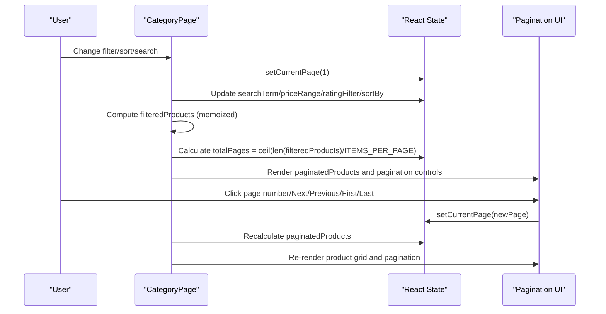
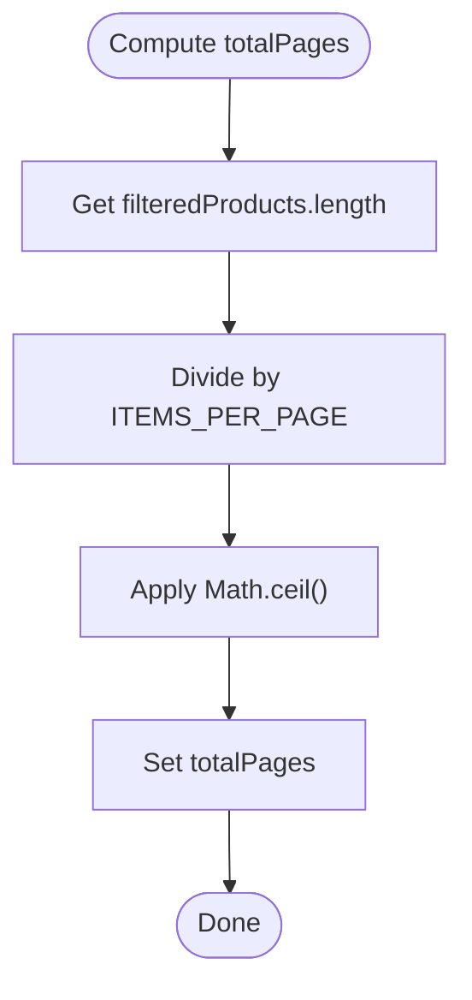
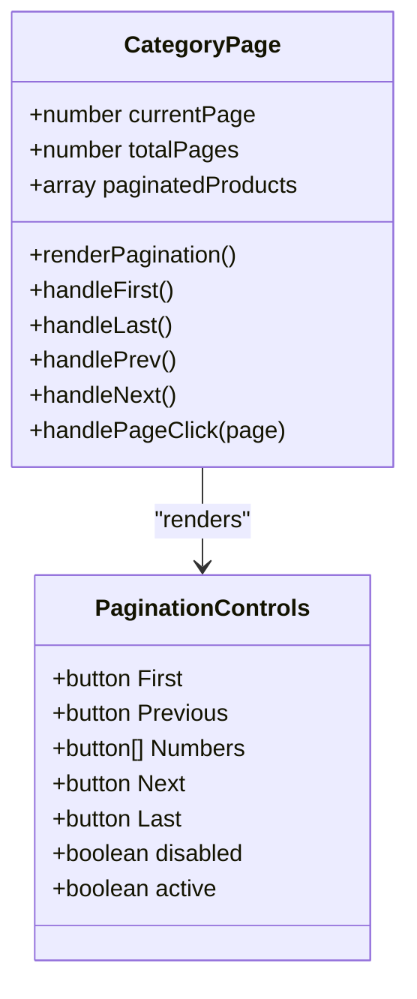
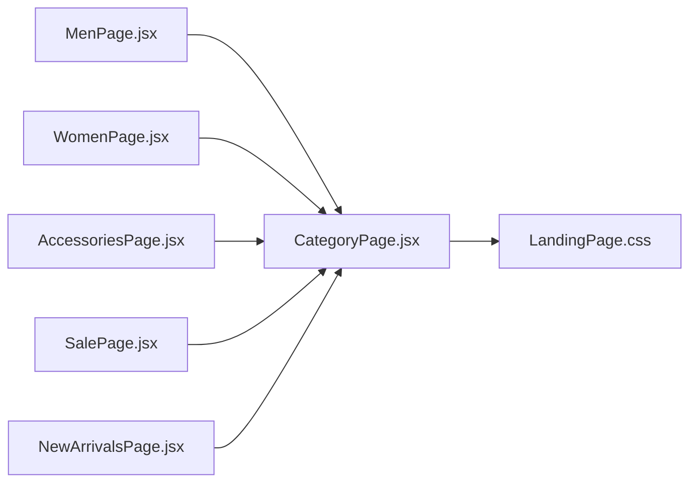

# Pagination System

<cite>
**Referenced Files in This Document**
- [CategoryPage.jsx](file://src/components/CategoryPage.jsx)
- [LandingPage.css](file://src/pages/LandingPage.css)
- [MenPage.jsx](file://src/pages/MenPage.jsx)
- [WomenPage.jsx](file://src/pages/WomenPage.jsx)
- [AccessoriesPage.jsx](file://src/pages/AccessoriesPage.jsx)
- [SalePage.jsx](file://src/pages/SalePage.jsx)
- [NewArrivalsPage.jsx](file://src/pages/NewArrivalsPage.jsx)
</cite>

## Table of Contents
1. [Introduction](#introduction)
2. [Project Structure](#project-structure)
3. [Core Components](#core-components)
4. [Architecture Overview](#architecture-overview)
5. [Detailed Component Analysis](#detailed-component-analysis)
6. [Dependency Analysis](#dependency-analysis)
7. [Performance Considerations](#performance-considerations)
8. [Troubleshooting Guide](#troubleshooting-guide)
9. [Conclusion](#conclusion)

## Introduction
This document provides comprehensive documentation for the pagination system implemented in the CategoryPage component. It explains the ITEMS_PER_PAGE constant configuration, pagination calculations using Math.ceil(), slice-based product pagination for efficient rendering, and the complete set of pagination controls including first/last navigation, previous/next buttons, numbered page links, and active page highlighting. It also details state management for currentPage, automatic page reset when filters change, disabled button states for boundary conditions, responsive design considerations, and user experience patterns for navigating large product catalogs efficiently.

## Project Structure
The pagination system resides within the CategoryPage component and is styled via LandingPage.css. CategoryPage is consumed by multiple category-specific pages (MenPage, WomenPage, AccessoriesPage, SalePage, NewArrivalsPage), which pass product data and metadata to CategoryPage.

```mermaid
graph TB
subgraph "Pages"
Men["MenPage.jsx"]
Women["WomenPage.jsx"]
Accessories["AccessoriesPage.jsx"]
Sale["SalePage.jsx"]
NewArrivals["NewArrivalsPage.jsx"]
end
subgraph "Components"
CategoryPage["CategoryPage.jsx"]
end
subgraph "Styles"
Styles["LandingPage.css"]
end
Men --> CategoryPage
Women --> CategoryPage
Accessories --> CategoryPage
Sale --> CategoryPage
NewArrivals --> CategoryPage
CategoryPage --> Styles
```

**Diagram sources**
- [CategoryPage.jsx:10-328](file://src/components/CategoryPage.jsx#L10-L328)
- [LandingPage.css:1349-1427](file://src/pages/LandingPage.css#L1349-L1427)
- [MenPage.jsx:1-29](file://src/pages/MenPage.jsx#L1-L29)
- [WomenPage.jsx:1-29](file://src/pages/WomenPage.jsx#L1-L29)
- [AccessoriesPage.jsx:1-29](file://src/pages/AccessoriesPage.jsx#L1-L29)
- [SalePage.jsx:1-29](file://src/pages/SalePage.jsx#L1-L29)
- [NewArrivalsPage.jsx:1-29](file://src/pages/NewArrivalsPage.jsx#L1-L29)

**Section sources**
- [CategoryPage.jsx:10-328](file://src/components/CategoryPage.jsx#L10-L328)
- [LandingPage.css:1349-1427](file://src/pages/LandingPage.css#L1349-L1427)
- [MenPage.jsx:1-29](file://src/pages/MenPage.jsx#L1-L29)
- [WomenPage.jsx:1-29](file://src/pages/WomenPage.jsx#L1-L29)
- [AccessoriesPage.jsx:1-29](file://src/pages/AccessoriesPage.jsx#L1-L29)
- [SalePage.jsx:1-29](file://src/pages/SalePage.jsx#L1-L29)
- [NewArrivalsPage.jsx:1-29](file://src/pages/NewArrivalsPage.jsx#L1-L29)

## Core Components
- ITEMS_PER_PAGE constant: Defines the number of products rendered per page. This constant drives both the calculation of total pages and the slicing of the filtered product list for efficient rendering.
- currentPage state: Tracks the currently selected page. Changing filters automatically resets currentPage to 1 to ensure consistent navigation.
- filteredProducts: Memoized computation of products after applying search term, price range, and rating filters, followed by sorting based on user selection.
- totalPages: Computed using Math.ceil(filteredProducts.length / ITEMS_PER_PAGE) to determine the total number of pages.
- paginatedProducts: Slice of filteredProducts for the current page using (currentPage - 1) * ITEMS_PER_PAGE to currentPage * ITEMS_PER_PAGE.

Key implementation references:
- ITEMS_PER_PAGE definition and usage in pagination calculation and slicing.
- currentPage initialization and reset on filter changes.
- filteredProducts memoization and sorting.
- Pagination controls rendering and event handlers.

**Section sources**
- [CategoryPage.jsx:8](file://src/components/CategoryPage.jsx#L8)
- [CategoryPage.jsx:19](file://src/components/CategoryPage.jsx#L19)
- [CategoryPage.jsx:66-91](file://src/components/CategoryPage.jsx#L66-L91)
- [CategoryPage.jsx:94-98](file://src/components/CategoryPage.jsx#L94-L98)
- [CategoryPage.jsx:262-306](file://src/components/CategoryPage.jsx#L262-L306)

## Architecture Overview
The pagination system is part of the CategoryPage component lifecycle. Filtering and sorting occur first, then pagination calculations determine the current page’s subset of products. The UI renders the product grid and pagination controls, with state updates triggered by user interactions.



**Diagram sources**
- [CategoryPage.jsx:15-27](file://src/components/CategoryPage.jsx#L15-L27)
- [CategoryPage.jsx:66-91](file://src/components/CategoryPage.jsx#L66-L91)
- [CategoryPage.jsx:94-98](file://src/components/CategoryPage.jsx#L94-L98)
- [CategoryPage.jsx:262-306](file://src/components/CategoryPage.jsx#L262-L306)

## Detailed Component Analysis

### ITEMS_PER_PAGE Constant Configuration
- Purpose: Controls the number of products displayed per page.
- Impact: Determines total pages via Math.ceil() and defines the slice boundaries for paginatedProducts.
- Usage: Applied in both the calculation of totalPages and the slice indices for paginatedProducts.

Implementation references:
- Definition of ITEMS_PER_PAGE.
- Usage in totalPages calculation.
- Usage in paginatedProducts slice.

**Section sources**
- [CategoryPage.jsx:8](file://src/components/CategoryPage.jsx#L8)
- [CategoryPage.jsx:94](file://src/components/CategoryPage.jsx#L94)
- [CategoryPage.jsx:95-98](file://src/components/CategoryPage.jsx#L95-L98)

### Pagination Calculation Using Math.ceil()
- filteredProducts length divided by ITEMS_PER_PAGE yields the total number of pages.
- Math.ceil ensures fractional remainders round up to a full page.
- This guarantees all products are reachable even when the last page is partially filled.

Algorithm flow:


**Diagram sources**
- [CategoryPage.jsx:94](file://src/components/CategoryPage.jsx#L94)

**Section sources**
- [CategoryPage.jsx:94](file://src/components/CategoryPage.jsx#L94)

### Slice-Based Product Pagination
- paginatedProducts is derived from filteredProducts using slice with:
  - Start index: (currentPage - 1) * ITEMS_PER_PAGE
  - End index: currentPage * ITEMS_PER_PAGE
- This approach avoids re-rendering the entire product list and minimizes DOM updates.

Rendering logic:
- Only paginatedProducts are mapped to product cards.
- Conditional rendering displays either the product grid with pagination or a “No products found” message with a reset filters action.

**Section sources**
- [CategoryPage.jsx:95-98](file://src/components/CategoryPage.jsx#L95-L98)
- [CategoryPage.jsx:225-320](file://src/components/CategoryPage.jsx#L225-L320)

### Pagination Controls
Controls include:
- First and Last buttons: Navigate to page 1 and the last page respectively.
- Previous and Next buttons: Move one page backward or forward.
- Numbered page links: Rendered dynamically for each page number.
- Active page highlighting: The current page number button is visually distinct.

Disabled button states:
- First and Previous are disabled when currentPage equals 1.
- Next and Last are disabled when currentPage equals totalPages.

Event handlers:
- Each control updates currentPage via setState.
- Automatic reset to page 1 occurs when filters or sorting changes.



**Diagram sources**
- [CategoryPage.jsx:262-306](file://src/components/CategoryPage.jsx#L262-L306)

**Section sources**
- [CategoryPage.jsx:262-306](file://src/components/CategoryPage.jsx#L262-L306)

### State Management and Automatic Page Reset
- currentPage is initialized to 1.
- On filter changes (searchTerm, sortBy, priceRange, ratingFilter), currentPage is reset to 1 to ensure consistent navigation.
- This prevents invalid page indices after filtering reduces the product count.

Trigger points:
- Search input change handler.
- Sort select change handler.
- Price slider change handler.
- Rating filter button click handler.
- Clear filters button click handler.

**Section sources**
- [CategoryPage.jsx:19](file://src/components/CategoryPage.jsx#L19)
- [CategoryPage.jsx:148-151](file://src/components/CategoryPage.jsx#L148-L151)
- [CategoryPage.jsx:159-162](file://src/components/CategoryPage.jsx#L159-L162)
- [CategoryPage.jsx:183-186](file://src/components/CategoryPage.jsx#L183-L186)
- [CategoryPage.jsx:199-202](file://src/components/CategoryPage.jsx#L199-L202)
- [CategoryPage.jsx:212-217](file://src/components/CategoryPage.jsx#L212-L217)

### Integration with Filtered Product Lists
- filteredProducts is computed using useMemo to avoid unnecessary recalculations.
- Sorting is applied after filtering based on sortBy selection.
- The pagination system operates on filteredProducts, ensuring that pagination reflects the current filter/sort state.

**Section sources**
- [CategoryPage.jsx:66-91](file://src/components/CategoryPage.jsx#L66-L91)
- [CategoryPage.jsx:94-98](file://src/components/CategoryPage.jsx#L94-L98)

### Responsive Design Considerations
- Pagination container uses flex layout with wrapping to accommodate various screen sizes.
- On smaller screens, the numbered page links are hidden to reduce clutter, while Previous/Next buttons remain prominent.
- Button sizes and spacing adjust across breakpoints to maintain usability.

Responsive rules:
- Hide numbered page links on mobile.
- Reduce button padding and font size on small screens.
- Maintain centered pagination layout with top border separation.

**Section sources**
- [LandingPage.css:1350-1359](file://src/pages/LandingPage.css#L1350-L1359)
- [LandingPage.css:1461-1463](file://src/pages/LandingPage.css#L1461-L1463)
- [LandingPage.css:1484-1486](file://src/pages/LandingPage.css#L1484-L1486)

### User Experience Patterns
- Immediate feedback: Changing filters resets to page 1 so users see the first page of results.
- Boundary awareness: Disabled buttons prevent invalid navigation attempts.
- Visual clarity: Active page highlighting improves orientation.
- Efficient browsing: Slice-based rendering ensures smooth transitions between pages.

**Section sources**
- [CategoryPage.jsx:148-151](file://src/components/CategoryPage.jsx#L148-L151)
- [CategoryPage.jsx:266-267](file://src/components/CategoryPage.jsx#L266-L267)
- [CategoryPage.jsx:273-274](file://src/components/CategoryPage.jsx#L273-L274)
- [CategoryPage.jsx:293-294](file://src/components/CategoryPage.jsx#L293-L294)
- [CategoryPage.jsx:300-301](file://src/components/CategoryPage.jsx#L300-L301)
- [CategoryPage.jsx:283](file://src/components/CategoryPage.jsx#L283)

## Dependency Analysis
- CategoryPage depends on:
  - React state hooks (useState) for currentPage and filters.
  - useMemo for filteredProducts computation.
  - react-router-dom for navigation.
  - LandingPage.css for pagination styling.
- CategoryPage is consumed by MenPage, WomenPage, AccessoriesPage, SalePage, and NewArrivalsPage, which supply product data and category metadata.



**Diagram sources**
- [MenPage.jsx:1-29](file://src/pages/MenPage.jsx#L1-L29)
- [WomenPage.jsx:1-29](file://src/pages/WomenPage.jsx#L1-L29)
- [AccessoriesPage.jsx:1-29](file://src/pages/AccessoriesPage.jsx#L1-L29)
- [SalePage.jsx:1-29](file://src/pages/SalePage.jsx#L1-L29)
- [NewArrivalsPage.jsx:1-29](file://src/pages/NewArrivalsPage.jsx#L1-L29)
- [CategoryPage.jsx:10-328](file://src/components/CategoryPage.jsx#L10-L328)
- [LandingPage.css:1349-1427](file://src/pages/LandingPage.css#L1349-L1427)

**Section sources**
- [CategoryPage.jsx:10-328](file://src/components/CategoryPage.jsx#L10-L328)
- [MenPage.jsx:1-29](file://src/pages/MenPage.jsx#L1-L29)
- [WomenPage.jsx:1-29](file://src/pages/WomenPage.jsx#L1-L29)
- [AccessoriesPage.jsx:1-29](file://src/pages/AccessoriesPage.jsx#L1-L29)
- [SalePage.jsx:1-29](file://src/pages/SalePage.jsx#L1-L29)
- [NewArrivalsPage.jsx:1-29](file://src/pages/NewArrivalsPage.jsx#L1-L29)

## Performance Considerations
- Slice-based pagination minimizes rendering overhead by only processing the current page’s products.
- useMemo ensures filteredProducts is recomputed only when dependencies change, reducing unnecessary work during pagination navigation.
- Math.ceil() provides precise page counts without iteration, keeping calculations O(1).
- Disabled button states prevent redundant re-renders caused by invalid navigation attempts.

[No sources needed since this section provides general guidance]

## Troubleshooting Guide
Common issues and resolutions:
- Navigating to a page beyond the new total after filtering:
  - Cause: currentPage remains unchanged after filter changes.
  - Resolution: Ensure currentPage is reset to 1 when filters change.
  - Reference: Filter handlers that call setCurrentPage(1).
- No pagination controls displayed:
  - Cause: filteredProducts is empty or totalPages is 1.
  - Resolution: Verify filteredProducts length and totalPages calculation.
  - Reference: totalPages and conditional pagination rendering.
- Active page highlighting not updating:
  - Cause: State not changing or className logic incorrect.
  - Resolution: Confirm page number button sets currentPage and className comparison.
  - Reference: Active class condition and page number onClick handler.

**Section sources**
- [CategoryPage.jsx:148-151](file://src/components/CategoryPage.jsx#L148-L151)
- [CategoryPage.jsx:94](file://src/components/CategoryPage.jsx#L94)
- [CategoryPage.jsx:262-306](file://src/components/CategoryPage.jsx#L262-L306)
- [CategoryPage.jsx:283](file://src/components/CategoryPage.jsx#L283)

## Conclusion
The pagination system in CategoryPage provides an efficient, user-friendly mechanism for navigating large product catalogs. By combining a constant ITEMS_PER_PAGE configuration, precise Math.ceil() calculations, and slice-based rendering, it delivers smooth performance. The comprehensive set of pagination controls, automatic page reset on filter changes, and thoughtful disabled button states ensure a robust user experience. Responsive styling maintains usability across devices, enabling efficient browsing of filtered product lists.