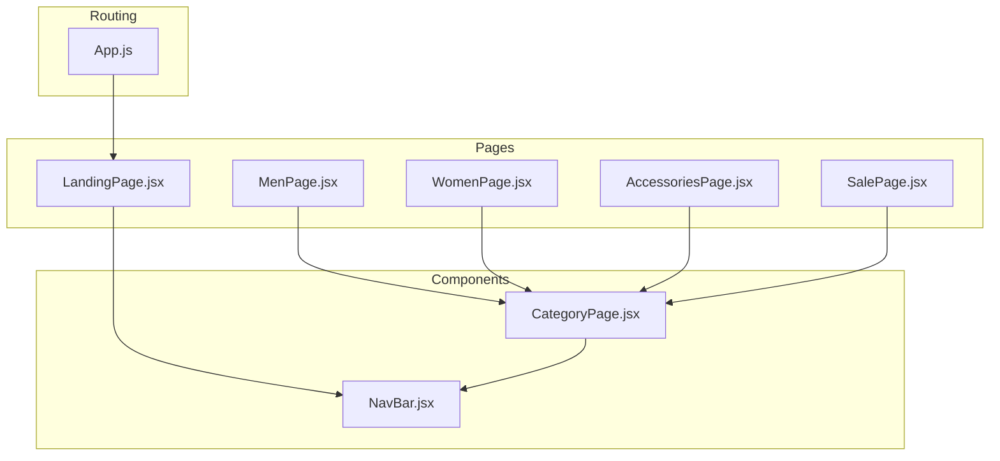
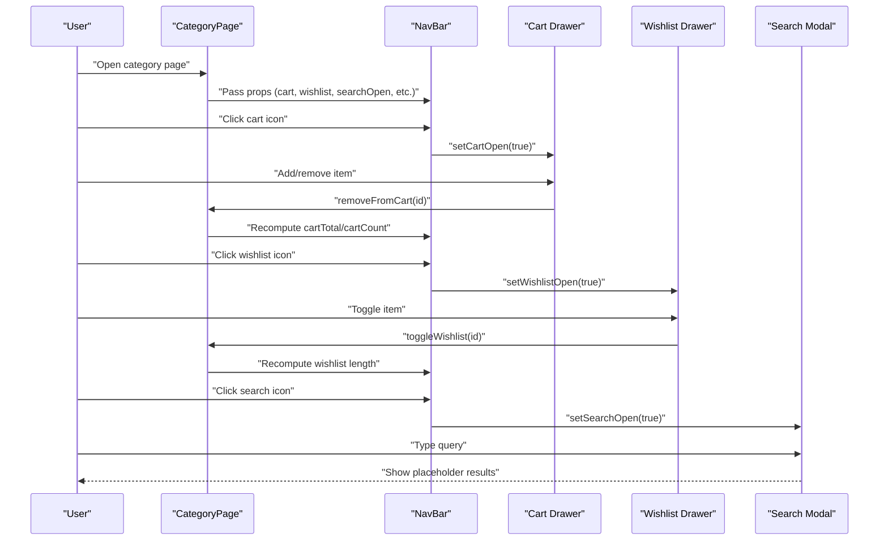
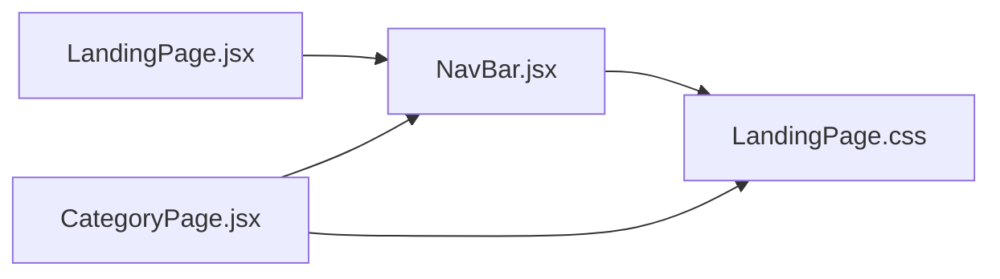

# Component Library

<cite>
**Referenced Files in This Document**
- [NavBar.jsx](file://src/components/NavBar.jsx)
- [CategoryPage.jsx](file://src/components/CategoryPage.jsx)
- [App.js](file://src/App.js)
- [LandingPage.jsx](file://src/pages/LandingPage.jsx)
- [LandingPage.css](file://src/pages/LandingPage.css)
- [MenPage.jsx](file://src/pages/MenPage.jsx)
- [WomenPage.jsx](file://src/pages/WomenPage.jsx)
- [AccessoriesPage.jsx](file://src/pages/AccessoriesPage.jsx)
- [SalePage.jsx](file://src/pages/SalePage.jsx)
- [setupTests.js](file://src/setupTests.js)
- [package.json](file://package.json)
</cite>

## Table of Contents
1. [Introduction](#introduction)
2. [Project Structure](#project-structure)
3. [Core Components](#core-components)
4. [Architecture Overview](#architecture-overview)
5. [Detailed Component Analysis](#detailed-component-analysis)
6. [Dependency Analysis](#dependency-analysis)
7. [Performance Considerations](#performance-considerations)
8. [Testing Strategies](#testing-strategies)
9. [Troubleshooting Guide](#troubleshooting-guide)
10. [Conclusion](#conclusion)
11. [Appendices](#appendices)

## Introduction
This document describes the reusable component library used in the Lumière e-commerce client. It focuses on two primary building blocks:
- NavBar: A reusable navigation and shopping assistant component that manages cart, wishlist, search, and user actions.
- CategoryPage: A flexible product display component that integrates NavBar and provides filtering, sorting, pagination, and product interactions.

The documentation explains composition patterns, props and state management, lifecycle handling, and how these components integrate with routing and styling. It also provides usage examples, testing strategies, performance considerations, and guidelines for extending and maintaining the component library.

## Project Structure
The component library centers around two key files:
- src/components/NavBar.jsx: Reusable navigation and overlays (cart, wishlist, search).
- src/components/CategoryPage.jsx: Product display shell that composes NavBar and provides product grid, filters, and pagination.

These components are integrated by page components under src/pages/, which route to category pages and the landing page. Routing is configured in src/App.js.

**Diagram sources**
- [App.js:18-85](file://src/App.js#L18-L85)
- [LandingPage.jsx:147-176](file://src/pages/LandingPage.jsx#L147-L176)
- [MenPage.jsx:26-28](file://src/pages/MenPage.jsx#L26-L28)
- [WomenPage.jsx:26-28](file://src/pages/WomenPage.jsx#L26-L28)
- [AccessoriesPage.jsx:26-28](file://src/pages/AccessoriesPage.jsx#L26-L28)
- [SalePage.jsx:26-28](file://src/pages/SalePage.jsx#L26-L28)
- [NavBar.jsx:31-177](file://src/components/NavBar.jsx#L31-L177)
- [CategoryPage.jsx:100-127](file://src/components/CategoryPage.jsx#L100-L127)

**Section sources**
- [App.js:18-85](file://src/App.js#L18-L85)
- [LandingPage.jsx:147-176](file://src/pages/LandingPage.jsx#L147-L176)
- [MenPage.jsx:26-28](file://src/pages/MenPage.jsx#L26-L28)
- [WomenPage.jsx:26-28](file://src/pages/WomenPage.jsx#L26-L28)
- [AccessoriesPage.jsx:26-28](file://src/pages/AccessoriesPage.jsx#L26-L28)
- [SalePage.jsx:26-28](file://src/pages/SalePage.jsx#L26-L28)
- [NavBar.jsx:31-177](file://src/components/NavBar.jsx#L31-L177)
- [CategoryPage.jsx:100-127](file://src/components/CategoryPage.jsx#L100-L127)

## Core Components
This section documents the two reusable components and their roles.

- NavBar
  - Purpose: Provides global navigation, branding, user greeting, and quick access to cart, wishlist, and search overlays.
  - Overlays: Cart drawer, wishlist drawer, and search modal.
  - Props: A comprehensive set of state and handlers passed down from parent components (e.g., LandingPage, CategoryPage).
  - Behavior: Manages open/close state for drawers/modals, displays counts, and triggers actions like adding to cart, removing from cart, toggling wishlist, and logging out.

- CategoryPage
  - Purpose: A flexible product display shell that composes NavBar and renders a product grid with filters, sorting, pagination, and interactions.
  - Props: categoryName, products, categoryIcon.
  - State: Local state for search term, sort criteria, price range, rating filter, current page, cart, wishlist, drawer/modal visibility, toast notifications, and menu state.
  - Composition: Renders NavBar with all required props and orchestrates product filtering/sorting/pagination.

**Section sources**
- [NavBar.jsx:7-30](file://src/components/NavBar.jsx#L7-L30)
- [CategoryPage.jsx:10-29](file://src/components/CategoryPage.jsx#L10-L29)
- [CategoryPage.jsx:100-127](file://src/components/CategoryPage.jsx#L100-L127)

## Architecture Overview
NavBar and CategoryPage form a cohesive UI layer:
- CategoryPage holds product data and local state, then passes state and callbacks to NavBar.
- NavBar encapsulates UI and interactions for cart, wishlist, and search, and exposes callbacks to update parent state.
- Page components (MenPage, WomenPage, AccessoriesPage, SalePage) supply product lists and pass them to CategoryPage.

**Diagram sources**
- [CategoryPage.jsx:100-127](file://src/components/CategoryPage.jsx#L100-L127)
- [NavBar.jsx:80-136](file://src/components/NavBar.jsx#L80-L136)
- [NavBar.jsx:138-174](file://src/components/NavBar.jsx#L138-L174)

## Detailed Component Analysis

### NavBar Component
NavBar is a composite UI component responsible for:
- Announcement bar
- Navigation links with active state
- Logo and home navigation
- Action buttons: Home, Search, Wishlist, Cart, User greeting, Logout
- Cart drawer: Items list, total computation, remove action, checkout trigger
- Wishlist drawer: Items list, remove action, view all trigger
- Search modal: Placeholder input and results area

Props and state management:
- Props: menuOpen, setMenuOpen, wishlist, wishlistOpen, setWishlistOpen, searchOpen, setSearchOpen, cart, cartOpen, setCartOpen, removeFromCart, cartTotal, cartCount, displayName, handleLogout, formatPrice, showToast, toggleWishlist, products, activeLink, setActiveLink, setSlide
- State: None owned by NavBar; it receives all state from parents and forwards callbacks.

Lifecycle handling:
- Uses React functional component with no lifecycle hooks; relies on parent-provided state and callbacks.
- Handles click events to toggle overlays and to navigate and update active link.

Composition patterns:
- Delegates rendering of cart/wishlist/search to separate overlay components.
- Uses conditional rendering for empty states and computed totals/prices.

Customization options:
- Active link highlighting is controlled by activeLink and setActiveLink.
- Slide transitions are coordinated via setSlide.
- Formatting and toast messages are delegated to parent-provided helpers.

Usage examples:
- LandingPage passes all state and callbacks to NavBar.
- CategoryPage composes NavBar and passes its own state and handlers.

**Section sources**
- [NavBar.jsx:7-30](file://src/components/NavBar.jsx#L7-L30)
- [NavBar.jsx:31-177](file://src/components/NavBar.jsx#L31-L177)

### CategoryPage Component
CategoryPage is a flexible product display shell that:
- Composes NavBar and provides product grid, filters, sorting, and pagination.
- Manages local state for search, sort, price range, rating, current page, cart, wishlist, drawers, and toasts.
- Computes filtered and sorted product lists using useMemo.
- Implements pagination with ITEMS_PER_PAGE constant.

Props and state management:
- Props: categoryName, products, categoryIcon
- State: searchTerm, sortBy, priceRange, ratingFilter, currentPage, wishlist, cart, cartOpen, wishlistOpen, searchOpen, toast, menuOpen, activeLink, slide
- Callbacks: showToast, toggleWishlist, addToCart, removeFromCart, handleLogout

Processing logic:
- Filtering: search term, price range, rating threshold.
- Sorting: newest, price-low, price-high, rating.
- Pagination: total pages, slice window, and navigation controls.

Integration with NavBar:
- Passes all state and callbacks to NavBar to keep navigation and overlays synchronized.

Usage examples:
- MenPage, WomenPage, AccessoriesPage, SalePage import CategoryPage and pass category-specific product arrays and icons.

**Section sources**
- [CategoryPage.jsx:10-29](file://src/components/CategoryPage.jsx#L10-L29)
- [CategoryPage.jsx:100-127](file://src/components/CategoryPage.jsx#L100-L127)
- [CategoryPage.jsx:66-91](file://src/components/CategoryPage.jsx#L66-L91)
- [CategoryPage.jsx:94-98](file://src/components/CategoryPage.jsx#L94-L98)

### Page Components Integration
Page components (MenPage, WomenPage, AccessoriesPage, SalePage) serve as thin wrappers that:
- Import CategoryPage
- Provide category-specific product arrays
- Pass categoryName and categoryIcon to CategoryPage

Routing integration:
- App.js defines routes for each category and the landing page, wrapping protected routes with a private route guard.

**Section sources**
- [MenPage.jsx:26-28](file://src/pages/MenPage.jsx#L26-L28)
- [WomenPage.jsx:26-28](file://src/pages/WomenPage.jsx#L26-L28)
- [AccessoriesPage.jsx:26-28](file://src/pages/AccessoriesPage.jsx#L26-L28)
- [SalePage.jsx:26-28](file://src/pages/SalePage.jsx#L26-L28)
- [App.js:18-85](file://src/App.js#L18-L85)

## Dependency Analysis
NavBar and CategoryPage depend on shared UI patterns and helpers:
- Shared helpers: formatPrice, Stars utility, ITEMS_PER_PAGE constant.
- State and callbacks are passed from parent components (LandingPage, CategoryPage) to NavBar.
- Styling is centralized in LandingPage.css, consumed by NavBar and CategoryPage via imported CSS.

**Diagram sources**
- [LandingPage.jsx:147-176](file://src/pages/LandingPage.jsx#L147-L176)
- [CategoryPage.jsx:100-127](file://src/components/CategoryPage.jsx#L100-L127)
- [NavBar.jsx:31-177](file://src/components/NavBar.jsx#L31-L177)
- [LandingPage.css:1-1486](file://src/pages/LandingPage.css#L1-L1486)

**Section sources**
- [LandingPage.jsx:147-176](file://src/pages/LandingPage.jsx#L147-L176)
- [CategoryPage.jsx:100-127](file://src/components/CategoryPage.jsx#L100-L127)
- [NavBar.jsx:31-177](file://src/components/NavBar.jsx#L31-L177)
- [LandingPage.css:1-1486](file://src/pages/LandingPage.css#L1-L1486)

## Performance Considerations
- Memoized filtering and sorting: CategoryPage uses useMemo to compute filteredProducts, reducing unnecessary re-renders when inputs change.
- Pagination: Limits rendered items per page to ITEMS_PER_PAGE, improving perceived performance and memory usage.
- Lazy image loading: Product images use lazy loading and fallbacks to prevent layout shifts and improve load times.
- Overlay animations: Transitions for drawers and modals are handled via CSS classes, minimizing heavy computations during interactions.
- Toast notifications: Short-lived toasts are cleared automatically to avoid persistent DOM overhead.

[No sources needed since this section provides general guidance]

## Testing Strategies
The project uses @testing-library for DOM-centric tests. The setup includes jest-dom matchers.

Recommended strategies:
- Component snapshot tests: Capture NavBar and CategoryPage render trees to detect unintended UI changes.
- Interaction tests: Simulate user actions (click cart, wishlist, search, add to cart, remove from cart, toggle wishlist) and assert state updates and UI changes.
- Prop-driven tests: Verify that passing different props (e.g., categoryIcon, activeLink) produces expected UI outcomes.
- Accessibility tests: Ensure keyboard navigation and screen reader support for overlays and buttons.
- Performance tests: Measure rendering time for large product lists and pagination to validate memoization effectiveness.

**Section sources**
- [setupTests.js:1-6](file://src/setupTests.js#L1-L6)
- [package.json:16-21](file://package.json#L16-L21)

## Troubleshooting Guide
Common issues and resolutions:
- Cart/wishlist drawers not closing: Ensure setCartOpen/setWishlistOpen are toggled on overlay close buttons and overlay clicks.
- Empty cart/wishlist states: Verify cartCount and wishlist length are computed from state arrays.
- Toast not disappearing: Confirm timeout clears the toast state after the delay.
- Pagination not updating: Ensure setCurrentPage resets to 1 when filters change and that sliced arrays reflect the current page.
- Image fallbacks: If product images fail to load, onError sets a fallback image to prevent broken image placeholders.

**Section sources**
- [NavBar.jsx:80-118](file://src/components/NavBar.jsx#L80-L118)
- [NavBar.jsx:138-174](file://src/components/NavBar.jsx#L138-L174)
- [CategoryPage.jsx:30-33](file://src/components/CategoryPage.jsx#L30-L33)
- [CategoryPage.jsx:94-98](file://src/components/CategoryPage.jsx#L94-L98)
- [CategoryPage.jsx:236-240](file://src/components/CategoryPage.jsx#L236-L240)

## Conclusion
The Lumière component library demonstrates a clean separation of concerns:
- NavBar encapsulates navigation and overlays with a well-defined prop contract.
- CategoryPage provides a flexible product display shell with robust filtering, sorting, and pagination.
- Page components act as lightweight adapters, supplying product data and category metadata.

This design promotes reusability, testability, and maintainability while keeping UI logic centralized and predictable.

[No sources needed since this section summarizes without analyzing specific files]

## Appendices

### Component Composition Patterns
- Props drilling: CategoryPage drills state and callbacks to NavBar, enabling consistent UI behavior across pages.
- Local state vs. shared state: CategoryPage maintains product-related state locally; NavBar remains stateless and purely presentational.
- Utility functions: formatPrice and Stars are shared helpers used across components.

**Section sources**
- [CategoryPage.jsx:100-127](file://src/components/CategoryPage.jsx#L100-L127)
- [NavBar.jsx:31-177](file://src/components/NavBar.jsx#L31-L177)
- [CategoryPage.jsx:6,7,8:6-8](file://src/components/CategoryPage.jsx#L6-L8)

### Usage Examples (by file reference)
- LandingPage integration with NavBar:
  - [LandingPage.jsx:152-175](file://src/pages/LandingPage.jsx#L152-L175)
- CategoryPage integration with NavBar:
  - [CategoryPage.jsx:104-127](file://src/components/CategoryPage.jsx#L104-L127)
- Men category page:
  - [MenPage.jsx:26-28](file://src/pages/MenPage.jsx#L26-L28)
- Women category page:
  - [WomenPage.jsx:26-28](file://src/pages/WomenPage.jsx#L26-L28)
- Accessories category page:
  - [AccessoriesPage.jsx:26-28](file://src/pages/AccessoriesPage.jsx#L26-L28)
- Sale category page:
  - [SalePage.jsx:26-28](file://src/pages/SalePage.jsx#L26-L28)

### Creating New Reusable Components
Guidelines:
- Define a clear prop contract and keep components stateless when possible.
- Encapsulate UI concerns (drawers, modals, grids) in dedicated components.
- Use shared helpers (formatPrice, Stars) to maintain consistency.
- Export minimal, focused components for reuse across pages.

**Section sources**
- [NavBar.jsx:7-30](file://src/components/NavBar.jsx#L7-L30)
- [CategoryPage.jsx:10-29](file://src/components/CategoryPage.jsx#L10-L29)

### Extending Existing Components
- Extend CategoryPage by adding new filters or controls while preserving existing props and state.
- Enhance NavBar by introducing new overlays or actions, ensuring parent components still pass required props.
- Maintain backward compatibility by avoiding breaking changes to prop names and callback signatures.

**Section sources**
- [CategoryPage.jsx:141-221](file://src/components/CategoryPage.jsx#L141-L221)
- [NavBar.jsx:31-177](file://src/components/NavBar.jsx#L31-L177)

### Maintaining Component Consistency
- Centralize styling in a shared stylesheet and import where needed.
- Standardize helper functions and constants across components.
- Keep prop contracts stable and document them clearly.
- Use consistent naming for state and callbacks to reduce cognitive load.

**Section sources**
- [LandingPage.css:1-1486](file://src/pages/LandingPage.css#L1-L1486)
- [CategoryPage.jsx:6,7,8:6-8](file://src/components/CategoryPage.jsx#L6-L8)