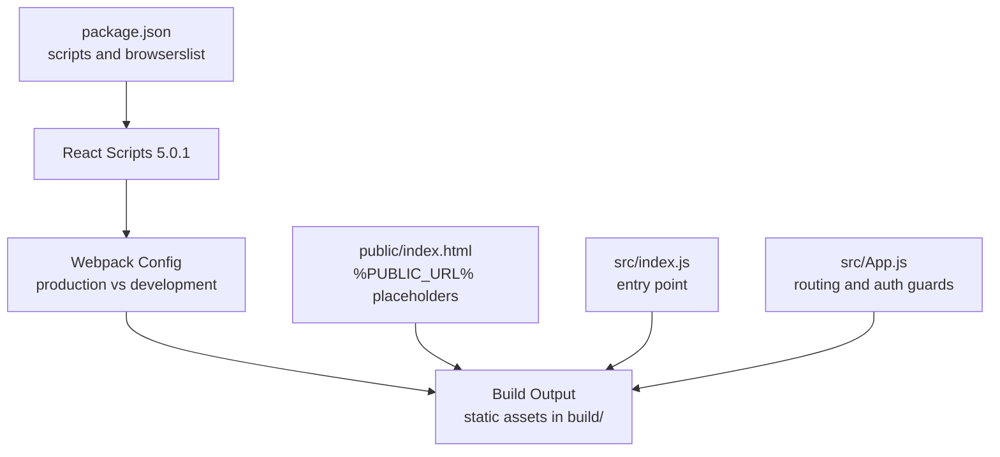
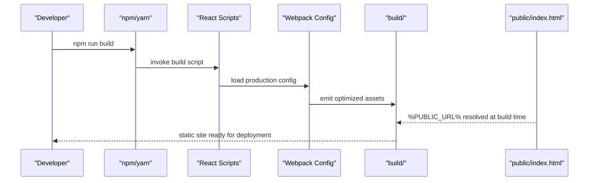
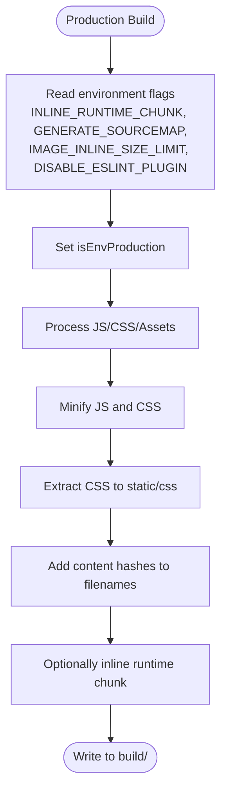
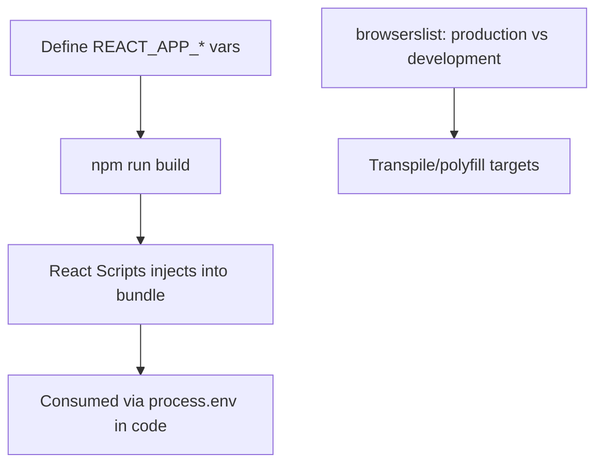
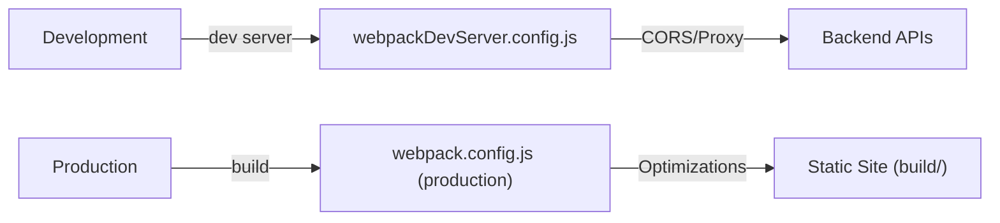
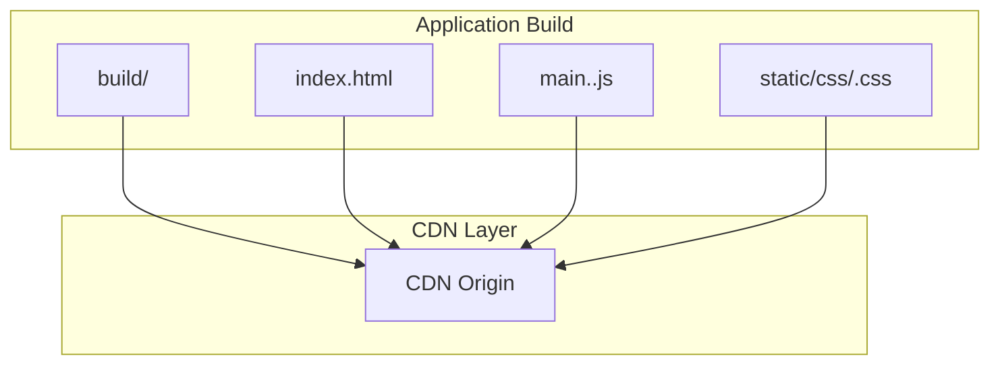
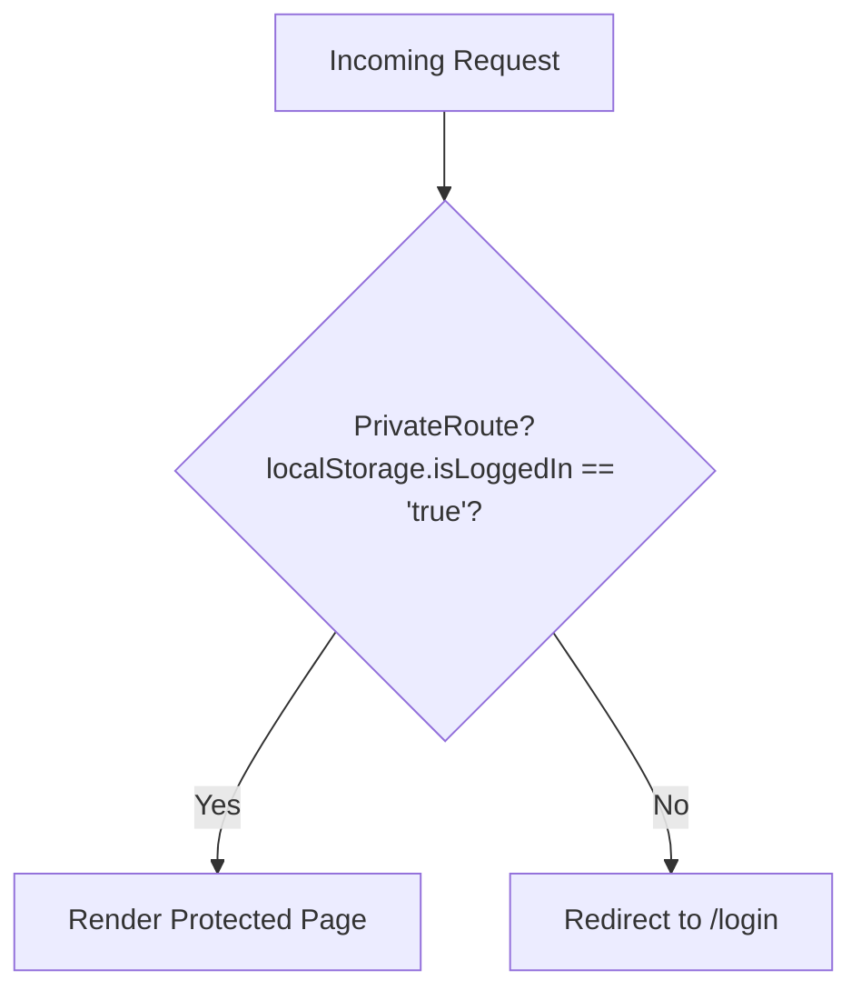
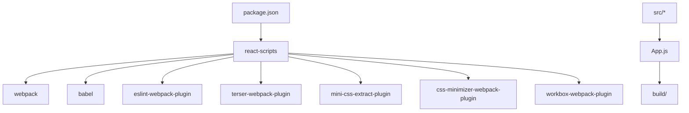

# Deployment and Build

<cite>
**Referenced Files in This Document**
- [package.json](file://package.json)
- [README.md](file://README.md)
- [public/index.html](file://public/index.html)
- [src/index.js](file://src/index.js)
- [src/App.js](file://src/App.js)
- [react-scripts webpack.config.js](file://node_modules/react-scripts/config/webpack.config.js)
- [react-scripts webpackDevServer.config.js](file://node_modules/react-scripts/config/webpackDevServer.config.js)
</cite>

## Table of Contents
1. [Introduction](#introduction)
2. [Project Structure](#project-structure)
3. [Core Components](#core-components)
4. [Architecture Overview](#architecture-overview)
5. [Detailed Component Analysis](#detailed-component-analysis)
6. [Dependency Analysis](#dependency-analysis)
7. [Performance Considerations](#performance-considerations)
8. [Troubleshooting Guide](#troubleshooting-guide)
9. [Conclusion](#conclusion)
10. [Appendices](#appendices)

## Introduction
This document explains how Lumière e-commerce client builds and deploys using Create React App and React Scripts 5.0.1. It covers build configuration, production optimizations, environment variable management, deployment strategies, artifact optimization, CDN integration, and operational guidance for production readiness, monitoring, and continuous deployment.

## Project Structure
The project follows a standard Create React App layout with a public HTML shell and a src tree containing application code. Build and development behaviors are governed by scripts and configuration embedded in react-scripts.

**Diagram sources**
- [package.json:16-40](file://package.json#L16-L40)
- [react-scripts webpack.config.js:100-200](file://node_modules/react-scripts/config/webpack.config.js#L100-L200)
- [public/index.html:1-44](file://public/index.html#L1-44)
- [src/index.js:1-18](file://src/index.js#L1-L18)
- [src/App.js:1-85](file://src/App.js#L1-L85)

**Section sources**
- [package.json:16-40](file://package.json#L16-L40)
- [README.md:22-30](file://README.md#L22-L30)
- [public/index.html:1-44](file://public/index.html#L1-L44)
- [src/index.js:1-18](file://src/index.js#L1-L18)
- [src/App.js:1-85](file://src/App.js#L1-L85)

## Core Components
- Build scripts: start, build, test, eject are provided by React Scripts.
- Production optimization: minification, hashing, CSS extraction, and runtime chunk inlining are configured in the Webpack setup.
- Environment variables: consumed via process.env and injected by React Scripts; browserslist controls target browsers for production.
- Public assets: HTML template uses %PUBLIC_URL% placeholders resolved at build time.

Key configuration touchpoints:
- Scripts and browserslist: [package.json:16-39](file://package.json#L16-L39)
- Build output and production behavior: [README.md:22-28](file://README.md#L22-L28)
- Public HTML template: [public/index.html:1-44](file://public/index.html#L1-L44)
- Application entry and routing: [src/index.js:1-18](file://src/index.js#L1-L18), [src/App.js:1-85](file://src/App.js#L1-L85)

**Section sources**
- [package.json:16-39](file://package.json#L16-L39)
- [README.md:22-28](file://README.md#L22-L28)
- [public/index.html:1-44](file://public/index.html#L1-L44)
- [src/index.js:1-18](file://src/index.js#L1-L18)
- [src/App.js:1-85](file://src/App.js#L1-L85)

## Architecture Overview
The build pipeline transforms source code and assets into optimized static files. During development, a dev server serves assets with hot reloading. In production, React Scripts produces a deployable build directory with hashed filenames and extracted CSS.

**Diagram sources**
- [package.json:16-21](file://package.json#L16-L21)
- [react-scripts webpack.config.js:100-200](file://node_modules/react-scripts/config/webpack.config.js#L100-L200)
- [public/index.html:17-27](file://public/index.html#L17-L27)

## Detailed Component Analysis

### Build Configuration and Production Optimizations
- Minification and hashing: production builds minify JS and CSS and append content hashes to filenames for cache busting.
- CSS extraction: CSS is extracted to separate files in production for efficient caching.
- Runtime chunk inlining: configurable via environment variable to reduce requests.
- Source maps: controlled by an environment variable to balance debugging and bundle size.
- ESLint and TypeScript: optional integrations enabled by environment flags.
- Image inlining threshold: controlled by an environment variable.

**Diagram sources**
- [react-scripts webpack.config.js:42-66](file://node_modules/react-scripts/config/webpack.config.js#L42-L66)
- [react-scripts webpack.config.js:117-197](file://node_modules/react-scripts/config/webpack.config.js#L117-L197)
- [react-scripts webpack.config.js:199-200](file://node_modules/react-scripts/config/webpack.config.js#L199-L200)

**Section sources**
- [react-scripts webpack.config.js:42-66](file://node_modules/react-scripts/config/webpack.config.js#L42-L66)
- [react-scripts webpack.config.js:117-197](file://node_modules/react-scripts/config/webpack.config.js#L117-L197)
- [react-scripts webpack.config.js:199-200](file://node_modules/react-scripts/config/webpack.config.js#L199-L200)

### Environment Variables and Injection
- Injected variables: React Scripts injects environment variables prefixed with REACT_APP_ into the client bundle at build time.
- Browserslist targets: Separate production and development targets drive transpilation and polyfills.
- Public URL: %PUBLIC_URL% in HTML resolves to the configured public URL or path.

**Diagram sources**
- [package.json:22-39](file://package.json#L22-L39)
- [public/index.html:17-27](file://public/index.html#L17-L27)

**Section sources**
- [package.json:22-39](file://package.json#L22-L39)
- [public/index.html:17-27](file://public/index.html#L17-L27)

### Development vs Production Builds
- Development: Hot reloading, eval source maps, relaxed CORS, and proxy support.
- Production: Minified assets, hashed filenames, extracted CSS, and runtime chunk inlining toggled by environment.

**Diagram sources**
- [react-scripts webpackDevServer.config.js:24-136](file://node_modules/react-scripts/config/webpackDevServer.config.js#L24-L136)
- [react-scripts webpack.config.js:100-200](file://node_modules/react-scripts/config/webpack.config.js#L100-L200)

**Section sources**
- [react-scripts webpackDevServer.config.js:24-136](file://node_modules/react-scripts/config/webpackDevServer.config.js#L24-L136)
- [react-scripts webpack.config.js:100-200](file://node_modules/react-scripts/config/webpack.config.js#L100-L200)

### Asset Optimization and CDN Integration
- Static assets: Images and fonts placed under public/ are served as-is; assets imported in JS are processed by Webpack.
- CDN strategy: Serve the build/ directory from a CDN by pointing your CDN origin to the build output. Use a stable PUBLIC_URL to ensure %PUBLIC_URL% placeholders resolve correctly.
- Subresource Integrity (SRI): Not configured by default; can be added via custom Webpack configuration if required.

[No sources needed since this diagram shows conceptual workflow, not actual code structure]

### Routing and Authentication Guards in Production
- Client-side routing uses React Router with a private route guard checking a client-side token in localStorage.
- Production deployment must ensure HTTPS and secure storage of tokens; consider moving to HttpOnly cookies for stronger protection.

**Diagram sources**
- [src/App.js:13-16](file://src/App.js#L13-L16)

**Section sources**
- [src/App.js:13-16](file://src/App.js#L13-L16)

## Dependency Analysis
- Build-time dependencies: React Scripts 5.0.1 provides Webpack, Babel, ESLint, and related plugins.
- Runtime dependencies: React, ReactDOM, React Router Dom, and testing libraries.
- Scripts: start, build, test, eject are defined in package.json.

**Diagram sources**
- [package.json:5-21](file://package.json#L5-L21)
- [react-scripts webpack.config.js:15-35](file://node_modules/react-scripts/config/webpack.config.js#L15-L35)

**Section sources**
- [package.json:5-21](file://package.json#L5-L21)
- [react-scripts webpack.config.js:15-35](file://node_modules/react-scripts/config/webpack.config.js#L15-L35)

## Performance Considerations
- Minification and hashing: enabled by default in production builds.
- CSS extraction: improves caching and reduces render-blocking CSS.
- Runtime chunk inlining: reduce round trips; toggle via environment variable.
- Source maps: disabled by default; enable only when necessary for debugging.
- Image inlining: tune IMAGE_INLINE_SIZE_LIMIT to balance inlining vs network efficiency.
- Browserslist: narrow production targets to reduce polyfills and bundle size.

[No sources needed since this section provides general guidance]

## Troubleshooting Guide
Common issues and resolutions:
- Build fails to minify: Verify third-party packages are ES5-compatible or adjust configuration.
- Public URL mismatch: Ensure PUBLIC_URL aligns with CDN or subpath deployment.
- Missing environment variables: Define REACT_APP_* variables at build time; they are not available at runtime unless prefixed correctly.
- Development proxy issues: Configure proxy and allowedHosts appropriately in development.

**Section sources**
- [README.md:68-71](file://README.md#L68-L71)
- [react-scripts webpackDevServer.config.js:24-46](file://node_modules/react-scripts/config/webpackDevServer.config.js#L24-L46)

## Conclusion
Lumière e-commerce client leverages Create React App and React Scripts 5.0.1 to produce optimized, production-ready static assets. The build pipeline is configured for minification, hashing, and CSS extraction, while environment variables and browserslist control behavior across environments. Deployment is straightforward: serve the build/ directory via a CDN or web server, ensuring PUBLIC_URL alignment and HTTPS for secure routing and token handling.

[No sources needed since this section summarizes without analyzing specific files]

## Appendices

### A. Build and Deploy Checklist
- Confirm production build runs without errors.
- Validate hashed assets and extracted CSS in build/.
- Set PUBLIC_URL for CDN or subpath deployments.
- Configure REACT_APP_* variables for backend URLs and feature flags.
- Test redirects and routing in production-like environment.
- Monitor bundle size and performance metrics post-deploy.

[No sources needed since this section provides general guidance]