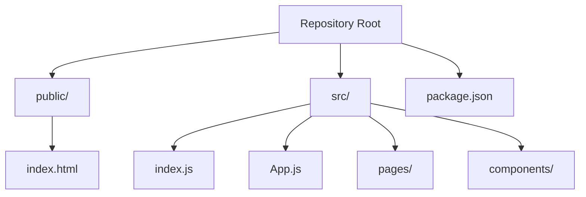
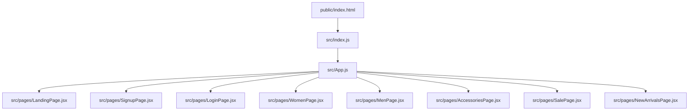
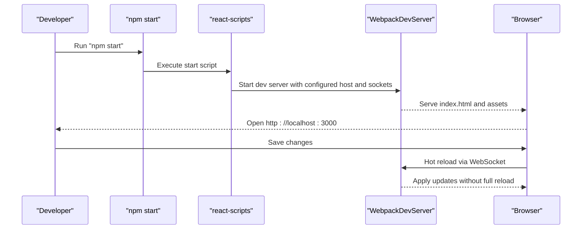
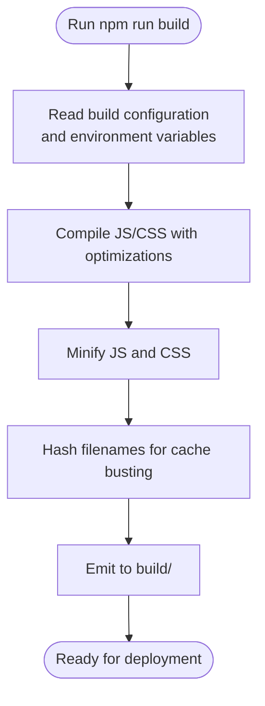
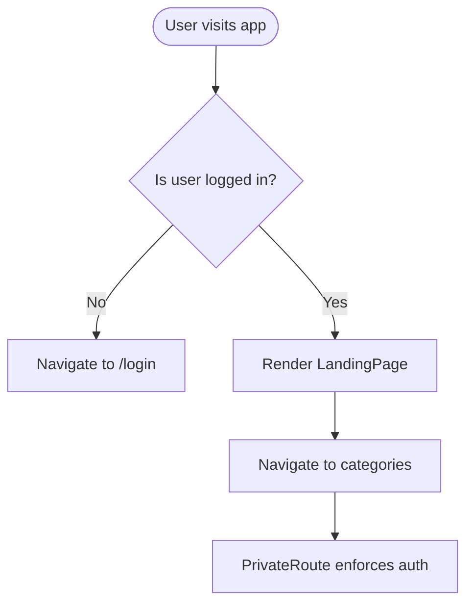
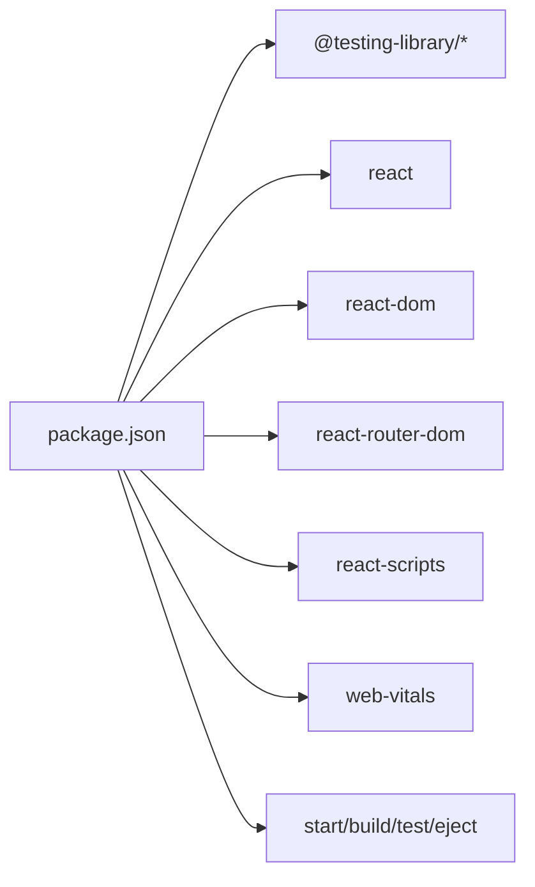

# Getting Started

<cite>
**Referenced Files in This Document**
- [package.json](file://package.json)
- [README.md](file://README.md)
- [public/index.html](file://public/index.html)
- [src/App.js](file://src/App.js)
- [src/index.js](file://src/index.js)
- [src/pages/LandingPage.jsx](file://src/pages/LandingPage.jsx)
- [node_modules/react-scripts/config/webpack.config.js](file://node_modules/react-scripts/config/webpack.config.js)
- [node_modules/react-scripts/config/webpackDevServer.config.js](file://node_modules/react-scripts/config/webpackDevServer.config.js)
</cite>

## Table of Contents
1. [Introduction](#introduction)
2. [Project Structure](#project-structure)
3. [Core Components](#core-components)
4. [Architecture Overview](#architecture-overview)
5. [Detailed Component Analysis](#detailed-component-analysis)
6. [Dependency Analysis](#dependency-analysis)
7. [Performance Considerations](#performance-considerations)
8. [Troubleshooting Guide](#troubleshooting-guide)
9. [Conclusion](#conclusion)
10. [Appendices](#appendices)

## Introduction
This guide helps you install, run, and build the Lumière e-commerce client locally. It covers prerequisites, installation, development server setup, production builds, environment variables, and troubleshooting. The project is a Create React App-based frontend that runs on a modern browser and uses React Router for navigation.

## Project Structure
The repository follows a standard Create React App layout:
- public: Static assets and the HTML shell
- src: Application source code including pages, components, and entry points
- Root configuration: package.json defines scripts, dependencies, and browser targets

**Diagram sources**
- [package.json](file://package.json)
- [public/index.html](file://public/index.html)
- [src/index.js](file://src/index.js)
- [src/App.js](file://src/App.js)

**Section sources**
- [package.json](file://package.json)
- [public/index.html](file://public/index.html)
- [src/index.js](file://src/index.js)
- [src/App.js](file://src/App.js)

## Core Components
- Package scripts define the development server, production build, and tests.
- The app entry point initializes React and mounts the router-driven App.
- App sets up protected routes and navigates to category pages.
- Landing page composes UI sections and manages shopping state.

Key behaviors:
- Development server starts at http://localhost:3000 by default.
- Production build emits optimized assets to a build folder.
- Hot reloading is enabled via React Refresh integrated by react-scripts.

**Section sources**
- [package.json](file://package.json)
- [README.md](file://README.md)
- [src/index.js](file://src/index.js)
- [src/App.js](file://src/App.js)
- [src/pages/LandingPage.jsx](file://src/pages/LandingPage.jsx)

## Architecture Overview
The runtime architecture ties together the HTML shell, React entry, routing, and page components.

**Diagram sources**
- [public/index.html](file://public/index.html)
- [src/index.js](file://src/index.js)
- [src/App.js](file://src/App.js)
- [src/pages/LandingPage.jsx](file://src/pages/LandingPage.jsx)

## Detailed Component Analysis

### Prerequisites
- Operating systems: Works on Windows and Unix-like systems (Linux/macOS).
- Node.js: The project uses react-scripts 5.0.1. Install a Node.js version compatible with that toolchain. Refer to the react-scripts release notes or Node.js LTS schedule for compatibility.
- Package manager: npm is used in the scripts. Yarn is supported by Create React App; ensure either npm or yarn is installed globally.

Verification steps:
- Confirm Node.js installation: node --version
- Confirm npm installation: npm --version

Notes:
- The project does not declare a Node.js engine requirement in package.json. Install a recent LTS Node.js version recommended by your OS package manager or the official Node.js website.

**Section sources**
- [package.json](file://package.json)
- [README.md](file://README.md)

### Installation Steps
1. Clone the repository to your machine.
2. Open a terminal in the project root.
3. Install dependencies:
   - npm install
4. Start the development server:
   - npm start
   - The app opens at http://localhost:3000

Verification:
- The browser loads the landing page after the initial compilation.
- Changes to source files trigger hot reload.

**Section sources**
- [README.md](file://README.md)
- [package.json](file://package.json)

### Development Server Setup
- Port: The default port is 3000. The development server configuration reads HOST and socket-related environment variables to customize the host and hot reload endpoints.
- Hot reloading: Enabled via React Refresh integrated by react-scripts.
- HTTPS and proxy: Optional HTTPS and proxy settings are configurable via environment variables.

Environment variables affecting development:
- HOST: Host binding for the dev server.
- WDS_SOCKET_HOST, WDS_SOCKET_PATH, WDS_SOCKET_PORT: Customize the hot reload WebSocket endpoint.
- Other internal variables are used by the dev server configuration.

**Diagram sources**
- [package.json](file://package.json)
- [node_modules/react-scripts/config/webpackDevServer.config.js](file://node_modules/react-scripts/config/webpackDevServer.config.js)

**Section sources**
- [package.json](file://package.json)
- [node_modules/react-scripts/config/webpackDevServer.config.js](file://node_modules/react-scripts/config/webpackDevServer.config.js)

### Build Process for Production
- Build command: npm run build
- Output: Emits optimized assets to a build directory with hashed filenames.
- Optimization: Minification and asset optimization are handled by the underlying build pipeline.

Environment variables affecting build:
- PUBLIC_URL: Controls the public URL path for assets. Set it if deploying under a subpath.
- GENERATE_SOURCEMAP: Disable source maps by setting to false.
- INLINE_RUNTIME_CHUNK: Disable runtime chunk inlining by setting to false.
- IMAGE_INLINE_SIZE_LIMIT: Adjust image inlining threshold.
- DISABLE_ESLINT_PLUGIN: Disable ESLint plugin during build by setting to true.
- TSC_COMPILE_ON_ERROR: Configure TypeScript compile behavior.

**Diagram sources**
- [package.json](file://package.json)
- [node_modules/react-scripts/config/webpack.config.js](file://node_modules/react-scripts/config/webpack.config.js)

**Section sources**
- [README.md](file://README.md)
- [package.json](file://package.json)
- [node_modules/react-scripts/config/webpack.config.js](file://node_modules/react-scripts/config/webpack.config.js)

### Environment Variables Reference
Commonly used variables:
- HOST: Host address for the dev server.
- WDS_SOCKET_HOST, WDS_SOCKET_PATH, WDS_SOCKET_PORT: Hot reload WebSocket configuration.
- PUBLIC_URL: Public URL for hosted deployment.
- GENERATE_SOURCEMAP: Enable/disable source maps.
- INLINE_RUNTIME_CHUNK: Inline runtime chunk.
- IMAGE_INLINE_SIZE_LIMIT: Image inlining limit.
- DISABLE_ESLINT_PLUGIN: Disable ESLint plugin.
- TSC_COMPILE_ON_ERROR: TypeScript compile on error behavior.

These are read by the development server and build configuration.

**Section sources**
- [node_modules/react-scripts/config/webpackDevServer.config.js](file://node_modules/react-scripts/config/webpackDevServer.config.js)
- [node_modules/react-scripts/config/webpack.config.js](file://node_modules/react-scripts/config/webpack.config.js)
- [package.json](file://package.json)

### Routing and Navigation
- Router: BrowserRouter drives navigation.
- Authentication: A private route guard checks a local storage flag to protect routes.
- Routes: Define pages for login, signup, landing, and categories.

**Diagram sources**
- [src/App.js](file://src/App.js)

**Section sources**
- [src/App.js](file://src/App.js)

### Entry Point and Rendering
- The DOM entry point creates a root and renders the App component inside React Strict Mode.
- reportWebVitals is wired for optional performance measurement.

**Section sources**
- [src/index.js](file://src/index.js)
- [public/index.html](file://public/index.html)

## Dependency Analysis
- Runtime dependencies include React, ReactDOM, React Router, and testing libraries.
- Scripts define start, build, test, and eject commands.
- Browserslist defines supported browsers for production and development.

**Diagram sources**
- [package.json](file://package.json)

**Section sources**
- [package.json](file://package.json)

## Performance Considerations
- Use the production build for performance measurements and deployment.
- Keep dependencies updated and avoid unnecessary re-renders in components.
- Leverage lazy loading for large pages if needed.
- Monitor bundle size using Create React App’s built-in analyzers.

## Troubleshooting Guide
Common issues and resolutions:
- Port already in use (default 3000): Change HOST or stop the conflicting process.
- Hot reload not working: Verify firewall/proxy settings and ensure WebSocket connectivity to the hot reload endpoint.
- Build fails to minify: Review third-party dependencies and adjust configuration as needed.
- Assets not loading under a subpath: Set PUBLIC_URL to the subpath.
- ESLint errors in CI: Disable the ESLint plugin during build if necessary.

Verification steps:
- Confirm the app loads at http://localhost:3000 after starting the dev server.
- After building, inspect the build directory for emitted assets.
- Test navigation and protected routes using local storage flags.

**Section sources**
- [README.md](file://README.md)
- [node_modules/react-scripts/config/webpackDevServer.config.js](file://node_modules/react-scripts/config/webpackDevServer.config.js)
- [node_modules/react-scripts/config/webpack.config.js](file://node_modules/react-scripts/config/webpack.config.js)

## Conclusion
You now have the essentials to install, develop, and build the Lumière e-commerce client. Use the provided scripts, review the environment variables, and refer to the troubleshooting section for common issues. The routing and rendering setup ensures a smooth developer experience with hot reloading and optimized production builds.

## Appendices
- Compatibility: Works on Windows and Unix-like systems with a compatible Node.js version and npm or yarn installed.
- Next steps: Explore pages and components under src/pages and src/components to extend functionality.