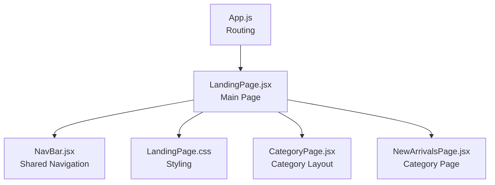
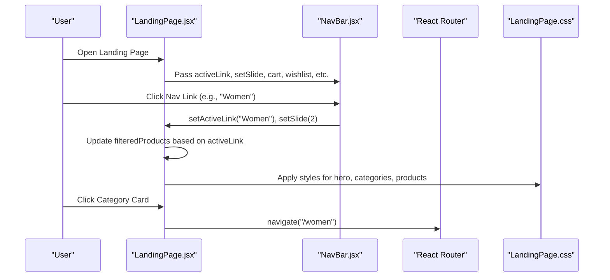
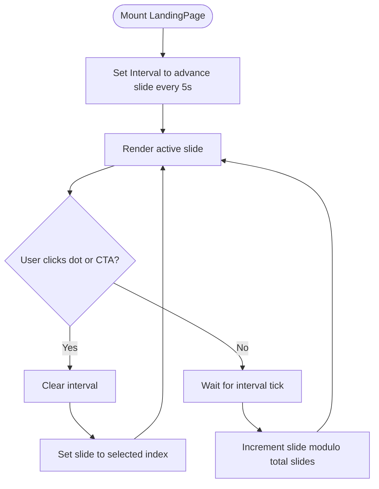
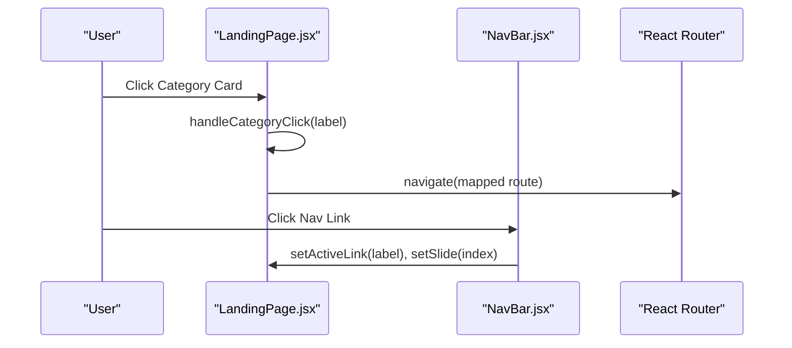
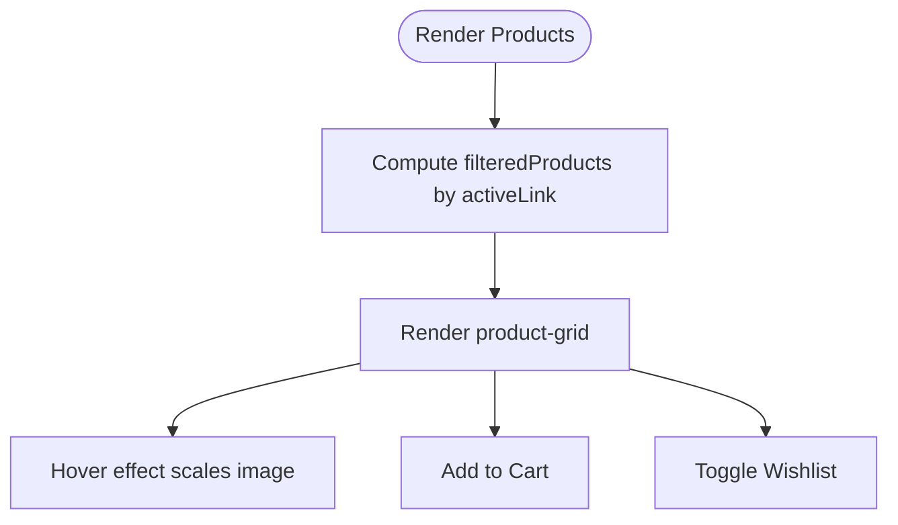
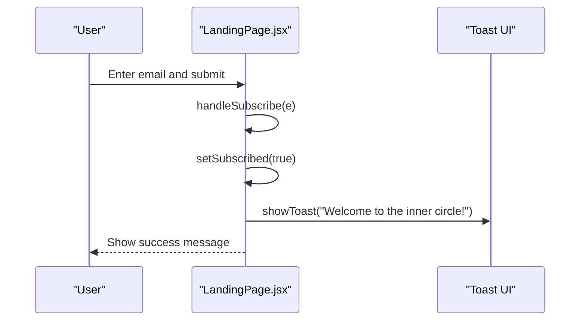
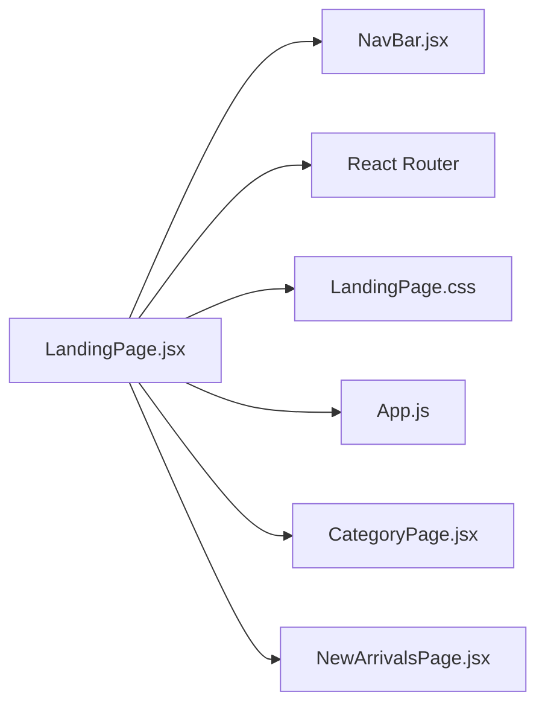

# Landing Page

<cite>
**Referenced Files in This Document**
- [LandingPage.jsx](file://src/pages/LandingPage.jsx)
- [NavBar.jsx](file://src/components/NavBar.jsx)
- [LandingPage.css](file://src/pages/LandingPage.css)
- [App.js](file://src/App.js)
- [CategoryPage.jsx](file://src/components/CategoryPage.jsx)
- [NewArrivalsPage.jsx](file://src/pages/NewArrivalsPage.jsx)
</cite>

## Table of Contents
1. [Introduction](#introduction)
2. [Project Structure](#project-structure)
3. [Core Components](#core-components)
4. [Architecture Overview](#architecture-overview)
5. [Detailed Component Analysis](#detailed-component-analysis)
6. [Dependency Analysis](#dependency-analysis)
7. [Performance Considerations](#performance-considerations)
8. [Troubleshooting Guide](#troubleshooting-guide)
9. [Conclusion](#conclusion)
10. [Appendices](#appendices)

## Introduction
This document provides a comprehensive guide to the LandingPage component implementation. It explains the hero carousel with auto-rotation, category navigation system, product showcase, newsletter subscription, trust indicators, and promotional content management. It also covers the relationship with the NavBar component, responsive design, performance optimization for images, and user engagement features. Practical troubleshooting guidance is included for carousel issues, category navigation problems, and styling customization.

## Project Structure
The LandingPage is the primary entry for authenticated users and integrates with shared UI components and routing.

**Diagram sources**
- [App.js:18-85](file://src/App.js#L18-L85)
- [LandingPage.jsx:57-405](file://src/pages/LandingPage.jsx#L57-L405)
- [NavBar.jsx:7-30](file://src/components/NavBar.jsx#L7-L30)
- [LandingPage.css:1-1486](file://src/pages/LandingPage.css#L1-L1486)
- [CategoryPage.jsx:10-328](file://src/components/CategoryPage.jsx#L10-L328)
- [NewArrivalsPage.jsx:26-29](file://src/pages/NewArrivalsPage.jsx#L26-L29)

**Section sources**
- [App.js:18-85](file://src/App.js#L18-L85)
- [LandingPage.jsx:57-405](file://src/pages/LandingPage.jsx#L57-L405)

## Core Components
- LandingPage: Orchestrates hero carousel, trust indicators, categories, product showcase, newsletter, testimonials, and footer.
- NavBar: Shared navigation bar with cart/wishlist drawers, search modal, and navigation links that synchronize with the hero carousel.
- LandingPage.css: Styles for hero, trust strip, categories, products, banner, testimonials, newsletter, and responsive breakpoints.

Key responsibilities:
- State management for carousel rotation and user actions.
- Category selection handling and navigation.
- Product filtering and display.
- Newsletter subscription flow.
- Integration with shared UI and routing.

**Section sources**
- [LandingPage.jsx:57-405](file://src/pages/LandingPage.jsx#L57-L405)
- [NavBar.jsx:7-30](file://src/components/NavBar.jsx#L7-L30)
- [LandingPage.css:503-1486](file://src/pages/LandingPage.css#L503-L1486)

## Architecture Overview
The LandingPage composes multiple sections and integrates with NavBar. The NavBar receives props to keep the hero carousel synchronized with active navigation.

**Diagram sources**
- [LandingPage.jsx:57-405](file://src/pages/LandingPage.jsx#L57-L405)
- [NavBar.jsx:7-30](file://src/components/NavBar.jsx#L7-L30)
- [App.js:18-85](file://src/App.js#L18-L85)
- [LandingPage.css:503-1486](file://src/pages/LandingPage.css#L503-L1486)

## Detailed Component Analysis

### Hero Carousel with Auto-Rotation
- Auto-rotation: A timer advances the active slide every 5 seconds. The timer is cleared when the user interacts with dots or clicks a hero item.
- Slide rendering: Each slide displays background image, overlay, headline, subtext, and CTA buttons.
- Interaction: Users can click dots to jump to a specific slide or click the hero CTA to navigate to a category route.

State and effects:
- State: slide index and timer reference.
- Effect: sets interval to advance slide; clears interval on unmount and on manual interaction.

Navigation:
- handleHeroClick maps slide index to category routes.

**Diagram sources**
- [LandingPage.jsx:76-82](file://src/pages/LandingPage.jsx#L76-L82)
- [LandingPage.jsx:89-92](file://src/pages/LandingPage.jsx#L89-L92)
- [LandingPage.jsx:177-207](file://src/pages/LandingPage.jsx#L177-L207)

**Section sources**
- [LandingPage.jsx:76-82](file://src/pages/LandingPage.jsx#L76-L82)
- [LandingPage.jsx:89-92](file://src/pages/LandingPage.jsx#L89-L92)
- [LandingPage.jsx:177-207](file://src/pages/LandingPage.jsx#L177-L207)
- [LandingPage.css:503-632](file://src/pages/LandingPage.css#L503-L632)

### Category Navigation System
- Categories grid: Six category cards with emoji, label, and item count.
- Selection handling: On click, routes are mapped to category pages. The active category is reset after navigation.
- Integration with NavBar: NavBar links update activeLink and setSlide to match hero content.

**Diagram sources**
- [LandingPage.jsx:94-105](file://src/pages/LandingPage.jsx#L94-L105)
- [NavBar.jsx:50-56](file://src/components/NavBar.jsx#L50-L56)

**Section sources**
- [LandingPage.jsx:94-105](file://src/pages/LandingPage.jsx#L94-L105)
- [NavBar.jsx:50-56](file://src/components/NavBar.jsx#L50-L56)
- [LandingPage.css:689-721](file://src/pages/LandingPage.css#L689-L721)

### Product Showcase Features
- Product grid: Four-column layout with hover effects, quick add, wishlist toggle, pricing, and badges.
- Filtering: filteredProducts computed based on activeLink, mapping to predefined category groups.
- Lazy loading: Images use lazy loading for performance.

**Diagram sources**
- [LandingPage.jsx:136-145](file://src/pages/LandingPage.jsx#L136-L145)
- [LandingPage.jsx:256-292](file://src/pages/LandingPage.jsx#L256-L292)
- [LandingPage.css:722-832](file://src/pages/LandingPage.css#L722-L832)

**Section sources**
- [LandingPage.jsx:136-145](file://src/pages/LandingPage.jsx#L136-L145)
- [LandingPage.jsx:256-292](file://src/pages/LandingPage.jsx#L256-L292)
- [LandingPage.css:722-832](file://src/pages/LandingPage.css#L722-L832)

### Newsletter Subscription Integration
- Form: Email input with submit handler.
- State: Tracks email and subscribed flag.
- Behavior: On submit, sets subscribed and shows toast message.

**Diagram sources**
- [LandingPage.jsx:131-135](file://src/pages/LandingPage.jsx#L131-L135)
- [LandingPage.jsx:84-87](file://src/pages/LandingPage.jsx#L84-L87)
- [LandingPage.css:954-1021](file://src/pages/LandingPage.css#L954-L1021)

**Section sources**
- [LandingPage.jsx:131-135](file://src/pages/LandingPage.jsx#L131-L135)
- [LandingPage.jsx:84-87](file://src/pages/LandingPage.jsx#L84-L87)
- [LandingPage.css:954-1021](file://src/pages/LandingPage.css#L954-L1021)

### Trust Indicators and Promotional Content
- Trust strip: Four service icons with hover effects.
- Banner: Promotional banner with gradient and decorative text.
- Testimonials: Three-column grid with star ratings and customer avatars.
- Press logos: Brand mentions in a horizontal layout.

**Section sources**
- [LandingPage.jsx:209-225](file://src/pages/LandingPage.jsx#L209-L225)
- [LandingPage.jsx:295-306](file://src/pages/LandingPage.jsx#L295-L306)
- [LandingPage.jsx:316-337](file://src/pages/LandingPage.jsx#L316-L337)
- [LandingPage.jsx:308-314](file://src/pages/LandingPage.jsx#L308-L314)
- [LandingPage.css:633-911](file://src/pages/LandingPage.css#L633-L911)

### Relationship with NavBar and Overall Page Layout
- NavBar props: menuOpen, setMenuOpen, cart, wishlist, searchOpen, setSearchOpen, cartOpen, setCartOpen, removeFromCart, cartTotal, cartCount, displayName, handleLogout, formatPrice, showToast, toggleWishlist, products, activeLink, setActiveLink, setSlide.
- Layout: lp-root container wraps all sections; NavBar is rendered first, followed by hero, trust, categories, products, banner, press, testimonials, newsletter, and footer.

**Section sources**
- [LandingPage.jsx:152-175](file://src/pages/LandingPage.jsx#L152-L175)
- [NavBar.jsx:7-30](file://src/components/NavBar.jsx#L7-L30)
- [LandingPage.jsx:147-405](file://src/pages/LandingPage.jsx#L147-L405)

## Dependency Analysis
- LandingPage depends on:
  - NavBar for shared navigation and drawers.
  - React Router for programmatic navigation.
  - Local storage for user session and display name.
  - CSS module for styling and responsive breakpoints.

**Diagram sources**
- [LandingPage.jsx:1-5](file://src/pages/LandingPage.jsx#L1-L5)
- [NavBar.jsx:1-3](file://src/components/NavBar.jsx#L1-L3)
- [App.js:1-11](file://src/App.js#L1-L11)
- [CategoryPage.jsx:1-5](file://src/components/CategoryPage.jsx#L1-L5)
- [NewArrivalsPage.jsx:1-2](file://src/pages/NewArrivalsPage.jsx#L1-L2)

**Section sources**
- [LandingPage.jsx:1-5](file://src/pages/LandingPage.jsx#L1-L5)
- [NavBar.jsx:1-3](file://src/components/NavBar.jsx#L1-L3)
- [App.js:1-11](file://src/App.js#L1-L11)

## Performance Considerations
- Image lazy loading: Product images use lazy loading to defer offscreen images.
- Background scaling: Hero background images scale smoothly for parallax-like effect.
- Minimal re-renders: Memoized computations for filtered products in category pages reduce unnecessary renders.
- CSS transitions: Smooth animations for hover states and drawer open/close.

Recommendations:
- Preload critical hero images.
- Use responsive image sizes and formats for optimal bandwidth.
- Consider IntersectionObserver for advanced lazy loading strategies.
- Debounce window resize handlers if adding dynamic calculations.

**Section sources**
- [LandingPage.jsx:264](file://src/pages/LandingPage.jsx#L264)
- [LandingPage.css:520-528](file://src/pages/LandingPage.css#L520-L528)
- [CategoryPage.jsx:235-240](file://src/components/CategoryPage.jsx#L235-L240)

## Troubleshooting Guide

### Carousel Issues
- Symptom: Auto-rotation stops after user interaction.
  - Cause: Timer cleared on manual interaction.
  - Fix: Restart timer after user action or disable auto-rotation while user is interacting.
  - Reference: [LandingPage.jsx:76-82](file://src/pages/LandingPage.jsx#L76-L82), [LandingPage.jsx:82](file://src/pages/LandingPage.jsx#L82)

- Symptom: Dots not highlighting active slide.
  - Cause: Slide index mismatch or missing active class binding.
  - Fix: Ensure active class is applied when index equals slide.
  - Reference: [LandingPage.jsx:198-202](file://src/pages/LandingPage.jsx#L198-L202), [LandingPage.css:592-604](file://src/pages/LandingPage.css#L592-L604)

### Category Navigation Problems
- Symptom: Clicking category does not navigate.
  - Cause: Missing route mapping or incorrect label.
  - Fix: Verify handleCategoryClick mapping and route correctness.
  - Reference: [LandingPage.jsx:94-105](file://src/pages/LandingPage.jsx#L94-L105)

- Symptom: Active category not resetting after navigation.
  - Cause: State not cleared after navigation.
  - Fix: Reset activeCategory after navigate.
  - Reference: [LandingPage.jsx:103-105](file://src/pages/LandingPage.jsx#L103-L105)

### Styling Customization Options
- Hero carousel:
  - Adjust timing and easing in CSS transitions.
  - Modify dot styles and active state.
  - Reference: [LandingPage.css:503-632](file://src/pages/LandingPage.css#L503-L632)

- Product grid:
  - Change grid columns and hover effects.
  - Reference: [LandingPage.css:722-832](file://src/pages/LandingPage.css#L722-L832)

- Newsletter:
  - Customize form styling and success message.
  - Reference: [LandingPage.css:954-1021](file://src/pages/LandingPage.css#L954-L1021)

- Responsive breakpoints:
  - Modify media queries for different screen sizes.
  - Reference: [LandingPage.css:1428-1486](file://src/pages/LandingPage.css#L1428-L1486)

## Conclusion
The LandingPage component delivers a visually engaging, responsive, and interactive shopping experience. Its hero carousel auto-rotation, category navigation, product showcase, newsletter integration, trust indicators, and promotional content are tightly integrated with the shared NavBar and routing. The component’s state management, performance-conscious image handling, and robust styling enable a smooth user journey across devices.

## Appendices

### Example Paths for Implementation Details
- Auto-rotation and slide management: [LandingPage.jsx:76-82](file://src/pages/LandingPage.jsx#L76-L82), [LandingPage.jsx:82](file://src/pages/LandingPage.jsx#L82)
- Category selection handling: [LandingPage.jsx:94-105](file://src/pages/LandingPage.jsx#L94-L105)
- Product filtering: [LandingPage.jsx:136-145](file://src/pages/LandingPage.jsx#L136-L145)
- Newsletter subscription: [LandingPage.jsx:131-135](file://src/pages/LandingPage.jsx#L131-L135)
- NavBar integration: [LandingPage.jsx:152-175](file://src/pages/LandingPage.jsx#L152-L175), [NavBar.jsx:50-56](file://src/components/NavBar.jsx#L50-L56)
- Responsive design: [LandingPage.css:1428-1486](file://src/pages/LandingPage.css#L1428-L1486)