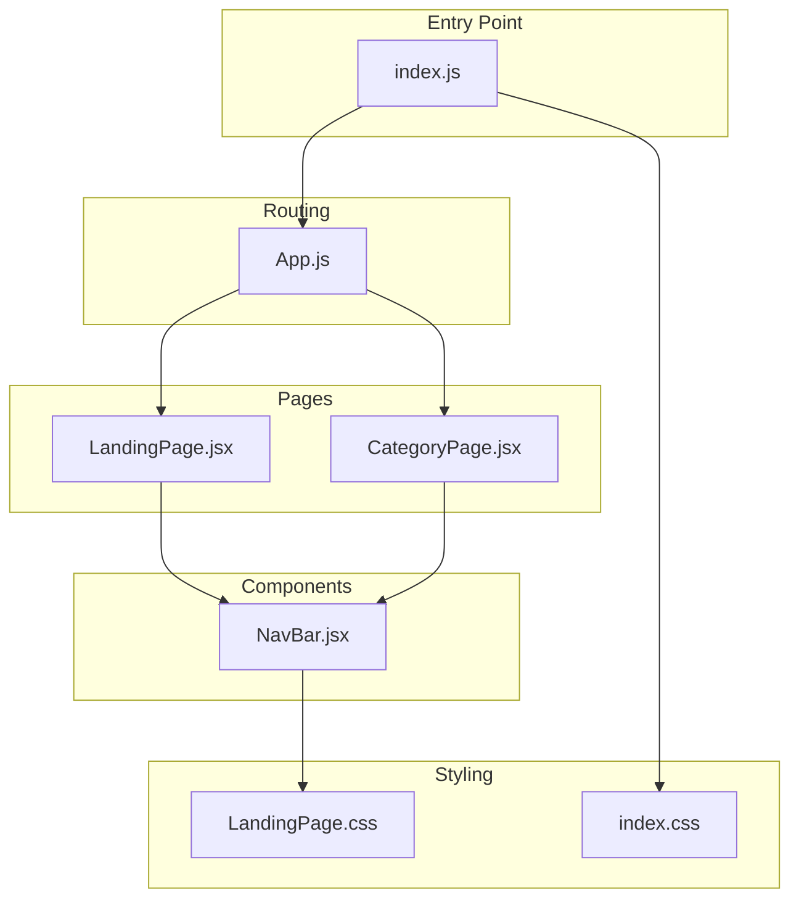
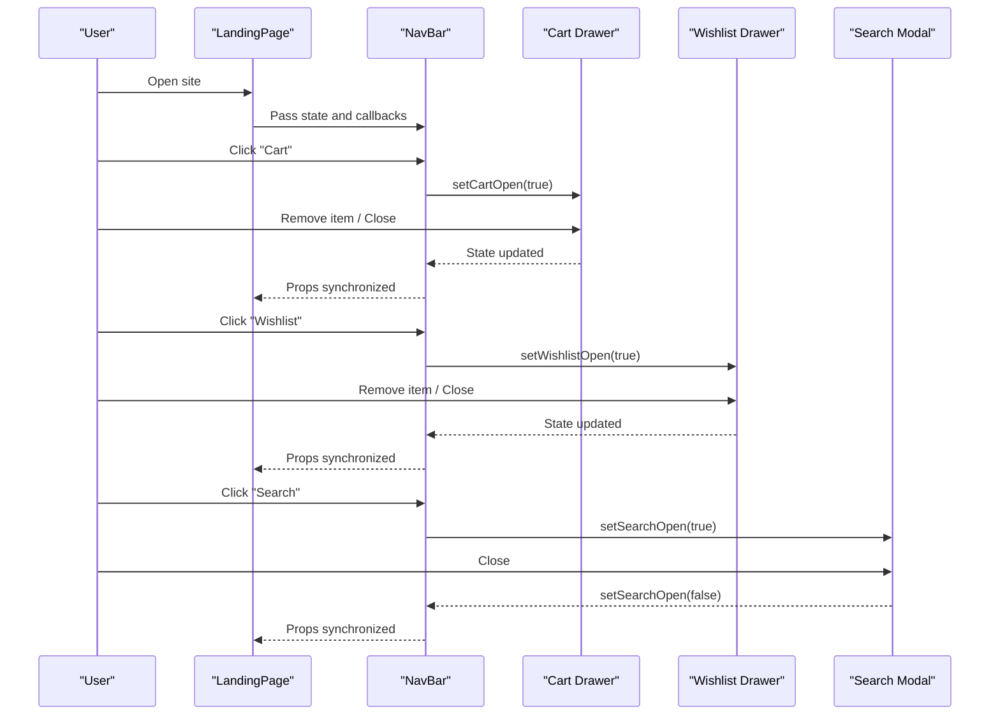
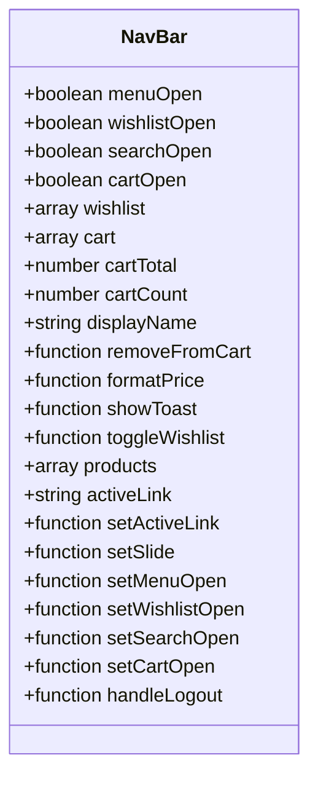
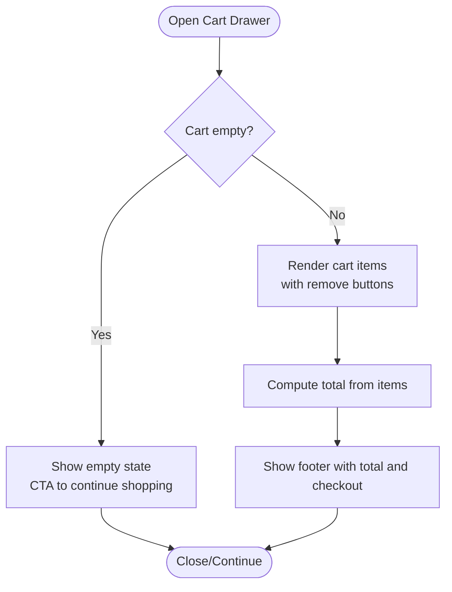
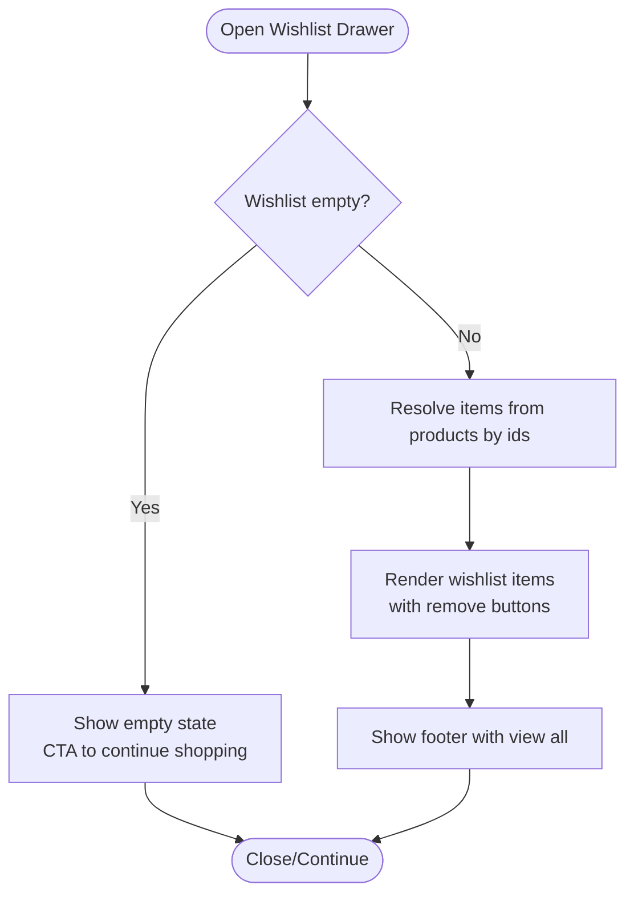
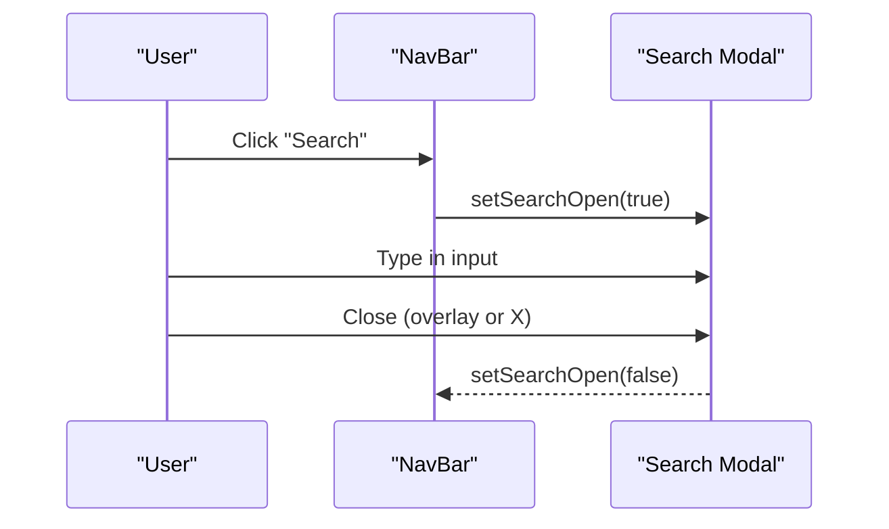
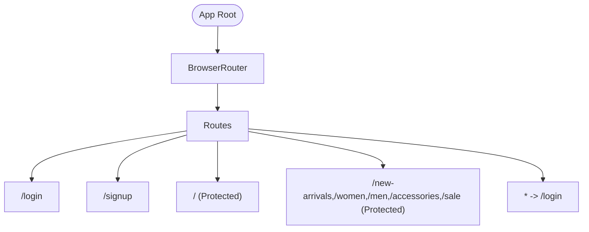
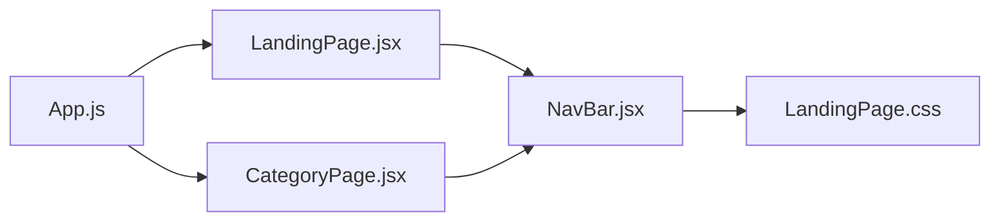

# Navigation System

<cite>
**Referenced Files in This Document**
- [NavBar.jsx](file://src/components/NavBar.jsx)
- [LandingPage.jsx](file://src/pages/LandingPage.jsx)
- [CategoryPage.jsx](file://src/components/CategoryPage.jsx)
- [App.js](file://src/App.js)
- [index.js](file://src/index.js)
- [LandingPage.css](file://src/pages/LandingPage.css)
- [index.css](file://src/index.css)
</cite>

## Table of Contents
1. [Introduction](#introduction)
2. [Project Structure](#project-structure)
3. [Core Components](#core-components)
4. [Architecture Overview](#architecture-overview)
5. [Detailed Component Analysis](#detailed-component-analysis)
6. [Dependency Analysis](#dependency-analysis)
7. [Performance Considerations](#performance-considerations)
8. [Troubleshooting Guide](#troubleshooting-guide)
9. [Conclusion](#conclusion)
10. [Appendices](#appendices)

## Introduction
This document describes the navigation system for the Lumière e-commerce client. It focuses on the sticky NavBar component that integrates cart, wishlist, and search functionality, along with mobile-responsive design, navigation state management, and route configuration using React Router DOM. It also covers the cart drawer, wishlist drawer, and search modal implementations, with practical usage examples, accessibility features, and guidelines for extending and customizing the navigation system.

## Project Structure
The navigation system spans several files:
- The NavBar component renders the sticky navigation bar, overlays, drawers, and modals.
- LandingPage and CategoryPage integrate NavBar and manage shared state (cart, wishlist, search, etc.).
- App.js configures routing and protected routes.
- CSS files define responsive behavior and visual styling.

**Diagram sources**
- [index.js:1-18](file://src/index.js#L1-L18)
- [App.js:18-85](file://src/App.js#L18-L85)
- [LandingPage.jsx:147-176](file://src/pages/LandingPage.jsx#L147-L176)
- [CategoryPage.jsx:100-127](file://src/components/CategoryPage.jsx#L100-L127)
- [NavBar.jsx:31-177](file://src/components/NavBar.jsx#L31-L177)
- [LandingPage.css:63-196](file://src/pages/LandingPage.css#L63-L196)
- [index.css:1-14](file://src/index.css#L1-L14)

**Section sources**
- [index.js:1-18](file://src/index.js#L1-L18)
- [App.js:18-85](file://src/App.js#L18-L85)

## Core Components
- NavBar: Renders the sticky navigation bar, cart drawer, wishlist drawer, and search modal. Manages visibility via props and local state.
- LandingPage: Hosts NavBar and manages cart, wishlist, search, and navigation state for the landing experience.
- CategoryPage: Hosts NavBar and manages cart, wishlist, search, and navigation state for category views.
- App: Configures React Router DOM routes and a private route guard.

Key responsibilities:
- Sticky navbar with logo, navigation links, actions (home, search, wishlist, cart), and user greeting/sign out.
- Cart drawer with item list, quantity, pricing, remove action, total computation, and checkout prompt.
- Wishlist drawer with item list, pricing, and remove action.
- Search modal with input and placeholder results.
- Mobile-responsive design using CSS classes and media queries.
- Route protection using a private route wrapper.

**Section sources**
- [NavBar.jsx:7-30](file://src/components/NavBar.jsx#L7-L30)
- [LandingPage.jsx:57-176](file://src/pages/LandingPage.jsx#L57-L176)
- [CategoryPage.jsx:10-28](file://src/components/CategoryPage.jsx#L10-L28)
- [App.js:13-16](file://src/App.js#L13-L16)

## Architecture Overview
The navigation system follows a unidirectional data flow:
- Parent pages (LandingPage, CategoryPage) maintain state for cart, wishlist, search, and active link.
- NavBar receives state and callbacks as props, updates visibility, and triggers actions.
- Overlays and drawers are controlled via open classes and click handlers.
- Routing is handled by React Router DOM with a private route guard.

**Diagram sources**
- [LandingPage.jsx:152-175](file://src/pages/LandingPage.jsx#L152-L175)
- [NavBar.jsx:62-136](file://src/components/NavBar.jsx#L62-L136)
- [NavBar.jsx:139-174](file://src/components/NavBar.jsx#L139-L174)

## Detailed Component Analysis

### NavBar Component
NavBar encapsulates:
- Announcement bar
- Sticky navigation bar with logo and desktop links
- Action buttons: Home, Search, Wishlist, Cart
- User greeting and logout
- Cart drawer with items, totals, and checkout prompt
- Wishlist drawer with items and view action
- Search modal with input and results placeholder

State and callbacks passed via props enable centralized state management in parent pages.

**Diagram sources**
- [NavBar.jsx:7-30](file://src/components/NavBar.jsx#L7-L30)

**Section sources**
- [NavBar.jsx:31-177](file://src/components/NavBar.jsx#L31-L177)

### Cart Drawer
The cart drawer displays:
- Header with item count
- Empty state with CTA
- List of cart items with name, price × quantity, and remove button
- Footer with total and checkout prompt

Behavior:
- Controlled via cartOpen prop and overlay/drawer classes
- Remove item triggers removeFromCart callback
- Total computed from cart items

**Diagram sources**
- [NavBar.jsx:80-118](file://src/components/NavBar.jsx#L80-L118)

**Section sources**
- [NavBar.jsx:80-118](file://src/components/NavBar.jsx#L80-L118)

### Wishlist Drawer
The wishlist drawer displays:
- Header with item count
- Empty state with CTA
- List of wishlist items with name and price
- Remove button to toggle item out of wishlist
- Footer with view all action

Behavior:
- Controlled via wishlistOpen prop and overlay/drawer classes
- Remove item triggers toggleWishlist callback
- Items resolved from products array using ids

**Diagram sources**
- [NavBar.jsx:138-174](file://src/components/NavBar.jsx#L138-L174)

**Section sources**
- [NavBar.jsx:138-174](file://src/components/NavBar.jsx#L138-L174)

### Search Modal
The search modal provides:
- Overlay and centered modal container
- Close button
- Text input with autofocus
- Placeholder results area

Behavior:
- Controlled via searchOpen prop
- Clicking overlay or close button toggles visibility

**Diagram sources**
- [NavBar.jsx:120-136](file://src/components/NavBar.jsx#L120-L136)

**Section sources**
- [NavBar.jsx:120-136](file://src/components/NavBar.jsx#L120-L136)

### Mobile-Responsive Design
The CSS establishes:
- Sticky navbar with backdrop blur and border
- Desktop navigation links with hover effects
- Hidden hamburger menu for mobile
- Cart and wishlist drawers with slide-in transforms
- Search modal with centered layout and max dimensions
- Focus-visible outlines for interactive elements

Responsive behavior relies on CSS classes and media queries present in the stylesheet.

**Section sources**
- [LandingPage.css:63-196](file://src/pages/LandingPage.css#L63-L196)
- [LandingPage.css:197-456](file://src/pages/LandingPage.css#L197-L456)

### Navigation State Management
Parent pages (LandingPage and CategoryPage) manage:
- Cart: items array, total, count, add/remove actions
- Wishlist: ids array, toggle action
- Search: open/close state
- Active link: for highlighting current section
- Menu open: for mobile navigation
- Slide: for hero carousel control
- Toast notifications

Props are passed to NavBar and callbacks update state in the parent.

**Section sources**
- [LandingPage.jsx:62-130](file://src/pages/LandingPage.jsx#L62-L130)
- [LandingPage.jsx:152-175](file://src/pages/LandingPage.jsx#L152-L175)
- [CategoryPage.jsx:15-63](file://src/components/CategoryPage.jsx#L15-L63)
- [CategoryPage.jsx:104-127](file://src/components/CategoryPage.jsx#L104-L127)

### Route Configuration with React Router DOM
App.js defines:
- Public login/signup routes
- Protected landing page route using a private route wrapper
- Protected category routes (New Arrivals, Women, Men, Accessories, Sale)
- Catch-all redirect to login

The private route guard checks for an auth token in localStorage.

**Diagram sources**
- [App.js:18-85](file://src/App.js#L18-L85)

**Section sources**
- [App.js:13-16](file://src/App.js#L13-L16)
- [App.js:23-82](file://src/App.js#L23-L82)

## Dependency Analysis
- NavBar depends on:
  - Parent pages for state and callbacks
  - CSS classes for styling and animations
- Parent pages depend on:
  - React Router DOM for navigation
  - Local storage for authentication state
  - Shared helpers (formatPrice, Stars) and constants (NAV_LINKS)
- App.js depends on:
  - React Router DOM for routing
  - PrivateRoute guard for authentication

**Diagram sources**
- [LandingPage.jsx:152-175](file://src/pages/LandingPage.jsx#L152-L175)
- [CategoryPage.jsx:104-127](file://src/components/CategoryPage.jsx#L104-L127)
- [NavBar.jsx:31-177](file://src/components/NavBar.jsx#L31-L177)
- [App.js:18-85](file://src/App.js#L18-L85)

**Section sources**
- [LandingPage.jsx:152-175](file://src/pages/LandingPage.jsx#L152-L175)
- [CategoryPage.jsx:104-127](file://src/components/CategoryPage.jsx#L104-L127)
- [App.js:18-85](file://src/App.js#L18-L85)

## Performance Considerations
- Drawer and modal transitions use CSS transforms and opacity for GPU-accelerated animations.
- Cart and wishlist lists are rendered with minimal re-computation; consider memoization for large datasets.
- Debounce or throttle search input if integrating live search.
- Lazy-load product images to improve initial render performance.

## Troubleshooting Guide
Common issues and resolutions:
- Cart/wishlist drawers not closing: ensure overlay click handlers and close buttons are wired to state setters.
- Search modal not opening: verify setSearchOpen is called on search button click.
- Active link highlighting not working: confirm setActiveLink is invoked on navigation clicks.
- Toast messages not appearing: check toast state and timeout logic.
- Authentication redirects: verify localStorage token and private route logic.

**Section sources**
- [NavBar.jsx:62-136](file://src/components/NavBar.jsx#L62-L136)
- [LandingPage.jsx:84-87](file://src/pages/LandingPage.jsx#L84-L87)
- [App.js:13-16](file://src/App.js#L13-L16)

## Conclusion
The Lumière navigation system provides a cohesive, responsive, and extensible foundation. The NavBar component centralizes UI concerns while delegating state to parent pages. React Router DOM ensures secure, protected routing. Drawers and modals offer rich interactions with accessible controls. The CSS establishes a clean, mobile-first design. Extensions can add search logic, enhance drawer actions, and refine animations without disrupting existing flows.

## Appendices

### Usage Examples

- Integrating NavBar in a page:
  - Pass state and callbacks from the page to NavBar.
  - Example props include cart, wishlist, searchOpen, cartOpen, wishlistOpen, activeLink, and respective setters.

- Synchronizing state across components:
  - Parent pages manage cart and wishlist arrays and expose add/remove/toggle functions.
  - NavBar invokes these callbacks to update state.

- Responsive behavior:
  - Use CSS classes and media queries to adapt layout for mobile devices.
  - Ensure focus outlines remain visible for keyboard navigation.

- Accessibility and keyboard navigation:
  - Interactive elements have focus states and outlines.
  - Provide titles and aria attributes where appropriate.
  - Ensure overlays and modals can be closed via Escape key if desired.

- Extending the navigation system:
  - Add new navigation links by updating the navigation list and adding routes.
  - Extend drawers with additional actions (e.g., move to wishlist, share items).
  - Integrate search with backend APIs and real-time suggestions.
  - Customize drawer animations and transitions.

**Section sources**
- [LandingPage.jsx:152-175](file://src/pages/LandingPage.jsx#L152-L175)
- [CategoryPage.jsx:104-127](file://src/components/CategoryPage.jsx#L104-L127)
- [NavBar.jsx:50-56](file://src/components/NavBar.jsx#L50-L56)
- [LandingPage.css:63-196](file://src/pages/LandingPage.css#L63-L196)