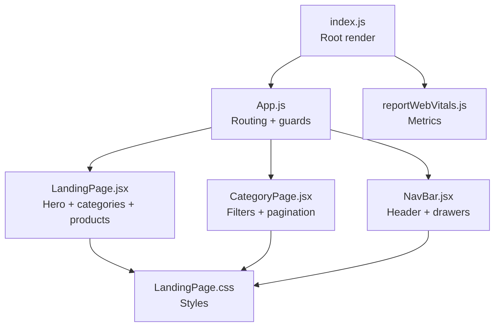
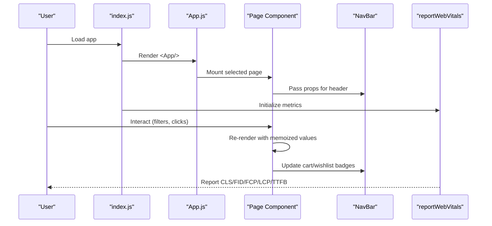
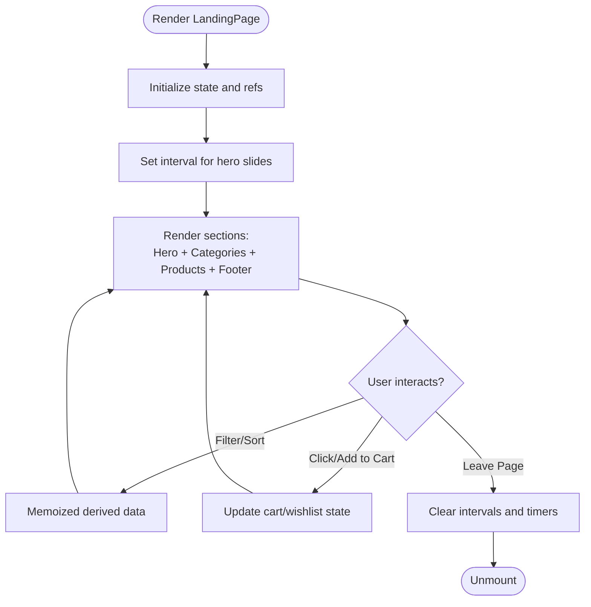
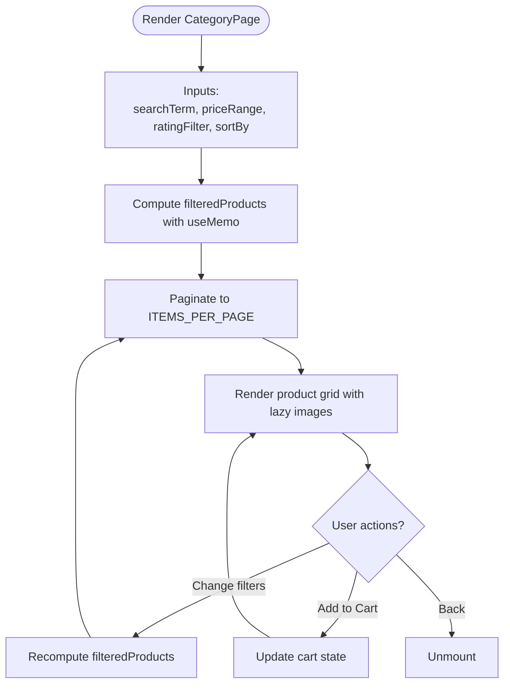
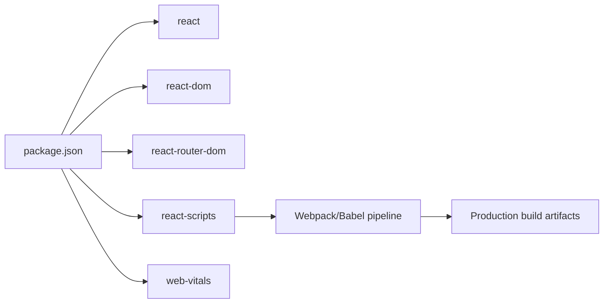

# Performance Optimization

<cite>
**Referenced Files in This Document**
- [App.js](file://src/App.js)
- [index.js](file://src/index.js)
- [reportWebVitals.js](file://src/reportWebVitals.js)
- [LandingPage.jsx](file://src/pages/LandingPage.jsx)
- [CategoryPage.jsx](file://src/components/CategoryPage.jsx)
- [NavBar.jsx](file://src/components/NavBar.jsx)
- [LandingPage.css](file://src/pages/LandingPage.css)
- [index.css](file://src/index.css)
- [package.json](file://package.json)
- [README.md](file://README.md)
</cite>

## Table of Contents
1. [Introduction](#introduction)
2. [Project Structure](#project-structure)
3. [Core Components](#core-components)
4. [Architecture Overview](#architecture-overview)
5. [Detailed Component Analysis](#detailed-component-analysis)
6. [Dependency Analysis](#dependency-analysis)
7. [Performance Considerations](#performance-considerations)
8. [Troubleshooting Guide](#troubleshooting-guide)
9. [Conclusion](#conclusion)
10. [Appendices](#appendices)

## Introduction
This document provides a comprehensive guide to performance optimization for the Lumière e-commerce client. It focuses on bundle analysis and optimization, lazy loading strategies for components and routes, image optimization, memory management, React performance techniques (hooks and memoization), build-time optimizations, monitoring and profiling, and user experience enhancements. The guidance is grounded in the current codebase and aims to help maintain fast, responsive, and scalable performance as the application evolves.

## Project Structure
The client is a Create React App project with a small set of pages and shared components. Key areas for performance work include:
- Routing and navigation
- Product listing and filtering
- Image loading and fallbacks
- CSS delivery and rendering
- Build pipeline and metrics collection

**Diagram sources**
- [index.js:1-18](file://src/index.js#L1-L18)
- [App.js:18-85](file://src/App.js#L18-L85)
- [LandingPage.jsx:147-405](file://src/pages/LandingPage.jsx#L147-L405)
- [CategoryPage.jsx:100-328](file://src/components/CategoryPage.jsx#L100-L328)
- [NavBar.jsx:30-177](file://src/components/NavBar.jsx#L30-L177)
- [LandingPage.css:1-800](file://src/pages/LandingPage.css#L1-L800)
- [reportWebVitals.js:1-14](file://src/reportWebVitals.js#L1-L14)

**Section sources**
- [index.js:1-18](file://src/index.js#L1-L18)
- [App.js:18-85](file://src/App.js#L18-L85)
- [LandingPage.jsx:147-405](file://src/pages/LandingPage.jsx#L147-L405)
- [CategoryPage.jsx:100-328](file://src/components/CategoryPage.jsx#L100-L328)
- [NavBar.jsx:30-177](file://src/components/NavBar.jsx#L30-L177)
- [LandingPage.css:1-800](file://src/pages/LandingPage.css#L1-L800)
- [reportWebVitals.js:1-14](file://src/reportWebVitals.js#L1-L14)

## Core Components
- App routing and private route guard: Centralizes navigation and access control.
- LandingPage: Hero carousel, trust badges, categories, featured products, newsletter, testimonials, footer.
- CategoryPage: Filtering, sorting, pagination, and product grid with lazy images and fallbacks.
- NavBar: Header actions, cart drawer, wishlist drawer, search modal, and user controls.

Key performance levers:
- Route-level code splitting for heavy pages
- Memoized computations for filters/sorting
- Lazy loading for images and fallbacks
- CSS-in-JS alternatives or scoped styles to reduce paint costs

**Section sources**
- [App.js:18-85](file://src/App.js#L18-L85)
- [LandingPage.jsx:57-405](file://src/pages/LandingPage.jsx#L57-L405)
- [CategoryPage.jsx:10-328](file://src/components/CategoryPage.jsx#L10-L328)
- [NavBar.jsx:7-177](file://src/components/NavBar.jsx#L7-L177)

## Architecture Overview
The runtime performance architecture centers on:
- React rendering and state updates
- Image loading strategies
- CSS delivery and layout stability
- Metrics collection via web-vitals

**Diagram sources**
- [index.js:7-18](file://src/index.js#L7-L18)
- [App.js:18-85](file://src/App.js#L18-L85)
- [LandingPage.jsx:147-405](file://src/pages/LandingPage.jsx#L147-L405)
- [CategoryPage.jsx:100-328](file://src/components/CategoryPage.jsx#L100-L328)
- [NavBar.jsx:30-177](file://src/components/NavBar.jsx#L30-L177)
- [reportWebVitals.js:1-14](file://src/reportWebVitals.js#L1-L14)

## Detailed Component Analysis

### Route-Level Code Splitting Strategy
Current state:
- Routes are statically imported and rendered directly.

Recommended approach:
- Dynamically import page components to split bundles by route.
- Keep shared components (e.g., NavBar) in a common chunk or lazy-load selectively.

Implementation pattern:
- Replace static imports with dynamic imports for heavy pages (e.g., category pages).
- Optionally wrap with Suspense boundaries at the router level.

Benefits:
- Reduces initial bundle size
- Delays loading of non-critical code until needed

**Section sources**
- [App.js:3-11](file://src/App.js#L3-L11)
- [App.js:38-78](file://src/App.js#L38-L78)

### LandingPage Performance Analysis
Highlights:
- Hero carousel with auto-rotation and manual control
- Large product grid with multiple images per card
- Newsletter subscription and testimonials sections
- Sticky header and drawers for cart/wishlist/search

Performance opportunities:
- Memoize derived data (e.g., filtered products) to avoid re-computation on renders
- Lazy load hero images and product images
- Debounce or throttle auto-advance intervals
- Minimize reflows by avoiding forced synchronous layouts

**Diagram sources**
- [LandingPage.jsx:57-130](file://src/pages/LandingPage.jsx#L57-L130)
- [LandingPage.jsx:147-405](file://src/pages/LandingPage.jsx#L147-L405)

**Section sources**
- [LandingPage.jsx:57-130](file://src/pages/LandingPage.jsx#L57-L130)
- [LandingPage.jsx:147-405](file://src/pages/LandingPage.jsx#L147-L405)

### CategoryPage Performance Analysis
Highlights:
- Filtering by search term, price range, and rating
- Sorting by newest/price/rating
- Pagination with fixed items per page
- Lazy loading for product images with fallbacks

Performance opportunities:
- Use useMemo for filter/sort computation keyed by inputs
- Virtualize long lists if product counts grow
- Debounce search input to limit recomputation
- Preload images near viewport; defer others

**Diagram sources**
- [CategoryPage.jsx:66-91](file://src/components/CategoryPage.jsx#L66-L91)
- [CategoryPage.jsx:94-98](file://src/components/CategoryPage.jsx#L94-L98)
- [CategoryPage.jsx:228-244](file://src/components/CategoryPage.jsx#L228-L244)

**Section sources**
- [CategoryPage.jsx:66-91](file://src/components/CategoryPage.jsx#L66-L91)
- [CategoryPage.jsx:94-98](file://src/components/CategoryPage.jsx#L94-L98)
- [CategoryPage.jsx:228-244](file://src/components/CategoryPage.jsx#L228-L244)

### NavBar Performance Analysis
Highlights:
- Navigation links, cart/wishlist drawers, search modal
- Badge counters for cart and wishlist
- Event handlers for toggling overlays

Performance opportunities:
- Defer rendering of drawers until opened
- Avoid unnecessary prop drilling by using context for shared state
- Keep drawer animations lightweight

**Section sources**
- [NavBar.jsx:30-177](file://src/components/NavBar.jsx#L30-L177)

### CSS and Rendering Performance
Observations:
- Extensive CSS in a single stylesheet
- Sticky header and backdrop blur effects
- Hover transforms and transitions on cards and buttons

Recommendations:
- Extract critical CSS for above-the-fold content
- Use CSS custom properties sparingly to avoid cascade-heavy styles
- Prefer efficient selectors and avoid deep nesting
- Consider CSS modules or styled-components for scoped styles if needed

**Section sources**
- [LandingPage.css:1-800](file://src/pages/LandingPage.css#L1-L800)
- [index.css:1-14](file://src/index.css#L1-L14)

## Dependency Analysis
- React and React DOM: Core rendering engine
- React Router DOM: Client-side routing
- web-vitals: Performance metrics instrumentation
- react-scripts: Build pipeline and bundling

**Diagram sources**
- [package.json:5-14](file://package.json#L5-L14)

**Section sources**
- [package.json:5-14](file://package.json#L5-L14)

## Performance Considerations

### Bundle Analysis and Optimization
- Use Create React App’s built-in analyzer to inspect bundle composition.
- Identify large dependencies and split routes/components dynamically.
- Remove unused code and assets; leverage tree-shaking.

Practical steps:
- Run the analyzer script and review vendor vs. application bundles.
- Move heavy pages to separate chunks.
- Audit third-party fonts and assets.

**Section sources**
- [README.md:48-54](file://README.md#L48-L54)

### Lazy Loading Strategies
- Route-level lazy loading: Dynamically import page components.
- Component-level lazy loading: Use React.lazy for heavy subcomponents.
- Image lazy loading: Apply loading="lazy" and provide fallbacks.
- IntersectionObserver-based preloading for images near viewport.

Evidence in code:
- Images already use lazy loading and error fallbacks.
- Routes are currently static; introduce dynamic imports.

**Section sources**
- [LandingPage.jsx:264](file://src/pages/LandingPage.jsx#L264)
- [CategoryPage.jsx:235](file://src/components/CategoryPage.jsx#L235)
- [CategoryPage.jsx:236-240](file://src/components/CategoryPage.jsx#L236-L240)

### Image Optimization Approaches
- Use loading="lazy" for non-critical images.
- Provide fallback URLs when external image services fail.
- Consider responsive images and appropriate sizes for different breakpoints.
- Compress images and serve modern formats if possible.

**Section sources**
- [LandingPage.jsx:260-265](file://src/pages/LandingPage.jsx#L260-L265)
- [CategoryPage.jsx:231-240](file://src/components/CategoryPage.jsx#L231-L240)

### Memory Management Best Practices
- Clear intervals and timeouts on unmount to prevent leaks.
- Avoid retaining large arrays or objects in state unnecessarily.
- Use refs for DOM measurements only when needed.
- Normalize product data to avoid duplication across state slices.

**Section sources**
- [LandingPage.jsx:77-80](file://src/pages/LandingPage.jsx#L77-L80)

### React Performance Optimization (Hooks and Memoization)
- useMemo for expensive derived computations (filters, sorts).
- useCallback for event handlers passed down to children.
- Prefer shallow comparisons and stable references to reduce re-renders.
- Break large components into smaller ones with focused responsibilities.

Evidence in code:
- CategoryPage uses useMemo for filteredProducts.

**Section sources**
- [CategoryPage.jsx:66-91](file://src/components/CategoryPage.jsx#L66-L91)

### Build-Time Optimizations
- Production builds are minified and hashed by default.
- Ensure browserslist targets are appropriate for your audience.
- Consider enabling gzip/brotli compression on the server.

**Section sources**
- [README.md:24-28](file://README.md#L24-L28)
- [package.json:28-39](file://package.json#L28-L39)

### Performance Monitoring and Profiling
- web-vitals integration reports CLS, FID, FCP, LCP, TTFB.
- Use DevTools Performance panel to record interactions and identify bottlenecks.
- Monitor Largest Contentful Paint (LCP) and Cumulative Layout Shift (CLS).

**Section sources**
- [reportWebVitals.js:1-14](file://src/reportWebVitals.js#L1-L14)

### Caching Strategies for Product Data
- Client-side caching: Store product lists in memory with expiry or invalidation.
- Network caching: Use HTTP cache headers and service workers for static assets.
- Local storage: Persist minimal user preferences (e.g., filters) to improve subsequent loads.

[No sources needed since this section provides general guidance]

### User Experience Optimization
- Keep interactions responsive; defer non-essential work.
- Provide loading indicators for async operations.
- Ensure layout stability to minimize CLS.
- Optimize perceived performance with skeleton loaders and fast first paint.

[No sources needed since this section provides general guidance]

## Troubleshooting Guide

Common issues and remedies:
- Excessive re-renders: Introduce useMemo/useCallback; stabilize props.
- Heavy initial load: Enable route-level code splitting; defer non-critical resources.
- Poor image performance: Ensure lazy loading and fallbacks; compress assets.
- Memory leaks: Verify cleanup of intervals/timeouts; avoid closures capturing large objects.

**Section sources**
- [LandingPage.jsx:77-80](file://src/pages/LandingPage.jsx#L77-L80)
- [CategoryPage.jsx:66-91](file://src/components/CategoryPage.jsx#L66-L91)

## Conclusion
Optimizing Lumière’s client requires a combination of route-level code splitting, memoized computations, lazy loading, and build-time improvements. Instrumenting performance with web-vitals and profiling with DevTools ensures continuous improvement. By applying the strategies outlined here—bundle analysis, lazy loading, image optimization, memory hygiene, and React-specific techniques—you can deliver a fast, responsive shopping experience that scales with growth.

## Appendices

### Measuring Performance Impact
- Use web-vitals metrics to track changes after each optimization.
- Compare before/after LCP, CLS, and FID during feature releases.
- Track bundle size deltas to ensure optimizations reduce payload.

**Section sources**
- [reportWebVitals.js:1-14](file://src/reportWebVitals.js#L1-L14)