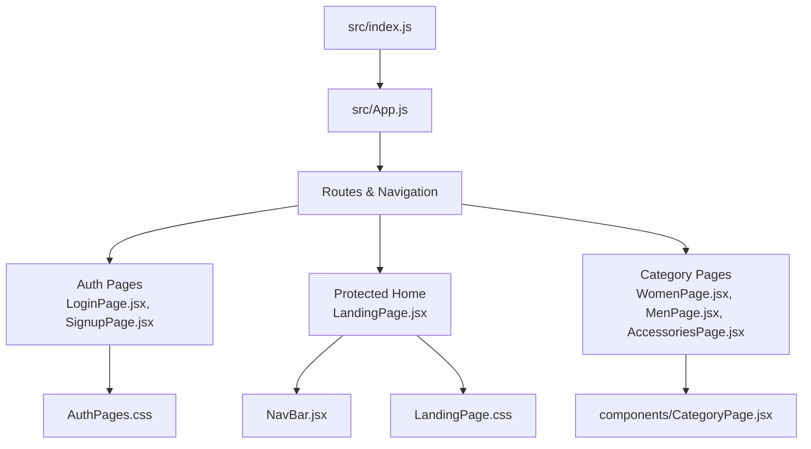
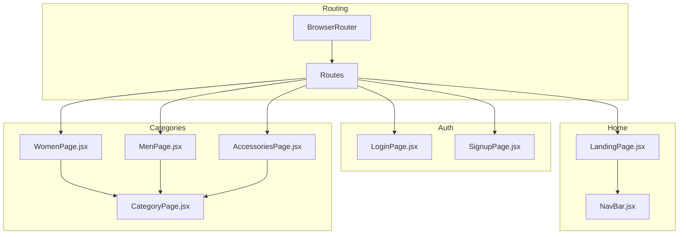
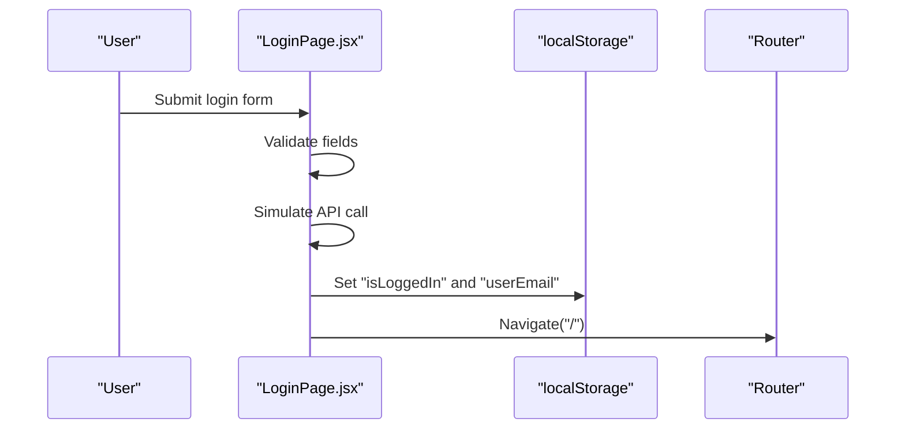
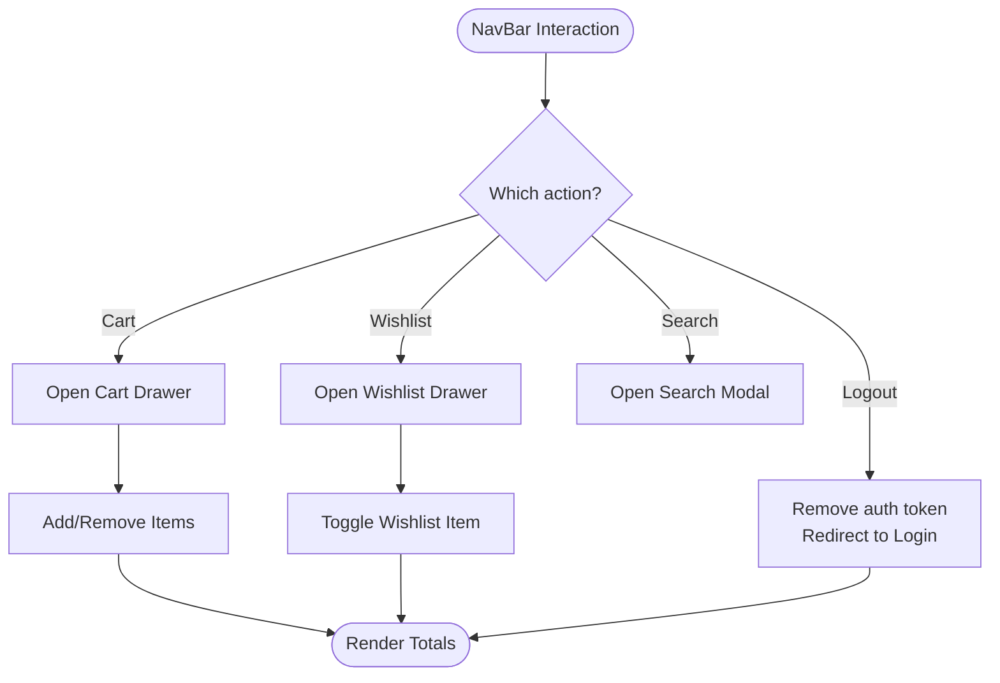
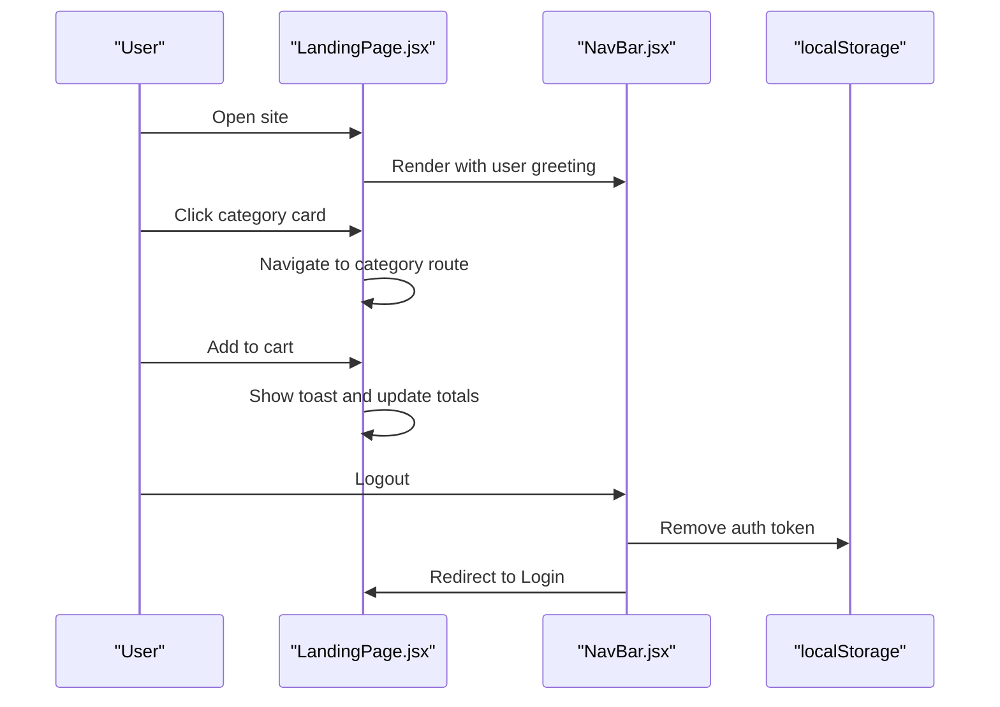
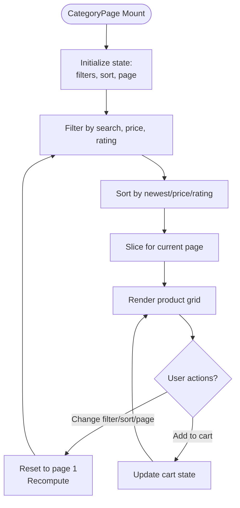
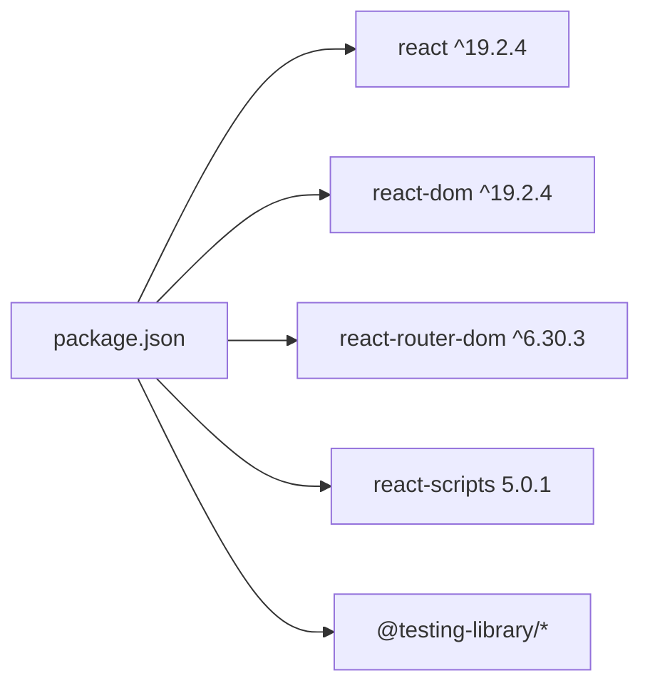

# Project Overview

<cite>
**Referenced Files in This Document**
- [README.md](file://README.md)
- [package.json](file://package.json)
- [src/index.js](file://src/index.js)
- [src/App.js](file://src/App.js)
- [src/components/NavBar.jsx](file://src/components/NavBar.jsx)
- [src/components/CategoryPage.jsx](file://src/components/CategoryPage.jsx)
- [src/pages/LandingPage.jsx](file://src/pages/LandingPage.jsx)
- [src/pages/LandingPage.css](file://src/pages/LandingPage.css)
- [src/pages/AuthPages.css](file://src/pages/AuthPages.css)
- [src/pages/LoginPage.jsx](file://src/pages/LoginPage.jsx)
- [src/pages/SignupPage.jsx](file://src/pages/SignupPage.jsx)
- [src/pages/WomenPage.jsx](file://src/pages/WomenPage.jsx)
- [src/pages/MenPage.jsx](file://src/pages/MenPage.jsx)
- [src/pages/AccessoriesPage.jsx](file://src/pages/AccessoriesPage.jsx)
</cite>

## Table of Contents
1. [Introduction](#introduction)
2. [Project Structure](#project-structure)
3. [Core Components](#core-components)
4. [Architecture Overview](#architecture-overview)
5. [Detailed Component Analysis](#detailed-component-analysis)
6. [Dependency Analysis](#dependency-analysis)
7. [Performance Considerations](#performance-considerations)
8. [Troubleshooting Guide](#troubleshooting-guide)
9. [Conclusion](#conclusion)

## Introduction
Lumière is a luxury fashion e-commerce client designed to delight modern Indian consumers with a premium shopping experience. It emphasizes elegant visuals, intuitive navigation, and a streamlined checkout funnel, while leveraging React 19.2.4 for a fast, responsive interface. The platform targets aspirational shoppers who value quality, style, and convenience, offering curated collections across women’s wear, men’s style, accessories, footwear, jewellery, beauty, and sale items.

Key positioning:
- Luxury-first aesthetic with a focus on craftsmanship and design.
- Modern Indian consumer preferences: curated categories, trust signals, and localized delivery promises.
- Progressive web app capabilities via Create React App toolchain.

## Project Structure
The project follows a feature-based layout under src/, separating pages, components, and shared assets. Routing is handled by react-router-dom, and styling is primarily CSS with global variables and media queries for responsiveness.

**Diagram sources**
- [src/index.js:1-18](file://src/index.js#L1-L18)
- [src/App.js:1-85](file://src/App.js#L1-L85)
- [src/pages/LoginPage.jsx:1-151](file://src/pages/LoginPage.jsx#L1-L151)
- [src/pages/SignupPage.jsx:1-158](file://src/pages/SignupPage.jsx#L1-L158)
- [src/pages/LandingPage.jsx:1-405](file://src/pages/LandingPage.jsx#L1-L405)
- [src/components/NavBar.jsx:1-177](file://src/components/NavBar.jsx#L1-L177)
- [src/components/CategoryPage.jsx:1-328](file://src/components/CategoryPage.jsx#L1-L328)
- [src/pages/LandingPage.css:1-800](file://src/pages/LandingPage.css#L1-L800)
- [src/pages/AuthPages.css:1-277](file://src/pages/AuthPages.css#L1-L277)

**Section sources**
- [README.md:1-71](file://README.md#L1-L71)
- [package.json:1-41](file://package.json#L1-L41)
- [src/index.js:1-18](file://src/index.js#L1-L18)
- [src/App.js:1-85](file://src/App.js#L1-L85)

## Core Components
- Authentication system: Login and signup flows with client-side validation and session persistence via localStorage. Protected routes ensure only authenticated users can access the home and category pages.
- Navigation and cart: A sticky navbar with cart drawer, wishlist drawer, search modal, and user greeting. Cart and wishlist are local state-driven for prototyping.
- Landing page: Hero carousel, trust badges, category cards, featured products, testimonials, newsletter subscription, and footer.
- Category pages: Reusable CategoryPage component with search, sorting, filtering, pagination, and product grid rendering.

Practical examples:
- On the landing page, users can browse categories, add items to cart, and receive toast notifications.
- Category pages support price range sliders, rating filters, and sorting to refine product discovery.
- Authentication guards redirect unauthenticated users to the login/signup flow.

**Section sources**
- [src/App.js:12-82](file://src/App.js#L12-L82)
- [src/pages/LoginPage.jsx:5-42](file://src/pages/LoginPage.jsx#L5-L42)
- [src/pages/SignupPage.jsx:5-44](file://src/pages/SignupPage.jsx#L5-L44)
- [src/components/NavBar.jsx:7-177](file://src/components/NavBar.jsx#L7-L177)
- [src/pages/LandingPage.jsx:57-135](file://src/pages/LandingPage.jsx#L57-L135)
- [src/components/CategoryPage.jsx:10-98](file://src/components/CategoryPage.jsx#L10-L98)

## Architecture Overview
The application is a single-page application (SPA) structured around:
- Router: BrowserRouter with protected/private routes.
- Pages: Feature-specific views for auth, landing, and categories.
- Components: Shared UI elements like NavBar and reusable CategoryPage.
- State: Local React state for UI toggles, cart, wishlist, and filters; localStorage for session persistence.

**Diagram sources**
- [src/App.js:18-82](file://src/App.js#L18-L82)
- [src/pages/LoginPage.jsx:1-151](file://src/pages/LoginPage.jsx#L1-L151)
- [src/pages/SignupPage.jsx:1-158](file://src/pages/SignupPage.jsx#L1-L158)
- [src/pages/LandingPage.jsx:1-405](file://src/pages/LandingPage.jsx#L1-L405)
- [src/components/NavBar.jsx:1-177](file://src/components/NavBar.jsx#L1-L177)
- [src/pages/WomenPage.jsx:1-29](file://src/pages/WomenPage.jsx#L1-L29)
- [src/pages/MenPage.jsx:1-29](file://src/pages/MenPage.jsx#L1-L29)
- [src/pages/AccessoriesPage.jsx:1-29](file://src/pages/AccessoriesPage.jsx#L1-L29)
- [src/components/CategoryPage.jsx:1-328](file://src/components/CategoryPage.jsx#L1-L328)

## Detailed Component Analysis

### Authentication System
- LoginPage: Validates email format and password length, simulates an async login with a timeout, and persists authentication state in localStorage.
- SignupPage: Validates name, email, phone, and password confirmation, then stores user identity in localStorage.
- PrivateRoute: Guards protected routes by checking a localStorage flag; redirects to login otherwise.

**Diagram sources**
- [src/pages/LoginPage.jsx:25-42](file://src/pages/LoginPage.jsx#L25-L42)
- [src/App.js:13-16](file://src/App.js#L13-L16)

**Section sources**
- [src/pages/LoginPage.jsx:1-151](file://src/pages/LoginPage.jsx#L1-L151)
- [src/pages/SignupPage.jsx:1-158](file://src/pages/SignupPage.jsx#L1-L158)
- [src/App.js:12-16](file://src/App.js#L12-L16)

### Navigation and Cart
- NavBar: Provides logo, category links, cart/wishlist drawers, search modal, and logout. Draws from shared styles and passes callbacks to parent pages.
- Cart and Wishlist: Controlled via open/close overlays and local state; supports item removal and total computation.

**Diagram sources**
- [src/components/NavBar.jsx:43-177](file://src/components/NavBar.jsx#L43-L177)
- [src/pages/LandingPage.jsx:113-130](file://src/pages/LandingPage.jsx#L113-L130)

**Section sources**
- [src/components/NavBar.jsx:1-177](file://src/components/NavBar.jsx#L1-L177)
- [src/pages/LandingPage.jsx:57-135](file://src/pages/LandingPage.jsx#L57-L135)

### Landing Page
- Features: Hero carousel with auto-rotation, trust badges, category grid, trending products, banner, press logos, testimonials, newsletter subscription, and footer.
- Interactions: Toast notifications, category routing, cart updates, and logout.

**Diagram sources**
- [src/pages/LandingPage.jsx:57-135](file://src/pages/LandingPage.jsx#L57-L135)
- [src/components/NavBar.jsx:73-177](file://src/components/NavBar.jsx#L73-L177)
- [src/App.js:129-129](file://src/App.js#L129-L129)

**Section sources**
- [src/pages/LandingPage.jsx:1-405](file://src/pages/LandingPage.jsx#L1-L405)
- [src/pages/LandingPage.css:1-800](file://src/pages/LandingPage.css#L1-L800)

### Category Pages and Filtering
- CategoryPage: Centralized logic for search, sorting, price/rating filters, pagination, and product rendering. Reused by WomenPage, MenPage, and AccessoriesPage.
- Filtering and Sorting: Memoized computation for performance; pagination divides large result sets.

**Diagram sources**
- [src/components/CategoryPage.jsx:66-98](file://src/components/CategoryPage.jsx#L66-L98)
- [src/pages/WomenPage.jsx:26-28](file://src/pages/WomenPage.jsx#L26-L28)
- [src/pages/MenPage.jsx:26-28](file://src/pages/MenPage.jsx#L26-L28)
- [src/pages/AccessoriesPage.jsx:26-28](file://src/pages/AccessoriesPage.jsx#L26-L28)

**Section sources**
- [src/components/CategoryPage.jsx:1-328](file://src/components/CategoryPage.jsx#L1-L328)
- [src/pages/WomenPage.jsx:1-29](file://src/pages/WomenPage.jsx#L1-L29)
- [src/pages/MenPage.jsx:1-29](file://src/pages/MenPage.jsx#L1-L29)
- [src/pages/AccessoriesPage.jsx:1-29](file://src/pages/AccessoriesPage.jsx#L1-L29)

## Dependency Analysis
- Core runtime: React 19.2.4, ReactDOM 19.2.4.
- Routing: react-router-dom 6.x for SPA navigation and guards.
- Tooling: react-scripts 5.0.1 (Create React App), testing libraries for unit and DOM testing.

**Diagram sources**
- [package.json:5-14](file://package.json#L5-L14)

**Section sources**
- [package.json:1-41](file://package.json#L1-L41)

## Performance Considerations
- Rendering optimization: CategoryPage uses useMemo to avoid unnecessary recomputation of filtered/sorted lists during search/filter/sort operations.
- Pagination: Limits rendered items per page to reduce DOM size and improve scrolling performance.
- Lazy loading images: Uses lazy loading attributes on product images to defer offscreen resources.
- Local storage usage: Keeps cart and wishlist in memory for immediate feedback; consider persisting to IndexedDB or server for production continuity.

[No sources needed since this section provides general guidance]

## Troubleshooting Guide
Common issues and resolutions:
- Authentication failures: Ensure localStorage contains the expected keys after login/signup. Verify form validation messages and network simulation timing.
- Protected route redirects: Confirm the presence of the authentication flag in localStorage; missing tokens redirect to login.
- Cart/Wishlist state resets: Since state is local, refreshing the page clears cart/wishlist. Persist to a backend or service worker for continuity.
- Styling inconsistencies: Verify CSS variable usage and media queries for responsive breakpoints.

**Section sources**
- [src/pages/LoginPage.jsx:12-42](file://src/pages/LoginPage.jsx#L12-L42)
- [src/pages/SignupPage.jsx:17-44](file://src/pages/SignupPage.jsx#L17-L44)
- [src/App.js:13-16](file://src/App.js#L13-L16)
- [src/pages/LandingPage.css:1-800](file://src/pages/LandingPage.css#L1-L800)

## Conclusion
Lumière presents a polished, responsive e-commerce client tailored to modern Indian luxury fashion consumers. Its architecture centers on clean separation of concerns, reusable components, and a strong focus on UX through animations, trust signals, and intuitive navigation. The authentication system and category filtering provide a solid foundation for growth, while the styling establishes a cohesive brand identity. Future enhancements could include server-side state synchronization, advanced search, and richer analytics.