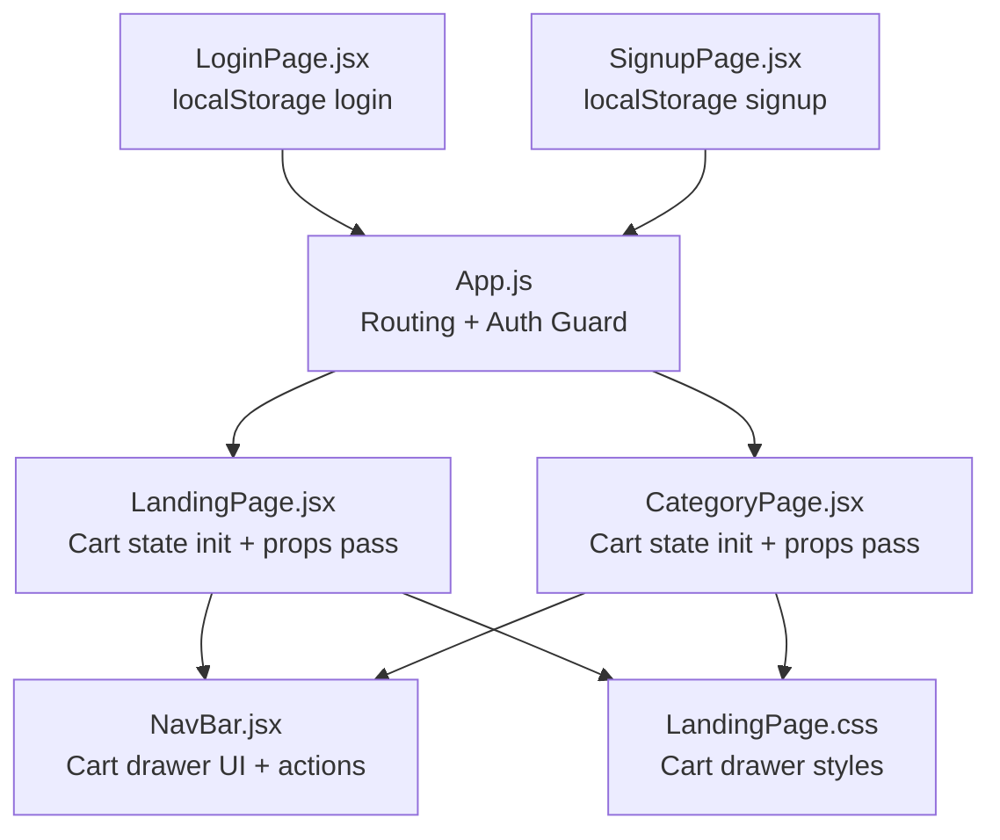
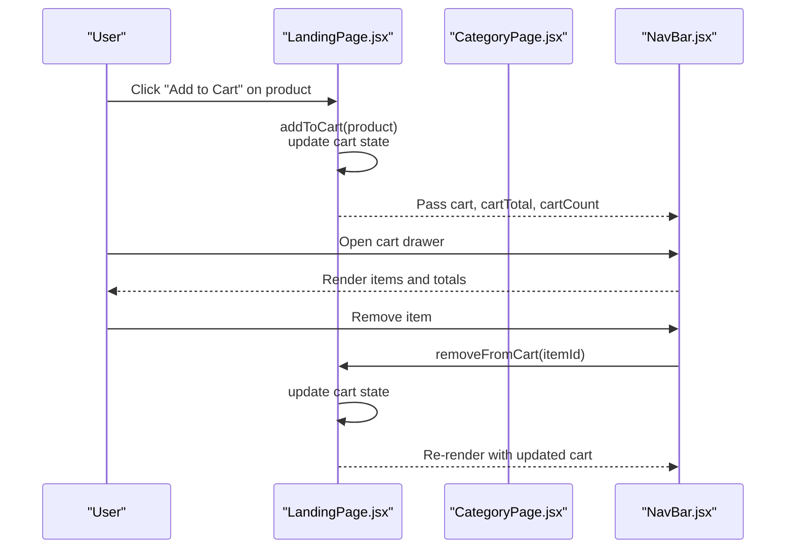
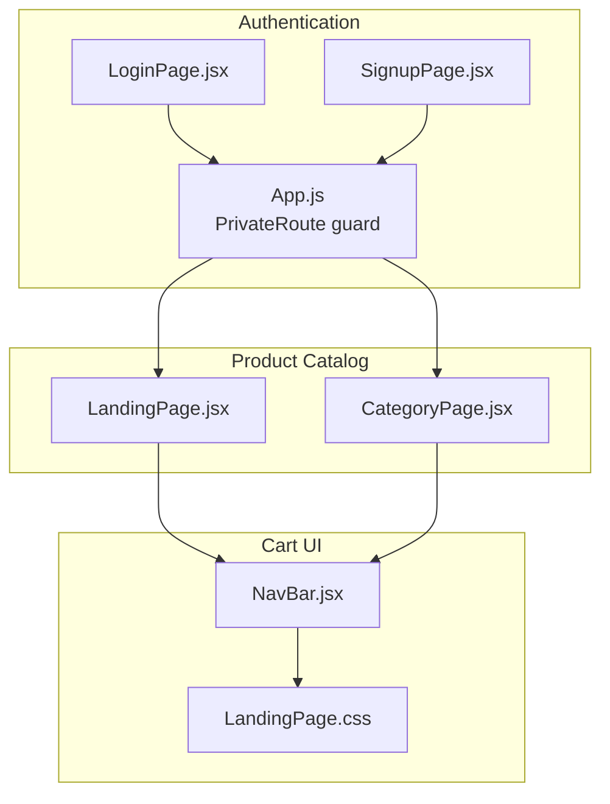
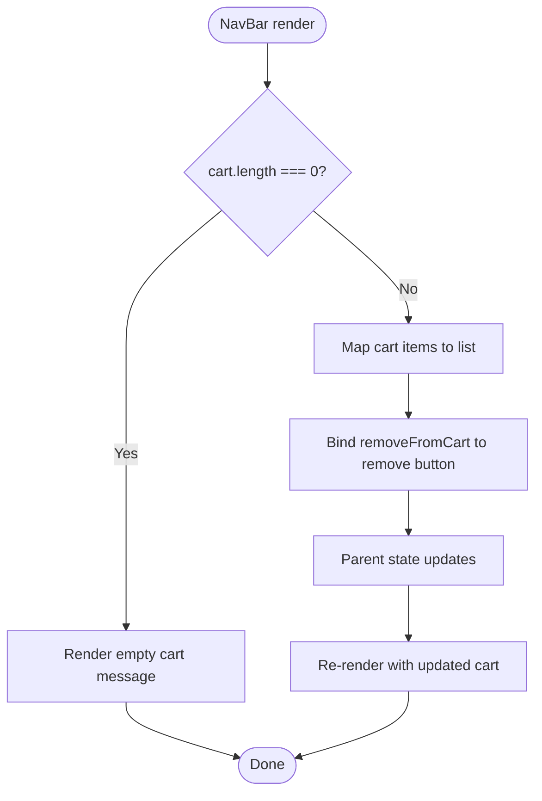
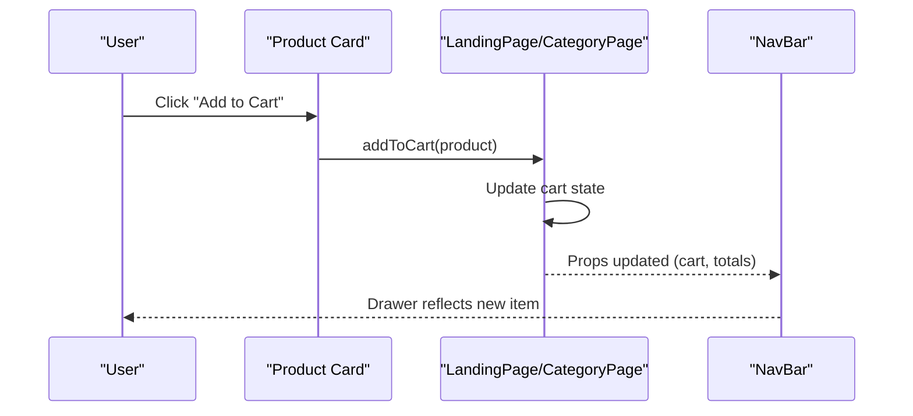
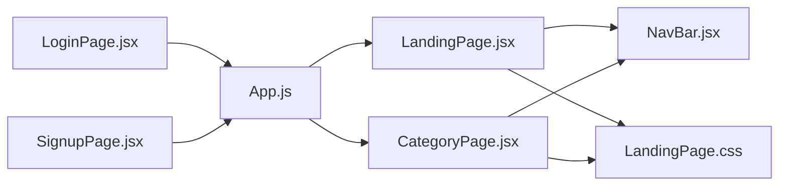

# Shopping Cart Management

<cite>
**Referenced Files in This Document**
- [App.js](file://src/App.js)
- [NavBar.jsx](file://src/components/NavBar.jsx)
- [LandingPage.jsx](file://src/pages/LandingPage.jsx)
- [CategoryPage.jsx](file://src/components/CategoryPage.jsx)
- [LoginPage.jsx](file://src/pages/LoginPage.jsx)
- [SignupPage.jsx](file://src/pages/SignupPage.jsx)
- [LandingPage.css](file://src/pages/LandingPage.css)
</cite>

## Table of Contents
1. [Introduction](#introduction)
2. [Project Structure](#project-structure)
3. [Core Components](#core-components)
4. [Architecture Overview](#architecture-overview)
5. [Detailed Component Analysis](#detailed-component-analysis)
6. [Dependency Analysis](#dependency-analysis)
7. [Performance Considerations](#performance-considerations)
8. [Troubleshooting Guide](#troubleshooting-guide)
9. [Conclusion](#conclusion)

## Introduction
This document explains the shopping cart management system implemented in the client application. It covers how cart state is managed with React hooks, how the cart drawer renders and manipulates items, how quantities are adjusted, and how cart data is synchronized across components. It also documents the current cart persistence strategy, the cart item data structure, and the relationship between cart management and product listing components. Finally, it provides troubleshooting guidance for common cart state issues and best practices for cart data management.

## Project Structure
The cart functionality spans several components:
- App routing enforces authentication via localStorage.
- LandingPage initializes and manages cart state, and passes it down to NavBar.
- CategoryPage also initializes and manages cart state independently for category views.
- NavBar renders the cart drawer, displays totals, and triggers removal actions.
- LoginPage and SignupPage manage user session persistence via localStorage.

**Diagram sources**
- [App.js:18-85](file://src/App.js#L18-L85)
- [LandingPage.jsx:57-175](file://src/pages/LandingPage.jsx#L57-L175)
- [CategoryPage.jsx:10-127](file://src/components/CategoryPage.jsx#L10-L127)
- [NavBar.jsx:30-177](file://src/components/NavBar.jsx#L30-L177)
- [LandingPage.css:197-306](file://src/pages/LandingPage.css#L197-L306)
- [LoginPage.jsx:25-42](file://src/pages/LoginPage.jsx#L25-L42)
- [SignupPage.jsx:32-44](file://src/pages/SignupPage.jsx#L32-L44)

**Section sources**
- [App.js:18-85](file://src/App.js#L18-L85)
- [LandingPage.jsx:57-175](file://src/pages/LandingPage.jsx#L57-L175)
- [CategoryPage.jsx:10-127](file://src/components/CategoryPage.jsx#L10-L127)
- [NavBar.jsx:30-177](file://src/components/NavBar.jsx#L30-L177)
- [LandingPage.css:197-306](file://src/pages/LandingPage.css#L197-L306)
- [LoginPage.jsx:25-42](file://src/pages/LoginPage.jsx#L25-L42)
- [SignupPage.jsx:32-44](file://src/pages/SignupPage.jsx#L32-L44)

## Core Components
- Cart state initialization and updates occur in LandingPage and CategoryPage using React’s useState. These components compute cartTotal and cartCount and pass them to NavBar.
- NavBar renders the cart drawer UI, shows item counts and totals, and invokes removeFromCart to remove items.
- Product listing pages (LandingPage and CategoryPage) expose “Add to Cart” actions that increment item quantities or add new items.

Key responsibilities:
- State initialization: LandingPage and CategoryPage initialize cart, wishlist, and UI flags.
- Item manipulation: addToCart increments quantity; removeFromCart deletes an item by id.
- Totals calculation: cartTotal and cartCount computed via reduce on the cart array.
- UI synchronization: cartCount badge and cartTotal are passed as props to NavBar.

**Section sources**
- [LandingPage.jsx:62-125](file://src/pages/LandingPage.jsx#L62-L125)
- [CategoryPage.jsx:15-58](file://src/components/CategoryPage.jsx#L15-L58)
- [NavBar.jsx:69-118](file://src/components/NavBar.jsx#L69-L118)

## Architecture Overview
The cart architecture follows a unidirectional data flow:
- Parent components (LandingPage and CategoryPage) own cart state and derive derived values (totals).
- NavBar receives cart state and derived values as props and renders the cart drawer UI.
- Product cards trigger addToCart and removeFromCart actions, updating parent state.

**Diagram sources**
- [LandingPage.jsx:113-125](file://src/pages/LandingPage.jsx#L113-L125)
- [CategoryPage.jsx:47-58](file://src/components/CategoryPage.jsx#L47-L58)
- [NavBar.jsx:80-118](file://src/components/NavBar.jsx#L80-L118)

## Detailed Component Analysis

### Cart State Initialization and Propagation
- LandingPage initializes cart, wishlist, and UI flags; computes cartTotal and cartCount; passes them to NavBar.
- CategoryPage mirrors this pattern for category-specific views.

Implementation highlights:
- State declarations and setters are defined in LandingPage and CategoryPage.
- Derived totals are computed inline and passed as props to NavBar.

**Section sources**
- [LandingPage.jsx:62-125](file://src/pages/LandingPage.jsx#L62-L125)
- [CategoryPage.jsx:15-58](file://src/components/CategoryPage.jsx#L15-L58)

### Cart Drawer UI and Interaction
- NavBar renders the cart overlay and drawer, displaying item count and total.
- When cart is empty, it shows a friendly message; otherwise, it lists items and allows removal.
- The drawer is controlled by cartOpen prop and toggled via button clicks.

UI behavior:
- Cart badge reflects cartCount.
- Total is formatted via formatPrice.
- Proceed to Checkout currently shows a toast message.

**Section sources**
- [NavBar.jsx:69-118](file://src/components/NavBar.jsx#L69-L118)
- [LandingPage.css:197-306](file://src/pages/LandingPage.css#L197-L306)

### Item Addition and Removal Logic
- addToCart:
  - Checks if an item with the same id exists.
  - If present, increments the existing item’s qty.
  - Otherwise, adds a new item with qty initialized to 1.
- removeFromCart:
  - Filters the cart to exclude the item with the given id.

Quantity adjustment mechanism:
- Quantity is stored per item in the cart array.
- Increment/decrement occurs in-place via mapping/filtering.

**Section sources**
- [LandingPage.jsx:113-120](file://src/pages/LandingPage.jsx#L113-L120)
- [CategoryPage.jsx:47-56](file://src/components/CategoryPage.jsx#L47-L56)

### Cart Totals Calculation
- cartTotal: sum of (price × qty) for all items.
- cartCount: sum of qty for all items.

These are computed in the parent components and passed down to NavBar for display.

**Section sources**
- [LandingPage.jsx:123-124](file://src/pages/LandingPage.jsx#L123-L124)
- [CategoryPage.jsx:57-58](file://src/components/CategoryPage.jsx#L57-L58)

### Cart Persistence Strategy
- Current implementation: cart state is local to LandingPage and CategoryPage and does not persist across page reloads or navigation.
- Recommended approach: Persist cart to localStorage keyed by user identifier (e.g., userEmail or userName) and hydrate on app load.

Integration points:
- Hydration: On app mount, read persisted cart from localStorage and set initial state.
- Sync: On addToCart/removeFromCart, update localStorage accordingly.

[No sources needed since this section provides general guidance]

### Cart Item Data Structure
- Each cart item is an object containing at minimum:
  - id: product identifier
  - name: product name
  - price: product price
  - qty: quantity in cart

This structure supports per-item quantity and total computation.

**Section sources**
- [LandingPage.jsx:113-120](file://src/pages/LandingPage.jsx#L113-L120)
- [CategoryPage.jsx:47-56](file://src/components/CategoryPage.jsx#L47-L56)

### State Synchronization Between Components
- LandingPage and CategoryPage maintain separate cart instances.
- To synchronize across views, lift cart state to a shared ancestor or a central context/store.
- Alternatively, persist cart to localStorage and hydrate in each view.

**Section sources**
- [LandingPage.jsx:62-125](file://src/pages/LandingPage.jsx#L62-L125)
- [CategoryPage.jsx:15-58](file://src/components/CategoryPage.jsx#L15-L58)

### Relationship Between Cart and Product Listing
- Product cards in LandingPage and CategoryPage call addToCart when the user adds an item.
- The cart drawer in NavBar reflects these changes immediately.

**Section sources**
- [LandingPage.jsx:274-276](file://src/pages/LandingPage.jsx#L274-L276)
- [CategoryPage.jsx:243](file://src/components/CategoryPage.jsx#L243)
- [NavBar.jsx:96-105](file://src/components/NavBar.jsx#L96-L105)

### Checkout Simulation Features
- Proceed to Checkout button in the cart drawer currently triggers a toast notification indicating future availability.
- No backend integration is implemented; checkout remains a UI simulation.

**Section sources**
- [NavBar.jsx:112-114](file://src/components/NavBar.jsx#L112-L114)

### User Session Persistence
- Authentication state is persisted in localStorage during login/signup.
- App.js enforces a private route guard using localStorage to protect landing and category pages.

**Section sources**
- [LoginPage.jsx:34-36](file://src/pages/LoginPage.jsx#L34-L36)
- [SignupPage.jsx:39-42](file://src/pages/SignupPage.jsx#L39-L42)
- [App.js:13-16](file://src/App.js#L13-L16)

## Architecture Overview

**Diagram sources**
- [App.js:18-85](file://src/App.js#L18-L85)
- [LoginPage.jsx:25-42](file://src/pages/LoginPage.jsx#L25-L42)
- [SignupPage.jsx:32-44](file://src/pages/SignupPage.jsx#L32-L44)
- [LandingPage.jsx:57-175](file://src/pages/LandingPage.jsx#L57-L175)
- [CategoryPage.jsx:10-127](file://src/components/CategoryPage.jsx#L10-L127)
- [NavBar.jsx:30-177](file://src/components/NavBar.jsx#L30-L177)
- [LandingPage.css:197-306](file://src/pages/LandingPage.css#L197-L306)

## Detailed Component Analysis

### Cart Drawer Component (NavBar)
- Renders cart overlay and drawer.
- Displays item count badge and total.
- Lists items and allows removal via removeFromCart.
- Uses formatPrice for currency display.

**Diagram sources**
- [NavBar.jsx:80-118](file://src/components/NavBar.jsx#L80-L118)
- [LandingPage.jsx:113-125](file://src/pages/LandingPage.jsx#L113-L125)

**Section sources**
- [NavBar.jsx:69-118](file://src/components/NavBar.jsx#L69-L118)
- [LandingPage.css:197-306](file://src/pages/LandingPage.css#L197-L306)

### Product Add to Cart Flow
- Product card triggers addToCart with product data.
- addToCart updates cart state and shows a toast.

**Diagram sources**
- [LandingPage.jsx:113-120](file://src/pages/LandingPage.jsx#L113-L120)
- [CategoryPage.jsx:47-56](file://src/components/CategoryPage.jsx#L47-L56)
- [NavBar.jsx:96-105](file://src/components/NavBar.jsx#L96-L105)

**Section sources**
- [LandingPage.jsx:274-276](file://src/pages/LandingPage.jsx#L274-L276)
- [CategoryPage.jsx:243](file://src/components/CategoryPage.jsx#L243)
- [LandingPage.jsx:113-120](file://src/pages/LandingPage.jsx#L113-L120)
- [CategoryPage.jsx:47-56](file://src/components/CategoryPage.jsx#L47-L56)

### Example: Cart State Handling in NavBar
- Cart props received by NavBar include cart, cartTotal, cartCount, and removeFromCart.
- The cart drawer uses these props to render itemized totals and counts.

Concrete references:
- Cart props passed: [LandingPage.jsx:160-166](file://src/pages/LandingPage.jsx#L160-L166), [CategoryPage.jsx:112-118](file://src/components/CategoryPage.jsx#L112-L118)
- Drawer rendering and totals: [NavBar.jsx:80-118](file://src/components/NavBar.jsx#L80-L118)

**Section sources**
- [LandingPage.jsx:160-166](file://src/pages/LandingPage.jsx#L160-L166)
- [CategoryPage.jsx:112-118](file://src/components/CategoryPage.jsx#L112-L118)
- [NavBar.jsx:80-118](file://src/components/NavBar.jsx#L80-L118)

## Dependency Analysis

**Diagram sources**
- [LandingPage.jsx:152-175](file://src/pages/LandingPage.jsx#L152-L175)
- [CategoryPage.jsx:104-127](file://src/components/CategoryPage.jsx#L104-L127)
- [NavBar.jsx:30-177](file://src/components/NavBar.jsx#L30-L177)
- [LandingPage.css:197-306](file://src/pages/LandingPage.css#L197-L306)
- [LoginPage.jsx:25-42](file://src/pages/LoginPage.jsx#L25-L42)
- [SignupPage.jsx:32-44](file://src/pages/SignupPage.jsx#L32-L44)
- [App.js:18-85](file://src/App.js#L18-L85)

**Section sources**
- [LandingPage.jsx:152-175](file://src/pages/LandingPage.jsx#L152-L175)
- [CategoryPage.jsx:104-127](file://src/components/CategoryPage.jsx#L104-L127)
- [NavBar.jsx:30-177](file://src/components/NavBar.jsx#L30-L177)
- [LandingPage.css:197-306](file://src/pages/LandingPage.css#L197-L306)
- [LoginPage.jsx:25-42](file://src/pages/LoginPage.jsx#L25-L42)
- [SignupPage.jsx:32-44](file://src/pages/SignupPage.jsx#L32-L44)
- [App.js:18-85](file://src/App.js#L18-L85)

## Performance Considerations
- Large cart contents:
  - Rendering N items in the cart drawer is O(N). Consider virtualization or pagination for very large carts.
  - Totals computation is O(N). Memoize totals if the cart grows large.
- Re-renders:
  - Passing cart arrays as props can cause re-renders. Consider splitting cart items into a separate memoized selector or using a lightweight cart store.
- Image loading:
  - Product images are loaded lazily; ensure similar optimization for cart thumbnails if added.

[No sources needed since this section provides general guidance]

## Troubleshooting Guide
Common issues and resolutions:
- Cart total not updating after removal:
  - Ensure removeFromCart returns a new array and that cartTotal is recomputed in the parent component.
  - Verify props are passed correctly to NavBar.
- Duplicate items not merging:
  - Confirm addToCart checks for existing item id and increments qty.
- Cart resets on refresh:
  - Implement localStorage persistence for cart keyed by user identity.
- Inconsistent state across views:
  - Lift cart state to a shared ancestor or a centralized store to avoid split ownership.
- Drawer not closing after action:
  - Ensure setCartOpen(false) is called appropriately after item removal or navigation.

**Section sources**
- [LandingPage.jsx:113-125](file://src/pages/LandingPage.jsx#L113-L125)
- [CategoryPage.jsx:47-58](file://src/components/CategoryPage.jsx#L47-L58)
- [NavBar.jsx:80-118](file://src/components/NavBar.jsx#L80-L118)

## Conclusion
The cart system uses React hooks to manage state locally within LandingPage and CategoryPage, with NavBar serving as the cart UI surface. Totals and counts are derived and passed down as props. While the current implementation is functional for small carts, integrating localStorage persistence and consolidating state across views would improve reliability and user experience. The checkout flow is currently simulated, and authentication is handled via localStorage for session persistence.