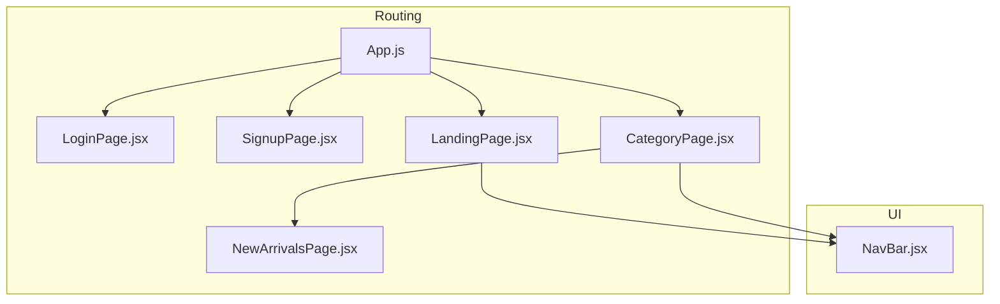
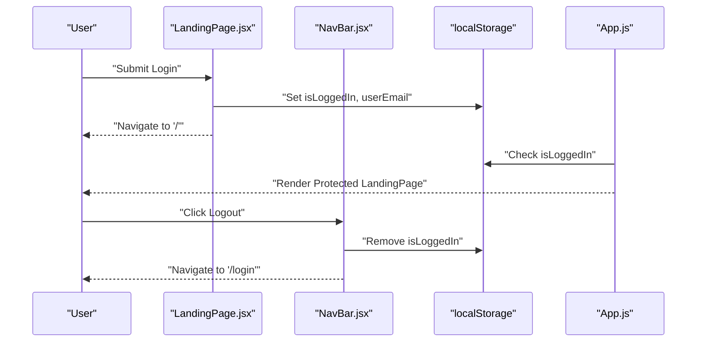
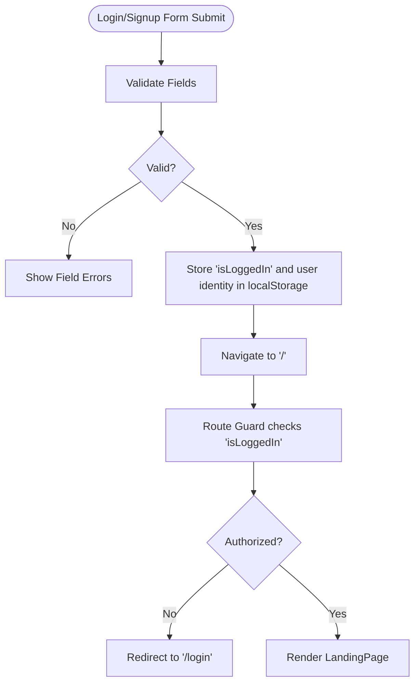
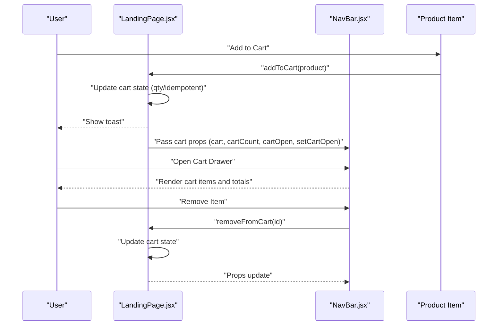
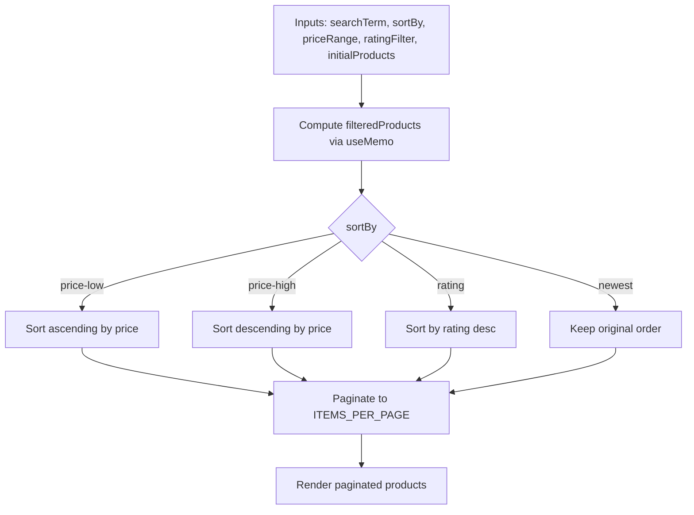
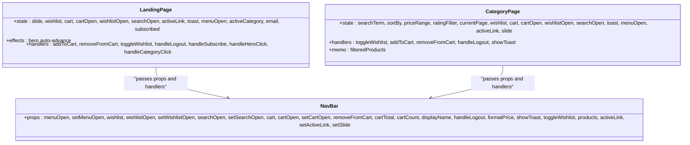
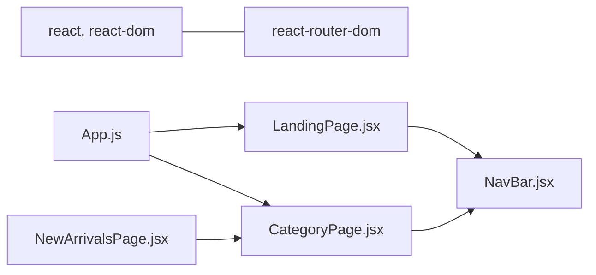

# State Management

<cite>
**Referenced Files in This Document**
- [LandingPage.jsx](file://src/pages/LandingPage.jsx)
- [NavBar.jsx](file://src/components/NavBar.jsx)
- [App.js](file://src/App.js)
- [LoginPage.jsx](file://src/pages/LoginPage.jsx)
- [SignupPage.jsx](file://src/pages/SignupPage.jsx)
- [CategoryPage.jsx](file://src/components/CategoryPage.jsx)
- [NewArrivalsPage.jsx](file://src/pages/NewArrivalsPage.jsx)
- [package.json](file://package.json)
</cite>

## Table of Contents
1. [Introduction](#introduction)
2. [Project Structure](#project-structure)
3. [Core Components](#core-components)
4. [Architecture Overview](#architecture-overview)
5. [Detailed Component Analysis](#detailed-component-analysis)
6. [Dependency Analysis](#dependency-analysis)
7. [Performance Considerations](#performance-considerations)
8. [Troubleshooting Guide](#troubleshooting-guide)
9. [Conclusion](#conclusion)

## Introduction
This document explains the state management implementation in the Lumière e-commerce client. It focuses on React hooks usage (useState, useEffect, useRef, useMemo), state lifting patterns for shared state across components, local storage integration for authentication and UI state persistence, and state synchronization across the application. Concrete examples are drawn from LandingPage.jsx and NavBar.jsx, along with authentication flows and filter coordination in CategoryPage.jsx. Best practices, performance optimization, debugging tips, and extension guidelines are included.

## Project Structure
The client uses React with React Router for navigation and local storage for lightweight persistence. Authentication guards protect routes, while individual pages manage their own state locally. Shared UI state (cart, wishlist, drawers) is lifted to the nearest common ancestor and passed down as props.

**Diagram sources**
- [App.js:18-85](file://src/App.js#L18-L85)
- [LoginPage.jsx:5-151](file://src/pages/LoginPage.jsx#L5-L151)
- [SignupPage.jsx:5-158](file://src/pages/SignupPage.jsx#L5-L158)
- [LandingPage.jsx:57-177](file://src/pages/LandingPage.jsx#L57-L177)
- [CategoryPage.jsx:10-127](file://src/components/CategoryPage.jsx#L10-L127)
- [NewArrivalsPage.jsx:26-28](file://src/pages/NewArrivalsPage.jsx#L26-L28)

**Section sources**
- [App.js:18-85](file://src/App.js#L18-L85)
- [package.json:1-41](file://package.json#L1-L41)

## Core Components
- Authentication state: stored in local storage and enforced by a route guard.
- UI state: managed locally in pages and shared via props to NavBar.
- Cart and wishlist: maintained per-page and synchronized through NavBar.
- Filters and sorting: centralized in CategoryPage with memoized computation.

Key hooks used:
- useState: local component state for UI toggles, forms, cart, wishlist, filters.
- useEffect: side effects like auto-advancing hero slides.
- useRef: storing timers to avoid stale closures and cleanup.
- useMemo: expensive derived computations (filters/sorting) cached until dependencies change.

**Section sources**
- [LandingPage.jsx:62-124](file://src/pages/LandingPage.jsx#L62-L124)
- [NavBar.jsx:7-30](file://src/components/NavBar.jsx#L7-L30)
- [CategoryPage.jsx:15-91](file://src/components/CategoryPage.jsx#L15-L91)

## Architecture Overview
The state model centers around two axes:
- Authentication: controlled by local storage and enforced by a route guard.
- UI and commerce state: per-page state lifted to the nearest common parent and passed down to NavBar.

**Diagram sources**
- [LoginPage.jsx:25-42](file://src/pages/LoginPage.jsx#L25-L42)
- [App.js:13-16](file://src/App.js#L13-L16)
- [LandingPage.jsx:126-129](file://src/pages/LandingPage.jsx#L126-L129)

## Detailed Component Analysis

### Authentication State Management
- LoginPage and SignupPage collect form data and write to local storage upon successful submission.
- App.js enforces a private route guard checking for an authentication flag.
- LandingPage reads user identity from local storage to greet the user.

**Diagram sources**
- [LoginPage.jsx:12-42](file://src/pages/LoginPage.jsx#L12-L42)
- [SignupPage.jsx:17-44](file://src/pages/SignupPage.jsx#L17-L44)
- [App.js:13-16](file://src/App.js#L13-L16)
- [LandingPage.jsx:59-60](file://src/pages/LandingPage.jsx#L59-L60)

**Section sources**
- [LoginPage.jsx:5-151](file://src/pages/LoginPage.jsx#L5-L151)
- [SignupPage.jsx:5-158](file://src/pages/SignupPage.jsx#L5-L158)
- [App.js:13-16](file://src/App.js#L13-L16)
- [LandingPage.jsx:59-60](file://src/pages/LandingPage.jsx#L59-L60)

### Cart and Wishlist State Handling
- LandingPage maintains cart and wishlist arrays and exposes handlers to add/remove items and update quantities.
- NavBar receives cart/wishlist state and UI flags (open/closed) as props, enabling shared UI state across the app.
- CategoryPage duplicates cart/wishlist state management for category pages, demonstrating consistent patterns.

**Diagram sources**
- [LandingPage.jsx:113-124](file://src/pages/LandingPage.jsx#L113-L124)
- [NavBar.jsx:15-29](file://src/components/NavBar.jsx#L15-L29)
- [CategoryPage.jsx:47-58](file://src/components/CategoryPage.jsx#L47-L58)

**Section sources**
- [LandingPage.jsx:62-124](file://src/pages/LandingPage.jsx#L62-L124)
- [NavBar.jsx:15-118](file://src/components/NavBar.jsx#L15-L118)
- [CategoryPage.jsx:20-58](file://src/components/CategoryPage.jsx#L20-L58)

### Filter State Coordination
- CategoryPage manages search term, sort order, price range, and rating filter.
- useMemo computes filtered and sorted results based on these inputs, preventing unnecessary recalculations.
- Pagination slices the filtered list for efficient rendering.

**Diagram sources**
- [CategoryPage.jsx:66-91](file://src/components/CategoryPage.jsx#L66-L91)
- [CategoryPage.jsx:94-98](file://src/components/CategoryPage.jsx#L94-L98)

**Section sources**
- [CategoryPage.jsx:15-98](file://src/components/CategoryPage.jsx#L15-L98)

### State Lifting Patterns and Prop Drilling Strategies
- LandingPage lifts cart, wishlist, and UI flags to NavBar as props, avoiding duplication and ensuring consistent UI state.
- CategoryPage follows the same pattern for category pages, passing cart/wishlist and handlers to NavBar.
- Event handlers are passed down as callbacks, enabling child components to mutate parent state.

**Diagram sources**
- [LandingPage.jsx:62-175](file://src/pages/LandingPage.jsx#L62-L175)
- [NavBar.jsx:7-30](file://src/components/NavBar.jsx#L7-L30)
- [CategoryPage.jsx:15-127](file://src/components/CategoryPage.jsx#L15-L127)

**Section sources**
- [LandingPage.jsx:152-175](file://src/pages/LandingPage.jsx#L152-L175)
- [NavBar.jsx:7-30](file://src/components/NavBar.jsx#L7-L30)
- [CategoryPage.jsx:104-127](file://src/components/CategoryPage.jsx#L104-L127)

### Local Storage Integration for State Persistence
- Authentication: login/signup writes an authentication flag and user identity; logout removes the flag.
- UI state: drawer open/closed flags and cart/wishlist lists are kept in component state; they reset on reload.
- Recommendations:
  - Persist critical UI state (e.g., cart, wishlist) in local storage keyed by user identity to survive refresh.
  - Use a hydration pattern to restore state from localStorage on mount.

**Section sources**
- [LoginPage.jsx:34-36](file://src/pages/LoginPage.jsx#L34-L36)
- [SignupPage.jsx:39-41](file://src/pages/SignupPage.jsx#L39-L41)
- [LandingPage.jsx:126-129](file://src/pages/LandingPage.jsx#L126-L129)

### Event Handler Implementation
- Handlers are defined inline or bound to component state and passed down as props.
- Handlers update state immutably and trigger re-renders efficiently.
- For performance-sensitive handlers, consider binding or memoizing callbacks at boundaries.

**Section sources**
- [LandingPage.jsx:107-124](file://src/pages/LandingPage.jsx#L107-L124)
- [NavBar.jsx:65-76](file://src/components/NavBar.jsx#L65-L76)
- [CategoryPage.jsx:43-58](file://src/components/CategoryPage.jsx#L43-L58)

## Dependency Analysis
- React and React Router are the primary runtime dependencies.
- App.js orchestrates routing and authentication guards.
- LandingPage and CategoryPage both depend on NavBar for shared UI state and actions.
- NewArrivalsPage composes CategoryPage with a static product list.

**Diagram sources**
- [package.json:5-14](file://package.json#L5-L14)
- [App.js:1-11](file://src/App.js#L1-L11)
- [LandingPage.jsx:3](file://src/pages/LandingPage.jsx#L3)
- [CategoryPage.jsx:3](file://src/components/CategoryPage.jsx#L3)
- [NewArrivalsPage.jsx:1](file://src/pages/NewArrivalsPage.jsx#L1)

**Section sources**
- [package.json:5-14](file://package.json#L5-L14)
- [App.js:1-11](file://src/App.js#L1-L11)

## Performance Considerations
- Memoization:
  - Use useMemo for expensive derived computations (e.g., filtering and sorting in CategoryPage) to avoid recomputation when inputs are unchanged.
- Immutability:
  - Always create new arrays/objects when updating state to enable shallow comparisons and predictable re-renders.
- Refs:
  - Use useRef for timers and DOM refs to avoid stale closures and ensure cleanup.
- Rendering:
  - Prefer splitting large lists into pages (as in CategoryPage) to reduce render cost.
- Handlers:
  - Bind or memoize handlers at component boundaries to prevent unnecessary prop updates.

**Section sources**
- [CategoryPage.jsx:66-91](file://src/components/CategoryPage.jsx#L66-L91)
- [LandingPage.jsx:77-80](file://src/pages/LandingPage.jsx#L77-L80)
- [CategoryPage.jsx:94-98](file://src/components/CategoryPage.jsx#L94-L98)

## Troubleshooting Guide
- Authentication not persisting:
  - Verify that login/signup writes the authentication flag and user identity to local storage.
  - Ensure the route guard checks for the flag consistently.
- Cart/wishlist not updating across components:
  - Confirm that state is lifted to a common ancestor and passed as props to NavBar.
  - Ensure handlers are passed down and invoked correctly.
- Filters not applying:
  - Check that memoized computation depends on all relevant inputs and that state updates are reflected in the UI.
- Timer leaks:
  - Ensure timers are cleared in useEffect cleanup to prevent memory leaks.

**Section sources**
- [LoginPage.jsx:34-42](file://src/pages/LoginPage.jsx#L34-L42)
- [App.js:13-16](file://src/App.js#L13-L16)
- [LandingPage.jsx:77-80](file://src/pages/LandingPage.jsx#L77-L80)
- [CategoryPage.jsx:66-91](file://src/components/CategoryPage.jsx#L66-L91)

## Conclusion
The Lumière client employs straightforward React hooks-based state management with clear lifting patterns and minimal external dependencies. Authentication is handled via local storage and route guards, while UI and commerce state is coordinated through props passed to NavBar. Memoization and immutable updates improve performance, and refs ensure safe cleanup. Extending the app can leverage these patterns, with potential migration to a dedicated state library for larger-scale state needs.