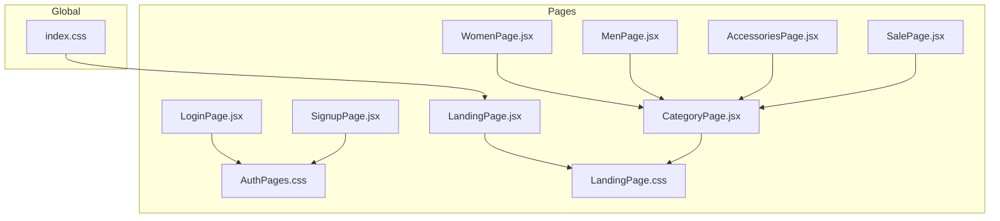
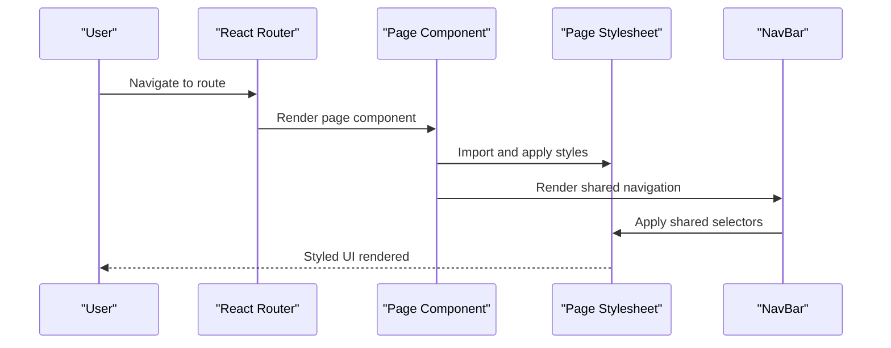
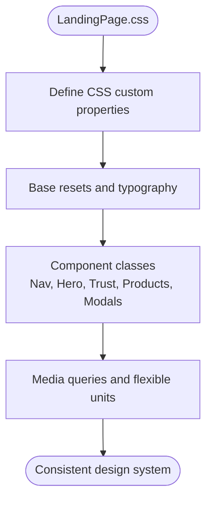
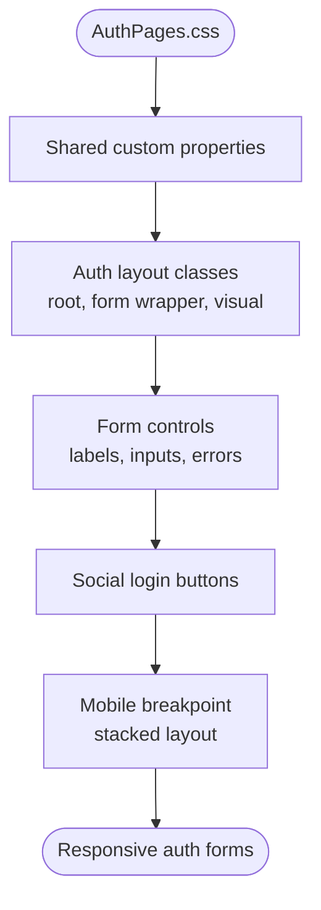
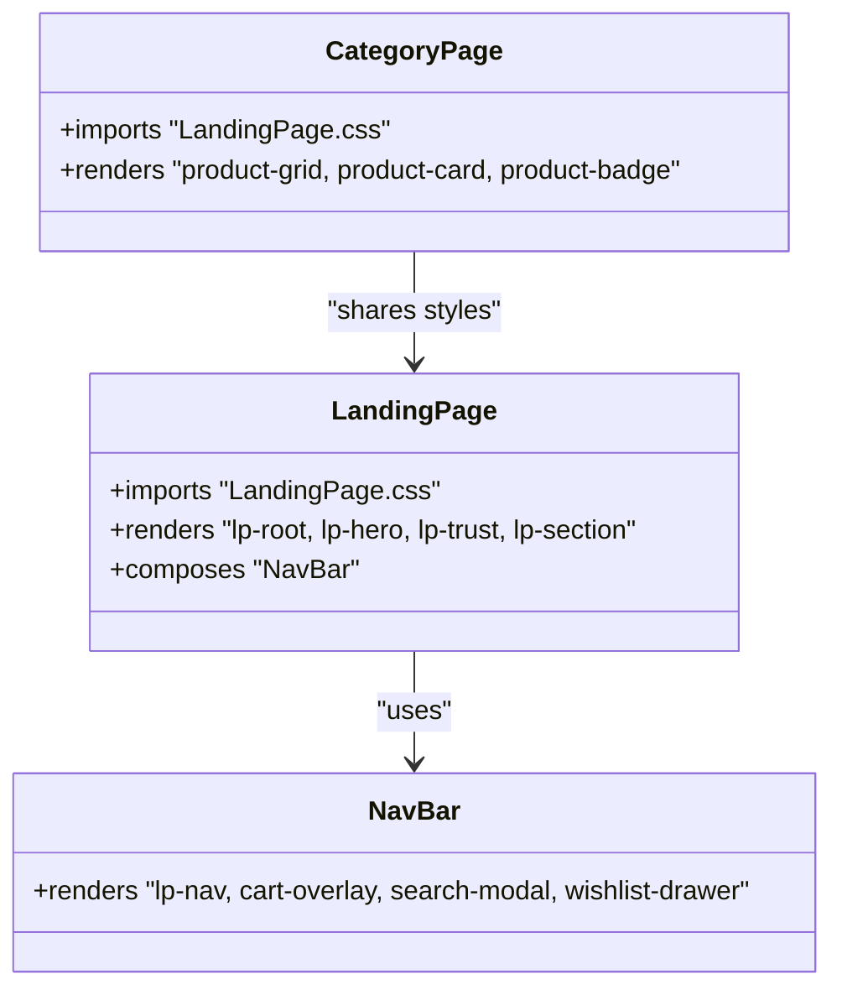
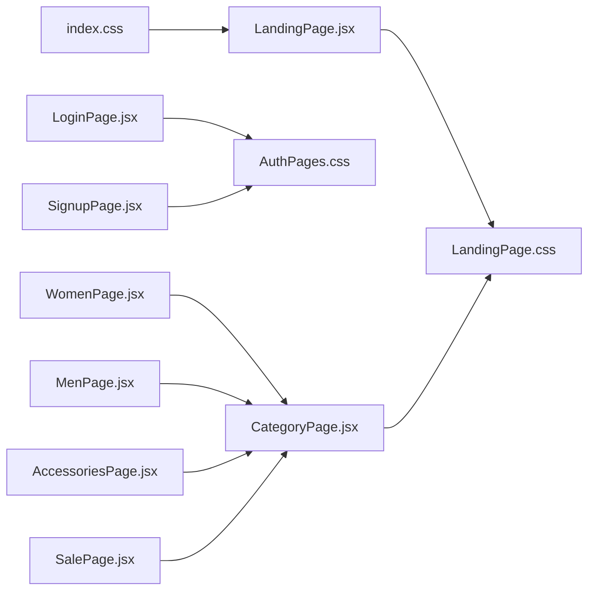

# Styling Architecture

<cite>
**Referenced Files in This Document**
- [index.css](file://src/index.css)
- [LandingPage.css](file://src/pages/LandingPage.css)
- [AuthPages.css](file://src/pages/AuthPages.css)
- [App.js](file://src/App.js)
- [LandingPage.jsx](file://src/pages/LandingPage.jsx)
- [NavBar.jsx](file://src/components/NavBar.jsx)
- [CategoryPage.jsx](file://src/components/CategoryPage.jsx)
- [LoginPage.jsx](file://src/pages/LoginPage.jsx)
- [SignupPage.jsx](file://src/pages/SignupPage.jsx)
- [WomenPage.jsx](file://src/pages/WomenPage.jsx)
- [MenPage.jsx](file://src/pages/MenPage.jsx)
- [AccessoriesPage.jsx](file://src/pages/AccessoriesPage.jsx)
- [SalePage.jsx](file://src/pages/SalePage.jsx)
- [package.json](file://package.json)
</cite>

## Table of Contents
1. [Introduction](#introduction)
2. [Project Structure](#project-structure)
3. [Core Components](#core-components)
4. [Architecture Overview](#architecture-overview)
5. [Detailed Component Analysis](#detailed-component-analysis)
6. [Dependency Analysis](#dependency-analysis)
7. [Performance Considerations](#performance-considerations)
8. [Troubleshooting Guide](#troubleshooting-guide)
9. [Conclusion](#conclusion)
10. [Appendices](#appendices)

## Introduction
This document describes the styling architecture of the Lumière e-commerce client. The project uses a CSS-in-CSS approach: each page defines its own stylesheet and imports it into the component that renders it. Design tokens are centralized via CSS custom properties (variables) in each stylesheet’s root scope. Responsive design follows a mobile-first strategy with media queries and flexible units. The system integrates tightly with React components through class-based selectors and shared patterns across pages.

## Project Structure
The styling system is organized around:
- Global baseline styles in a single file
- Page-specific stylesheets imported by their respective components
- Shared UI patterns reused across pages (e.g., buttons, forms, navigation)
- Category pages sharing a common layout and styling via a shared component

**Diagram sources**
- [index.css:1-14](file://src/index.css#L1-L14)
- [LandingPage.jsx:1-10](file://src/pages/LandingPage.jsx#L1-L10)
- [LandingPage.css:1-25](file://src/pages/LandingPage.css#L1-L25)
- [AuthPages.css:1-20](file://src/pages/AuthPages.css#L1-L20)
- [LoginPage.jsx:1-10](file://src/pages/LoginPage.jsx#L1-L10)
- [SignupPage.jsx:1-10](file://src/pages/SignupPage.jsx#L1-L10)
- [CategoryPage.jsx:1-10](file://src/components/CategoryPage.jsx#L1-L10)

**Section sources**
- [index.css:1-14](file://src/index.css#L1-L14)
- [LandingPage.jsx:1-10](file://src/pages/LandingPage.jsx#L1-L10)
- [AuthPages.css:1-20](file://src/pages/AuthPages.css#L1-L20)
- [CategoryPage.jsx:1-10](file://src/components/CategoryPage.jsx#L1-L10)

## Core Components
- Global baseline: resets and base typography are defined centrally to normalize rendering and fonts.
- Page-level stylesheets:
  - Landing page stylesheet defines the brand’s design system, including custom properties, reusable components, and responsive sections.
  - Authentication stylesheet defines form layouts, responsive breakpoints, and shared UI patterns for login/signup.
- Shared components:
  - Navigation bar reuses landing page styles for consistent header behavior and drawers.
  - Category page reuses landing page styles for product grids and badges.

Key characteristics:
- CSS custom properties define semantic color and spacing tokens.
- Utility-like class names compose complex UI elements (buttons, cards, modals).
- Media queries enforce mobile-first responsive behavior.

**Section sources**
- [index.css:1-14](file://src/index.css#L1-L14)
- [LandingPage.css:4-25](file://src/pages/LandingPage.css#L4-L25)
- [AuthPages.css:1-20](file://src/pages/AuthPages.css#L1-L20)
- [NavBar.jsx:40-78](file://src/components/NavBar.jsx#L40-L78)
- [CategoryPage.jsx:100-127](file://src/components/CategoryPage.jsx#L100-L127)

## Architecture Overview
The styling architecture blends CSS-in-CSS with React component composition:
- Each page imports its stylesheet and applies class names to DOM nodes.
- Shared components (e.g., NavBar) rely on the page stylesheet for consistent visuals.
- Category pages share a single layout component that imports the landing stylesheet to maintain uniformity.

**Diagram sources**
- [App.js:18-85](file://src/App.js#L18-L85)
- [LandingPage.jsx:147-175](file://src/pages/LandingPage.jsx#L147-L175)
- [LandingPage.css:63-196](file://src/pages/LandingPage.css#L63-L196)
- [NavBar.jsx:31-78](file://src/components/NavBar.jsx#L31-L78)

## Detailed Component Analysis

### Landing Page Styles (LandingPage.css)
- Design system
  - Centralized custom properties in the root scope define brand colors, typography families, and layout tokens.
  - Reusable component classes encapsulate complex UI patterns (navigation, hero, trust bar, product cards, modals).
- Responsive patterns
  - Mobile-first approach with progressively enhanced layouts.
  - Flexible units (clamp, min, max-width) and grid/flex layouts adapt to viewport sizes.
- Component-specific styles
  - Navigation bar, cart drawer, search modal, and wishlist drawer are fully styled within the stylesheet.
  - Product grid and badges reuse shared selectors for consistency.

**Diagram sources**
- [LandingPage.css:4-25](file://src/pages/LandingPage.css#L4-L25)
- [LandingPage.css:63-196](file://src/pages/LandingPage.css#L63-L196)
- [LandingPage.css:503-632](file://src/pages/LandingPage.css#L503-L632)

**Section sources**
- [LandingPage.css:4-25](file://src/pages/LandingPage.css#L4-L25)
- [LandingPage.css:63-196](file://src/pages/LandingPage.css#L63-L196)
- [LandingPage.css:503-632](file://src/pages/LandingPage.css#L503-L632)

### Authentication Styles (AuthPages.css)
- Design system
  - Shared custom properties for consistent theming across login and signup.
  - Form layout classes define spacing, focus states, and error indicators.
- Responsive patterns
  - A single breakpoint targets narrow screens, switching layout to a stacked column and hiding the visual panel.
- Component-specific styles
  - Login and signup share the same stylesheet and layout classes, ensuring visual parity.

**Diagram sources**
- [AuthPages.css:1-20](file://src/pages/AuthPages.css#L1-L20)
- [AuthPages.css:19-102](file://src/pages/AuthPages.css#L19-L102)
- [AuthPages.css:270-277](file://src/pages/AuthPages.css#L270-L277)

**Section sources**
- [AuthPages.css:1-20](file://src/pages/AuthPages.css#L1-L20)
- [AuthPages.css:19-102](file://src/pages/AuthPages.css#L19-L102)
- [AuthPages.css:270-277](file://src/pages/AuthPages.css#L270-L277)

### Component Integration Patterns
- Landing page imports its stylesheet and composes multiple sections and drawers using class names.
- Navigation bar reuses landing page styles for consistent header behavior and overlays.
- Category pages import the landing stylesheet to render product grids and badges consistently.

**Diagram sources**
- [LandingPage.jsx:147-175](file://src/pages/LandingPage.jsx#L147-L175)
- [NavBar.jsx:31-78](file://src/components/NavBar.jsx#L31-L78)
- [CategoryPage.jsx:100-127](file://src/components/CategoryPage.jsx#L100-L127)

**Section sources**
- [LandingPage.jsx:147-175](file://src/pages/LandingPage.jsx#L147-L175)
- [NavBar.jsx:31-78](file://src/components/NavBar.jsx#L31-L78)
- [CategoryPage.jsx:100-127](file://src/components/CategoryPage.jsx#L100-L127)

### Example: Applying Styles to Components
- Landing page root container uses a root class to scope the entire layout.
- Navigation bar leverages shared classes for logo, links, actions, and drawers.
- Product cards reuse grid and card classes to maintain consistent spacing and hover effects.

Concrete examples (paths):
- Root container: [LandingPage.jsx:147-149](file://src/pages/LandingPage.jsx#L147-L149)
- Navigation bar: [NavBar.jsx:43-78](file://src/components/NavBar.jsx#L43-L78)
- Product grid: [LandingPage.jsx:256-292](file://src/pages/LandingPage.jsx#L256-L292), [LandingPage.css:725-740](file://src/pages/LandingPage.css#L725-L740)

**Section sources**
- [LandingPage.jsx:147-149](file://src/pages/LandingPage.jsx#L147-L149)
- [NavBar.jsx:43-78](file://src/components/NavBar.jsx#L43-L78)
- [LandingPage.css:725-740](file://src/pages/LandingPage.css#L725-L740)

### Responsive Breakpoints and Mobile-First Principles
- Landing page stylesheet does not define explicit media queries; responsiveness relies on flexible units and component layouts.
- Authentication stylesheet defines a breakpoint to stack layout on small screens and hide the visual panel.

Examples (paths):
- Auth breakpoint: [AuthPages.css:270-277](file://src/pages/AuthPages.css#L270-L277)

**Section sources**
- [AuthPages.css:270-277](file://src/pages/AuthPages.css#L270-L277)

### Theme Customization Options
- Centralized tokens via CSS custom properties enable easy theme swaps.
- Color roles (ink, cream, gold, muted, error) are defined per stylesheet and consumed across components.

Examples (paths):
- Landing tokens: [LandingPage.css:5-17](file://src/pages/LandingPage.css#L5-L17)
- Auth tokens: [AuthPages.css:1-13](file://src/pages/AuthPages.css#L1-L13)

**Section sources**
- [LandingPage.css:5-17](file://src/pages/LandingPage.css#L5-L17)
- [AuthPages.css:1-13](file://src/pages/AuthPages.css#L1-L13)

## Dependency Analysis
The styling system exhibits low coupling and high cohesion:
- Each page depends on its stylesheet; shared components depend on the page stylesheet.
- Category pages depend on the landing stylesheet for consistent product presentation.
- No circular dependencies observed among stylesheets.

**Diagram sources**
- [index.css:1-14](file://src/index.css#L1-L14)
- [LandingPage.jsx:1-10](file://src/pages/LandingPage.jsx#L1-L10)
- [LandingPage.css:1-25](file://src/pages/LandingPage.css#L1-L25)
- [LoginPage.jsx:1-10](file://src/pages/LoginPage.jsx#L1-L10)
- [AuthPages.css:1-20](file://src/pages/AuthPages.css#L1-L20)
- [CategoryPage.jsx:1-10](file://src/components/CategoryPage.jsx#L1-L10)

**Section sources**
- [index.css:1-14](file://src/index.css#L1-L14)
- [LandingPage.jsx:1-10](file://src/pages/LandingPage.jsx#L1-L10)
- [AuthPages.css:1-20](file://src/pages/AuthPages.css#L1-L20)
- [CategoryPage.jsx:1-10](file://src/components/CategoryPage.jsx#L1-L10)

## Performance Considerations
- CSS delivery
  - Stylesheets are imported directly into components; ensure only necessary styles are loaded per route.
  - Consider lazy-loading styles for non-critical routes to reduce initial payload.
- Rendering performance
  - Prefer class-based selectors over deeply nested selectors to minimize specificity and improve rendering speed.
  - Use CSS custom properties for theming to avoid repeated reflows during theme switches.
- Asset optimization
  - Images are loaded lazily in product grids; keep image sizes optimized and leverage modern formats where possible.
- Build pipeline
  - The project uses a standard build toolchain; ensure production builds are configured to minify CSS and split bundles appropriately.

[No sources needed since this section provides general guidance]

## Troubleshooting Guide
Common styling issues and resolutions:
- Styles not applying
  - Verify the component imports the correct stylesheet and uses the intended class names.
  - Confirm custom properties are defined in the correct scope and not overridden unintentionally.
- Responsive layout problems
  - Check media queries and ensure breakpoints align with device widths.
  - Validate flexible units (clamp, min, max-width) are used appropriately.
- Theme inconsistencies
  - Ensure all pages define or consume the same custom property tokens.
  - Avoid inline styles overriding stylesheet-defined properties.

**Section sources**
- [LandingPage.css:4-25](file://src/pages/LandingPage.css#L4-L25)
- [AuthPages.css:1-20](file://src/pages/AuthPages.css#L1-L20)
- [CategoryPage.jsx:100-127](file://src/components/CategoryPage.jsx#L100-L127)

## Conclusion
The Lumière client employs a clean, maintainable styling architecture centered on CSS custom properties and page-specific stylesheets. The approach enables rapid iteration, strong design consistency, and straightforward theme customization. By adhering to mobile-first principles and reusing shared patterns, the system scales effectively across pages and components.

[No sources needed since this section summarizes without analyzing specific files]

## Appendices

### Best Practices for Extending the Styling System
- Define all design tokens in a single place per stylesheet to ensure consistency.
- Keep component classes modular and focused on a single responsibility.
- Use semantic class names that describe intent rather than appearance.
- Leverage CSS custom properties for theme tokens and avoid hardcoding values.
- Add responsive variants progressively, starting from mobile-first defaults.

[No sources needed since this section provides general guidance]

### Guidelines for Creating Custom Themes
- Centralize color and typography tokens in the stylesheet root.
- Create variant classes for secondary roles (e.g., alternate buttons) while preserving primary tokens.
- Test themes across components to ensure readability and accessibility.

[No sources needed since this section provides general guidance]

### Maintaining Design Consistency Across the Application
- Establish a shared component library of reusable classes.
- Document class naming conventions and usage patterns.
- Regularly audit stylesheets for duplication and refactor shared patterns into reusable classes.

[No sources needed since this section provides general guidance]