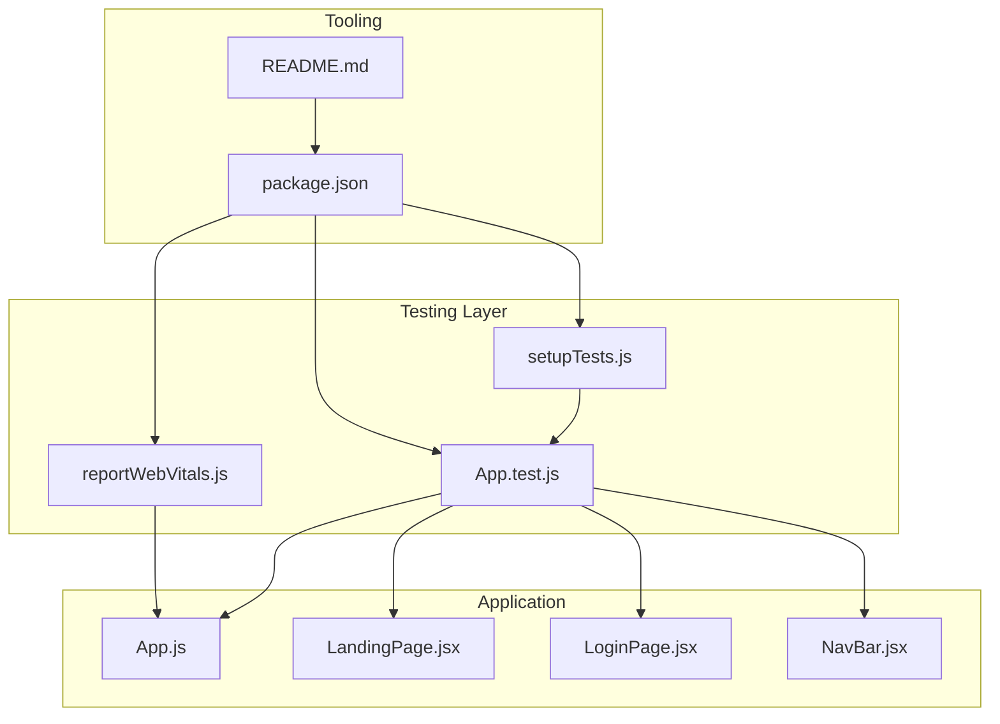
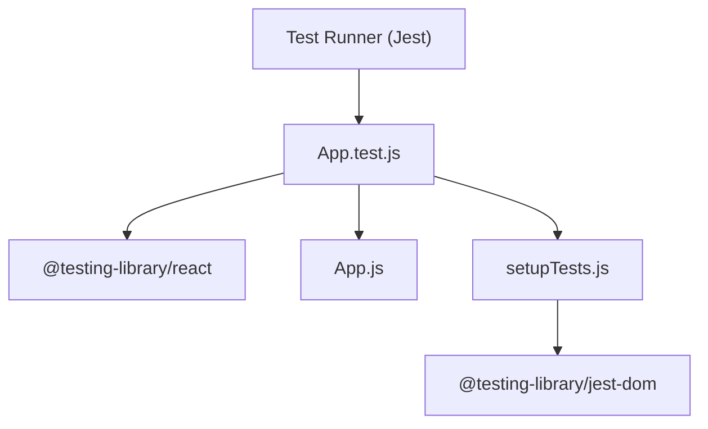
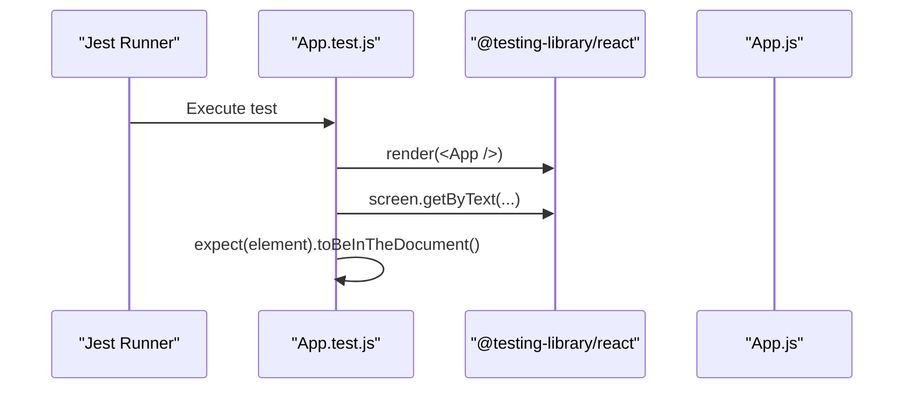
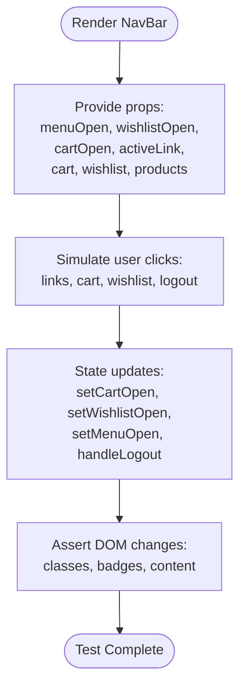
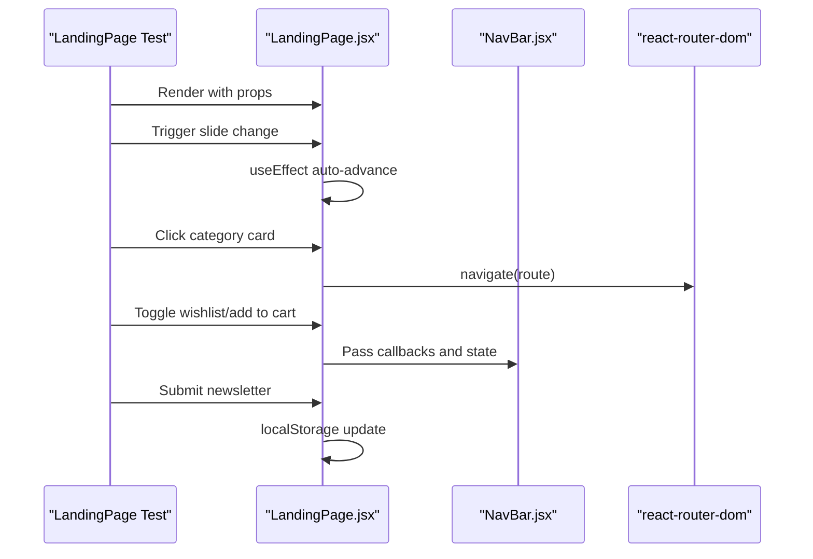
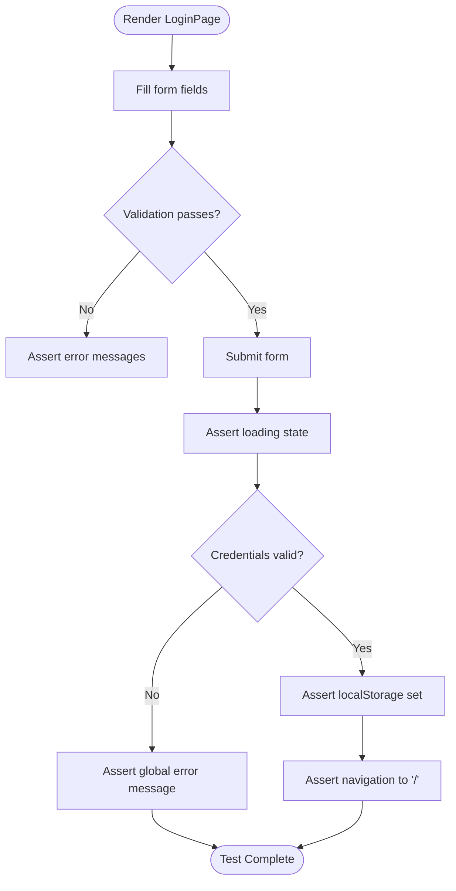
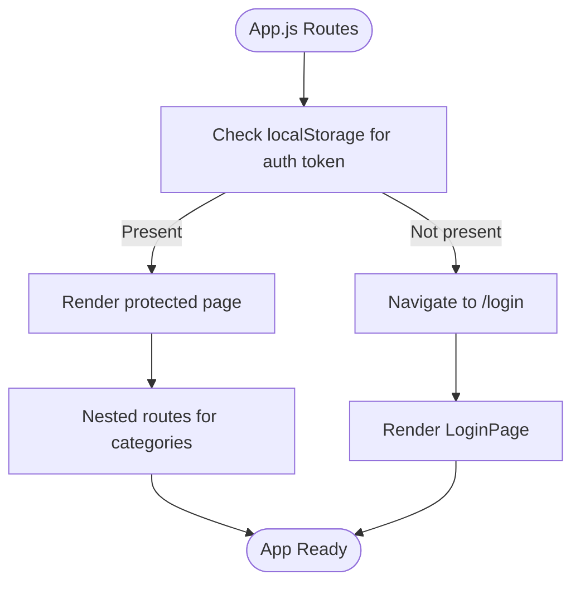
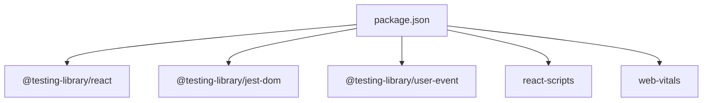

# Testing Strategy

<cite>
**Referenced Files in This Document**
- [App.test.js](file://src/App.test.js)
- [setupTests.js](file://src/setupTests.js)
- [reportWebVitals.js](file://src/reportWebVitals.js)
- [package.json](file://package.json)
- [README.md](file://README.md)
- [App.js](file://src/App.js)
- [NavBar.jsx](file://src/components/NavBar.jsx)
- [LandingPage.jsx](file://src/pages/LandingPage.jsx)
- [LoginPage.jsx](file://src/pages/LoginPage.jsx)
</cite>

## Table of Contents
1. [Introduction](#introduction)
2. [Project Structure](#project-structure)
3. [Core Components](#core-components)
4. [Architecture Overview](#architecture-overview)
5. [Detailed Component Analysis](#detailed-component-analysis)
6. [Dependency Analysis](#dependency-analysis)
7. [Performance Considerations](#performance-considerations)
8. [Troubleshooting Guide](#troubleshooting-guide)
9. [Conclusion](#conclusion)

## Introduction
This document describes the testing strategy for the Lumière e-commerce client. The project uses Create React App with React Testing Library and Jest for unit and component testing. The focus is on establishing a robust testing foundation that covers rendering, user interactions, state updates, and integration points. The documentation outlines setup, patterns, utilities, reporting, CI considerations, and best practices derived from the repository’s current configuration and code.

## Project Structure
The testing-related files and configuration are organized as follows:
- Test entry and setup: App.test.js, setupTests.js
- Performance reporting: reportWebVitals.js
- Dependencies and scripts: package.json
- Project documentation: README.md
- Application shell and routing: App.js
- Feature components and pages: LandingPage.jsx, LoginPage.jsx, NavBar.jsx

**Diagram sources**
- [App.test.js](file://src/App.test.js)
- [setupTests.js](file://src/setupTests.js)
- [reportWebVitals.js](file://src/reportWebVitals.js)
- [package.json](file://package.json)
- [README.md](file://README.md)
- [App.js](file://src/App.js)
- [LandingPage.jsx](file://src/pages/LandingPage.jsx)
- [LoginPage.jsx](file://src/pages/LoginPage.jsx)
- [NavBar.jsx](file://src/components/NavBar.jsx)

**Section sources**
- [App.test.js](file://src/App.test.js)
- [setupTests.js](file://src/setupTests.js)
- [reportWebVitals.js](file://src/reportWebVitals.js)
- [package.json](file://package.json)
- [README.md](file://README.md)
- [App.js](file://src/App.js)
- [LandingPage.jsx](file://src/pages/LandingPage.jsx)
- [LoginPage.jsx](file://src/pages/LoginPage.jsx)
- [NavBar.jsx](file://src/components/NavBar.jsx)

## Core Components
- Test setup and matchers: setupTests.js configures @testing-library/jest-dom matchers globally for DOM assertions.
- Test runner and scripts: package.json defines the test script via react-scripts and includes React Testing Library packages.
- Example component test: App.test.js demonstrates a minimal render test using React Testing Library.
- Performance reporting: reportWebVitals.js integrates web-vitals metrics collection for performance monitoring.

Key capabilities evidenced by the repository:
- Rendering and assertion with React Testing Library
- Global Jest matchers for DOM assertions
- Performance metrics integration
- Basic test script invocation

**Section sources**
- [setupTests.js](file://src/setupTests.js)
- [package.json](file://package.json)
- [App.test.js](file://src/App.test.js)
- [reportWebVitals.js](file://src/reportWebVitals.js)

## Architecture Overview
The testing architecture leverages Create React App’s defaults with React Testing Library and Jest. The test runner executes tests in watch mode, and global setup applies DOM matchers. Performance metrics can be collected per page via reportWebVitals.

**Diagram sources**
- [App.test.js](file://src/App.test.js)
- [setupTests.js](file://src/setupTests.js)
- [App.js](file://src/App.js)

## Detailed Component Analysis

### Example Component Test Pattern
The existing App.test.js demonstrates a foundational pattern:
- Import render and screen from @testing-library/react
- Render the component under test
- Query rendered content using screen utilities
- Assert presence with toBeInTheDocument matcher

This pattern is ideal for:
- Rendering verification
- Basic accessibility checks
- Ensuring critical elements appear

**Diagram sources**
- [App.test.js](file://src/App.test.js)
- [App.js](file://src/App.js)

**Section sources**
- [App.test.js](file://src/App.test.js)

### Navigation Bar Component Testing
The NavBar component is highly interactive and state-driven. Recommended testing approaches:
- Props-driven rendering: Verify UI segments render based on props (menuOpen, wishlistOpen, cartOpen, activeLink).
- Event simulation: Use user-event to click navigation links, cart/wishlist toggles, and logout to verify state transitions.
- State verification: Assert DOM classes, badges, and content reflect state changes (e.g., cartCount badge visibility).
- Accessibility: Confirm ARIA roles and keyboard interactions if applicable.

Mock data and state:
- Use local state and props to simulate cart, wishlist, and UI toggles.
- For product lists, pass static arrays to test rendering and filtering.

**Diagram sources**
- [NavBar.jsx](file://src/components/NavBar.jsx)

**Section sources**
- [NavBar.jsx](file://src/components/NavBar.jsx)

### Landing Page Component Testing
The LandingPage component combines state, effects, and child components:
- State initialization: Verify initial state for slides, cart, wishlist, toast, and categories.
- Effects: Ensure auto-advance effect runs and clears on unmount.
- User interactions: Click hero slides, category cards, add/remove from cart, and wishlist toggles.
- Navigation: Validate route navigation via useNavigate.
- Local storage: Confirm user greeting reads from localStorage.
- Form submission: Simulate newsletter subscription and toast feedback.

Mock data:
- Use static PRODUCTS and CATEGORIES arrays for rendering and filtering.
- Simulate timers and navigation for effect-driven behavior.

**Diagram sources**
- [LandingPage.jsx](file://src/pages/LandingPage.jsx)
- [NavBar.jsx](file://src/components/NavBar.jsx)

**Section sources**
- [LandingPage.jsx](file://src/pages/LandingPage.jsx)
- [NavBar.jsx](file://src/components/NavBar.jsx)

### Login Page Component Testing
The LoginPage component focuses on form validation and navigation:
- Validation: Assert field-specific error messages for invalid inputs.
- Submission: Simulate form submit with valid/invalid credentials and verify navigation and loading states.
- Local storage: Confirm successful login sets localStorage flags.
- Disabled states: Verify button disabled during async operation.

**Diagram sources**
- [LoginPage.jsx](file://src/pages/LoginPage.jsx)

**Section sources**
- [LoginPage.jsx](file://src/pages/LoginPage.jsx)

### Authentication Guard and Routing Tests
App.js defines protected routes and a private route guard:
- PrivateRoute: Redirects unauthenticated users to /login.
- Route definitions: Ensure routes render correct pages and handle catch-all redirects.

Recommended tests:
- Unauthenticated access: Verify redirect to /login.
- Authenticated access: Set localStorage and assert protected page renders.
- Route matching: Confirm nested routes and catch-all behavior.

**Diagram sources**
- [App.js](file://src/App.js)

**Section sources**
- [App.js](file://src/App.js)

## Dependency Analysis
The testing stack relies on the following dependencies declared in package.json:
- @testing-library/react: React Testing Library for rendering and querying
- @testing-library/jest-dom: DOM matchers for assertions
- @testing-library/user-event: User interaction simulation
- react-scripts: Test script and Jest configuration
- web-vitals: Performance metrics collection

**Diagram sources**
- [package.json](file://package.json)

**Section sources**
- [package.json](file://package.json)

## Performance Considerations
- Performance metrics: reportWebVitals.js integrates web-vitals to collect CLS, FID, FCP, LCP, TTFB. This enables performance monitoring in development and can be wired into CI dashboards.
- Test performance: Keep tests fast by avoiding unnecessary waits, mocking timers, and minimizing DOM queries.
- Coverage: Use Jest coverage flags to track test coverage and identify untested components.

[No sources needed since this section provides general guidance]

## Troubleshooting Guide
Common issues and resolutions:
- Missing DOM matchers: Ensure setupTests.js imports @testing-library/jest-dom so matchers like toBeInTheDocument are available.
- Test script not found: Verify npm test script in package.json executes react-scripts test.
- Watch mode not starting: Check README.md for instructions on running tests in watch mode.
- Async operations: Use waitFor utilities from React Testing Library to handle asynchronous state updates and navigation.

**Section sources**
- [setupTests.js](file://src/setupTests.js)
- [package.json](file://package.json)
- [README.md](file://README.md)

## Conclusion
The Lumière e-commerce client establishes a solid testing foundation with React Testing Library and Jest. Current tests demonstrate basic rendering and DOM assertions, while components like NavBar, LandingPage, and LoginPage offer rich opportunities for interaction and state verification. Integrating performance reporting via reportWebVitals and expanding tests to cover user flows, async behavior, and edge cases will strengthen the suite. Adopting best practices—clear assertions, focused tests, and maintainable setup—will ensure reliable, readable tests aligned with the development workflow.